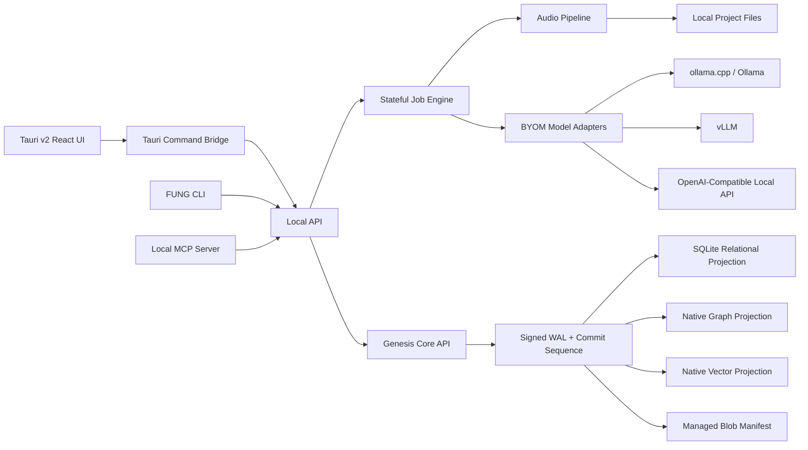

# Technical Design - FUNG Architecture

## Complexity Assessment

Level: C-3 Architecture-Driven Implementation.

เหตุผล: ระบบมี desktop runtime, local database, long-running audio capture, AI model orchestration, MCP/API/CLI, stateful jobs, export pipeline และ legal/privacy constraints.

## Platform Priority

1. Desktop app first.
2. Web app second.
3. Mobile third.

Desktop เป็น primary runtime สำหรับ recording, local files, local DB, model execution และ project state.

## Stack Decision

| Layer | Decision | Responsibility |
| --- | --- | --- |
| Desktop shell | Tauri v2 | Native desktop packaging, file access, secure command bridge |
| UI | React/TypeScript | Timeline, transcript editor, settings, project library |
| Local API | Internal HTTP API | Job control, transcript, export, model orchestration |
| Database boundary | GenesisBlockDB embedded core | Single open/write/query/backup/restore contract for relational, graph, vector and blob metadata |
| Internal relational subsystem | SQLite | Genesis-owned relational projection, joins and schema migrations; never a direct application handle |
| AI runtime | BYOM adapters | ollama.cpp, vLLM, OpenAI-compatible local endpoints |
| Automation | MCP | Tool access for agents and external local workflows |
| CLI | FUNG CLI | Batch import, transcribe, export, diagnostics |
| State | Stateful job engine | resumable recording, processing, export, and summaries |

## Architecture Overview



## Key Components

### Tauri Desktop App

- Owns native window, menu, file picker, microphone permission, filesystem access, and secure command bridge.
- Does not perform heavy AI work inside UI thread.

### Local API

- Single local control plane for UI, CLI, and MCP.
- Exposes bounded endpoints for project, recording, jobs, transcript, layers, summary, and export.
- Runs on loopback only by default.

### GenesisBlockDB

- Single operational boundary exposed to FUNG UI/API/CLI/MCP.
- Owns signed WAL authority, commit sequence, relational SQLite projection, native graph/vector projections and managed blob metadata.
- FUNG registers a versioned relational schema package and uses `GenesisTransaction` plus Typed Query IR.
- FUNG must not open SQLite, mutate graph/vector stores independently or maintain cross-store identity mappings.
- Tracks provenance: source audio, model used, parameters, output artifacts and revision history using canonical `EntityId` values.

### Stateful Job Engine

- Every long task is resumable and queryable.
- Recording, transcription, diarization, cleanup, separation, summary, and export are represented as jobs with state transitions.

Job states:

```text
queued -> running -> paused -> completed
queued -> running -> failed -> retrying -> running
running -> cancelled
```

### BYOM Model Adapters

- Users can bring local models or local-compatible endpoints.
- Cloud providers are disabled by default and must require explicit opt-in.

Supported adapter classes:

- Transcription adapter.
- Diarization adapter.
- Noise reduction adapter.
- Source separation adapter.
- LLM summary/intent adapter.

## Local API Surface - V1

| Endpoint Group | Purpose |
| --- | --- |
| `/health` | Runtime readiness and dependency checks |
| `/projects` | Project CRUD and project library |
| `/recordings` | Start, pause, stop, recover recording sessions |
| `/jobs` | Stateful job status, retry, cancel |
| `/transcripts` | Transcript segments, speaker labels, search |
| `/layers` | Audio layers and derived artifacts |
| `/models` | BYOM providers, capabilities, diagnostics |
| `/exports` | WAV, MP3, transcript, summary export |

## Data Model - Initial Entities

| Entity | Purpose |
| --- | --- |
| Project | User workspace for one recording or a group of recordings |
| Recording | Source audio capture/import |
| AudioChunk | Durable chunk file metadata |
| AudioLayer | Original/cleaned/separated/selected layer |
| Speaker | Speaker label and user rename |
| TranscriptSegment | Text, timestamp, speaker reference |
| ModelProvider | BYOM provider config |
| ModelRun | Model execution provenance |
| Summary | Whole-story or speaker-level summary |
| IntentInference | Inferred intent with evidence and confidence |
| ExportArtifact | Exported file metadata |
| AuditEvent | Local audit trail |

## Security and Privacy Defaults

- Loopback-only API by default.
- No cloud upload unless explicitly enabled.
- Local project folder remains user-visible.
- Model runs must record provider, model name, parameters, and output artifact references.
- Intent analysis must be labelled as AI inference.

## Risks

| Risk | Level | Mitigation |
| --- | --- | --- |
| Long recording data loss | High | Chunked files, Genesis blob manifest, signed WAL and recovery scan |
| Model runtime instability | High | Adapter isolation, diagnostics, graceful fallback |
| Legal/privacy misuse | High | Local-first defaults, consent UX, audit trail, disclaimers |
| Speaker misclassification | Medium | Editable labels, confidence display, no identity claims |
| Heavy CPU/GPU load | Medium | queue control, pause/resume, runtime profile |

## Implementation Plan

### Phase 0 - Documentation Approval

- Product spec.
- Architecture.
- Audio AI pipeline.
- Design system.
- Legal/privacy model.

### Phase 1 - Desktop Foundation

- Tauri v2 scaffold.
- React shell.
- Genesis embedded core initialization and one database root.
- FUNG relational schema package plus typed query/transaction adapter.
- Local API health and project CRUD.

### Phase 2 - Recording Core

- Long recording session.
- Chunked audio persistence.
- Recovery scan.
- WAV export.

### Phase 3 - AI Pipeline MVP

- BYOM provider registry.
- Transcription adapter.
- Speaker diarization adapter.
- Transcript editor.

### Phase 4 - Audio Enhancement and Layers

- Noise reduction.
- Layer artifacts.
- MP3 export.

### Phase 5 - Summary and Intent

- Whole-story summary.
- Speaker-level summary.
- Intent inference with evidence.
- MCP and CLI automation.

## Version Diff

| Version | Change |
| --- | --- |
| 0.1.0b | Initial architecture with desktop-first Tauri v2, SQLite WAL, GenesisBlockDB, API, MCP, CLI, BYOM runtimes, and stateful jobs. |
| 1.0.0b | Corrected GenesisBlockDB to the single operational boundary with internal SQLite relational, native graph/vector, managed blob and signed WAL authority. |

## CHANGELOG

| Version | Date | Status | Summary | Commit Hash | Agent |
|---------|------|--------|---------|-------------|-------|
| 0.1.0b | 2026-07-05 | beta | Initial technical design. | N/A | ATHER |
| 1.0.0b | 2026-07-20 | candidate | Structural correction to the GenesisBlockDB unified operational boundary | N/A — no commit created | ATHER |
