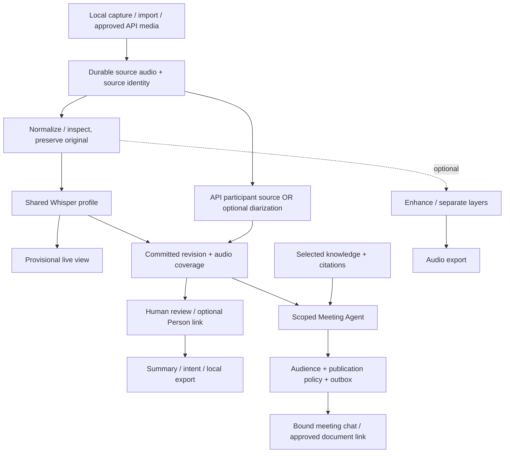

# Audio AI Pipeline

## Pipeline Overview

The combined flow below is a **target architecture**; see the current-state boundaries in the linked specs before claiming any branch implemented.

Attribution enriches the transcript but is not a blocking prerequisite: unknown speakers remain readable. Optional denoising/diarization never block durable ASR output. A committed ASR revision is not human-reviewed truth.

## Recording Strategy

- Record as durable chunks instead of one large in-memory buffer.
- Each chunk enters GenesisBlockDB metadata/WAL and custody after file write succeeds; application code does not open a parallel SQLite store.
- Recovery scans compare DB state and project files.
- Recording session state is stored as a stateful job.

## Processing Stages

### 1. Capture / Import

Inputs:

- Microphone recording.
- Imported `.wav`, `.mp3`, `.m4a`, or other supported audio.

Outputs:

- Source audio artifact.
- AudioChunk records.
- Recording metadata.

### 2. Normalize / Inspect

Purpose:

- Read sample rate, channels, duration, loudness, clipping risk.
- Create waveform preview data.
- Prepare consistent processing format.

### 3. Noise Reduction

Purpose:

- Reduce background noise while preserving speech intelligibility.
- Keep original audio untouched.

Outputs:

- Cleaned voice layer.
- Processing metadata.

### 4. Layer Separation

Purpose:

- Separate useful layers such as speech, music, noise bed, and selected highlights.
- Allow user to increase or focus on desired layer.

V1 target:

- Original layer.
- Cleaned speech layer.
- Noise-reduced export layer.
- User-selected clip layer.

V2 target:

- Voice/music/noise separation when model/runtime supports it.

### 5. Transcription

Purpose:

- Convert audio to timestamped text.
- Provider must be BYOM-capable.

Outputs:

- TranscriptSegment rows with start/end timestamp.
- ModelRun provenance.

### 6. Speaker Diarization

Purpose:

- Assign speaker labels to transcript segments.
- Speaker labels are editable.

Constraints:

- Do not claim real-world identity automatically.
- Confidence and uncertainty must be visible when available.

### 7. Summary

Types:

- Whole-story summary.
- Timeline summary.
- Decisions and action items.
- Speaker-level summary.

All summaries must keep evidence links to transcript timestamps.

### 8. Intent Inference

Purpose:

- Infer likely intent, concern, sentiment, objective, or disagreement for each speaker.

Rules:

- Must be labelled as AI inference.
- Must include evidence spans.
- Must include confidence or uncertainty.
- Must avoid legal/medical/financial conclusions.

## Live and agent branch contracts — candidate

- [Live transcript](../specs/2026-09-21-live-meeting-transcription-spec.md) owns utterance revisions, committed event cursors, source gaps and low-latency targets; current worker is 8-second chunked-live, not proven token streaming.
- [Google Meet adapter decision](../decisions/2026-09-21-google-meet-agent-api-strategy.md) supplies participant/track metadata when available; shared mics may still need pyannote and unknown speaker labels.
- [Speaker identity](../specs/2026-09-21-speaker-identity-domain-design.md) adds optional reviewed Person links, not automatic identity or TTS rights.
- [Knowledge evidence](../specs/2026-09-21-meeting-knowledge-evidence-spec.md) supplies scoped document versions, source locations and numeric context.
- [Meeting Agent](../specs/2026-09-21-meeting-agent-participation-spec.md) consumes committed fresh revisions and sends only through a separate policy/outbox; capture is independent.

Reuse [Whisper profiles](../specs/2026-09-21-whisper-model-profiles.md): large-v3-turbo default, medium for low-resource/CPU int8, large-v3 qualification reference only. Shared model cache/worker budget spans participants; do not duplicate model weights per speaker or run enrollment/diarization ahead of live ASR.

Existing [pipeline adaptation](../specs/2026-09-21-fung-meeting-transcript-pipeline-adaptation.md) stop-path speaker/summary slice remains separately evidenced. The new live/gateway/knowledge/outbox graph above does not imply that slice now has a durable dependency DAG or a production Meet connector.

## Export Requirements

| Export | V1 Requirement |
| --- | --- |
| `.wav` | Original or processed audio |
| `.mp3` | Processed/export mix |
| `.txt` | Plain transcript |
| `.srt` | Subtitle format |
| `.vtt` | Web subtitle format |
| `.json` | Full structured transcript, speakers, model runs, summaries |

## Stateful Jobs

Each processing stage runs as a job with:

- id.
- project_id.
- type.
- input artifact references.
- output artifact references.
- status.
- progress.
- error.
- model/provider metadata when applicable.

## Version Diff

| Version | Change |
| --- | --- |
| 0.2.0b | Added candidate parallel live/knowledge/agent branches, optional attribution and shared model constraints; aligned custody with Genesis. |
| 0.1.0b | Initial local audio pipeline from capture/import through export, summary, and intent inference. |

## Changelog

| Version | Date | Status | Summary | Commit Hash | Agent |
|---------|------|--------|---------|-------------|-------|
| 0.2.0b | 2026-09-21 | candidate | Added candidate parallel live/knowledge/agent branches, optional attribution and shared model constraints; aligned custody with Genesis. | working-tree | RWANG |
| 0.1.0b | 2026-07-05 | beta | Initial audio AI pipeline spec. | N/A | ATHER |
