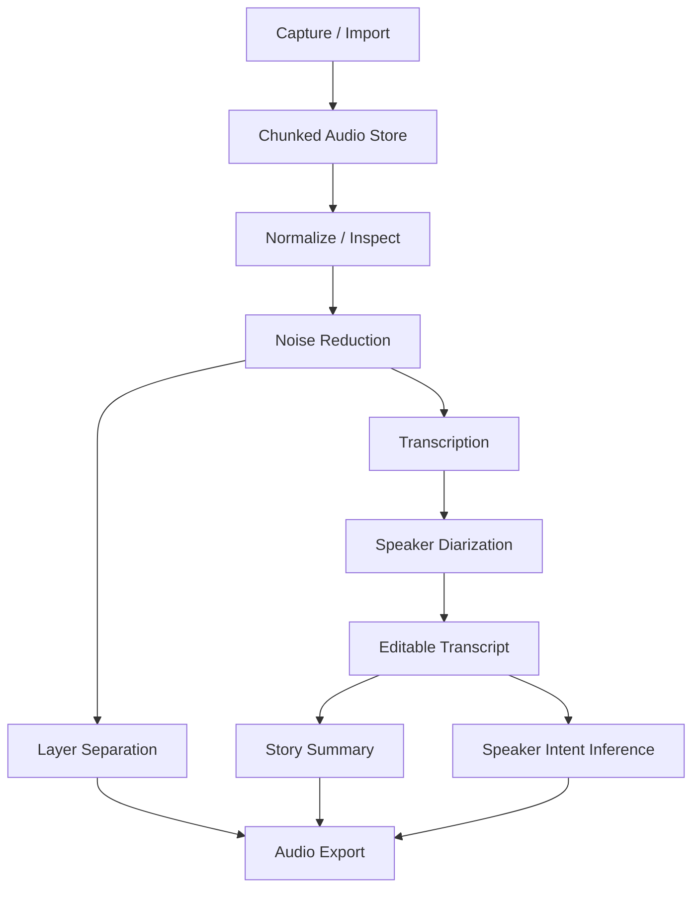

# Audio AI Pipeline

## Pipeline Overview

## Recording Strategy

- Record as durable chunks instead of one large in-memory buffer.
- Each chunk is committed to SQLite WAL metadata after file write succeeds.
- Recovery scans compare DB state and project files.
- Recording session state is stored as a stateful job.

## Processing Stages

### 1. Capture / Import

Inputs:

- Microphone recording.
- Imported `.wav`, `.mp3`, `.m4a`, or other supported audio.

Outputs:

- Source audio artifact.
- AudioChunk records.
- Recording metadata.

### 2. Normalize / Inspect

Purpose:

- Read sample rate, channels, duration, loudness, clipping risk.
- Create waveform preview data.
- Prepare consistent processing format.

### 3. Noise Reduction

Purpose:

- Reduce background noise while preserving speech intelligibility.
- Keep original audio untouched.

Outputs:

- Cleaned voice layer.
- Processing metadata.

### 4. Layer Separation

Purpose:

- Separate useful layers such as speech, music, noise bed, and selected highlights.
- Allow user to increase or focus on desired layer.

V1 target:

- Original layer.
- Cleaned speech layer.
- Noise-reduced export layer.
- User-selected clip layer.

V2 target:

- Voice/music/noise separation when model/runtime supports it.

### 5. Transcription

Purpose:

- Convert audio to timestamped text.
- Provider must be BYOM-capable.

Outputs:

- TranscriptSegment rows with start/end timestamp.
- ModelRun provenance.

### 6. Speaker Diarization

Purpose:

- Assign speaker labels to transcript segments.
- Speaker labels are editable.

Constraints:

- Do not claim real-world identity automatically.
- Confidence and uncertainty must be visible when available.

### 7. Summary

Types:

- Whole-story summary.
- Timeline summary.
- Decisions and action items.
- Speaker-level summary.

All summaries must keep evidence links to transcript timestamps.

### 8. Intent Inference

Purpose:

- Infer likely intent, concern, sentiment, objective, or disagreement for each speaker.

Rules:

- Must be labelled as AI inference.
- Must include evidence spans.
- Must include confidence or uncertainty.
- Must avoid legal/medical/financial conclusions.

## Export Requirements

| Export | V1 Requirement |
| --- | --- |
| `.wav` | Original or processed audio |
| `.mp3` | Processed/export mix |
| `.txt` | Plain transcript |
| `.srt` | Subtitle format |
| `.vtt` | Web subtitle format |
| `.json` | Full structured transcript, speakers, model runs, summaries |

## Stateful Jobs

Each processing stage runs as a job with:

- id.
- project_id.
- type.
- input artifact references.
- output artifact references.
- status.
- progress.
- error.
- model/provider metadata when applicable.

## Version Diff

| Version | Change |
| --- | --- |
| 0.1.0b | Initial local audio pipeline from capture/import through export, summary, and intent inference. |

## Changelog

| Version | Date | Status | Summary | Commit Hash | Agent |
|---------|------|--------|---------|-------------|-------|
| 0.1.0b | 2026-07-05 | beta | Initial audio AI pipeline spec. | N/A | ATHER |
