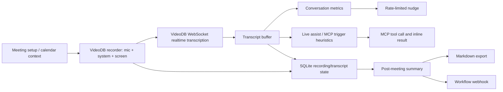
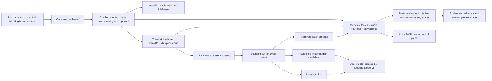

# Call.md × FUNG — Architecture Comparison and Adaptation Decision

## Purpose

เอกสารนี้เปรียบเทียบ Call.md กับ FUNG ในระดับ architecture, data flow, trust boundary และการปฏิบัติการ เพื่อใช้ตัดสินใจว่า feature ใดควร **ออกแบบใหม่บน FUNG**, feature ใดใช้เป็นเพียง reference และส่วนใดไม่ควรรับเข้ามา

เอกสารนี้ไม่อนุมัติการคัดลอก source code, การเปลี่ยน stack หรือการเปิดใช้ cloud/MCP runtime ใด ๆ

## Decision Summary

**Decision: ไม่ fork Call.md เพื่อเป็นฐานของ FUNG.**

ให้ใช้ Call.md เป็น implementation reference สำหรับ “live meeting copilot loop” แล้วสร้าง feature บน architecture เดิมของ FUNG: Tauri v2 + Rust + local control plane + GenesisBlockDB + stateful jobs + BYOM.

เหตุผลหลัก:

1. ทั้งสองผลิตภัณฑ์แก้ปัญหาการประชุมคล้ายกัน แต่ Call.md เป็น Electron/Node application ที่พึ่ง VideoDB cloud สำหรับ realtime transcription และ AI; FUNG มี local-first และ GenesisBlockDB เป็น operational boundary อยู่แล้ว
2. การย้าย Call.md เข้า FUNG จะเกิด desktop shell ซ้ำ, persistence ซ้ำ, API/control plane ซ้ำ และ trust boundary ที่ขัดกัน
3. ฟีเจอร์ที่มีคุณค่าจริงคือ stream/event design ระหว่างประชุม ไม่ใช่ Electron หรือ VideoDB SDK
4. FUNG ต้องรักษา evidence spans, inference labels, explicit consent และ durable/recoverable capture; คุณสมบัติเหล่านี้ต้องเป็น first-class contract ไม่ใช่ UI layer ที่ต่อเพิ่มภายหลัง

## Scope and Evidence Boundary

### Sources reviewed

| Source | Revision / date reviewed | What it establishes |
| --- | --- | --- |
| `https://github.com/video-db/call.md` | `a738410d5ff2cc0bf6a6bfb271a995e96a6bdd6f`, 2026-08-09 | Public repository structure and described product flow |
| `https://raw.githubusercontent.com/video-db/call.md/main/README.md` | 2026-08-09 | Claimed features, VideoDB dependency, dual-channel realtime flow and external workflow behavior |
| `https://raw.githubusercontent.com/video-db/call.md/main/package.json` | 2026-08-09 | Electron/React/Node dependency graph and package metadata license declaration |
| `docs/Desktop/ARCHITECTURE.md` | current workspace document | FUNG target architecture and GenesisBlockDB ownership |
| `docs/Desktop/01-foundations.md` | current workspace document | FUNG product principles and scope boundaries |
| `contracts/local-mcp-v1.yaml` and `contracts/stateful-job-model-v1.yaml` | current workspace contracts | Existing MCP and durable-job invariants |

### Assumptions and limits

1. “Call.md” means the public `video-db/call.md` repository above.
2. This is an architecture analysis, not a security audit, legal opinion, benchmark, or production-readiness certification.
3. Call.md feature statements are treated as repository/documentation claims. Their behavior, quality, latency and Windows packaging have not been run or independently verified on this workstation.
4. The reviewed Call.md checkout contains no root `LICENSE` file, while `package.json` declares `MIT`. Before copying source, assets, names, or distributing a derivative, obtain an explicit upstream license/NOTICE confirmation and review all third-party dependency terms.

## Product Intent: Same Problem, Different Product Contract

| Dimension | Call.md | FUNG | Architectural consequence |
| --- | --- | --- | --- |
| Core promise | Turn meetings into live agent loops | Preserve conversations as private, durable, evidence-backed intelligence | FUNG can adopt live assistance, but must retain provenance and uncertainty |
| Realtime input | Microphone + system audio + screen capture | Microphone/import today; capture architecture targets durable chunked audio | Dual-channel capture is an additive FUNG capability, not a replacement capture stack |
| AI default | VideoDB-hosted realtime transcription and AI require internet | Local/BYOM first; cloud disabled by default | A cloud realtime adapter can only be an explicit, policy-controlled provider |
| User-facing intelligence | Sales-style coaching, questions, metrics, automatic MCP lookup | Transcript, speaker review, summary, intent and export with evidence | FUNG should favor neutral, explainable assistance over persuasive coaching defaults |
| Data ownership | SQLite app state plus VideoDB collection/cloud processing | GenesisBlockDB is the single local operational boundary | Do not add Drizzle/better-sqlite3 or a second database ownership path |
| Automation | Connect remote/stdio MCP servers; agent can auto-trigger tools; webhooks | Localhost MCP wraps local API and respects job/DB invariants | FUNG needs scoped grants and approval gates before invoking external tools or egress |

## Runtime Architecture: Point-by-Point

| Concern | Call.md design | FUNG design | Trade-off | Decision for FUNG |
| --- | --- | --- | --- | --- |
| Desktop shell | Electron main process, preload IPC, React renderer | Tauri v2 command/event bridge, React UI, Rust backend | Electron offers mature Node-native library access; Tauri reduces duplicated Node runtime and matches FUNG’s existing Rust domain core | Keep Tauri. Do not embed Electron or port FUNG into Call.md |
| Frontend | React 19, Tailwind, shadcn/ui, Zustand and tRPC client | React/TypeScript UI with FUNG’s established desktop surfaces | React components and interaction ideas can be studied; component code is coupled to Call.md state/API contracts | Recreate only approved UX patterns in FUNG style and contracts |
| App-to-domain boundary | Electron IPC plus local Hono/tRPC layer | Tauri bridge to a single local API/control plane | Both isolate UI from services; Call.md has two Node-oriented pathways that do not map cleanly to Rust | Route UI, CLI and MCP through FUNG’s single local control plane |
| Durable state | Drizzle ORM + `better-sqlite3` owned by Call.md main process | GenesisBlockDB owns signed WAL, relational/graph/vector/blob projections | Direct SQLite is simple inside one Node app; it would violate FUNG’s single-owner persistence contract | Keep GenesisBlockDB as sole write/query boundary; no direct SQLite access |
| Long work | Service events and application state; post-meeting processing in services | Explicit stateful jobs and append-only `JobEvent` transitions | Call.md feels responsive for live work; FUNG has stronger resumption/audit semantics | Add live jobs/events to the existing job model rather than background UI tasks |
| Audio capture | `@videodb/recorder` and VideoDB-specific packaging patches | Native capture boundary with durable chunks, local files and recovery target | VideoDB reduces implementation effort but introduces vendor/runtime coupling | Implement a FUNG capture adapter; evaluate providers only behind an opt-in interface |
| Realtime transport | Audio sent to VideoDB over WebSocket for live transcripts | Local event stream today; optional BYOM/cloud adapters may be added later | Hosted WebSocket can lower latency-to-feature but sends sensitive meeting data off-device | Local-first event stream is default; cloud stream requires explicit per-provider consent |
| Models | VideoDB OpenAI-compatible API and SDK | BYOM adapters for local or compatible endpoints | Cloud gives simpler deployment; BYOM protects data choice and avoids one vendor | Preserve provider abstraction and provenance for every model run |
| Packaging | Electron Builder; native module rebuild for `better-sqlite3` | Tauri/Rust packaging and FUNG GPU resource staging | A second packager enlarges installer, signing, update and CVE surface | One FUNG packaging pipeline only |
| Platform permissions | Microphone and Screen Recording | Tauri/native permission boundary and recording policy | Screen/system capture is platform-specific and legally sensitive | Add permission/consent UX as an explicit feature gate, not as a hidden SDK capability |

## End-to-End Flow Comparison

### Call.md observed logical flow

The Call.md source organizes this around a co-pilot coordinator, transcript buffer, context manager, metrics service, nudge engine, summary generator and an MCP orchestration set. It buffers live transcript segments, emits UI events, applies simple trigger heuristics before MCP agent work, then generates and saves a post-meeting summary and Markdown export.

### Required FUNG adaptation flow

### Why the FUNG flow is intentionally different

| Call.md step | What works conceptually | Required FUNG correction |
| --- | --- | --- |
| Capture and immediately stream audio | Enables feedback during the call | Persist/recover source chunks first; a live stream cannot be the sole source of truth |
| `me` versus `them` channels | Better than guessing speaker identity after the fact | Model them as explicit audio layers/channels and keep them separate from user-editable speaker labels |
| Buffer transcript before AI | Controls prompt size and update rate | Preserve the referenced segment IDs and time spans in every derived output |
| Metrics/nudge loop | Provides immediate usable feedback | Make it local, rate-limited, dismissible, opt-in and non-judgmental; record why it appeared |
| Auto-trigger MCP tool | Can enrich a conversation quickly | Default to recommendation/preview. External reads or writes require scoped meeting grant and confirmation policy |
| Generate summary on stop | Natural terminal workflow | Run it as a resumable `summary.generate` job with model/provenance/evidence refs |
| Webhook after meeting | Useful workflow integration | Treat it as an export/egress policy decision: redaction preview, destination allowlist, explicit user approval and audit event |

## Data Model and Ownership Comparison

| Data concern | Call.md | FUNG required model | Why |
| --- | --- | --- | --- |
| Recording | A recording row plus VideoDB video/collection references | `Recording`, `AudioChunk`, `AudioLayer`, blob manifest and integrity/provenance refs | FUNG must recover local audio even when provider/network is unavailable |
| Dual-channel audio | `me` / `them` transcript channels | Audio-layer metadata: `capture_role = microphone | system_audio`, source device, channel layout, chunk sequence | “Us versus them” is capture provenance, not a verified person identity |
| Transcript | Streamed segments stored in app DB | `TranscriptSegment` with start/end times, recording/layer ref, revision and optional speaker label | Enables edit history and evidence links |
| Speaker | Channel attribution plus meeting participant handling | Editable `Speaker` labels linked to segments; no biometric identity claim | Captured source and inferred identity have different confidence/legal meaning |
| Metric | Derived live state and saved snapshot | `LiveMetricObservation` or versioned derived artifact with window, formula version and segment refs | User must be able to inspect what the metric means |
| Nudge | Nudge history/notification | `NudgeCandidate` / `NudgeDecision` with policy, evidence refs, dismissal state and no hidden behavioral score | Avoid opaque or coercive meeting scoring |
| Assist output | LLM/MCP response for inline display | `ModelRun` or `ExternalToolRun` with requested capability, redaction decision, output ref and audit event | Supports revocation, troubleshooting and privacy review |
| Summary/action item | Stored short overview, key points, checklist | `Summary` / `IntentInference` with evidence spans, inference labels and provider/model parameters | Preserves FUNG’s evidence-based product promise |
| External delivery | Direct workflow webhooks | `ExportArtifact` plus `EgressApproval` and destination/audit metadata | A webhook is data disclosure, not merely a convenience integration |

## Feature Decision Matrix

| Call.md capability | Product value for FUNG | Fit with FUNG | Risk | Decision | Delivery condition |
| --- | --- | --- | --- | --- | --- |
| Dual-channel mic/system capture | High | High | High: OS capture, consent, data loss | Adopt as a new FUNG capability | Native feasibility spike, chunk recovery and consent E2E pass |
| Screen capture | Medium | Low | High: privacy/storage/platform complexity | Defer | Separate approved spec; no dependency for audio intelligence |
| Live transcript | High | High | Medium: latency/resource contention | Adopt incrementally | Local/BYOM path first; cloud only opt-in |
| Live talk ratio/WPM/silence | High | High | Medium: misleading interpretation | Adopt | Formula/version/evidence window shown; no personality or performance score |
| Monologue/question detection | Medium | Medium | Medium: language and transcription error | Pilot behind feature flag | Thai/multilingual evaluation set and false-positive threshold approved |
| Coaching nudges | Medium | Medium | High: manipulative or unsupported inference | Adapt | User opt-in, rate-limit, dismiss, evidence explanation and neutral copy |
| AI questions / suggested phrasing | Medium | Medium | Medium: hallucination, leakage | Adapt | BYOM provider policy, inference label and no autonomous sending |
| MCP auto-trigger | Medium | Low as-is | Critical: unintended data access/action | Do not adopt as-is | Replace with suggest → preview → approved execution contract |
| MCP results panel | High | High | Medium: untrusted content rendering | Adopt | Result sandboxing, source/tool name, timestamps and audit trace |
| Meeting preparation checklist | Medium | Medium | Low | Adopt later | Calendar/auth scope and a user-owned template model approved |
| Calendar polling/auto-record | Medium | Medium | High: unintended recording | Defer | Per-calendar consent, visible countdown, default ask-before-record and legal review |
| Summary/key points/action items | High | High | Medium: unsupported claims | Adopt through existing target | Evidence spans and user review before export |
| Markdown export | High | High | Low | Adopt | Extend current export contract only; preserve provenance |
| Workflow webhooks / CRM push | Medium | Low by default | High: external disclosure and secret management | Defer | Egress policy, destination credentials, redaction and retry/audit design approved |

## MCP and Agent Control: Critical Divergence

Call.md connects MCP servers over stdio or HTTP and uses conversation-trigger heuristics to invoke an MCP agent during meetings. This is attractive for a demo but is not compatible with FUNG’s current trust contract without additional control.

The current FUNG MCP contract is loopback-only, wraps the local API, cannot bypass database/job invariants and requires long-running actions to create/reuse a durable job. The following policy is therefore required before any external-MCP/live-assist feature:

| Policy area | Required FUNG decision |
| --- | --- |
| Default action | Suggest only; never invoke external tools automatically by default |
| Grant scope | Per meeting/project, capability-specific, time-bounded and revocable |
| Data minimization | Send only the selected evidence span and required metadata; never full transcript/audio by default |
| Confirmation | External write, credentialed read, network egress and tool side-effect require explicit confirmation |
| Tool catalogue | User-visible allowlist with provider, endpoint, permission and data classification |
| Audit | Record trigger, policy decision, user confirmation, exact input reference, output ref and failure (without storing secrets) |
| Rendering | Treat tool output as untrusted; sanitize Markdown/links and state the origin |
| Resilience | Disconnected/failed tools cannot block capture, chunk persistence, transcript or export jobs |

## Trade-off Analysis

### Option A — Fork Call.md and change its branding/features

| Benefit | Cost / risk |
| --- | --- |
| Fastest route to a familiar live-copilot demo | Replaces or duplicates FUNG’s Tauri/Rust/Genesis architecture |
| Existing calendar, MCP and coaching UI | VideoDB-dependent realtime path changes FUNG’s local-first promise |
| Existing product surface is relatively broad | Requires Node native-module packaging, Electron security/updater ownership and database migration |
| Git history can be examined and retained | License/NOTICE must be confirmed before reuse; upstream updates will be difficult to merge after divergence |

**Verdict: Reject.** It creates a separate product stack rather than advancing FUNG.

### Option B — Port selected Call.md source modules into FUNG

| Benefit | Cost / risk |
| --- | --- |
| Can accelerate an individual UI or metric algorithm | Service modules are TypeScript/Node, coupled to Electron, Drizzle, VideoDB and Call.md types |
| Retains some implementation detail | Still has license/attribution obligations and risks smuggling cloud/persistence assumptions into FUNG |

**Verdict: Reject as a default.** Reimplement behavior from a written FUNG contract. Any future code reuse requires approved license review, dependency audit, narrow provenance record and independent tests.

### Option C — Use Call.md as a reference and implement FUNG-native slices

| Benefit | Cost / risk |
| --- | --- |
| Preserves FUNG’s local-first, BYOM, evidence and Genesis contracts | Requires deliberate design and native capture work |
| Lets FUNG build a differentiated, trustworthy Meeting Mode | Slower than a fork for a demo |
| Avoids second desktop/persistence/packaging stack | Needs clear scope gates for MCP, cloud and legal consent |

**Verdict: Select.** This is the only option aligned with FUNG’s architecture and user promise.

## Recommended Architecture Decisions

1. **Keep one desktop runtime.** Tauri/Rust remains the only native shell and domain runtime.
2. **Persist before enriching.** Capture coordinator must establish durable chunks and Genesis records before optional live analysis.
3. **Represent capture role separately from speaker identity.** `microphone`/`system_audio` describe source provenance; speaker labels remain editable, uncertain annotations.
4. **Introduce a bounded live-analysis queue.** It consumes finalized transcript spans and must never delay capture. It exposes queue depth, latency and drop/defer reason.
5. **Make metrics deterministic first.** Implement talk ratio, silence and speech-rate from timestamped spans before using an LLM for any interpretation.
6. **Treat nudges as policy-controlled recommendations.** No hidden score, no personality label, no automatic action; show evidence and let users disable them per meeting.
7. **Extend MCP only through grants.** The local MCP server remains an API wrapper. Any external server/tool needs explicit project-scoped authorization and egress policy.
8. **Keep model/provider provenance.** Every live assist, summary, nudge requiring a model, or external tool response must point to provider, policy and input evidence refs.
9. **Defer screen capture, calendar auto-record and workflow webhooks.** They expand privacy, platform permission and external-identity scope beyond the live-audio vertical slice.

## Proposed Delivery Sequence

This sequence is a proposal only. Each slice needs its own approved design, task plan, tests and release gate before code starts.

| Slice | Scope | Exit criteria | Dependency |
| --- | --- | --- | --- |
| S1: Capture provenance spike | Separate microphone/system audio layers; chunk ledger; recovery | Interruption recovery preserves both layers and their sequence; consent state recorded | Native platform capture feasibility |
| S2: Local live transcript events | Emit finalized segment events without blocking capture | Sustained capture test shows bounded queue and no dropped durable chunks | S1 and selected local/BYOM transcript adapter |
| S3: Deterministic metrics | Talk ratio, silence and rate over configurable windows | Formula/evidence references visible; multilingual fixture tests pass | S2 |
| S4: Nudge candidates | Neutral, rate-limited, dismissible recommendations | Opt-in policy and no-nudge negative tests pass | S3 plus UX/legal approval |
| S5: Evidence-backed live assist | BYOM text assist tied to selected context | Offline/default path and provider failure leave capture untouched | S2 plus provider policy |
| S6: Controlled MCP result surface | Suggested tool action, preview, grant, audit and result panel | External-tool denial/revoke/redaction tests pass | S5 plus security design |
| S7: Post-meeting package | Recap/action/export extension | Every claim has evidence span; export requires user review | Existing summary/export work |

## Non-Goals and Explicit Deferrals

- Do not import Call.md’s Electron main/preload/renderer architecture.
- Do not create a FUNG-owned direct SQLite/Drizzle path.
- Do not make VideoDB, cloud transcription or network connectivity required for recording.
- Do not auto-start recording from calendar events.
- Do not collect screen capture as a prerequisite for the meeting feature.
- Do not execute arbitrary MCP tools from transcript keywords.
- Do not send raw transcript/audio to webhooks/CRMs by default.
- Do not present speaking metrics, inferred intent or coaching output as factual evaluation of a person.

## Acceptance Criteria for This Architecture Decision

This comparison is accepted when stakeholders agree that:

- [ ] Call.md is a reference implementation, not the FUNG base repository.
- [ ] FUNG retains Tauri/Rust, GenesisBlockDB and the single local control plane.
- [ ] Cloud realtime processing is opt-in and never required for durable recording.
- [ ] Dual-channel capture, metrics and nudge designs preserve source/evidence provenance.
- [ ] External MCP and webhook capabilities require a separate security/consent specification before implementation.
- [ ] S1 is selected, deferred, or replaced by a more specific approved product outcome.

## Open Decisions Requiring Boss Approval

| ID | Decision | Why it matters |
| --- | --- | --- |
| OQ-01 | Should FUNG’s first live capture target microphone only, or microphone + system audio? | Determines native capture scope, consent UX and meeting usefulness |
| OQ-02 | Is live assist a personal/private tool, or may it suggest externally shareable replies? | Sets model output policy and safety requirements |
| OQ-03 | Should nudge cards exist in V1, or should metrics be read-only first? | Controls product risk and validation workload |
| OQ-04 | Is any cloud realtime provider permitted after explicit consent, or local/BYOM only? | Determines latency, cost, privacy and provider implementation path |
| OQ-05 | What external MCP capabilities, if any, can a meeting grant authorize? | Defines the security boundary before agentic tool use |
| OQ-06 | Is calendar preparation in scope before mobile/cloud roadmap completion? | Brings OAuth/calendar data and auto-record policy into scope |

## Version Diff

| Version | Change |
| --- | --- |
| 0.1.0b | Initial point-by-point comparison of Call.md and FUNG; selects FUNG-native adaptation over repository fork or direct code port. |

## CHANGELOG

| Version | Date | Status | Summary | Commit Hash | Agent |
|---------|------|--------|---------|-------------|-------|
| 0.1.0b | 2026-08-09 | draft | Added Call.md/FUNG architecture comparison, trade-off analysis, decisions and delivery gates. | N/A — uncommitted | ATHER |
