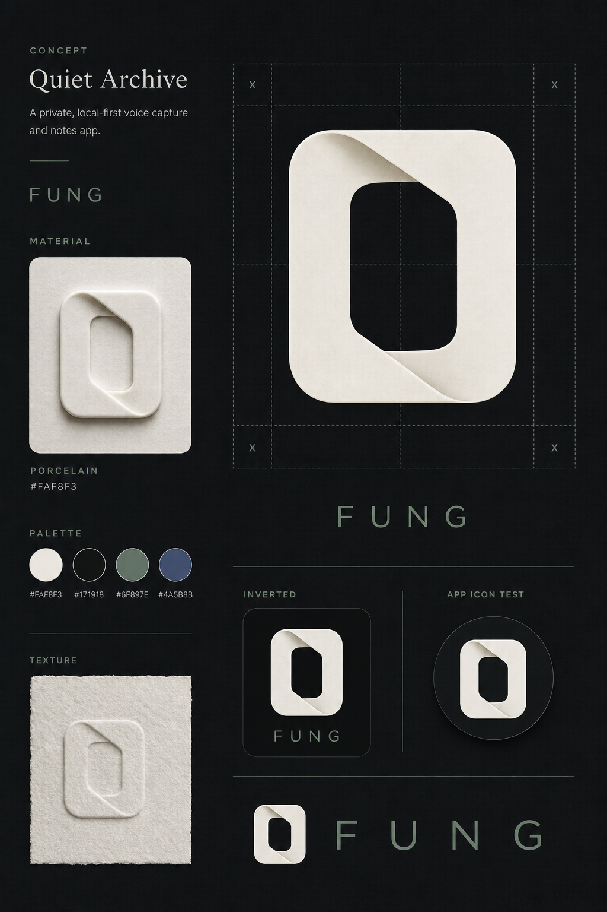
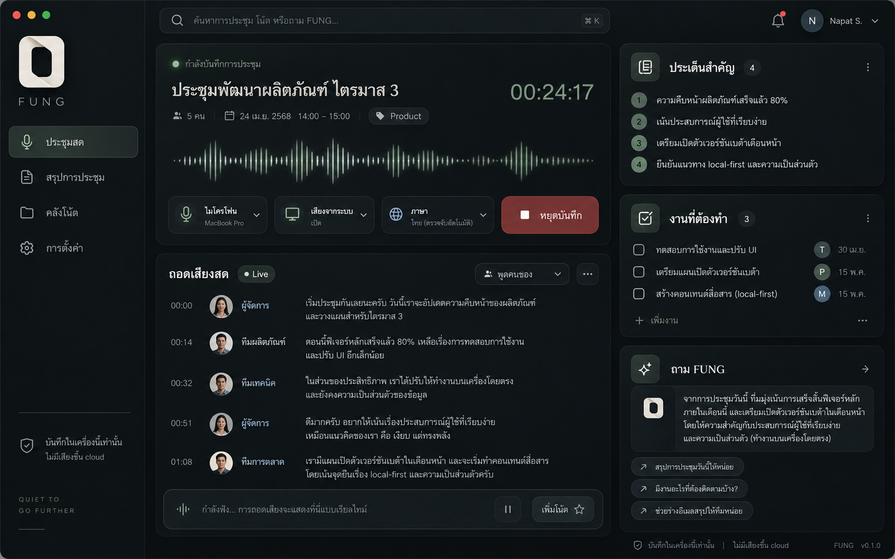
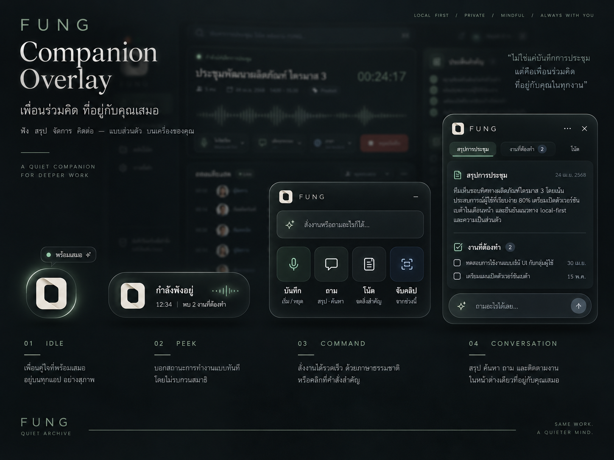

# FUNG — Quiet Archive Design System

**Design direction:** Quiet Archive × Ambient Workspace
**Brand promise:** Local by default. Connected by choice.
**Document status:** ข้อเสนอสำหรับ review และนำไปวางแผนพัฒนา ไม่ใช่การรับรองว่าระบบในเอกสารถูก implement แล้ว

> FUNG ต้องทำให้การฟัง การอ่าน และการเรียกใช้ข้อมูลรู้สึกสงบและควบคุมได้ ความเป็นผู้ช่วยมาจากการเข้าถึงงานได้ทันทีและบอกสถานะตามจริง ไม่ใช่การเติมแสงเรือง กราฟ หรือมาสคอตที่ไม่มีหน้าที่

## สารบัญ

| ส่วน | เนื้อหา |
| --- | --- |
| 0–2 | สถานะเอกสาร แหล่งอ้างอิง หลักการ และจุดต่างจาก mock |
| 3–8 | Logo, token architecture, color, typography, layout และ motion |
| 9–11 | Component contracts, data truth และ flow หลัก |
| 12–15 | Desktop, Mobile, Web, Landing และ Phone page |
| 16–18 | Companion Overlay, Settings และ Accessibility |
| 19–21 | ภาษาและข้อความ สัญญาฝั่ง frontend และ API mapping |
| 22–25 | Screen inventory, QA, แผน implementation และ handoff |
| 26 | ประเด็นที่ต้องตัดสินใจก่อนอนุมัติ |

---

## 0. การใช้เอกสารและขอบเขตความน่าเชื่อถือ

### 0.1 แหล่งอ้างอิง

| ID | แหล่งข้อมูล | ใช้ตัดสินเรื่องใด |
| --- | --- | --- |
| **B** | [FRONTEND_REDESIGN_BRIEF.md](references/FRONTEND_REDESIGN_BRIEF.md), v1.0.0, snapshot 16 ก.ย. 2026 | ความสามารถปัจจุบัน API ข้อจำกัด CI สถานะข้อมูล และขอบเขตแต่ละ surface |
| **L** | [Quiet Archive.png](references/quiet-archive-logo-concept.png) — ภาพโลโก้ที่ผู้ใช้ระบุ | รูปร่างมาร์ก วัสดุ porcelain บุคลิกภาพ และ palette ตั้งต้น |
| **M1** | [Mock: Desktop Live Meeting](references/desktop-live-meeting-direction.png) — mock ล่าสุด | ทิศทาง dark workspace, รายการ transcript, สถานะ และพื้นที่ถาม FUNG |
| **M2** | [Mock: Companion Overlay](references/companion-overlay-direction.png) — mock ล่าสุด | ทิศทางมาร์กเป็น companion และลำดับ Idle → Peek → Command → Conversation |
| **U** | คำสั่งในบทสนทนา: niche / ใช้งานง่าย / มีลักษณะ JARVIS / overlay แบบ pet / ใช้โลโก้ที่ให้มา | เจตนาการออกแบบ ไม่ใช่ข้อยืนยันความพร้อมของ backend |

เอกสารนี้อ้างความสามารถจาก **B เท่านั้น** ไม่ได้อ่านหรือทดสอบ repository ล่าสุดซ้ำ ค่า spacing, semantic colors, interaction และ layout ใหม่ในเอกสารเป็น **ข้อเสนอออกแบบ** ที่แยกจากข้อเท็จจริงเดิม ภาพ M1/M2 เป็น visual direction ไม่ใช่ภาพผลิตภัณฑ์ที่ทำงานแล้ว ไม่มีการนำคำอธิบายคู่แข่งในบทสนทนามาเป็นข้อกำหนดทางเทคนิคที่ยืนยันแล้ว

ลำดับการตัดสิน: ความจริงของข้อมูลและข้อจำกัดความปลอดภัยใน B ต้องไม่ถูกเปลี่ยนเพราะภาพ mock; รูปร่างแบรนด์อิง L; รายละเอียด visual อิง M1/M2 และข้อเสนอในเอกสารนี้ หากสองแหล่งขัดกัน ต้องบันทึกข้อขัดแย้ง ไม่เดาเงียบ ๆ

### 0.2 สัญลักษณ์สถานะ

| สถานะ | ความหมาย |
| --- | --- |
| **EXISTING** | B ระบุว่ามีแล้ว ไม่ได้หมายถึงผู้เขียนตรวจโค้ดรอบนี้ |
| **CONDITIONAL** | B ระบุว่าต้องมี runtime, pairing, provider, configuration หรือ feature flag |
| **PROPOSED** | ข้อเสนอ UX/UI หรือสัญญาข้อมูลใหม่ ต้อง review ก่อนพัฒนา |
| **EXPERIMENTAL** | B ระบุว่ายังมี fixture หรือบางส่วนยังไม่ครบ |
| **UNSUPPORTED** | ยังไม่มี backend/handler ตาม B; ไม่แสดงเป็นปุ่มที่กดแล้วสำเร็จได้ |

คำว่า **ต้อง** ในเอกสารหมายถึงข้อกำหนดสำหรับ implementation ที่จะใช้ design system นี้ ไม่ใช่การประกาศว่าของเดิมทำเช่นนั้นแล้ว

### 0.3 ไม่อยู่ในขอบเขตการส่งมอบครั้งนี้

ไม่รวมการแก้ repository, native overlay implementation, Figma/Penpot component library, SVG โลโก้ฉบับ production, การทดสอบแอปจริง หรือภาพ light mode ทุกหน้าจอ ไฟล์ token เป็นข้อเสนอที่สร้างและตรวจคู่สีแล้ว แต่ยังต้องเชื่อมกับ component และ runtime จริง

---

## 1. Product experience principles

**หลักฐานตั้งต้น:** B §1, §7–8; U. รายละเอียดวิธีจัดหน้าเป็น PROPOSED

| หลักการ | กฎที่ใช้ตัดสินงานออกแบบ | ตัวอย่างการตรวจ |
| --- | --- | --- |
| **Content before chrome** | บทสนทนาและผลลัพธ์ใหญ่กว่าของตกแต่ง | หน้า Live ไม่ใช้ waveform ยักษ์กินพื้นที่อ่าน transcript |
| **One primary task** | แต่ละ view มีงานหลักชัดหนึ่งงาน คำสั่งรองอยู่ตามบริบท | ระหว่างอัด ปุ่มหลักคือ “จบประชุม” ไม่ใช่ “เริ่มงานใหม่” |
| **Quiet, not invisible** | เรียบ แต่สถานะสำคัญต้องอ่านเห็น | การบันทึก ความผิดพลาด และ cloud execution ห้ามลด contrast จนหาย |
| **Presence without interruption** | ผู้ช่วยไม่แย่ง focus หรือโผล่ข้อความเองพร่ำเพรื่อ | Companion อยู่เล็ก ๆ จนผู้ใช้เรียก; ผลลัพธ์ใหม่ไม่บังคับเปิดแผง |
| **Truth over decoration** | ทุกค่าที่ดูเป็นข้อมูลต้องมีที่มา | ไม่มี level source → ไม่วาด waveform จำลอง |
| **Local is a boundary** | แสดงตำแหน่งข้อมูล แหล่งประมวลผล และการเชื่อมต่อแยกกัน | “จับคู่แล้ว” ไม่เท่ากับ “เชื่อมต่ออยู่” และไม่เท่ากับ “ทำงานในเครื่อง” |
| **Same grammar, different surfaces** | ใช้ token และ component grammar ร่วมกัน แต่ไม่ย่อ desktop ลงมือถือ | Mobile ใช้ bottom navigation; Web แยกไฟล์ใน browser กับไฟล์จาก desktop |

**บุคลิกที่ต้องการ:** สุขุม ชัดเจน มีสัมผัสวัสดุเล็กน้อย เป็นส่วนตัว และตอบสนองต่อการใช้งาน

**สิ่งที่ตัดออก:** ดาวเสาร์หรือ mascot คนละแบรนด์, ขอบทองเรืองแสงรอบทุก card, ฉากหินในพื้นที่ทำงาน, HUD เส้นตกแต่ง, ตัวเลขความแม่นยำที่ไม่มีข้อมูล, การเคลื่อนไหวไม่หยุด และกรอบซ้อนหลายชั้นโดยไม่มีเหตุผล

---

## 2. Visual baseline และ discrepancy register

M1/M2 กำหนด mood และความสัมพันธ์ของส่วนประกอบ ไม่ใช่ข้อสรุป pixel-perfect เอกสารนี้เสนอให้ลดขนาดพื้นที่ waveform, ใช้สีอ่านง่ายขึ้น และแก้ affordance ที่ภาพทำให้ดูเหมือนมีฟีเจอร์แล้ว โดยเปิดเผยความต่างดังนี้

| ID | สิ่งที่เห็นในภาพ / จุดขัดแย้ง | ข้อมูลจาก B | ข้อกำหนดออกแบบรอบนี้ |
| --- | --- | --- | --- |
| V-01 | Desktop ใช้ปุ่มหน้าต่างแบบ macOS | B §1 ระบุ Windows/Tauri ไม่มี OS decorations | ใช้ controls ที่สอดคล้องกับ Windows build; ไม่คัดลอก traffic lights จาก mock |
| V-02 | waveform desktop ดูเคลื่อนไหวได้ | B §3 ระบุ rail VU ไม่มี source; live events ใน §5 ไม่มี level event | ไม่มี waveform ที่อ้างว่าเป็นระดับเสียงสดจนเชื่อม source จริง; ใช้สถานะข้อความแทนได้ |
| V-03 | Global search และ hotkey ดูพร้อม | B §3 ระบุ search ไม่มี handler | ซ่อน global search ใน production จนมี capability; การถาม FUNG ไม่ถูกอ้างว่าเป็น global search |
| V-04 | มี pause บน desktop, เพิ่มโน้ต, จับคลิป | B ให้ desktop live start/stop; Notes มีบน mobile; capture.marker ยังปิด | Desktop ไม่เสนอ pause/marker/clip/note ที่ยังไม่รองรับ; command list ต้องผ่าน capability gate |
| V-05 | Task checklist เพิ่ม/ติ๊กเสร็จได้ | B ระบุ action items จาก AI แต่ไม่ระบุ task persistence API | แสดงรายการข้อเสนอแบบอ่านอย่างเดียว; ปุ่มติ๊กและเพิ่มงานต้องรอ backend contract |
| V-06 | รูปคน จำนวนผู้เข้าประชุม และชื่อบทบาท | B มี speaker grouping ไม่ใช่การยืนยันตัวบุคคล | ใช้ “ผู้พูด 1” หรือชื่อที่ผู้ใช้กำหนด; ไม่สร้างรูปหรือจำนวนคนจากจำนวน cluster |
| V-07 | Companion ลอยเหนือทุกแอป | B §4.1 ระบุเพียง panel overlays ภายในแอป | OS-level Companion เป็น PROPOSED ต้อง ADR และ native capability แยก |
| V-08 | วันที่ เปอร์เซ็นต์ เวอร์ชัน ข้อมูลโครงการใน mock | เป็นข้อมูลสาธิต ไม่ใช่ product telemetry | ไม่คัดลอกเป็นค่า default; ตัวอย่างที่คงไว้ใน design fixture ต้องติดป้าย “ข้อมูลตัวอย่าง” |
| V-09 | L มี wordmark sage บนพื้นมืด แต่ B §2 ให้ porcelain บนมืด | แหล่งอ้างอิงต่างกัน | UI token รอบนี้ยึด porcelain ตาม B; ภาพ L ไม่แก้ไขย้อนหลัง; ขอ brand sign-off ก่อน freeze |
| V-10 | “ไม่มีเสียงขึ้น cloud” แสดงตลอด | B §3 มี opt-in cloud provider และ delegated cloud execution | คงประโยคเดิมใน local context; เมื่อ route ไม่ local ต้องแสดง route จริงแทน ไม่ใช้ claim เดิมครอบทุกกรณี |
| V-11 | Mock ชุดล่าสุดเป็น dark เท่านั้น | B ต้องการ light + dark | Dark เป็น visual reference; Light เป็น semantic proposal ที่ต้อง review ภาพต่อ ไม่ถือว่าผ่านแล้ว |

ทุก divergence นี้เป็นการกำหนดขอบเขตอย่างเปิดเผย ไม่ใช่การเปลี่ยน feature scope ของ backend โดยอัตโนมัติ

---

## 3. Brand identity และ logo usage

**หลักฐาน:** L; B §2. เก็บรูปร่าง Quiet Archive ตามต้นฉบับ

### 3.1 มาร์ก

มาร์กเป็นรูปช่องเปิดคล้าย O จากแผ่น porcelain ที่พับกลับ มีช่องว่างกลางเป็นส่วนสำคัญ ห้ามแทนด้วยตัว F, วงกลมทั่วไป, ดาวเสาร์ หรือ icon ใหม่ที่สื่อคนละ identity

สำหรับ production ให้ใช้ SVG `currentColor` ที่ B ระบุ: `docs/brand-kit/logo/fung-mark.svg` หรือ canonical asset ที่ทีมแบรนด์ยืนยัน ห้าม trace มาร์กใหม่จาก screenshot แล้วถือว่าเป็น asset เดียวกัน แพ็กนี้มีเพียงภาพ concept อ้างอิง ไม่ได้แนบ SVG ต้นฉบับที่ยังไม่ได้รับมา

| บริบท | ขนาด / สี / การใช้งาน |
| --- | --- |
| UI mark | กว้างอย่างน้อย 24px, อิง geometry จริง ไม่บีบหรือยืด |
| Favicon | 16px เป็นข้อยกเว้นตาม B; ต้องตรวจ negative space ที่ขนาดจริง |
| Clearspace | อย่างน้อย 25% ของความกว้างมาร์ก รอบทุกด้าน |
| Light surface | `#171918` — ink |
| Dark surface | `#FAF8F3` — porcelain |
| App icon | อนุญาต tile ink ตาม B; มี safe area ตามแพลตฟอร์มที่นำไปใช้ |
| UI ทั่วไป | ไม่ใส่กล่องหลังโลโก้เป็นส่วนหนึ่งของ lockup; interactive container ต้องแยกจาก artwork |

### 3.2 Wordmark และ typography ของแบรนด์

ใช้ `FUNG`, DM Sans Medium, uppercase, tracking `0.34em` ตาม B ไม่เปลี่ยนเป็น serif เพราะ headline ใช้ serif ได้ สี wordmark ใน token คือ sage บนสว่าง และ porcelain บนมืด ตาม discrepancy V-09

Fraunces ใช้กับ editorial headline และ brand statement เท่านั้น ไม่ใช้แทน wordmark และไม่ใช้กับ transcript, settings, timer หรือ labels

### 3.3 Material expression

Porcelain เป็นความรู้สึกของวัสดุ ไม่ใช่ texture ที่ต้องปูหลังทุกหน้าจอ เก็บความนูนและผิวไว้ที่ brand artwork หรือ companion visual ขนาดเหมาะสม; UI 24–32px ให้ใช้มาร์กเรียบคมเพื่ออ่านรูปทรงได้

ห้าม emboss ตัวอักษรยาว ห้ามวางผิว grain ทับ transcript และห้าม glow จน negative space กลางมาร์กหาย การแสดง listening/thinking ใช้ indicator ข้างมาร์ก ไม่ย้อมสีหรือบิดรูปโลโก้

---

## 4. Token architecture และ ownership

**EXISTING:** สี brand 6 ตัวและ type family จาก B §2. **PROPOSED:** semantic themes, dimensions, motion และการ scope ตัวแปร

ลำดับ token: **Brand primitives → Semantic roles → Component usage**

ตัวอย่าง: `brand-slate` คือค่าสีเอกลักษณ์; `action-primary-bg` คือสีพื้นปุ่มตาม theme; component เรียก semantic role ไม่เรียกสี brand ตรง ๆ เว้นแต่มาร์กหรือ brand artwork

| ไฟล์ในแพ็ก | หน้าที่ |
| --- | --- |
| `tokens/fung.tokens.json` | ข้อมูลตั้งต้นของ token, theme, breakpoint และคู่สีที่ทดสอบ; เป็น project-specific schema ไม่อ้าง DTCG compatibility |
| `tokens/build_tokens.py` | สร้าง CSS และรายงาน contrast ด้วย Python standard library |
| `tokens/fung.tokens.css` | CSS ที่ generate แล้ว ใช้ prefix `--fung-` และ scope `[data-fung-root]` |
| `qa/CONTRAST_REPORT.md` | ผลตรวจคู่สีทึบเท่านั้น ไม่ใช่ใบรับรอง accessibility ของแอป |

ห้ามแก้ JSON และ CSS แยกกันด้วยมือ ให้แก้ JSON แล้ว generate CSS ใหม่ การนำไปเป็น source of truth ใน repo ต้องเลือกให้เหลือเจ้าของเดียวและ migrate ของเดิม ไม่ปล่อยให้ `docs/brand-kit/tokens.css` กับชุดใหม่กลายเป็นสองมาตรฐานถาวร

### 4.1 Theme contract

ค่าที่ผู้ใช้เลือกมี `light`, `dark`, `system` แต่ละ root มี `data-fung-root` และ `data-theme` ของตนเอง ไม่มีค่าหรือ `system` ให้ตามระบบ CSS ที่แนบรองรับการ resolve สีนี้ แต่ **ไม่ได้ทำการ persist preference** และไม่ได้ sync ข้ามหน้าต่างให้เอง

เสนอ storage key `fung.ui.theme.v1` เป็นชื่อใหม่ที่ต้องตรวจ collision ใน repo ก่อนใช้ Desktop/Mobile/Web ต้องมี adapter จัดเก็บตามข้อจำกัดของแต่ละ runtime; Phone page ต้องแยก preference ออกจาก session token และไม่เปลี่ยนวิธีเก็บ token เดิม

เมื่อเลือก `system` การเปลี่ยน theme ของ OS ต้องสะท้อนในแอปโดยไม่กระทบ recording state ห้าม flash theme ตรงข้ามก่อนโหลดหน้า และห้ามใช้ theme เป็นสถานะ local/cloud

---

## 5. Color system

### 5.1 Brand primitives — คงค่าตาม B

| Token | Hex | ความหมาย |
| --- | --- | --- |
| `brand-porcelain` | `#FAF8F3` | พื้นสว่าง วัสดุแบรนด์ และ foreground บนพื้นมืด |
| `brand-ink` | `#171918` | พื้นมืดและข้อความหลักบนสว่าง |
| `brand-sage` | `#6F897E` | accent แบรนด์และ local/confirmed family |
| `brand-slate` | `#4A5B8B` | interactive/focus family |
| `brand-metal` | `#9A8260` | pending/caution family |
| `brand-clay` | `#B0553F` | error/destructive family |

B §2 ระบุ clay สำหรับ error/destructive ขณะที่ B §7 เพิ่มการใช้สีแดงกับ recording เอกสารนี้รักษาทั้งสองบริบท: ใช้ clay family กับ error, destructive และ recording เท่านั้น ไม่ใช้เป็นสีแบรนด์ของปุ่มทั่วไป

### 5.2 Semantic palette — PROPOSED

ตารางนี้เป็น subset สำหรับอ่านเร็ว ค่าเต็มอยู่ใน JSON/CSS ห้ามเปลี่ยน brand primitive เพื่อแก้ contrast ของ component ให้แก้ semantic role แทน

| Semantic token (`--fung-…`) | Light | Dark |
| --- | --- | --- |
| `bg-canvas` | `#FAF8F3` | `#171918` |
| `bg-inset` | `#F0EDE6` | `#111312` |
| `bg-surface` | `#FFFEFA` | `#202521` |
| `bg-elevated` | `#FFFFFF` | `#292F2A` |
| `text-primary` | `#171918` | `#FAF8F3` |
| `text-secondary` | `#505A54` | `#CAD1C9` |
| `text-tertiary` | `#59665F` | `#A3AFA4` |
| `border-subtle` | `#D6D9D1` | `#384239` |
| `border-strong` | `#768177` | `#788A7A` |
| `action-primary-bg` | `#4A5B8B` | `#B9C8EE` |
| `action-primary-fg` | `#FAF8F3` | `#171918` |
| `link` | `#4A5B8B` | `#B9C8EE` |
| `focus` | `#4A5B8B` | `#B9C8EE` |
| `state-local-fg` | `#3F6150` | `#ACC6B4` |
| `state-local-bg` | `#E7EEE8` | `#23382C` |
| `state-pending-fg` | `#765925` | `#E3C493` |
| `state-pending-bg` | `#F4ECDD` | `#3C3021` |
| `state-danger-fg` | `#9A4634` | `#F1AB97` |
| `state-danger-bg` | `#F7E7E1` | `#3D2722` |
| `state-recording-fg` | `#9A4634` | `#F1AB97` |
| `state-inferred-fg` | `#4A5B8B` | `#B9C8EE` |
| `logo-mark` | `#171918` | `#FAF8F3` |
| `logo-wordmark` | `#6F897E` | `#FAF8F3` |

สี `border-subtle` มีหน้าที่แบ่งพื้นผิวแบบตกแต่ง ไม่ใช้เป็นขอบเดียวของ input หรือ control ที่ผู้ใช้จำเป็นต้องมองเห็น ใช้ `border-strong` สำหรับเส้นสำคัญ และใช้ selected label/indicator ร่วมกับสีเสมอ

### 5.3 Color semantics

| ความหมาย | Visual treatment | ข้อห้าม |
| --- | --- | --- |
| Local / confirmed | Sage semantic + icon + ข้อความ | ห้ามใช้ dot เขียวจุดเดียวแทน privacy/trust ทั้งระบบ |
| Interactive / selected | Slate semantic, underline หรือ indicator ตาม component | ไม่ใช้ sage เป็น primary button ทุกบริบท |
| Pending / uncertain / degraded | Metal semantic + ข้อความอธิบาย | ไม่แปล “กำลังรอ” เป็น “ล้มเหลว” |
| Recording | Clay indicator + label “กำลังบันทึก” + stop affordance | ไม่ทำ indicator ให้ดูเป็นเสียงระดับสูงหรือภัยคุกคาม |
| Error / destructive | Clay semantic + error message หรือ verb ที่ชัด | ไม่ใช้ red ตกแต่ง card ปกติ |
| Inactive / unavailable | Neutral + เหตุผล | ไม่แสดงเป็นค่า 0 เมื่อข้อมูลไม่พร้อม |

### 5.4 Contrast targets และข้อจำกัด

เป้าหมายภายในโครงการคือข้อความใช้งานทั่วไปอย่างน้อย **4.5:1**, และ outline/focus ที่จำเป็นอย่างน้อย **3:1** กับพื้นข้างเคียง ไฟล์ build ตรวจคู่สีทึบที่ประกาศไว้ **58 คู่** ผ่านเป้าหมายที่กำหนด ค่าจริงและวิธีคำนวณอยู่ในรายงาน ไม่ครอบคลุม alpha, blur, ภาพพื้นหลัง, font rendering, disabled controls หรือโลโก้

Brand sage และ metal ไม่ได้รับอนุญาตให้เป็นสี body text โดยอัตโนมัติ ข้อความ “สถานะตรวจไม่ได้” เป็นข้อมูลสำคัญ ต้องใช้ text token ที่อ่านได้ ไม่ใช้ `text-disabled`

---

## 6. Typography และภาษา

**Family ตาม B §2; scale และ usage ด้านล่างเป็น PROPOSED**

| Role | Family | ขนาด / line-height ตั้งต้น | ใช้ที่ใด |
| --- | --- | --- | --- |
| UI ไทย | IBM Plex Sans Thai | 14 / 24px desktop; 16 / 26px mobile | transcript, form, body, settings |
| UI Latin | DM Sans | ตาม role เดียวกับข้อความรอบข้าง | ชื่อผลิตภัณฑ์, labels Latin, navigation ที่จำเป็น |
| Caption | IBM Plex Sans Thai / DM Sans | 12 / 18px | metadata รอง; ไม่ใช้กับข้อความสำคัญหรือปุ่มหลัก |
| Label | IBM Plex Sans Thai / DM Sans | 13 / 20px | control labels, chips; mobile เลือก 14px เมื่อพื้นที่พอ |
| Section title | IBM Plex Sans Thai / DM Sans | 20 / 30px | หัวข้อ section |
| Page title | IBM Plex Sans Thai / DM Sans | 24 / 34px | ชื่อประชุมและหัวหน้าหน้า |
| Editorial display | Fraunces สำหรับ Latin; IBM Plex Sans Thai สำหรับไทย | 48px / 1.12; ปรับตามพื้นที่ | Landing / presentation เท่านั้น |
| Timer desktop | IBM Plex Mono | 28 / 36px | สถานะการอัดที่เห็นชัดแต่ไม่ใหญ่กว่าเนื้อหา |
| Timer mobile capture | IBM Plex Mono | 40 / 52px | หน้าบันทึกหลัก |
| Timestamp / code | IBM Plex Mono | 12–14 / 20–22px | transcript time, pairing code, machine identifier |

ใช้ weight 400/500/600 เป็นหลัก ไม่ใช้ตัวบางเป็น body ใน dark mode ตั้ง `font-variant-numeric: tabular-nums` ให้ timer/progress เพื่อไม่ให้ layout กระตุก ภาษาไทยไม่เพิ่ม letter spacing แบบ wordmark และไม่ตั้ง line-height แคบจนสระหรือวรรณยุกต์ชนกัน

Metadata สั้นตัดด้วย ellipsis ได้เมื่อมีทางอ่านข้อความเต็ม ส่วน transcript, error, permission และ evidence ห้ามตัดเนื้อหาที่จำเป็นเงียบ ๆ ชื่อไฟล์ยาวและ mixed Thai/English ต้องทดสอบจริง ไม่ใช้ `break-all` กับเนื้อหาปกติทั้งระบบ

Font assets ต้อง bundle ตาม pipeline ใน repo; ไม่ใช้ remote font import เพิ่มใน runtime ที่ B จำกัด network แพ็กนี้ไม่แจกไฟล์ฟอนต์

---

## 7. Spacing, sizing และ layout

### 7.1 Scale และ component geometry

| กลุ่ม | ข้อกำหนด PROPOSED |
| --- | --- |
| Spacing | 0, 4, 8, 12, 16, 20, 24, 32, 40, 48, 64, 80, 96px; ใช้ 8–24px มากที่สุดในแอป |
| Radius | 4px สำหรับ control จิ๋ว; 8px input/button; 12px row-container; 16px panel/dialog; pill เฉพาะ capsule/chip |
| Control | สูงปกติ 44px; compact desktop 36px ใช้เฉพาะ pointer-fine; touch target อย่างน้อย 44px |
| Icon | 16 / 20 / 24px, stroke 1.75 เป็นค่าเริ่มต้น; ใช้ lucide-react ตาม B |
| Panel padding | 16px compact, 24px regular; ไม่ซ้อน card เกินสองชั้นโดยไม่มีหน้าที่ |
| Divider | 1px; ใช้เส้นเฉพาะที่แบ่ง group จริง ไม่ล้อมข้อความทุกย่อหน้า |
| Reading width | คุมเนื้อหาอ่านยาวประมาณ `72ch` เป็นจุดเริ่มต้น ต้อง review กับข้อความไทยจริง |

### 7.2 Desktop fixed stage — ไม่เปลี่ยน runtime เงียบ ๆ

B ระบุ native window **1280×800**, ไม่ resize และ stage **1304×744** ที่ scale ด้วย transform เอกสารนี้ใช้ geometry เดิมเป็น baseline; responsive native desktop เป็นข้อเสนอแยกที่ต้องแก้ runtime และทดสอบก่อน

| ส่วนของ stage | ค่าเสนอ |
| --- | --- |
| Navigation rail/sidebar | 176px |
| Topbar | 56px |
| Status bar | 24px |
| Content horizontal padding | 24px ซ้าย/ขวา |
| Gap main ↔ context | 24px |
| Context rail | 320px เมื่อเปิด |
| Main area เมื่อเปิด context | 736px: `1304 − 176 − 48 − 24 − 320` |

Transcript เป็นพื้นที่หลักที่ scroll ได้ Context rail ไม่บังคับเปิดสาม card ยาวตลอดเวลา ให้สลับ **ประเด็น / งานที่เสนอ / ถาม FUNG** ตามบริบท ข้อเสนอ collapse rail นี้เป็นการลดความหนาแน่นจาก M1 ไม่ใช่ภาพที่ทดสอบแล้ว

ต้องวัดขนาดอ่านและ hit target **หลัง stage transform** ด้วย ไม่ถือว่า 44 CSS px ก่อน scale ผ่านข้อกำหนด touch แล้ว ห้ามแก้ปัญหาด้วยการ scale ทุกอย่างให้เล็กลงเมื่อข้อความล้น

### 7.3 Web และ mobile responsive

| ช่วง | แนวทางใหม่ที่เสนอ |
| --- | --- |
| ≤640px | คอลัมน์เดียว, full-width sheet, ไม่มี side-by-side card ที่ทำให้ปุ่มเล็ก |
| 641–959px | เนื้อหาหลักหนึ่งคอลัมน์; context เปลี่ยนเป็น panel ที่เรียกเมื่อใช้ |
| 960–1199px | main + optional rail เมื่อเนื้อหาอ่านได้จริง |
| ≥1200px | จัด main + context; content max-width 1440px สำหรับเว็บ |

ค่า 640/960/1200 เป็น **layout breakpoint** ไม่ใช่ bootstrap routing rule ใหม่ B §6 มี coarse-pointer breakpoint 760px และเงื่อนไข landscape ที่ต้องคงเดิมจนแก้พร้อม tests ห้ามนำ 640px ไปแทน 760px ใน bootstrap

Mobile portrait ใช้ bottom nav 5 ช่องตาม B; landscape ใช้ rail ซ้าย 68px การแสดง Capture ใน landscape ต้องเหลือ timer, state และ stop ที่กดได้ ไม่บังคับคง composition แนวตั้ง รวม `safe-area-inset-*` กับพื้นที่รอบ nav/sheet ทุกจุดที่เกี่ยวข้อง

---

## 8. Surface, elevation, icons และ motion

### 8.1 Material hierarchy

ใช้พื้น canvas, surface และ elevated แยกชั้นด้วย semantic color ก่อนใช้ shadow หน้าทำงานพื้นทึบเป็นค่าเริ่มต้น การใช้ blur หรือ translucency กับ companion เป็น optional enhancement ไม่ใช่เงื่อนไขให้ข้อความอ่านออก

เงา surface เบามาก เงา elevated ใช้กับ menu/sheet เงา overlay ใช้กับแผงที่ลอยจริง ไม่มี outer glow ต่อเนื่องรอบทุกองค์ประกอบ และไม่มี background cinematic หลัง transcript

### 8.2 Motion contract

| การเปลี่ยน | เวลาเสนอ | ข้อกำหนด |
| --- | ---: | --- |
| Press feedback | 80ms | ไม่ scale ข้อความจนเบลอ |
| Hover/focus | 120ms | Focus ต้องมองเห็นทันที ไม่รอ animation จบ |
| Peek/command expand | 180ms | ขยายจากจุดกำเนิดที่เข้าใจได้ ไม่กระเด้งแรง |
| Sheet/panel transition | 240ms | รักษา focus และตำแหน่งปิดให้คาดเดาได้ |
| Transition สูงสุดทั่วไป | 320ms | งานพื้นฐานไม่ควรรอ effect ยาว |
| Reduced motion | 0ms สำหรับ transition ที่ไม่จำเป็น | ใช้ข้อความและ indicator คงที่แทนการเต้น/หมุน |

ไม่มี perpetual idle animation เป็นค่าเริ่มต้น Listening indicator บอกเพียง state ได้ แต่ต้องไม่วาดเป็น amplitude meter หากไม่มี level จริง การแสดง thinking หมายถึง request กำลังทำงาน ไม่แสดงเปอร์เซ็นต์จากเวลาหรือวงหมุน

Reduced-motion tokens ใน CSS ไม่หยุด animation ที่ hard-code duration เอง ทีมต้องผูก component กับ token และทดสอบอีกครั้ง Recording ต้องไม่ขึ้นกับ `transitionend` หรือ event ภาพเคลื่อนไหว

### 8.3 Icon rules

Icon-only button ต้องมี accessible name และ tooltip เมื่อใช้ pointer ไม่ใช้ emoji เป็น status icon หลัก ปุ่ม Stop ใช้ square + “จบประชุม” หรือ “หยุดและบันทึก” ตาม surface ไม่ให้ผู้ใช้ต้องเดาจากสีแดงอย่างเดียว

---

## 9. Component system

ทุก component ใช้ semantic token และประกาศ state ที่รองรับ ไม่ใช่ทุก component ต้องมี empty/loading เหมือนกัน เช่น Button ไม่มี empty state แต่ List ต้องมี

### 9.1 Primitive contracts

| Component | Variants / states | ข้อกำหนดการใช้ |
| --- | --- | --- |
| `Button` | primary, secondary, ghost, destructive; default/hover/focus/pressed/loading/disabled | หนึ่ง primary action ต่อ task region; loading ไม่เปลี่ยนความกว้าง; disabled มีเหตุผลเมื่อผู้ใช้คาดว่าจะทำได้ |
| `IconButton` | neutral/destructive; pressed/toggled | ขนาด hit area ไม่เล็กตาม icon; accessible name ต้องตรง action |
| `TextField` | idle/focus/invalid/readOnly/disabled | Label ถาวร; placeholder ไม่ใช่ label; secret ไม่ echo กลับหลังบันทึก |
| `Select` | closed/open/selected/unavailable | ค่าที่เลือกต้องยังมองเห็นเมื่อเปิดไม่ได้; แสดงเหตุผล runtime ไม่พร้อม |
| `Switch` | on/off/pending/failed | ค่าสำคัญ เช่น LAN/cloud ต้องสะท้อนผล backend ไม่ใช่ toggle สำเร็จทันทีทั้งที่ล้มเหลว |
| `Tabs` | selected/focus/disabled | แยก navigation กับ action; มี keyboard navigation และ selected indicator นอกจากสี |
| `StatusChip` | local/pending/recording/error/inactive/inferred | label บอกความหมายเต็ม; ไม่ใช้สีเดียวแทนหลาย domain |
| `SurfacePanel` | flat/elevated | header และ action รองอยู่ระดับเดียว; เนื้อหาไม่ถูกซ้อน card โดยไม่จำเป็น |
| `ListRow` | idle/hover/selected/disabled/loading | แยก click target ของ row กับเมนู; ชื่อยาวยังตรวจดูได้ |
| `Dialog` | open/submitting/error | trap focus เฉพาะ modal; Esc ตามความปลอดภัย; คืน focus เมื่อปิด |
| `Sheet` | compact/full-width | ใช้กับ mobile detail/pairing; keyboard ไม่บัง submit/close |
| `Toast` | success/info | งานล้มเหลวที่ยังต้องแก้มี persistent inline state ด้วย ไม่พึ่ง toast ที่หายเอง |
| `EmptyState` | first-use/no-results | บอกบริบทว่าว่างเพราะอะไร; CTA เฉพาะที่ทำงานได้ |
| `ErrorState` | retryable/permission/configuration/fatal | บอกสิ่งที่ยังปลอดภัย ขั้นตอนถัดไป และรหัสเมื่อจำเป็น |
| `LoadingState` | indeterminate/determinate | ไม่บอกว่าว่าง ไม่สร้างแถวข้อมูลปลอมที่ดูเป็นของผู้ใช้ |

### 9.2 Domain components

| Component | ข้อมูลสำคัญ | Contract |
| --- | --- | --- |
| `CaptureControlBar` | capture state, source, language, warning | desktop กับ mobile ใช้ actions ต่างกันได้ตาม capability |
| `RecordingIndicator` | capture phase | แสดง clay dot + label ระหว่างอัด; degraded ยังแสดงว่าอัดอยู่ |
| `AudioLevel` | actual value หรือ null | null → “ไม่มีข้อมูลระดับเสียง”; 0 → ค่าเงียบจริง ไม่ปนกัน |
| `AudioPlayer` | manifest/audio URL, duration, readiness | เปิดเฉพาะ surface ที่เล่นได้จริง; waveform peaks ต้องมี source |
| `TranscriptRow` | speaker label, time, text, confidence? | ไม่มี confidence → ไม่วาดคะแนน; ชื่อ cluster ไม่ใช่ identity |
| `TranscriptCompletenessNotice` | capped, cap, relevant scope | ต้องอยู่ก่อนเนื้อหา ตาม B §7 |
| `SummaryBlock` | kind, content, attribution flags | แยกภาพรวม/timeline/decisions_actions; ไม่รวมคนละ recording เงียบ ๆ |
| `EvidenceChip` | source number, recording, startMs | เปิดหลักฐานได้; seek/play เฉพาะ runtime ที่รองรับ |
| `AskComposer` | question, scope, model state | ขอบเขตค้นแสดงก่อนส่ง; คำตอบมี sources หรือบอกว่าไม่มีหลักฐาน |
| `JobProgress` | status, progress, error | determinate เฉพาะค่าที่ runtime ให้; รองรับ delegated progress ย้อน |
| `DeviceRow` | identity, trust, reachability | paired/revoked/unreachable แยกกัน; load error ไม่ใช่ไม่มีอุปกรณ์ |
| `PairingCode` | code, expiry, attempts/error | หกหลัก; paste ได้; หมดอายุไม่เรียกสำเร็จ |
| `PrivacyRouteBadge` | storage, processing, transfer state | เป็น adapter ใหม่; unknown ต้องไม่แสดง local assurance |
| `CapabilityNotice` | availability, reason, next action | ซ่อน unsupported หรือ disabled พร้อมเหตุผล ไม่ทิ้ง no-op |

### 9.3 Action availability rule

เสนอ adapter กลาง `CapabilityState = available | blocked | unsupported | experimental | unknown` เพื่อให้ทุก surface ตัดสินเหมือนกัน ชื่อนี้เป็น **view-model ใหม่** ไม่ใช่ type ที่ B บอกว่ามีแล้ว

`blocked` แสดงเหตุผลและวิธีแก้ที่เกี่ยวข้อง เช่น “ต้องจับคู่ desktop ก่อน”; `unsupported` ซ่อนจาก primary navigation หรือแสดงในพื้นที่ roadmap โดยระบุสถานะ; `unknown` แสดง “ยังตรวจสอบความพร้อมไม่ได้” ไม่ใช้ข้อความ “พร้อมใช้งาน”

---

## 10. Data truth, status และ privacy

**หลักฐาน:** B §3, §5.1–5.6, §7. เป็นส่วนที่ภาพสวยไม่สามารถ override ได้

### 10.1 แยกสถานะคนละแกน

Auth, device trust, network reachability, storage location, processing executor และ capture state ต้องไม่ถูกย่อเป็น dot เดียว

| ตัวอย่าง | ความหมายที่ UI พูดได้ | สิ่งที่ห้ามสรุปต่อเอง |
| --- | --- | --- |
| Authenticated | “เข้าสู่ระบบแล้ว” | ไฟล์ถูก sync แล้ว / ประมวลผลบน cloud แล้ว |
| Paired | “จับคู่แล้ว” | Desktop ตอบสนองอยู่ตอนนี้ |
| Reachability error | “ติดต่อ desktop ไม่ได้” | ถูกเพิกถอน / ไม่มีอุปกรณ์ |
| Level = null | “ไม่มีข้อมูลระดับเสียง” | ไมค์เงียบ / ไมค์ปิด |
| Empty recordings response | “ยังไม่มีไฟล์ในแหล่งนี้” | ไม่มีไฟล์ในอุปกรณ์ทั้งหมด |
| Request failed | “โหลดรายการไม่สำเร็จ” | รายการว่าง |
| Cloud enabled policy | “อนุญาตให้ขอใช้ cloud” | งานนี้ประมวลผลบน cloud แล้ว |

### 10.2 Proposed privacy view model

```ts
// Proposed frontend adapter: ไม่ใช่ native API/type ที่มีแล้วตาม brief
interface PrivacyPresentation {
  storageOrigin: "device" | "browser" | "paired-desktop" | "unknown";
  processingExecutor: "local" | "cloud" | "unknown";
  audioTransfer: "none" | "lan" | "internet" | "unknown";
  evidence: "reported" | "unavailable";
}
```

เติมค่าเฉพาะที่ adapter ผูกกับข้อมูลจริงได้ ไม่เดาจาก URL, account login หรือสี theme หากไม่มีข้อมูลพอ ให้ state เป็น unknown และขอเพิ่ม backend contract ผ่าน review

ประโยค “เสียงทั้งหมดถูกบันทึกและประมวลผลในเครื่องนี้เท่านั้น — โปรดแจ้งผู้ร่วมประชุมก่อนเริ่มอัด” ต้องคงใน flow local ที่ตรงกับความจริง ส่วนการส่งไฟล์ผ่าน LAN ให้ใช้คำว่า “ส่งให้ desktop ที่จับคู่” ไม่บอกว่าไม่มีข้อมูลออกจากอุปกรณ์มือถือ

ตาม B §5.6 `executor: cloud` เป็นคำขอ Desktop อาจปฏิเสธหรือใช้ route อื่นได้ Badge ผลลัพธ์ “คลาวด์” แสดงเมื่อ completed และมีผลยืนยันเท่านั้น ก่อนหน้านั้นใช้ข้อความ “ขอประมวลผลผ่านคลาวด์” หรือ “กำลังตรวจสอบเส้นทาง” ตามข้อมูลที่มี

### 10.3 Knowledge status

| ค่าเดิมใน B | Label ไทยเสนอ | การแสดง |
| --- | --- | --- |
| `confirmed` | ยืนยันแล้ว | Sage + check; ต้องมีที่มาของการยืนยัน |
| `inferred` | อนุมาน | Slate + reasoning/inference label |
| `evidence` | หลักฐาน | Neutral + source reference |
| `superseded` | มีข้อมูลใหม่แทน | Neutral, ไม่ลบประวัติหรือทำให้เหมือนยังเป็นข้อมูลล่าสุด |
| `disputed` | มีข้อมูลขัดแย้ง | Metal + warning; ไม่วินิจฉัยว่าใครผิดเอง |
| `ai_proposed` | ข้อเสนอจาก AI | Slate + explicit label; ไม่ติ๊ก confirmed อัตโนมัติ |

ป้ายผู้พูดต้องเปิดเผยว่าเป็นการจัดกลุ่มเสียง ไม่ใช่การยืนยันตัวบุคคล ไม่ใช้ภาพบุคคลสร้างใหม่เพื่อทำให้ cluster ดูเหมือนผู้เข้าประชุมที่รู้จักแล้ว

---

## 11. Core workflow contracts

### 11.1 Desktop live meeting

**EXISTING ตาม B §4.1:** พร้อมเริ่ม → กำลังเริ่ม → กำลังฟัง → อัดต่อเนื่องแต่ถอดสดมีปัญหา → กำลังปิด → จบแล้ว; มี error state ตามเหตุจริง

| Phase | สิ่งที่ต้องเห็น | Action ที่อนุญาต |
| --- | --- | --- |
| Ready | source ไมค์/เสียงระบบ, ภาษา, consent line, runtime blocker ถ้ามี | เริ่มประชุม |
| Starting | สถานะกำลังเริ่ม; ป้องกัน double start | ไม่แสดงว่าอัดแล้วก่อน status ยืนยัน |
| Listening | timer, recording indicator, transcript, topic เมื่อมีข้อมูล | จบประชุม; Ask ตาม capability |
| Degraded | “ยังบันทึกเสียงอยู่ แต่ถอดสดมีปัญหา” พร้อมรายละเอียดจริง | จบประชุมยังเข้าถึงได้; retry เฉพาะที่มีสัญญารองรับ |
| Stopping | “กำลังปิดเซสชัน…”; อย่าถือว่าไฟล์ปลอดภัยแล้วก่อนผลตอบกลับ | ป้องกันคำสั่งซ้ำ; แสดง error เมื่อเกิด |
| Stopped | สถานะสิ้นสุดและสรุปที่กำลังสร้าง/พร้อม/ล้มเหลว | ดู transcript, สรุปใหม่, export ตามความพร้อม |
| Error | ขั้นตอนที่ล้มเหลวและสถานะไฟล์ที่ทราบจริง | การแก้ไขเฉพาะกรณี ไม่ใช้ “เริ่มใหม่” จนกลบ recording ที่ต้องกู้ |

Desktop contract ใน B มี start/stop แต่ไม่ระบุ pause/resume จึงไม่มี pause ใน default desktop controls การเปลี่ยน mic source หรือภาษา mid-session ต้องปิดถ้า API ไม่รองรับ ไม่ให้ dropdown ดูเปลี่ยนได้แต่ไม่เกิดผล

### 11.2 Mobile capture

ใช้ค่าเดิม `idle`, `preparing`, `recording`, `paused`, `finalizing`, `completed`, `recovery_required` ไม่ยุบเป็น boolean `isRecording` จนข้อมูลหาย

Mobile รองรับ pause/resume ตาม B; timer และ “บันทึกปลอดภัยถึง {clock}” ต้องมาจากสถานะจริง ไม่ใช้เวลาหน้าจอเป็นหลักฐานว่าเขียนไฟล์ครบแล้ว Error แยก stage `session`, `native-start`, `web-permission`, `native-sync`, `native-stop` เพื่อให้คำแนะนำตรงจุด

### 11.3 Transcript behavior

Live feed ตาม B มี cap 200 segments และหน่วงประมาณ 10–20 วินาที จึงใช้ข้อความ “ถอดเสียงสด อาจหน่วงประมาณ 10–20 วินาที” ตาม baseline ไม่ใช้ตัวเลข 2–5 วินาทีจาก mock ก่อนหน้า

Auto-follow ทำงานเมื่อผู้ใช้อยู่ท้าย feed เท่านั้น เมื่อเลื่อนขึ้นอ่าน ให้หยุด auto-follow และแสดง “มีข้อความใหม่ · กลับไปล่าสุด” ห้ามกระชาก scroll กลับลงท้าย ข้อเสนอ interaction นี้ต้อง implement โดยไม่ประกาศว่ามีแล้ว

`TranscriptView.capped` ต้องแสดง notice ก่อน transcript; `searchedRowsCapped` ต้องแสดงก่อนหรือชิดคำตอบ Ask โดยเห็นชัด การตอบจาก subset ไม่อ้างว่าได้อ่านการประชุมทั้งหมดแล้ว

Timestamp เปิด transcript/evidence ได้ แต่ปุ่มเล่นหรือ seek ต้องแยก capability เพราะ B ระบุ desktop rail playback ปิดอยู่ อย่าสร้าง affordance เล่นเสียงบน desktop เพียงเพราะ web/mobile เล่นได้

### 11.4 Summary และ Ask

สรุปแยกสาม kind เดิม: `whole_story`, `timeline`, `decisions_actions` ขอบเขตคำขอต้องมี `(projectId, recordingId)` เสมอ และต้องเปิดเผย `otherRecordings`, `unattributable`, `attributionComplete` ตาม B

Ask แสดง scope ที่ adapter ยืนยันได้ ไม่รับประกันการค้นทั่วทั้งเครื่องจาก input กล่องเดียว คำตอบประกอบด้วยแหล่งอ้างอิงหมายเลข `[n]`, ชื่อแหล่งข้อมูล และตำแหน่งเวลาเมื่อมี ข้อเสนอจาก AI ไม่กลายเป็น task ที่ยืนยันแล้วหรือคำสั่งภายนอกที่รันทันที

การ export สรุปมี `.txt`, subtitle มี `.srt`/`.vtt` ตาม B ไม่เพิ่ม PDF/DOCX export เป็นปุ่มทำงานโดยไม่มี API เพิ่ม

### 11.5 Jobs และ recovery

Progress ต้องใช้ค่าที่ runtime ส่ง ไม่ไหลจาก 0→95% ตามเวลาเพื่อความสวย Delegated jobs อาจ resume แล้ว progress ย้อนตาม B §5.6 UI ต้องรองรับและบอกว่ากำลังดำเนินงานต่อ ไม่ clamp แบบ monotonic จนโกหกสถานะ

`cancelled`, `requestedWhileRunning`, `notPending` ต้องแสดงผลต่างกัน โดยเฉพาะ requested ไม่บอกว่ายกเลิกเสร็จแล้วทันที งานที่ถอด/สรุปล้มเหลวไม่ทำให้ตัวไฟล์เสียงถูกแสดงว่าเสียหายโดยไม่มีหลักฐาน

Recovery notice อยู่สูงกว่ารายการล่าสุด มีคำอธิบายว่าพบ session ที่ยังต้องกู้ และแสดงผล `recovery_scan/recover` จริง ห้ามกดปิด notice แล้วลบไฟล์หรือเริ่มงานทับโดยอัตโนมัติ

---

## 12. Desktop information architecture

**Baseline:** B §4.1. **PROPOSED:** เปลี่ยน presentation จาก P1–P4 เป็นคำที่คนใช้เข้าใจ แต่คง internal mapping เพื่อไม่ทำให้ tests/handlers ขาด

| เส้นทางที่ผู้ใช้เห็น | Internal mapping / capability | Layout และพฤติกรรม |
| --- | --- | --- |
| หน้าหลัก | HomeScreen | เริ่มประชุม, นำเข้าไฟล์, ล่าสุดไม่เกิน 5 ตาม baseline; error แยก empty |
| ประชุม | P1 Capture + LiveMeetingPanel | Session header กะทัดรัด, transcript หลัก, context rail เลือกเปิด |
| ตรวจบทสนทนา | P2 Transcript | เนื้อหา + แหล่งอ้างอิง; speaker rename เฉพาะที่ runtime รองรับ |
| สรุป | P3 Summary | สลับภาพรวม/ลำดับเวลา/ข้อสรุปและงาน; TTS เฉพาะ provider พร้อม |
| ระบบ | P4 Runtime / Settings Runtime | สถานะ runtime, model, jobs และ local API ที่มาจากระบบจริง |
| คลัง | การจัด presentation จาก data/API เดิมที่มี | ต้อง audit ก่อนสร้าง library/search ใหม่; ไม่ยืนยันว่า source รองรับ global list แบบใหม่แล้ว |
| ตั้งค่า | SettingsPanel + 7 tab เดิม | กลุ่มบัญชี, การสำรอง, AI, import, runtime ตาม section 17 |

Nav ใหม่เป็นข้อเสนอ ไม่ให้ agent rename `P1`–`P4` หรือย้าย handlers โดยไม่ตรวจ B §6 โดยเฉพาะ record ต้องยังเรียก `setLiveMeetingOpen(true)` และ `enterMeetingWorkspace("P1")` จนมี approved migration ของ test contract

### 12.1 Live layout specification

ชั้นบน: มาร์ก, ชื่อประชุม, recording state, timer, route/privacy summary และคำสั่งจบประชุมที่เข้าถึงง่าย

ชั้นเนื้อหา: transcript เป็น canvas หลัก; ข้างขวา context rail 320px โดยเสนอให้แสดงหนึ่งหมวดที่ active แทนการยัด summary/tasks/chat ยาวพร้อมกัน ผู้ใช้ซ่อนได้โดยไม่หยุดงาน

ชั้นคำสั่ง: Ask composer อยู่กับ context ของ session; ไม่มี global search placeholder ที่ไม่มี handler และไม่มี task checkbox persistence ปลอม

เมื่อไม่มีข้อมูลระดับเสียงจริง ไม่แสดงเครื่องวัดขนาดใหญ่ ใช้แถว source/status แทน การกดกลับ Home ระหว่างอัดต้องไม่ stop recording โดยไม่ได้ขอ และที่อื่นในแอปต้องยังเห็น persistent recording indicator

---

## 13. Mobile information architecture

**Baseline:** B §4.2; platform Android/Tauri. ภาพ light/landscape ยังต้องทำเพิ่มตาม B

| หน้า | โครงสร้างเสนอ | กฎสำคัญ |
| --- | --- | --- |
| Home | Greeting สั้น, primary capture, recent work, capability chip | ไม่ใช้ orbit menu หลายวงจนต้องเรียนรู้; shortcut ที่ไม่รองรับซ่อน |
| Files | List + source/status + inline player | แสดง loading/error/empty ต่างกัน; unfinished file เปิดเล่นไม่ได้พร้อมเหตุผล |
| Capture | State → timer → actual level/ไม่มีข้อมูล → source → pause/resume/stop | ปุ่ม stop ไม่ถูก keyboard หรือ bottom nav บัง |
| Notes | ค้นหา, list, create sheet, detail + evidence/status | Chips ที่ยัง inert ไม่แสดงเป็น filter ที่ใช้งานได้ |
| Graph | Canvas + legend + inspector/bottom sheet | มีทางอ่าน node/edge เป็น list เพื่อใช้งานโดยไม่ต้องลากกราฟอย่างเดียว |
| Timeline | Speaker turns + zoom + inspector | Fixture ต้องมี “ตัวอย่าง”; ไม่แสดงเหมือน transcript จริง |
| Devices | Account, current device, trusted desktop, readonly cloud policy, theme, MCP | แยก signed-out, paired, unreachable, revoked |
| Pairing | Sheet code input + remaining time + error | รหัสหกหลัก, paste ได้; ไม่เดาว่าต่อสำเร็จเพราะ code ครบ |
| Story editor | Clip timeline + actions ตาม availability | EXPERIMENTAL; no fake history or autosave assurance |
| Processing studio | สี่ tab ตาม B + delegate route/status | EXPERIMENTAL บางส่วน; model hard-coded ต้องแยก fixture กับ runtime |

Bottom nav คง 5 ช่อง: **หน้าหลัก / ไฟล์ / พูด / โน้ต / อุปกรณ์** Graph และ Timeline เป็น secondary routes ไม่เพิ่มเป็น bottom item ที่หกหรือเจ็ด

FUNG Companion บนมือถือใน scope นี้เป็น **in-app control** เท่านั้น ไม่สัญญาว่าลอยเหนือแอปอื่น การทำ Android system overlay ต้องเป็นโครงการ capability/permission แยก

---

## 14. Web dashboard และการเชื่อม desktop

**Baseline:** B §4.3, §5.3, §5.5. Web dashboard ต้อง login และคุย desktop เครื่องเดียวกันผ่าน loopback

### 14.1 Three-source layout

รักษา 3 ส่วนเดิม แต่ตั้งชื่อและสถานะชัด: **บันทึกในเบราว์เซอร์ / ไฟล์จาก desktop / อุปกรณ์ที่จับคู่** เมื่อจอแคบเรียงคอลัมน์เดียว แหล่งจัดเก็บของรายการต้องเห็นเสมอ ไม่รวมทุกแหล่งแล้วเรียกว่า “ไฟล์ของฉัน” โดยไม่มี source badge

| ส่วน | States | ข้อกำหนด |
| --- | --- | --- |
| Browser recorder | idle/requesting mic/recording/saving/mic denied/error | บันทึกลง browser storage ตาม B; ไม่อ้างว่าเข้ารหัสหรืออยู่ถาวรโดยไม่มีข้อมูลรองรับ |
| Desktop connection | unconfigured/loading/error/ready | ช่องวาง connect URL มีคำอธิบายว่าใช้ desktop เครื่องเดียวกัน; ไม่แสดง local API token เต็มหลังเชื่อม |
| Desktop import | uploading/running/completed/failed | ส่งไฟล์แล้วรอ job ตาม API; ไม่เรียก completed เพียงเพราะ upload สำเร็จ |
| Paired devices | loading/error/empty/rows/revoke pending | ยกเลิกอุปกรณ์ผ่าน authority เดิม; error ไม่แสดง empty |
| Account settings | profile edit / connected accounts / devices | Backup บนเว็บ disabled พร้อมเหตุผลตาม B; อย่าแสดงปุ่มสำรองที่ใช้ไม่ได้ |

Loopback path และ LAN phone page เป็นคนละ surface ไม่ออกแบบ dashboard ที่คาดว่าจะ fetch LAN origin ได้เอง เพราะ B จำกัด localApiClient และ egress ไว้

### 14.2 Onboarding

ก่อนเชื่อม แสดงสิ่งที่ทำได้แล้วคือ browser recording และสิ่งที่ต้องใช้ desktop เช่น transcription; ไม่มีภาพ empty ที่บังคับ download เพื่อใช้ทุกอย่าง

เมื่อวาง URL สำเร็จ ให้แสดงชื่อแหล่งที่ตรวจได้จริง สถานะการเชื่อม และคำสั่ง disconnect/เปลี่ยนลิงก์ ไม่เก็บ token ใน analytics, screenshot fixture, error log, clipboard toast หรือ persistent settings โดยอัตโนมัติ

---

## 15. Landing และ Phone page

### 15.1 Landing — editorial แต่ไม่สัญญาเกิน product

B §4.4 มีห้าช่วง narrative หลักพร้อม footer: **Hero → Knowledge → Architecture → Demo/Download → Closing → Footer** ใช้ Fraunces กับ headline Latin และมาร์ก porcelain เป็น brand artwork แยกจากภาพใช้งานจริง

Hero ต้องตอบว่า FUNG ทำอะไรและข้อมูลอยู่ที่ไหนในข้อความที่อ่านรู้เรื่อง ไม่ใช้คำว่า “เข้าใจทุกอย่าง”, “แม่นยำ 100%”, “ปลอดภัยเสมอ” หรือ “All Systems Local” แบบไม่อธิบายทางเลือก cloud หากข้อความเดิมกว้างกว่าความจริง ให้เสนอ content change อย่างเปิดเผยก่อนแทนใน production

ปุ่ม Windows download ต้องคง SmartScreen notice ตาม B; Android APK ที่ยัง “เร็ว ๆ นี้” ไม่แสดงเป็น download สำเร็จ การ sign-in ไม่ถูกทำให้เข้าใจผิดว่า local desktop ต้องมีบัญชีเสมอ

Scroll narrative เป็น progressive enhancement: ไม่มีการ scroll-jack หรือบังคับรอ animation เพื่ออ่านข้อความ/กดปุ่ม ปิด motion แล้วเรื่องราวยังครบ

### 15.2 Phone page — local utility

ตาม B เป็น HTML ไฟล์เดียวที่ desktop เสิร์ฟ ไม่มี build และไม่มี external fetch ใช้ token subset แบบ inline ที่ generate จาก source เดียวกันได้ ไม่โหลด CDN, remote font, analytics หรือ framework เพิ่ม

Layout คือ connect card → recordings list + player + channel chips → “ลืมลิงก์นี้” แยก error ติดต่อไม่ได้ / token หมดอายุ / ไม่มีไฟล์ ห้ามใส่ Ask/summary editing หรือ desktop management ที่ API หน้านี้ไม่รองรับ

Token อยู่ใน `sessionStorage` และถูกลบจาก address bar ตาม B ปุ่มลืมลิงก์ล้าง credential การเชื่อมต่อใน browser นี้ ไม่ทำให้ผู้ใช้เข้าใจว่าลบไฟล์ใน desktop แล้ว

Companion บนหน้านี้ไม่อยู่ใน MVP หากมีภายหลังให้เป็น in-page element และต้องไม่บัง audio controls

---

## 16. FUNG Companion Overlay

**สถานะทั้งหมดใน section นี้: PROPOSED** — M2 เป็นภาพทิศทาง ไม่ใช่หลักฐานว่ามี native overlay แล้ว

### 16.1 ขอบเขตและรูปร่าง

ใช้ Quiet Archive mark เป็นตัวตนของผู้ช่วย ไม่สร้าง mascot ใหม่ แยก **presentation mode** ออกจาก **work state** เพื่อไม่ให้ “Conversation เปิดอยู่” หมายถึง “กำลังอัด”

| Presentation | ขนาดตั้งต้น (logical px) | เนื้อหา | วิธีเข้า/ออก |
| --- | --- | --- | --- |
| Idle | hitbox 48×48, mark 32×32 | มาร์ก + status indicator เมื่อมีเหตุจำเป็น | Click/keyboard action เปิด Command; focus หรือ hover อาจเปิด Peek |
| Peek | 296×72; ขยายสูงได้ตามข้อความ | “กำลังบันทึก · 12:34” หรือสถานะล่าสุดจริง | Hover/focus preview; click pin หรือเปิด Command; ไม่แย่ง focus |
| Command | กว้าง 400, สูงตาม content ประมาณ 240–360 | Ask field + action ที่ capability รองรับ | Explicit click/hotkey ที่ผู้ใช้ตั้ง; Esc ลดกลับ mode ก่อนหน้า |
| Conversation | กว้าง 440, สูงตาม content สูงสุดประมาณ 560 | Answer, sources, context, composer | จากผล Ask หรือ explicit expand; ปุ่มกลับ/ย่อและเปิด Workspace |
| Workspace | หน้าต่างแอปหลัก | งานตรวจ transcript, settings, export, graph | ส่งต่อ context ที่ตรวจได้; ไม่สร้าง recording session ใหม่ |

ขนาดเป็นจุดเริ่มต้น ต้อง clamp กับ work area และ text scaling โดยเหลือขอบ 16px ห้ามย่อฟอนต์เพื่อให้ mode พอดีจอเล็ก หาก width ไม่พอให้ใช้ in-app sheet/เปิด workspace ไม่บังคับ overlay ล้นจอ

### 16.2 Work-state presentation

| Work state | ข้อความ/ภาพที่อนุญาต | ข้อห้าม |
| --- | --- | --- |
| Idle | มาร์กนิ่ง; “พร้อมใช้งาน” เฉพาะ readiness ยืนยัน | ไม่ pulse แบบกำลังฟังโดยไมค์ปิด |
| Recording | Clay indicator + timer + stop ที่เข้าถึงได้ใน Peek/Command | ไม่ทำให้ผู้ใช้คิดว่าปิด panel คือหยุดอัด |
| Processing | “กำลังประมวลผล…”; indicator ที่ไม่ใช่เปอร์เซ็นต์ปลอม | ไม่เปลี่ยนเป็น “เสร็จแล้ว” เพราะ animation จบ |
| Needs attention | Metal/clay ตามเหตุ + ข้อความสั้น | ไม่เปิด modal แย่ง focus อัตโนมัติทุก event |
| Ready result | “สรุปพร้อมแล้ว” เมื่อมีผลตอบกลับจริง | ไม่โชว์ action-item count จาก fixture |
| Unknown/disconnected | “ยังตรวจสอบสถานะไม่ได้” | ไม่แสดง local assurance หรือ listening waveform |

ถ้าการอัดกำลังทำงาน ไม่อนุญาตย่อเหลือมาร์กเปล่าที่ไม่มี recording indicator ผู้ใช้ซ่อน Companion ได้ แต่ต้องแจ้งว่าการอัดยังดำเนินอยู่และมีทางกลับไปจบจาก main app ได้ ไม่ออกแบบ stealth recording

### 16.3 MVP commands ตาม product truth

| คำสั่ง | สถานะตาม baseline | การแสดงใน Companion ที่เสนอ |
| --- | --- | --- |
| เริ่ม/จบประชุม | EXISTING desktop live API | แสดงเมื่อ companion integration พร้อมและ shared state เชื่อถือได้ |
| ถามเกี่ยวกับข้อมูลในขอบเขตที่รองรับ | EXISTING `meeting_ask` | แสดง scope; ไม่ใช้คำว่า “ถามอะไรก็ได้” หากทำได้เฉพาะข้อมูลประชุม |
| เปิดสรุป / เปิด Workspace | UI navigation ใหม่บน capability เดิม | แสดงเมื่อมี result/context |
| สร้างสรุปใหม่ | EXISTING scoped summary API | ส่ง projectId/recordingId ที่ชัด; ไม่ทำข้าม session |
| เพิ่มโน้ตบน desktop | UNSUPPORTED ตามรายการ API ใน B | ซ่อนใน MVP หรือ roadmap พร้อมเหตุผล |
| ปัก marker / จับคลิป | UNSUPPORTED desktop; mobile editor บางส่วน EXPERIMENTAL | ห้ามนำปุ่มจาก M2 มาเปิดใช้โดยไม่มี contract |
| สร้าง/ติ๊ก task | ยังไม่มี persistence contract ใน B | แสดง action proposals แบบอ่านอย่างเดียว |
| ส่งอีเมล/ทำงานกับเครื่องมือภายนอก | CONDITIONAL external tools flag + approval | preview → approve → execute → result; ไม่ให้ภาษาธรรมชาติลัดข้าม consent |

### 16.4 Interaction และ lifecycle requirements

Overlay ต้องไม่แย่ง focus เมื่อขึ้น Idle/Peek หรือเมื่อมี event ใหม่ การ focus composer ต้องเกิดจาก explicit action ของผู้ใช้ พร้อมคืน focus ให้แอปก่อนหน้าเมื่อจบ interaction เท่าที่ runtime รองรับและทดสอบแล้ว ไม่ claim ว่าพฤติกรรมนี้มีใน build ปัจจุบัน

แยก drag handle ออกจากข้อความ/input, ป้องกันการ click หลัง drag โดยไม่ตั้งใจ, จำกัด hit-test ให้อยู่เฉพาะพื้นที่ UI ที่มองเห็น ไม่ใช้ transparent full-screen window ดักคลิกทั้งจอ การเปลี่ยน monitor/DPI ต้อง clamp ตำแหน่งใหม่ ไม่ปล่อย overlay หายออกนอก work area

Close หมายถึงปิดหรือซ่อน **หน้าต่างผู้ช่วย** ไม่ใช่จบประชุม Stop เป็น action อีกตัวที่มี label ชัด Escape ลดชั้น panel ไม่ยกเลิกการอัดหรือ revoke pairing

Global hotkey เป็น preference ใหม่ที่ต้องตรวจการชนกันและ permission ไม่กำหนด `⌘K` ให้ Windows build จากภาพ mock และไม่อ้างว่าสำรอง shortcut แล้วโดยไม่มี native implementation

เมื่อ companion ถูกปิด/เปิดใหม่ main session ต้องไม่เริ่มซ้ำหรือหยุดตาม webview lifecycle งาน capture เป็นของ session owner เดียว ไม่ใช่แต่ละหน้าต่างถือ recorder ของตัวเอง

### 16.5 Surface boundary และ approval gates

Desktop native overlay ต้อง ADR ครอบคลุม window lifecycle, permission/capabilities, focus, hit-testing, shared session state, screen-sharing privacy, DPI/multi-monitor, recovery และ resource budget

Web/Mobile ใน scope เริ่มต้นทำได้เพียง presentation ภายในแอปตามข้อเสนอ ไม่กำหนดว่าจะลอยเหนือแอปอื่น Phone page ไม่เพิ่ม native behavior

การส่ง state ระหว่างหน้าต่างต้องไม่ทำให้ Supabase/session token หลุดเข้าฝั่ง webview ตาม B และไม่ข้าม egress rules การเปิดหลายหน้าต่างไม่ใช่เหตุผลเพิ่ม network access ให้ทุก window

---

## 17. Settings, identity และ security UX

**Baseline:** B §3–5.5. IA ภาษาไทยใหม่เป็น PROPOSED; capabilities เดิมต้องไม่หาย

| กลุ่ม UI เสนอ | ของเดิมที่ครอบคลุม | ข้อกำหนดสำคัญ |
| --- | --- | --- |
| บัญชีและอุปกรณ์ | Sign In, enrollment, device pairing | Local desktop ใช้ได้โดยไม่มีบัญชี; pending/error/cleanup failed ไม่แสดงเป็น signed-out สำเร็จ |
| สำรองและกู้คืน | Local backup, Google Drive appdata | Recovery phrase 24 คำแสดงครั้งเดียวตาม B; ไม่มี secret ใน log/toast/ภาพ fixture |
| เสียงอ่านสรุป | TTS Providers | runtime type/test/provider readiness; ยังไม่พร้อมต้องไม่เล่นเสียงสำเร็จจำลอง |
| AI และคลาวด์ | Cloud Providers, tier policy, daily cap | ปิดเป็นค่าเริ่มต้นตาม B; รักษา 5 slot เดิมจนเปลี่ยน contract |
| นำเข้าจากแหล่งภายนอก | URL Fetch, Zoom | Consent ก่อน URL fetch; branch จาก blockerCode ไม่ parse detail; Zoom config blocker ชัด |
| การเชื่อมต่อและ Runtime | Local API, LAN, FUNGWIRE, health | Loopback/LAN/USB คนละวิธี; token ที่ยังใช้ได้ไม่แสดงใน telemetry |
| เครื่องมือภายนอก | External Connections, MCP meeting tools | แสดง experimental/disabled จริง; approval grant ไม่เกิน 15 นาทีตาม B |

### 17.1 Pairing

รหัสหกหลัก อายุ 5 นาที และผิดได้ 5 ครั้งตาม B ใช้ `expiresAtMs` จากผลจริงแทนเริ่มนับใหม่เมื่อเปิด sheet อีกรอบ Error `wrong_code`, `locked`, `expired`, `not_found` ต่างกัน Success ต้องมาจากผล confirm ไม่ใช่เดาจาก device list ที่ cache อยู่

FUNGWIRE switch ต้องแสดง effective status หลังตอบกลับ และแยก “เปิด server” จาก “มี peer ต่ออยู่” ไม่รายงานว่าเชื่อมสำเร็จเพียงเพราะ enabled=true

### 17.2 Auth flows ที่ต้องคง

Web ใช้ Supabase PKCE callback; Mobile เปิด system browser และกลับด้วย deep link รองรับ cold start; Desktop ใช้ Rust broker ถือ token ตาม B ทั้งสาม flow ใช้ visual grammar ร่วมกันได้แต่ห้าม copy implementation flow เดียวครอบทุก surface

### 17.3 External tools approval

Preview แสดง tool ที่จะเรียก ข้อมูลที่จะส่ง ผลกระทบ และ scope ของการอนุมัติ ปุ่ม “อนุมัติและรัน” เป็น deliberate action แยกจาก “ดูคำแนะนำ” การหมดอายุหรือ revoke ต้องป้องกันคำสั่งใหม่ ไม่ทำ approved badge ค้างหลังสิทธิ์หมด

---

## 18. Accessibility และ input behavior

ข้อกำหนดในส่วนนี้เป็น **เป้าหมายโครงการ** ที่ต้องตรวจใน build จริง ไม่ใช่คำรับรองว่าผลิตภัณฑ์ผ่านมาตรฐานใดแล้ว B กำหนด touch target ≥44dp; รายละเอียดที่เหลือเป็นข้อเสนอเพื่อการทดสอบ

| เรื่อง | Acceptance requirement |
| --- | --- |
| Contrast | ใช้คู่ semantic ที่ผ่านเป้าหมายและวัดซ้ำเมื่อมี transparency/ภาพพื้นหลัง |
| Keyboard | งานเริ่ม/จบประชุม, อ่าน transcript, เปิดหลักฐาน, export, pairing ทำได้โดยไม่ต้องใช้เมาส์ |
| Focus | มี ring มองเห็น, ไม่ถูก overflow clip, focus order ตามการอ่าน; modal คืน focus เมื่อปิด |
| Touch | Mobile action ≥44dp และตรวจ effective size หลัง scale; ไม่พึ่ง hover อย่างเดียว |
| Screen reader | Controls มีชื่อ; status ใช้ live region เท่าที่จำเป็น; transcript ไม่ announce ทุก segment จนใช้งานไม่ได้ |
| Progress/timer | Progress มี label/value เมื่อทราบ; timer ไม่ announce ทุกวินาที |
| Reduced motion | ปิด animation ที่ไม่จำเป็นโดยยังรู้สถานะครบ; ไม่มี gesture บังคับ |
| Zoom/text size | ตรวจ 200% text zoom, ขนาดฟอนต์ระบบมือถือ และ viewport แคบ; ไม่ซ่อน stop/consent/error |
| Color independence | Recording, error, inferred และ selected มี label/icon ไม่ใช่แค่สี |
| Graph/timeline | มี list/inspector alternative; ไม่บังคับลาก node หรือ pinch เพื่อเข้าถึงเนื้อหาสำคัญ |
| Thai input | IME composition ไม่ส่ง Ask ก่อนพิมพ์เสร็จ; Enter/Shift+Enter มีพฤติกรรมชัด |
| Forced/high contrast | ปุ่ม ขอบ input และ focus ไม่หายเมื่อระบบแทนสี; logo decorative ไม่ใช่ทางเดียวเข้าถึง action |

Fixed desktop stage เดิมเป็น risk ต่อ zoom และ effective target ข้อกำหนดนี้อาจต้องปรับ layout/runtime ผ่าน ADR ไม่ให้ claim ว่าผ่านเพียงเพราะ token ใช้หน่วย rem

---

## 19. Content design และ microcopy

ไทยนำ ใช้ verb ชัด สั้นพออ่านตอนทำงาน ไม่พูดเหมือนระบบรู้ทุกอย่าง ไม่ใช้คำว่า “ฉลาดที่สุด” หรือ “เข้าใจคุณเสมอ” เป็นข้อความสถานะ

| สถานการณ์ | ข้อความใช้ได้ | ข้อความที่ไม่ใช้ |
| --- | --- | --- |
| พร้อมอัด local | “พร้อมเริ่มประชุม” + consent line | “กำลังฟังอยู่” ทั้งที่ยังไม่เริ่ม |
| ถอดสดขัดข้อง แต่อัดต่อ | “ยังบันทึกเสียงอยู่ แต่ถอดเสียงสดมีปัญหา” | “การประชุมล้มเหลว” โดยไม่แยกไฟล์เสียง |
| ไม่มีระดับเสียง | “ไม่มีข้อมูลระดับเสียง” | “เสียงเงียบ 0%” |
| รายการอุปกรณ์โหลดล้มเหลว | “โหลดรายการอุปกรณ์ไม่สำเร็จ” | “ยังไม่มีอุปกรณ์” |
| ไม่มีผลในขอบเขตที่ค้น | “ไม่พบหลักฐานในข้อมูลที่ค้นครั้งนี้” | “ไม่มีใครพูดเรื่องนี้” เมื่อข้อมูลอาจไม่ครบ |
| สรุปบางส่วน | “สรุปนี้อ้างอิงข้อมูลบางส่วน” + รายละเอียด cap/scope | “สรุปครบทั้งหมด” |
| อุปกรณ์ paired แต่ไม่ตอบสนอง | “จับคู่แล้ว · ติดต่อไม่ได้” | “ออนไลน์” |
| Task จาก AI | “งานที่ AI เสนอ” | “งานที่ยืนยันแล้ว” โดยยังไม่มีการยืนยัน |
| ลืม phone link | “ลืมลิงก์นี้” + อธิบายว่าล้างการเชื่อมต่อใน browser นี้ | “ลบข้อมูลทั้งหมด” |
| Token/config ถูกปิด | “ฟีเจอร์นี้ต้องตั้งค่าก่อน” + action ที่เกี่ยวข้อง | ปุ่มกดแล้วเงียบ |

เวลาใช้รูปแบบ 24 ชั่วโมง; duration ใช้ `HH:MM:SS` เมื่อเหมาะสม ห้ามใช้วันที่หรือเวอร์ชันที่มากับ mock เป็น production default ใน design fixture ที่ต้องเห็นวัน ให้เขียน label ว่าเป็นข้อมูลตัวอย่าง และกำหนด locale/พ.ศ. หรือ ค.ศ. อย่างสม่ำเสมอ

ตัวเลข confidence, speaker count, storage capacity และ percentages ต้องแสดงเฉพาะที่มี source ระบุได้ ไม่มีข้อมูลไม่เติมค่าตัวอย่างใน runtime

---

## 20. Frontend implementation contract

### 20.1 Layering ที่เสนอ

`Design tokens → UI primitives → Domain components → Surface layout → Data/capability adapters → Existing bridge/client`

Primitive ไม่เรียก Tauri หรือ Supabase เอง Domain component รับ props และ action callbacks; adapter เป็นจุดแปลงข้อมูลและความพร้อม Surface ไม่สร้างความจริงจาก state หน้าจอ เช่น `isOpen` ไม่ได้แปลว่า capture running

โครงสร้างไฟล์ต่อไปนี้เป็น **ข้อเสนอ** ต้องตรวจ repository conventions ก่อนย้ายจริง:

```text
src/design-system/
  tokens/fung.tokens.css
  primitives/
  domain/
  adapters/
  theme/

docs/design/
  DESIGN_SYSTEM.md
  decisions/
  mockups/<surface>/
  wireframes/<surface>/
```

ไม่เพิ่ม router, CSS framework, animation library หรือ state manager เพียงเพื่อใช้ design system เพราะ B §6 ระบุว่า dependency ใหม่ต้อง review

### 20.2 Non-negotiable baseline constraints

| ข้อจำกัดตาม B §6 | ผลต่อการออกแบบ / implement |
| --- | --- |
| Network APIs ใน `src/` จำกัดที่ `src/web/localApiClient.ts` | ห้าม component ใหม่ fetch เอง; ใช้ adapter เข้า bridge/client เดิม |
| Loopback guard ใน client และ CSP จำกัด origins | ไม่แก้ UI connection flow โดยเพิ่ม LAN fetch จาก dashboard เงียบ ๆ |
| Bootstrap/lazy boundaries | ไม่ static import surface อื่นเพื่อแชร์ UI; ตรวจ boundary เดิมก่อน refactor |
| Record action contract | คง `setLiveMeetingOpen(true)` + `enterMeetingWorkspace("P1")` จนแก้ test contract อย่างมีอนุมัติ |
| `public.devices` authority | ไม่เขียน devices ตรงจากฟอร์มใหม่; revoke ผ่าน authority เดิมและเป็น soft revoke |
| Job names | ห้ามตั้งชื่อ job ใหม่ใน UI โดยไม่ตรง Rust JobKind |
| Summary scope | เรียกด้วย projectId + recordingId เสมอ |
| Native desktop fixed window/stage | Responsive desktop และ floating window เป็น change request แยก |

### 20.3 Update cadence และ resource budget

B ให้ live events เพียง 4 ชนิด: `live-status`, `live-segment`, `live-topic`, `live-summary` ส่วน jobs/session/pairing ฯลฯ ใช้ polling ห้ามออกแบบ UI ที่สัญญาว่ามี streaming progress ของทุกอย่าง

| ช่องข้อมูลตาม B | Cadence baseline |
| --- | --- |
| Jobs | 1s |
| Pairing | 2s |
| Broker session | 500ms |
| Zoom | 2s |
| Delegated job | 1.5s |
| Endpoint publish | 60s |

PROPOSED: component/window ที่ใช้ข้อมูลเดียวกันต้องไม่สร้าง polling ชุดซ้ำโดยไม่ตั้งใจ ให้มี owner/cache ตาม runtime ที่ทีมตกลง การหยุด poll เมื่อซ่อนแผงต้องไม่ทำให้ auth/capture/session correctness หาย ไม่มีการกำหนดค่า FPS/CPU/RAM ว่าผ่านแล้วก่อนวัดจริง

Idle companion ไม่ใช้ render loop ต่อเนื่อง จัดการ event listener cleanup เมื่อปิดหน้าต่างและไม่เก็บข้อมูลลับใน persisted view state

---

## 21. Command/API mapping matrix

ชื่อฝั่ง backend ในตารางมาจาก B §3–5. ชื่อหน้าใหม่เป็น PROPOSED ไม่เปลี่ยน native command names

| UI area | Existing API / bridge ตาม B | Gate / หมายเหตุ |
| --- | --- | --- |
| Desktop capture | `live_meeting_start/stop/status` + 4 live events | ไม่มี desktop pause/level event ใน brief |
| Transcript | `list_transcript_segments`; job `transcript.retry` | เปิดเผย cap; ไม่แต่ง completion |
| Import desktop | `import_and_transcribe` | ตรวจ supported extensions ตาม B |
| Summary | `generate_meeting_summary`, `meeting_summaries` | project + recording scope; Ollama readiness |
| Ask | `meeting_ask` | sources + searchedRowsCapped; ไม่เท่ากับ global search |
| Graph desktop/mobile | `graph_build_start`; mobile `queryGraph` | Desktop graph viewer ใหม่ต้องตรวจ data mapping ไม่เดาว่า mobile API ใช้ข้าม surface ได้ |
| Diarization | `diarization_status`; job `speakers.diarize`; mobile speaker bridge | Runtime/model gate; desktop rename persistence ต้องตรวจเพิ่มก่อนเปิด editor ใหม่ |
| Export | job `export.render`, `list_export_artifacts` | ไม่ใช้ unsupported `export.queue` |
| Recovery | `recovery_scan/recover` | ไม่เดาผล recovery |
| Mobile capture | `startNativeRecorder`, `controlNativeRecorder`, `finishCapture` และ capture bridge | รักษา 7 phases และ stage errors |
| Mobile player/notes | `playbackManifest`, `loadPlaybackSegment`, `queryRecordings`, `persistNote` | ตัว player และ notes ตาม surface จริง |
| Mobile delegate | `desktopReachable`, `delegateTranscription`, `pollDelegatedJob`, `desktopCloudEnabled` | Pairing + identity + route truth; cloud readonly |
| Web recorder | `useWebRecorder`, `webRecordings.ts` | Browser recording แตกต่างจาก desktop file |
| Web import | `POST /recordings/import` → `GET /jobs/{id}` → transcript | ผ่าน localApiClient เดิม; upload ≤512 MB ตาม B |
| Web/phone files | `GET /recordings`, audio/transcript routes | Phone เดิมมี list/player; ไม่ขยายฟีเจอร์จากการมี route เพียงอย่างเดียว |
| Local API | `start_local_api`, `set_local_api_lan` | Token/session semantics เดิม |
| Device pairing | `broker_pairing_*`, RPC `confirm_pairing`, FUNGWIRE broker | 6 digits, TTL, attempts; authority เดิม |
| Auth | Broker desktop / Supabase PKCE web / native exchange mobile | ไม่สลับ flow ข้าม surface |
| Backup/Drive | `backup_*`, `filesystem_backup_select_root`, `broker_drive_*` | Native/Drive config; appdata scope |
| Cloud/TTS | `cloud_config_*`, `tier_policy_*`, `cloud_call_counts_today`, `tts_*` | Runtime/provider readiness + default-off cloud |
| URL/Zoom | `media_fetch_status/consent_set`, `fetch_and_transcribe`, `zoom_*` | `blockerCode`, consent, Zoom client ID |
| External tools | `external_connector_*`, `meeting_tool_*` | Feature flag + preview/approve/grant |
| Companion window | **ไม่มี existing command contract ที่ยืนยันใน B** | ADR และ native integration ใหม่; ไม่ประดิษฐ์ command name แล้วอ้างว่ามีแล้ว |

Desktop speaker rename เป็นตัวอย่างที่ screen inventory ใน B ต้องการ แต่ command listing ไม่ทำให้ยืนยัน endpoint persistence ได้ครบ: ออกแบบ edit/revert state ได้ในฐานะ proposal แต่ห้ามผูก command เดาจากชื่อของ mobile ไปใช้อัตโนมัติ

---

## 22. Screen inventory และ state coverage

**รหัสด้านล่างเป็นใหม่เพื่อ handoff** ไม่ใช่ route ที่มีอยู่แล้ว ทุก data-driven screen ต้องมี normal/empty/loading/error ที่เหมาะสม; form/control ใช้ state ตาม domain ไม่สร้าง empty state แบบไร้ความหมายเพื่อให้ครบช่อง

### 22.1 Desktop

| ID | หน้าจอ | State / coverage ที่ต้องออกแบบ |
| --- | --- | --- |
| D01 | Home | recent / first-use empty / loading / error / active recording indicator |
| D02 | Meeting workspace | P1 Capture / P2 Transcript / P3 Summary / P4 Runtime หรือ mapping IA ใหม่ที่ชัด |
| D03 | Live meeting | ready / starting / listening / degraded / stopping / stopped / error |
| D04 | Transcript review | loading / content / capped / empty / error / rename gate / source selection |
| D05 | Summary + TTS | generating / ready 3 kinds / partial attribution / failed / provider unavailable |
| D06 | Export | format choice / pending / running / ready artifacts / failed |
| D07 | Recovery | found / recovering / recovered / failed / dismiss without destructive side effect |
| D08 | Settings | ทุก tab เดิม, ready / blocked / unavailable / saving / error |
| D09 | Device pairing | waiting / confirming / confirmed / wrong_code / locked / expired / error |
| D10 | External tools | disabled flag / suggested / preview / approved / executing / result / revoked / expired |
| D11 | Sign-in | signed_out / pending / authenticated / refreshing / refresh_failed / cleanup_failed |
| D12 | Backup + Drive | phrase reveal / configured / running / restore / failure / Drive blocker |

### 22.2 Mobile

| ID | หน้าจอ | State / coverage ที่ต้องออกแบบ |
| --- | --- | --- |
| M01 | Home | ready / empty / loading / error; portrait + landscape |
| M02 | Capture | 7 CaptureState phases + stage errors; portrait + landscape |
| M03 | Files + player | loading / empty / error / playable / unfinished; portrait + landscape |
| M04 | Notes | list / create sheet / detail / evidence / epistemic status / failure |
| M05 | Graph | loading / empty / error / nodes + inspector / list alternative |
| M06 | Timeline | speaker turns / zoom / split/merge/rename/confirm / fixture label / failure |
| M07 | Devices | signed-out / signed-in / paired / unreachable / revoked / unknown |
| M08 | Pairing sheet | input / submitting / success / wrong / expired / locked |
| M09 | Story editor | empty / example / actual clips / history / unsupported action / error |
| M10 | Processing studio | 4 tabs / readiness / delegate local/cloud / polling / retry/resume / error |
| M11 | Sign-in handoff | external browser / waiting / cold-start callback / success / failure |
| M12 | Theme + MCP settings | system/light/dark / effective MCP state / pending / failure |

### 22.3 Web, Landing, Phone และ Companion

| ID | หน้าจอ | State / coverage ที่ต้องออกแบบ |
| --- | --- | --- |
| W01 | Sign-in → callback | loading / callback success / error / retry |
| W02 | Dashboard | 3 areas; independent loading/error/empty; desktop and ≤640px |
| W03 | Browser recorder | idle / permission / recording / saving / mic denied / failure |
| W04 | Desktop transcription | uploading / queued/running / transcript ready / failed |
| W05 | Desktop connection | unconfigured / loading / ready / error / invalid link |
| W06 | Account settings | profile / connections / disabled backup / devices / submit result |
| W07 | Responsive variants | ≤640px ของ W01–W06 ไม่ถือว่า W02 หน้าเดียวครอบทุก flow |
| L01 | Landing | Hero / Knowledge / Architecture / Demo / Closing / Footer; desktop + mobile; reduced motion |
| P01 | Connect card | paste/scan affordance / connecting / ready / unreachable / expired link |
| P02 | Recording list/player | loading / empty / ready / failed; channel selection; forget link |
| O01 | Companion presentation | Idle / Peek / Command / Conversation / Workspace handoff |
| O02 | Companion work state | idle / recording / processing / attention / result / unknown; cross-product ที่เกี่ยวข้อง |

Light และ dark ต้องครอบหน้าจอเหล่านี้ตาม brief ยกเว้นข้อยกเว้นที่ review อย่างชัดเจน มี design fixture แยก normal/empty/error/loading ไม่ปะปนตัวอย่างกับข้อมูลจริง หน้าจอที่ยัง EXPERIMENTAL ต้องคง label ใน mock ด้วย

---

## 23. Quality gates และ acceptance tests

### 23.1 Visual/component gates

| ID | การทดสอบ | ผ่านเมื่อ |
| --- | --- | --- |
| QA-V01 | Brand identity | มาร์กตรง L/canonical asset; ไม่มี F placeholder/favicon คนละแบบหลุดใน surfaces ที่ migrate แล้ว |
| QA-V02 | Tokens | ไม่มี hard-coded semantic colors ใหม่ใน component โดยไม่มีเหตุผล; light/dark keys ตรงกัน |
| QA-V03 | Contrast | 58 คู่สีทึบผ่าน build; ตรวจ screenshot อีกครั้งสำหรับ alpha/blur/focus |
| QA-V04 | Thai typography | วรรณยุกต์ไม่ถูกตัด; ชื่อประชุม/ไฟล์ยาวไม่ทับปุ่ม; mixed scripts อ่านได้ |
| QA-V05 | Real viewport | Desktop 1280×800 กับ stage เดิม; Mobile 360/390/430dp portrait/landscape; Web ที่ boundary 640px |
| QA-V06 | Text scaling | 200% text zoom และ mobile font scaling ยังมี stop/error/consent; overflow ถูกจัดการอย่างมีเหตุผล |
| QA-V07 | Motion | Reduced motion แล้วเข้าใจทุก state; ไม่มี idle render animation ที่ไม่จำเป็น |
| QA-V08 | Theme | reload แล้ว preference ถูกต้อง, system change ทำงาน, token/session ไม่ถูก reset ตาม theme |

### 23.2 Product-truth gates

| ID | Scenario | Expected result |
| --- | --- | --- |
| QA-T01 | Level source หาย | แสดง unavailable ไม่ waveform หรือ 0 ปลอม |
| QA-T02 | Transcript ขัดข้องระหว่างอัด | เห็นชัดว่ายังอัดอยู่และถอดสดมีปัญหา; จบประชุมได้ |
| QA-T03 | Device API error | แสดง error ไม่ empty |
| QA-T04 | Transcript capped | Warning อยู่ก่อนเนื้อหาและไม่ถูกซ่อนหลัง expand |
| QA-T05 | Ask search capped | คำตอบไม่อ้างครอบคลุมทั้งหมดและมี limit notice |
| QA-T06 | Summary scope ไม่ครบ | แสดง attribution flags; ไม่รวม recording ที่ไม่ตั้งใจ |
| QA-T07 | Desktop ไม่มี pause/marker/task persistence | ไม่มีปุ่ม active ที่กดแล้วไม่ทำอะไร |
| QA-T08 | Delegated job resume | รับ progress ย้อนได้โดยแสดงสถานะจริง |
| QA-T09 | ขอ cloud แต่ถูกปฏิเสธ | ไม่ขึ้น badge cloud completed; error/route ตามผลจริง |
| QA-T10 | ไม่มี speaker identity | ใช้ cluster label และ disclosure ไม่สุ่มรูปบุคคล |
| QA-T11 | Pairing code หมดอายุ | เกิด expired; re-open sheet ไม่เริ่ม TTL ใหม่เอง |
| QA-T12 | Web upload สำเร็จแต่ transcription failed | แยก upload กับ job; ไม่แสดง transcript ready |
| QA-T13 | ปิด Companion ขณะอัด | การอัดไม่หาย/เริ่มซ้ำ; main app ยังมี state และปุ่มจบ |
| QA-T14 | มี external tool suggestion | ไม่ execute ก่อน explicit approval ที่ยังไม่หมดอายุ |

### 23.3 Integration/security gates

| ID | Scenario | Expected result |
| --- | --- | --- |
| QA-I01 | Egress/static tests | ผ่าน baseline tests ที่ B ระบุ; ไม่มี fetch กระจายไป component ใหม่ |
| QA-I02 | Lazy/bootstrap | ผ่าน boundaries เดิม; coarse-pointer rules ไม่เปลี่ยนเพราะ layout breakpoints |
| QA-I03 | Device revoke | ไม่เขียน public.devices ตรง; loading/revoked/error แยกกัน |
| QA-I04 | Auth handoff | Desktop broker, Mobile system browser/cold-start, Web callback ทำตาม flow เดิม |
| QA-I05 | Secret handling | token, key, recovery phrase ไม่อยู่ใน logs/telemetry/fixtures; phone token ยัง session-scoped |
| QA-I06 | Multi-window lifecycle | ไม่มี double recorder, polling explosion, stale listeners หรือ stale local assurance |
| QA-I07 | Overlay input | ไม่ดักคลิกนอกพื้นที่ UI; drag/focus/Esc/multi-monitor ทำงานตาม spec |
| QA-I08 | Screen-share privacy | ขอบเขตที่ overlay/secret panel ปรากฏถูกทดสอบและเปิดเผย ไม่ claim ว่าซ่อนจาก capture โดยอัตโนมัติ |
| QA-I09 | Cross-surface files | Browser-local กับ desktop-local ไม่ถูกสลับ source หรือ token |
| QA-I10 | Export/recovery | ทุก success มาจากผล job/command จริง ไม่ใช่เวลาที่ผ่านไป |

**สถานะทดสอบในแพ็กนี้:** ตรวจ token generation และ contrast report เท่านั้น ตารางอื่นเป็น acceptance plan ยังไม่ได้รันกับแอป

---

## 24. Implementation plan และ change governance

| ระยะ | เป้าหมาย | ของที่ต้องส่งก่อนปิดระยะ |
| --- | --- | --- |
| Phase 0 — Audit | ตรวจ repo ปัจจุบันเทียบ B, canonical logo, handlers/capability, test contracts | รายการ discrepancy ที่ยืนยันจากโค้ด + ownership ของ token + screen map |
| Phase 1 — Foundations | รวม token, font, logo และ theme adapter; primitives/state notices | Preview light/dark, keyboard review, ไม่มี egress/lazy regression |
| Phase 2 — Core desktop | Home → Live → Transcript → Summary → Export/Recovery | Existing flow ทำงานครบ; ไม่มี mock-only actions; screen-state QA |
| Phase 3 — Other surfaces | Mobile, Web, Phone, Landing ใช้ grammar เดียวกันแต่คง runtime ต่างกัน | Source/privacy labels, responsive/landscape, auth/pairing tests |
| Phase 4 — Companion | Native capability และ UI ใหม่หลัง ADR | Lifecycle/focus/privacy/resource QA + state sync ที่ไม่เริ่ม recorder ซ้ำ |
| Phase 5 — Completion | Light variants, experimental boundaries, visual regression, docs | Definition of Done และ pending changes ที่ไม่ถูกซ่อน |

ห้ามทำ native overlay เป็นแค่ CSS `position: fixed` แล้วอ้างว่าลอยเหนือทุกแอป และห้ามเอา mock ไป generate component ทั้งระบบโดยไม่ใส่ capability mapping

### 24.1 ADR/change requests ที่เสนอ

| Proposed ID | เรื่อง | เหตุที่ต้องแยก |
| --- | --- | --- |
| ADR-DS-001 | Token source of truth + theme persistence | ปัจจุบันมี palette หลายชุดตาม B |
| ADR-DS-002 | Desktop fixed-stage → responsive/reflow | กระทบ native window, useStageScale และ accessibility |
| ADR-DS-003 | Native Companion window + lifecycle | เป็นความสามารถใหม่ ไม่ใช่ modal เดิม |
| ADR-DS-004 | Shared state/polling owner ข้าม windows | ป้องกัน double recording/duplicate poll/token exposure |
| CR-DS-001 | Global search / desktop notes / task persistence / marker | UI ใน mock ไม่เท่ากับ backend ที่พร้อม |
| CR-DS-002 | Desktop speaker rename/data contracts | Inventory ต้องการ แต่ mapping ฝั่ง desktop ยังต้องยืนยัน |
| CR-DS-003 | Brand wordmark dark + marketing privacy wording | แหล่งอ้างอิงบางจุดขัดกัน ต้องตัดสินใจแบบเปิดเผย |

ID เหล่านี้เป็นชื่อเสนอในแพ็ก ไม่ใช่ issue/ADR ที่สร้างใน repository แล้ว

---

## 25. Handoff และการใช้ไฟล์

### 25.1 Package contents

```text
FUNG_Design_System_v0.1.0/
  DESIGN_SYSTEM.md
  README.md
  CHANGELOG.md
  tokens/
    fung.tokens.json
    fung.tokens.css
    build_tokens.py
  qa/
    CONTRAST_REPORT.md
    PACKAGE_CHECK.md
  references/
    FRONTEND_REDESIGN_BRIEF.md
    quiet-archive-logo-concept.png
    desktop-live-meeting-direction.png
    companion-overlay-direction.png
```

ใช้ ZIP เมื่ออ่านพร้อมภาพอ้างอิง ไฟล์ Markdown เดี่ยวมีเนื้อหาครบแต่ relative image/source links ต้องมีโฟลเดอร์ references อยู่ด้วย

### 25.2 Token integration example

```html
<!-- ตัวอย่างการ scope เท่านั้น ไม่ใช่ production bootstrap ที่แทนของเดิม -->
<div data-fung-root data-theme="dark" lang="th">
  <main class="fung-workspace">...</main>
</div>
```

```css
/* Import ผ่าน build pipeline เดิม; ไม่มี remote font/CSS imports */
.fung-workspace {
  background: var(--fung-bg-canvas);
  color: var(--fung-text-primary);
  font-family: var(--fung-font-ui);
  font-size: var(--fung-font-size-body);
  line-height: var(--fung-line-height-body);
}

.fung-primary-button {
  min-height: var(--fung-control-height);
  padding: 0 var(--fung-space-16);
  border: 1px solid transparent;
  border-radius: var(--fung-radius-sm);
  background: var(--fung-action-primary-bg);
  color: var(--fung-action-primary-fg);
  transition: background-color var(--fung-motion-hover) var(--fung-ease-standard);
}

.fung-primary-button:hover:not(:disabled) {
  background: var(--fung-action-primary-hover);
}

.fung-primary-button:active:not(:disabled) {
  background: var(--fung-action-primary-pressed);
}

.fung-primary-button:focus-visible {
  outline: var(--fung-focus-width) solid var(--fung-focus);
  outline-offset: var(--fung-focus-offset);
}
```

CSS token file ไม่ให้ button behavior, focus trapping, route guards, state persistence, live events หรือ permissions ทีมต้อง implement contracts เหล่านี้แยกและทดสอบ ไม่ถือว่าการ import CSS ทำให้ system ครบแล้ว

### 25.3 Rebuild และตรวจความตรงกัน

```sh
python tokens/build_tokens.py
python tokens/build_tokens.py --check
```

ใช้ Python 3.9+ และ standard library ไม่มี package เพิ่ม คำสั่งแรกเขียน CSS และรายงานใหม่ คำสั่ง `--check` ตรวจไฟล์ที่ generate ว่าตรง JSON และคู่สีผ่านโดยไม่แก้ไฟล์

### 25.4 Figma/Penpot handoff ที่ต้องทำในระยะพัฒนา

B §9 ต้องการไฟล์เดียว แยก page ตาม surface และ library token/component ร่วมกัน โครง page เสนอคือ Foundations, Components, Desktop, Mobile, Web, Landing, Phone, Companion และ States/QA

ทุก screen frame มี ID จาก §22, state, theme, viewport, data fixture label, capability gate และ command/API mapping จาก §21 ส่ง wireframe + hi-fi แยกกัน; PNG 2× ตาม B ลง `docs/design/mockups/<surface>/NN-screen-state.png` และ wireframe ลง `docs/design/wireframes/<surface>/`

แพ็กนี้ยังไม่ใช่ Figma/Penpot file และไม่อ้างว่าภาพครบตาม inventory แล้ว M1/M2 เป็นเพียง reference ของทิศทางล่าสุด

---

## 26. Open decisions ก่อน freeze v1.0

| ID | สิ่งที่ต้องยืนยัน | Default proposal ใน v0.1 |
| --- | --- | --- |
| O-01 | SVG logo canonical file ตัวไหนเป็นตัวจริง | ใช้ไฟล์ที่ B ระบุหลังตรวจ repo; ไม่สร้างจาก PNG ใหม่ |
| O-02 | Dark wordmark porcelain หรือ sage ตาม L | UI porcelain ตาม B; รอ brand sign-off |
| O-03 | ปรับ fixed desktop stage เพื่อ zoom/reflow หรือไม่ | รักษา baseline ก่อน; เก็บ ADR แยกและไม่ claim accessibility ผ่านแล้ว |
| O-04 | มี desktop level source/rename/player contract เพิ่มแล้วหรือยัง | ไม่มีข้อมูลยืนยันในแพ็กนี้; gate ตาม baseline |
| O-05 | Companion MVP ต้องข้ามแอปทันทีหรือเริ่ม in-app prototype | แยก native ADR ก่อนเปิดใช้จริง; UI modes เหมือนกันได้ |
| O-06 | Global hotkey และ screen-share policy | ยังไม่กำหนดว่า implement/รองรับแล้ว; ต้อง user/platform review |
| O-07 | Desktop Notes, markers, clips และ task persistence อยู่ release ใด | ซ่อนจาก MVP จนมี contract ที่ผ่าน review |
| O-08 | Cloud route disclosure ใช้ข้อมูลใดจาก backend | แสดง known/unknown อย่างซื่อสัตย์; ไม่สร้าง local badge จากการคาดเดา |
| O-09 | Light mode และ responsive mock ผ่าน visual review หรือยัง | ยัง; token proposal ผ่านเฉพาะคู่สีที่ตรวจ |
| O-10 | ที่อยู่ถาวรและ owner ของ token ใน repo | เลือกแหล่งเดียวใน Phase 0 ก่อน merge |

**Freeze criteria:** ไม่มี open decision ที่กระทบ privacy/capture/capability ถูกข้ามไป; logo canonical ยืนยันแล้ว; state coverage สำคัญครบ; build/test ที่เกี่ยวข้องผ่าน; ผู้รับผิดชอบอนุมัติ version ไม่ใช่เปลี่ยน `status` เพราะภาพ mock ดูพร้อม

---

## ภาคผนวก A — ภาพทิศทางที่ใช้ประกอบ

### A1. Quiet Archive identity



ภาพอ้างอิงรูปทรงและบุคลิกแบรนด์ ไม่ใช่ SVG สำหรับ production

### A2. Desktop Live Meeting direction



ข้อมูลและ controls ในภาพเป็น mock มีข้อแตกต่างจาก baseline ที่ระบุใน §2 ห้ามคัดลอกไปเป็น production data/capabilities

### A3. Companion direction



ใช้มาร์ก FUNG และการขยายระดับ UI เป็นทิศทางหลัก OS-level overlay และคำสั่งบางรายการในภาพยังเป็นข้อเสนอใหม่ตาม §16

---

**End of document — DS-FUNG-001 v0.1.0 / Proposed**
