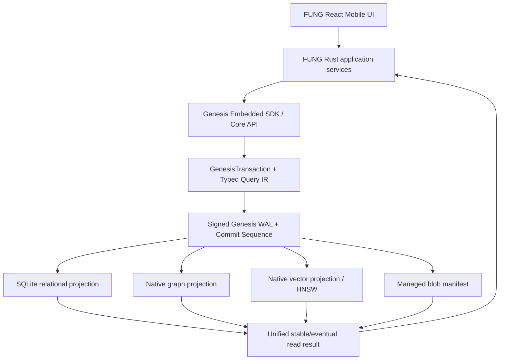

# FUNG Mobile — Full Feature Wiring over GenesisBlockDB

## 1. Classification and Authority

| Item | Decision |
| --- | --- |
| Complexity | C-3 — Architecture-Driven Implementation |
| Change risk | HIGH |
| Product owner | Boss (Founder) |
| Technical owner | ATHER |
| Parent product | `docs/Mobile/PRODUCT_UX_SPEC.md` |
| Parent mobile architecture | `docs/Mobile/TECHNICAL_DESIGN.md` |
| Canonical database boundary | GenesisBlockDB `docs/SPEC--GENESISDB-UNIFIED-OPERATIONAL-BOUNDARY-V1.md` `0.1.0b` |
| Current evidence | `docs/Mobile/IMPLEMENTATION_STATUS.md` `0.4.0b` |
| Approval state | Approved and implemented as beta; physical/release gates remain |

สเปคนี้ต้องไม่ redefine GenesisBlockDB ภายใน FUNG. GenesisBlockDB เป็น **database operational boundary เพียงจุดเดียว** ตาม upstream candidate spec โดยมี SQLite relational subsystem, native graph, native vector, managed blob manifest และ signed Genesis WAL อยู่ภายใน engine

## 2. Correct Interpretation of “Wire Every Feature”

1. FUNG เปิด Genesis embedded handle เพียง handle เดียวใน app sandbox
2. FUNG ไม่เปิด `rusqlite::Connection`, ไม่รัน DDL/DML และไม่ synchronize row/graph/vector เอง
3. ทุก mutation ใช้ `GenesisTransaction` และ canonical `EntityId`
4. ทุก query ใช้ Typed Query IR/SDK; HQL ไม่เป็น correctness dependency
5. Signed Genesis WAL และ commit sequence เป็น internal durability authority
6. UI, audio, notes, transcript, graph, vector, jobs, devices, MCP และ derived artifacts resolve ผ่าน Genesis API boundary เดียว
7. ไฟล์ media ขนาดใหญ่เก็บผ่าน Genesis-managed blob manifest หรือ approved sandbox directory โดยใช้ logical ID, relative path และ hash
8. control ที่มองเห็นต้องเรียก operation จริง หรือแสดง named unavailable reason; ห้าม fake data/progress/provider/connection

## 3. Non-negotiable Boundary

### Forbidden FUNG paths

- direct SQLite handle or raw SQL write
- application-owned table migration
- separate graph tables treated as graph database
- application-maintained row/graph/vector ID mapping
- audio metadata commit outside canonical Genesis transaction
- absolute Android filesystem path as portable artifact identity
- dual write between GenesisBlockDB and a FUNG-owned database

### Allowed FUNG ownership

- UI and ephemeral presentation state
- native audio capture/playback lifecycle
- provider adapters and authenticated transport
- construction of typed Genesis mutations/queries
- app-specific relational schema package submitted to Genesis
- app sandbox/root supplied to Genesis at startup

## 4. Current-State Conformance

| ID | Implemented state | Remaining acceptance |
| --- | --- | --- |
| GB-01 | runtime opens one shared Genesis embedded `Storage`; no production FUNG SQL authority | physical-device reopen proof |
| GB-02 | versioned FUNG schema and typed row queries/mutations are registered through Genesis | broader migration fixtures |
| GB-03 | note/relationship graph mutations and reads use Genesis graph APIs with canonical IDs | graph rebuild/property breadth |
| GB-04 | vector capability remains provider-gated and no synthetic embedding is created | approved embedding model and vector UAT |
| GB-05 | wired cross-domain mutations commit through signed/idempotent Genesis transactions and expose frontier | full fault-injection matrix |
| GB-06 | capture stores sandbox-relative segment references with SHA-256 and verifies them before playback | physical playback and portable backup proof |
| GB-07 | coherent Genesis backup/restore is still absent | implement and pass U9 |
| GB-08 | durable app data hydrates from Genesis; WebView storage is presentation preference only | restart E2E on the rebuilt APK |

The legacy `fung.db` path is retained only as a read-only, one-way import source. The caller writes a completion marker after successful canonical import; there is no production dual write or reverse synchronization.

## 5. FUNG Schema Package

FUNG registers a versioned `RelationalSchemaPackage` through Genesis. Logical tables include:

- projects, recordings, audio segments/checkpoints
- notes and immutable note revisions
- transcripts, transcript revisions and evidence spans
- speakers and speaker-turn revisions
- model providers, model runs and stateful jobs
- paired devices, capability grants and MCP sessions
- story sequences/clips/revisions
- effect chains/nodes, voice profiles/sessions
- export artifacts and audit records

Graph nodes/edges and vector embeddings are not implemented as additional app-owned relational tables. They are cross-domain mutations in the same Genesis transaction and share stable `EntityId` values with relational rows.

## 6. Canonical Mutation Examples

### Save note

One `GenesisTransaction` contains:

- relational note identity + immutable revision
- native graph Note node
- explicit/evidence edge mutations
- optional vector upsert when an approved embedding provider exists
- blob metadata only when the note has an attachment
- actor, device, valid time and epistemic status

### Reconcile audio segment

One `GenesisTransaction` contains:

- recording/checkpoint relational update
- AudioChunk entity and `BELONGS_TO` graph edge
- managed blob metadata: relative path, checksum, MIME, size, lifecycle
- no vector mutation unless a derived embedding exists

### Import provider result

One `GenesisTransaction` contains:

- job/model-run state and immutable input hash
- transcript/speaker/evidence rows
- native graph nodes/edges with `inferred` or `evidence` status
- optional vectors in a declared vector space
- provider/model/version/runtime/device provenance

If validation fails, no projection may become partially visible at stable consistency.

## 7. Query Contract

| Feature | Genesis query |
| --- | --- |
| Home/recent | RelationalQuery over project/recording/note/job projection |
| Notes/search | relational named query + optional FTS capability |
| Graph Explorer | GraphQuery anchored by canonical `EntityId` |
| Semantic retrieval | SemanticQuery over approved vector collection |
| Evidence-aware search | UnifiedQuery: semantic candidate + graph constraint + relational filters |
| Timeline | relational turn/time-range query + blob manifest references |
| Story | relational derived-clip query joined to evidence/source identity |
| MCP | same typed queries under project/tool namespace authorization |

Stable reads wait/report required projection frontier. Eventual reads must return projection/index lag honestly.

## 8. Audio and Blob Contract

- Android native recorder may write temporary segments inside the supplied sandbox
- segment becomes confirmed only after checksum validation and Genesis transaction commit
- Genesis blob manifest owns logical artifact identity and relative path
- source audio is immutable after confirmation
- native playback resolves ordered blob references returned by Genesis; UI never invents segment order
- Story, effects and export create derived blob entities with input manifest hashes
- backup/restore validates blob hashes as part of one Genesis bundle

Native playback remains an application/native responsibility, but its manifest, position range and artifact identity originate from Genesis query results.

## 9. Requirements — EARS

| ID | Requirement | Verification |
| --- | --- | --- |
| FW-001 | WHEN FUNG starts THEN it SHALL open one in-process Genesis database root and SHALL NOT open a separate SQLite/graph/vector database. | dependency/static + device test |
| FW-002 | WHEN FUNG changes row, graph, vector or blob metadata THEN it SHALL submit one canonical Genesis transaction. | transaction contract tests |
| FW-003 | WHEN a cross-domain transaction is acknowledged stable THEN required projections SHALL have reached its commit frontier. | fault-injection/frontier test |
| FW-004 | WHEN the app crashes after WAL commit THEN reopen SHALL replay idempotently without partial logical state. | crash/reopen suite |
| FW-005 | WHEN FUNG schema changes THEN Genesis SHALL apply a versioned schema package and compatibility check. | migration suite |
| FW-006 | WHEN UI starts or restarts THEN projects, notes, recordings, jobs, graph and devices SHALL hydrate from Genesis queries rather than production demo snapshots. | restart E2E |
| FW-007 | WHEN a recording completes THEN Genesis SHALL return an ordered checksum-verified blob manifest that native playback can play/seek/pause locally. | Android playback E2E |
| FW-008 | WHEN source audio is edited in Stories THEN only derived metadata/artifacts SHALL change and source hashes SHALL remain identical. | immutability property test |
| FW-009 | WHEN a provider result is imported THEN row/graph/vector/provenance mutations SHALL share one `EntityId` and commit sequence. | ingestion integration test |
| FW-010 | WHEN projection/index lag exists THEN stable/eventual query behavior SHALL report or wait according to the requested consistency. | lag behavior test |
| FW-011 | WHEN Desktop or MCP accesses data THEN the same Genesis namespace/governance policy SHALL authorize relational, graph, vector and blob access. | negative authorization suite |
| FW-012 | WHEN backup is requested THEN Genesis SHALL produce one verifiable bundle for relational, graph, vector and blob metadata at a coherent frontier. | backup/restore test |
| FW-013 | WHEN a provider/device/license prerequisite is absent THEN UI SHALL show a named unavailable state and SHALL NOT fabricate output. | truth-state matrix |
| FW-014 | WHEN Android artifact is called Genesis-enabled THEN physical-device create/migrate/join/graph/vector/reopen/backup tests SHALL pass. | Genesis U7 mobile suite |

## 10. Feature Wiring Matrix

| Surface | Operational wiring |
| --- | --- |
| Home/Projects/Notes | typed relational reads and transactions through Genesis |
| Capture/Recovery | native recorder + Genesis segment/blob/checkpoint transaction |
| Playback | native ordered-blob transport driven by Genesis manifest |
| Timeline/Speakers | Genesis time-range reads, native graph speaker/evidence relations, native playback position |
| Graph Explorer | GraphQuery, relation proposal/confirm/dispute mutations |
| Semantic search | Genesis vector collection + UnifiedQuery; unavailable without approved embedding provider |
| Stories | derived clip relational state + evidence graph + immutable source blob references |
| Transcription/Diarization | stateful provider job + validated Genesis result transaction |
| Refinement/Effects | provider proposal/render + derived artifact/provenance transaction |
| Desktop | authenticated executor; never a second source of truth |
| MCP | governed SDK/query facade; no raw DB/table/filesystem access |
| Agent Voice | rights/grant/provider checks + audited derived voice artifact/session |
| Export/Backup | derived export blob vs coherent Genesis backup bundle are separate operations |

## 11. Dependency-aligned Implementation Sequence

### G0 — Truth sync and freeze — Complete

- approve Genesis unified operational boundary upstream
- freeze `EntityId`, Typed Query IR, schema package, transaction and consistency contracts
- mark current FUNG `rusqlite` path as transitional/nonconformant

### G1 — Genesis U1 evidence — Complete for targeted implementation gate

- independently review SQLite S0/S1 invariants, replay, rebuild and snapshot behavior
- no FUNG persistence migration begins before U1 review passes

### G2 — Genesis U2 relational application contract — Complete

- implement schema package, typed row mutations, joins/named queries and SDK/FFI surface
- register FUNG logical relational schema through this public contract

### G3 — Genesis U3 unified transaction/frontier — Complete for targeted suites

- implement row/graph/vector/blob transaction event, idempotent projection apply and watermarks
- pass cross-domain fault injection and stable/eventual tests

### F0 — FUNG adapter and migration — Complete in production code

- introduce `FungRepository` backed only by Genesis SDK
- import existing `fung.db` and WebView durable snapshot through an explicit one-time migration tool
- validate counts, IDs, checksums and graph identity before cutover
- disable direct `rusqlite` production path after verified cutover; retain rollback artifact read-only

### F1 — UI hydration and CRUD — Complete for wired surfaces

- wire bootstrap, projects, notes, recordings, jobs, devices and preferences to Genesis queries/transactions
- remove production seed and durable `localStorage` writes

### F2 — Audio playback/export — Playback implemented; export/physical UAT pending

- add Android Media3 ordered-segment transport
- drive Timeline/Stories playhead from native events
- add original audio/note/JSON export using Genesis blob identity

### F3 — Graph/vector/evidence — Graph/evidence implemented; vector provider pending

- wire full domain graph, evidence relations and approved vector spaces
- add relation proposal/confirmation and semantic/unified retrieval

### F4 — Desktop providers and jobs — Contracts/queues implemented; real executors pending

- implement authenticated pairing/transport and retry-safe stateful job dispatch/import
- connect transcription, diarization, refinement, DSP and export adapters only with real provider evidence

### F5 — MCP and Agent Voice — Persistence/governance wired; real synthesis pending

- capability/namespace grant editor, session ledger and revoke
- connect owned/licensed synthesis only after rights/provider approval

### G4/F6 — Physical-device and release proof — Pending

- run Genesis U7 Android suite plus FUNG record/play/restart/graph/vector/backup UAT
- iOS remains blocked on macOS/Xcode/signed device
- no “complete” claim from unit tests or APK build alone

## 12. Migration and Rollback

1. Existing `fung.db` remains readable only by the migration utility, never dual-written after cutover
2. Map existing UUIDs to identical public `EntityId` values
3. Convert absolute artifact paths to validated relative blob references and hashes
4. Import relational, graph and blob metadata through canonical Genesis transactions
5. Build vector projection only from approved embedding runs; do not invent vectors during migration
6. Compare logical counts, checksums and queries before switching active root
7. Rollback switches to the pre-cutover application artifact and original read-only data; it does not reverse-write Genesis state into old SQLite
8. Backup both original migration input and verified Genesis bundle before cleanup; cleanup requires separate user authorization

## 13. Provider and Platform Gates

| Gate | Required decision/evidence |
| --- | --- |
| Genesis U2/U3 | upstream implementation and independent architecture review |
| On-device Thai STT | approved model, license, size, ABI and thermal benchmark |
| Desktop diarization | selected runtime/model/license |
| DSP/refinement/TTS | selected provider, policy fixtures and provenance contract |
| Agent Voice | rights retention/revocation and grant-duration approval |
| iOS | macOS/Xcode, signing identity and physical device |

Missing gates produce truthful unavailable states. They do not justify a parallel database or fake result.

## 14. Risk Assessment

| Risk | Level | Prevention |
| --- | --- | --- |
| Dual-write divergence | HIGH | one cutover; no direct SQLite writes after switch |
| Signed WAL/projection partial state | HIGH | Genesis U3 fault injection and frontier checks |
| Migration loses media identity | HIGH | stable IDs, relative path conversion, checksum comparison |
| Native playback resolves wrong source | HIGH | ordered manifest from Genesis + range fixtures |
| AI relation shown as fact | HIGH | epistemic status/provenance enforced in transaction validation |
| Remote caller crosses namespace | HIGH | common Genesis governance for every projection/blob |
| Upstream candidate changes | HIGH | capability/version negotiation and contract freeze before F0 |

## 15. Acceptance / Success / Exit Criteria

- FW-001 through FW-014 pass
- production FUNG has no direct `rusqlite`/raw DDL/DML path
- FUNG does not maintain row/graph/vector identity mapping or synchronization glue
- source audio plays locally from a Genesis-managed ordered blob manifest
- every derived transcript/speaker/relation/vector/artifact has source and model/device provenance
- crash/reopen and projection rebuild return coherent logical results
- backup/restore returns one verified frontier
- Android physical Genesis and FUNG suites pass
- unselected providers and iOS remain explicitly incomplete
- contracts, docs, migrations, rollback and implementation status match runtime evidence

## 16. Implementation Gate Result

The user approved this corrected boundary and implementation proceeded in dependency order. The production cutover, schema/query/transaction adapter, feature persistence wiring and source playback transport are implemented as beta. This does not waive the remaining acceptance criteria: a current physical Android run, coherent backup/restore, independent projection rebuild/lock/integrity evidence, real Desktop providers and iOS proof remain open.

## Version Diff

### `0.0.0` → `0.1.0b`

- Proposed an incorrect FUNG-owned SQLite source of truth with GenesisBlockDB treated as an application graph/provenance layer.

### `0.1.0b` → `0.2.0b`

- Replaced FUNG-owned SQLite authority with the GenesisBlockDB unified operational boundary.
- Added signed WAL, stable frontier, native graph/vector, managed blob and canonical identity requirements.
- Prohibited direct SQLite, application-owned cross-store mapping and dual writes.
- Reordered implementation behind Genesis U1/U2/U3 and added an explicit one-time cutover migration.

### `0.2.0b` → `0.3.0b`

- Recorded approval and the completed Genesis U2/U3 plus FUNG production cutover implementation.
- Replaced the stale direct-SQL gap table with the current one-handle, canonical-transaction and read-only legacy-import state.
- Marked each dependency phase with its real completion boundary and retained physical, backup, provider, vector and iOS gates.

## CHANGELOG

| Version | Date | Status | Summary | Commit Hash | Agent |
| --- | --- | --- | --- | --- | --- |
| 0.1.0b | 2026-07-20 | candidate | Initial FUNG-owned SQLite wiring proposal; rejected after upstream boundary review | N/A — no commit created | ATHER |
| 0.2.0b | 2026-07-20 | candidate | Corrected wiring to use GenesisBlockDB as the single operational boundary | N/A — no commit created | ATHER |
| 0.3.0b | 2026-07-21 | beta | Approved boundary implemented through Genesis U2/U3 cutover and full FUNG persistence wiring | N/A — no commit created | ATHER |
