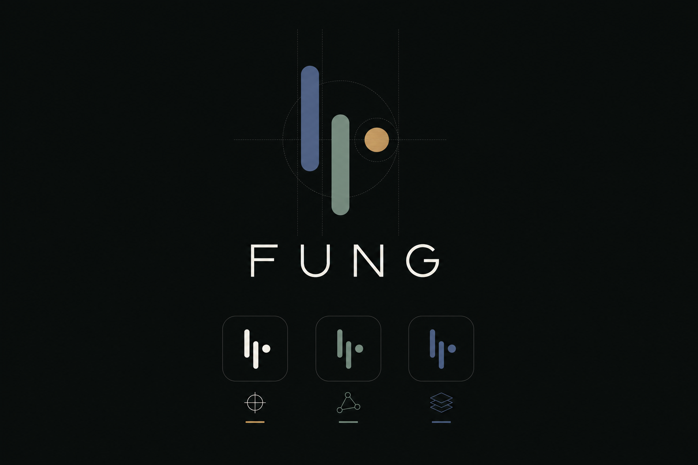
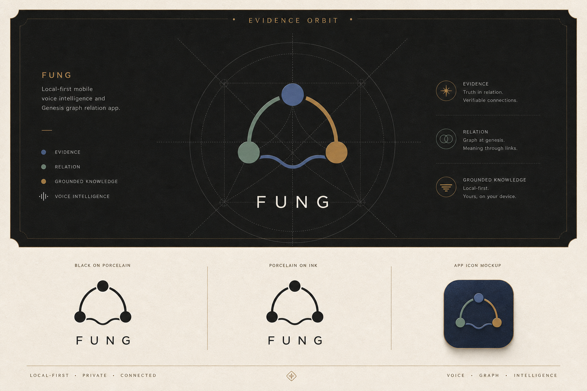
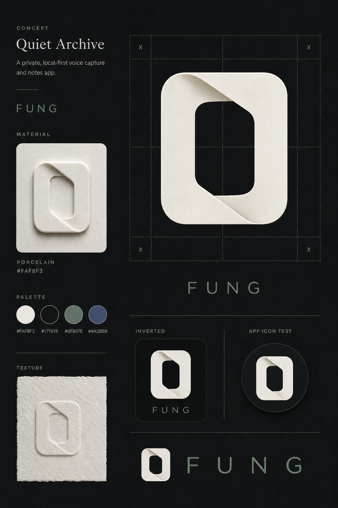

# FUNG Logo Concepts — Mockup Review

## Review boundary

These began as exploration mockups. Concept C is selected and vectorised; concepts A and B remain retained references only. The production master is defined by `DESIGN_SYSTEM.md` and the SVG assets in `docs/Mobile/design-system/assets/`.

## Concept A — Kanso Signal

| Aspect | Direction |
| --- | --- |
| Core idea | Quiet signal: two asymmetric waveform strokes plus a single pause/evidence point. |
| Product fit | Voice-first command, live capture and discreet local-ready state. |
| Character | Minimal, technically precise, compact app-icon friendly. |
| Palette | Indigo focus, sage local, very small warm-metal evidence point on ink. |
| Risk to solve in vectorisation | Preserve enough differentiation at 16–24 px and avoid reading as a generic equaliser. |

## Concept B — Evidence Orbit

| Aspect | Direction |
| --- | --- |
| Core idea | Three connected evidence nodes with a restrained waveform relation. |
| Product fit | GenesisBlockDB relation graph, evidence/provenance and Mobile-to-Desktop continuity. |
| Character | Most expressive and system-level; works well as a case-study identity. |
| Palette | Indigo evidence, sage relation, warm-metal inference. |
| Risk to solve in vectorisation | Simplify for small app-icon sizes; ensure inferred warm-metal does not imply fact. |

## Concept C — Quiet Archive

| Aspect | Direction |
| --- | --- |
| Core idea | Soft folded porcelain ribbon around an open archival center. |
| Product fit | Durable voice capture, note preservation and tactile porcelain visual DNA. |
| Character | Most premium, material and editorial. |
| Palette | Porcelain on ink, with sage/indigo reserved for UI state rather than the mark. |
| Risk to solve in vectorisation | Strip material texture from the logo master; retain only the simple geometric silhouette. |

## Selection record

Quiet Archive (Concept C) is selected-beta as of 2026-07-21. Its production master is intentionally flat and original; mockup texture stays presentation-only.

## Common non-negotiables

1. No copied reference geometry, branding, lime/neon palette, cloning claim or avatar treatment.
2. The final mark needs monochrome, inverted, 24 px and 16 px tests before it becomes a production asset.
3. The mark must work as a static app icon and must not depend on 3D, shadow, paper texture or motion.
4. Wordmark typography must be separately licensed or platform-safe before release.

## Next gate

Quiet Archive has a vector master, light/dark variants and Android app icon. The single SOT in `DESIGN_SYSTEM.md` governs clear-space/minimum-size rules and brand-case-study regeneration.

## Version Diff

| Version | Change |
| --- | --- |
| `0.1.0b` | Introduced three distinct non-production FUNG logo concept mockups for review. |
| `0.1.1b` | Recorded Quiet Archive as the selected-beta direction; A/B remain reference concepts. |

## CHANGELOG

| Version | Date | Status | Summary | Commit Hash | Agent |
| --- | --- | --- | --- | --- | --- |
| `0.1.0b` | 2026-07-21 | candidate | Generated Kanso Signal, Evidence Orbit and Quiet Archive mockups. | pending approval | ATHER |
| `0.1.1b` | 2026-07-21 | beta | Quiet Archive selected and handed to the SOT/vector implementation. | pending verification | ATHER |
