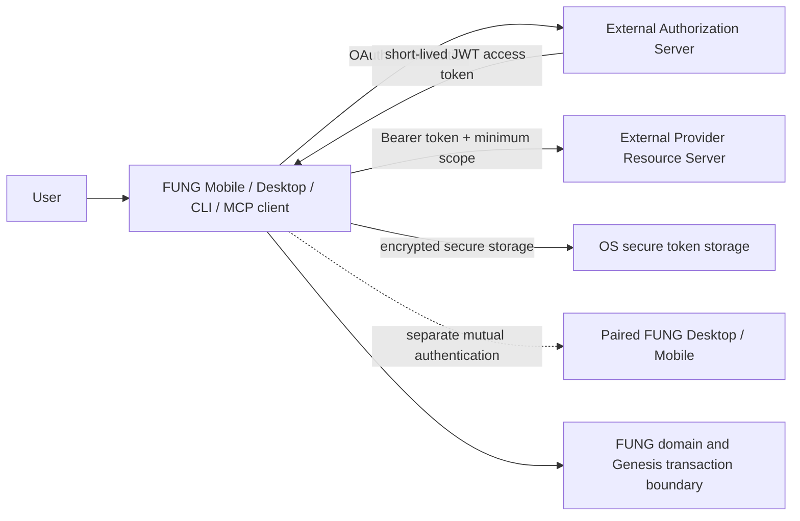
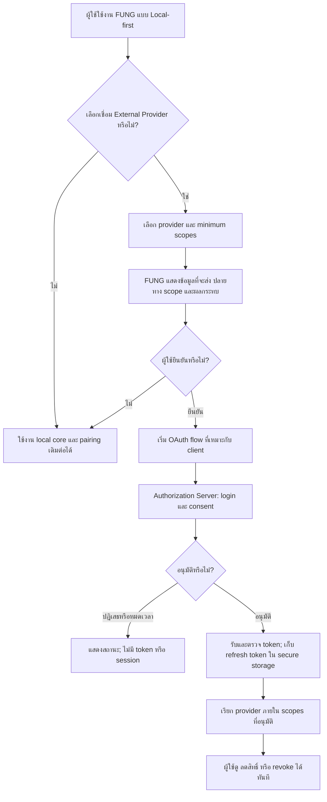
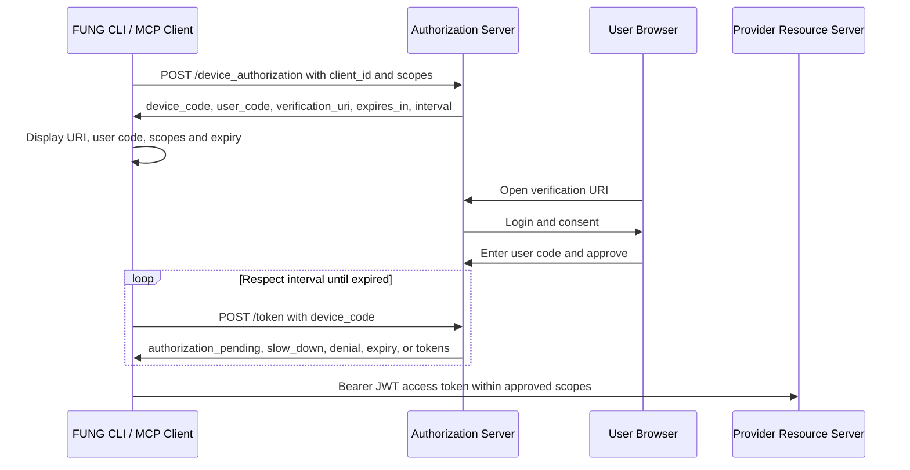

# FUNG OAuth 2.0 และ JWT Authorization Specification

## 1. Authority และ Classification

| Item | Decision |
| --- | --- |
| Complexity | C-3 — Architecture-Driven Implementation |
| Change risk | HIGH — ขอบเขต identity, token lifecycle, revocation และ external-provider access ข้ามหลาย client |
| Product owner | Boss (Founder) |
| Technical owner | ATHER |
| Parent product contract | `docs/Mobile/PRODUCT_UX_SPEC.md` |
| Parent architecture | `docs/Mobile/TECHNICAL_DESIGN.md` `1.0.0b` และ `docs/Desktop/ARCHITECTURE.md` `1.0.0b` |
| Peer contracts | `docs/Mobile/FULL_FEATURE_WIRING_SPEC.md`, `contracts/local-api-v1.yaml`, `contracts/local-mcp-v1.yaml` |
| Status | Approved beta — documentation contract is authorized; implementation remains separately gated |

## 2. Context และ Problem

FUNG เป็นผลิตภัณฑ์ local-first: ผู้ใช้ต้องสร้างโน้ต บันทึกเสียง เล่นกลับ ค้นหา และใช้การจับคู่ Mobile–Desktop ภายใน LAN ได้โดยไม่ต้องมี account หรือ Internet. เมื่อผู้ใช้เลือกเชื่อม External Provider เช่น provider สำหรับการประมวลผลหรือบริการที่ต้องใช้สิทธิ์ของผู้ใช้ ระบบต้องมีมาตรฐาน authorization ที่ไม่ทำให้ token หรือข้อมูลต้นทางรั่วไหล และไม่ขยายสิทธิ์เกิน consent.

การ pair ระหว่าง Mobile กับ Desktop มีขอบเขตชัดเจนอยู่แล้ว: เป็น explicit device identity, short-lived verification และ mutually authenticated encrypted channel. OAuth 2.0 จึงใช้เฉพาะ external-provider authorization แบบ opt-in ไม่ใช่สิ่งทดแทน pairing หรือสิทธิ์ภายใน GenesisBlockDB.

## 3. Goals และ Scope

### In scope — V1

- User flow สำหรับการเริ่ม เชื่อมต่อ ตรวจสอบ ลดสิทธิ์ และ revoke External Provider
- OAuth 2.0 Authorization Code Flow พร้อม PKCE สำหรับ FUNG Mobile และ Desktop native clients
- OAuth 2.0 Device Authorization Flow สำหรับ FUNG CLI, MCP client และ client ที่รับ browser callback ไม่ได้
- JWT access-token validation, scope enforcement, token storage, refresh rotation และ audit metadata
- Security, test, monitoring, rollback และ acceptance contract

### Out of scope — V1

- Mandatory cloud account, mandatory cloud sync หรือการบังคับ login สำหรับ local core
- การใช้ OAuth แทน Mobile–Desktop pairing หรือ LAN/MCP mutual authentication
- การเก็บ source audio, transcript, note content, API key หรือ PII ลงใน JWT
- Password grant, implicit flow, `code_challenge_method=plain` และ client secret ที่ฝังใน native app
- OAuth authorization ที่เปิดสิทธิ์ GenesisBlockDB หรือ local project โดยตรง

## 4. Architecture Decision

OAuth authorization แยกจาก local runtime อย่างชัดเจน. FUNG client ร้องขอสิทธิ์เท่าที่จำเป็นจาก Authorization Server; Resource Server ยอมรับเฉพาะ access token ที่ผ่าน validation และ scope check. Token material ไม่เข้าสู่ GenesisBlockDB และไม่อยู่ใน application logs.



| Component | Responsibility |
| --- | --- |
| FUNG native client | create authorization transaction, open system browser, validate callback, store tokens securely, invoke provider only after consent |
| FUNG CLI / MCP client | display device-code instruction, poll within provider interval, retain no token in logs or shell history |
| Authorization Server | authenticate user, collect consent, issue authorization/device code and tokens |
| Resource Server | validate JWT and scopes before serving provider-owned resource |
| OS secure storage | protect refresh token and any token material at rest; token material must not be persisted in project data |

### 4.1 Approved deployment boundary

| Surface | Approved runtime | Responsibility |
| --- | --- | --- |
| Web UI | Vercel | Serve the FUNG browser surface and only public runtime configuration. |
| Identity and cloud control plane | Supabase | Auth, PostgreSQL, RLS, device/account metadata, OAuth audit metadata and provider-specific Edge Functions. |
| Desktop data plane | FUNG Tauri + embedded GenesisBlockDB | Local audio, notes, transcripts, graph, vectors, provenance and signed-WAL durability. |

Supabase is not a replica of GenesisBlockDB. It may retain account, device, sync-cursor and encrypted-backup-manifest metadata only. Audio, note bodies, transcript content, graph projections, vectors, provider credentials and Genesis WAL never enter the Supabase control plane by default. Vercel receives only public `VITE_*` configuration; service-role keys and OAuth client secrets are server-side Supabase Edge Function secrets.

## 5. User Flow



Acceptance criteria:

- Local core ต้องใช้งานได้แม้ผู้ใช้ไม่เชื่อม account.
- ก่อน consent UI ต้องแสดง provider, ประเภทข้อมูล, destination, requested scopes และผลของการอนุมัติ.
- ผู้ใช้ revoke ได้จาก FUNG และ FUNG ต้องหยุดใช้ token พร้อมล้าง secure storage.
- UI ต้องแยก `Local`, `FUNG Desktop` และ `External Provider` โดยไม่ทำให้เข้าใจว่าเป็น execution location เดียวกัน.

## 6. Authorization Code Flow with PKCE

ใช้สำหรับ Mobile และ Desktop ที่เปิด system browser และรับ registered callback ได้.

```mermaid
sequenceDiagram
    participant U as User
    participant A as FUNG Native App
    participant B as System Browser
    participant AS as Authorization Server
    participant RS as Provider Resource Server

    A->>A: Create state, nonce, code_verifier
    A->>A: Create code_challenge = S256(code_verifier)
    A->>B: Open /authorize with code, PKCE, state, nonce, scopes
    B->>AS: Authorization request
    AS->>U: Login and consent
    U->>AS: Approve
    AS->>B: Registered redirect with code and state
    B->>A: Deliver callback
    A->>A: Validate state and callback binding
    A->>AS: POST /token with code, code_verifier, client_id, redirect_uri
    AS->>A: JWT access token, refresh token, token metadata
    A->>A: Validate claims; secure-store refresh token
    A->>RS: Bearer JWT access token
    RS->>A: Scoped provider result
```

| Requirement | Contract |
| --- | --- |
| Grant | `response_type=code` only |
| PKCE | Required with `S256`; reject `plain` |
| `state` | cryptographically random, one-time, bound to the authorization transaction and compared before token exchange |
| `nonce` | required when OIDC ID token is returned; compare before accepting identity result |
| Redirect | claimed HTTPS redirect is preferred; Desktop loopback callback is permitted only when registered and bound to the pending transaction |
| Native client | public client; never embeds a reusable client secret |
| Scope | minimum provider-defined scope; no wildcard by default |

## 7. Device Authorization Flow

ใช้สำหรับ FUNG CLI, MCP client หรือ device/client ที่เปิด browser callback ภายในตัวเองไม่ได้.



Requirements:

- แสดง `verification_uri`, `user_code`, requested scopes และเวลาหมดอายุโดยไม่เปิดเผย `device_code`.
- เคารพ `interval`; เมื่อได้รับ `slow_down` ต้องเพิ่มระยะ polling.
- `device_code` เป็น one-time และอายุสั้น. เมื่อ denied หรือ expired ต้องยุติ transaction โดยไม่สร้าง session.
- CLI/MCP ต้องห้ามส่ง token, device code หรือ authorization response ไปยัง log, terminal history หรือ audit event.
- MCP grant จำกัดตาม project/tool family และยังต้องผ่าน local capability consent เดิม.

## 8. JWT และ Token Lifecycle Contract

JWT access token เป็น short-lived bearer credential. Refresh token เป็น opaque credential ที่ Authorization Server ควบคุม; ไม่มีการเขียน refresh token ลงใน JWT, Genesis data หรือ application log.

```json
{
  "iss": "https://authorization-server.example",
  "sub": "provider-subject",
  "aud": "fung-external-provider-gateway",
  "client_id": "fung-desktop",
  "scope": "provider.transcribe",
  "iat": 1780000000,
  "nbf": 1780000000,
  "exp": 1780000900,
  "jti": "unique-token-id"
}
```

| Item | Requirement |
| --- | --- |
| Signature | asymmetric signing such as `ES256` or `RS256`; reject `alg=none` and algorithm confusion |
| Required validation | `iss`, `aud`, `exp`, `nbf`, `iat`, signature, permitted algorithm, `client_id`, scope, and token format |
| Key discovery | use provider JWKS with cache and key-rotation handling; never trust an unpinned arbitrary key URL |
| Access-token lifetime | 5–15 minutes unless provider has a stricter policy |
| Refresh token | opaque, OS-secure-storage only, rotation on every refresh, reuse detection by Authorization Server |
| Token transmission | TLS only; `Authorization: Bearer` header; never URL query string |
| JWT content | no source audio, transcript, note text, API key, raw PII or local project identifier |
| Revocation | revoke at provider when available, clear local secure storage, invalidate active provider session and append redacted audit metadata |

## 9. Security, Privacy และ Audit

1. OAuth consent is opt-in and external processing remains visibly distinct from local or paired-Desktop work.
2. Token exchange and provider access require TLS; system browser is used for user authentication rather than an embedded credential-collection view.
3. Every authorization transaction uses one-time values and is rejected on callback mismatch, expiry, replay, scope escalation or audience mismatch.
4. Token material is never written to GenesisBlockDB, project export, crash report, analytics payload, CLI output or application log.
5. Audit records contain only provider ID, client type, requested/approved scopes, transaction result, timestamp and a non-secret correlation identifier.
6. Provider responses that become FUNG artifacts follow existing Genesis provenance, inference-label and user-consent rules; OAuth authorization does not grant a bypass.

## 10. Testing และ Acceptance

| Layer | Required proof |
| --- | --- |
| Unit | state/nonce lifecycle, PKCE verifier/challenge, token-claim validation, expiry handling, scope gate and secure-storage abstraction |
| Integration | successful and rejected authorization-code exchange, device polling transitions, JWKS key rotation, refresh rotation and provider revocation |
| Security negative suite | missing/invalid state, callback replay, invalid PKCE, expired code/token, wrong issuer/audience, algorithm confusion, insufficient scope, refresh reuse and token-log redaction |
| UX | consent explanation, cancel/deny/expired state, disconnected provider, revoke confirmation and local-core continuity |
| MCP/CLI | no secret output in logs/history, minimum tool scope, denied and timeout flows, revocation stops further calls |

The slice is acceptable only when all authorization flows preserve local-first operation, all negative security tests pass, and token/log artifact scans find no token material.

## 11. Monitoring และ Observability

| Signal | Threshold / action |
| --- | --- |
| authorization success/deny/expiry rate | monitor by provider and client type; investigate unexpected denial or expiry spike |
| callback validation failure | any replay or state mismatch is security-significant and must alert security owner |
| token refresh failure | show re-authentication action; do not retry indefinitely |
| scope denial from Resource Server | surface missing permission; do not silently widen scope |
| token-redaction test failure | release-blocking |
| revoke completion | verify local token deletion and provider endpoint outcome where supported |

Observability must use redacted transaction IDs and provider metadata only; it must not contain authorization codes, device codes, access tokens, refresh tokens or user content.

## 12. Rollout และ Rollback

- OAuth provider integration ships disabled by default behind a capability flag.
- First release enables one approved provider and one client flow at a time after test evidence is recorded.
- Rollback disables the affected provider capability, prevents new authorization transactions, clears locally stored credentials and retains only redacted audit metadata.
- Rollback never disables local capture, notes, playback, Genesis data access, Mobile–Desktop pairing or existing LAN/MCP mutual-auth boundaries.

Rollback triggers:

1. Any confirmed token disclosure or acceptance of a token with invalid validation fields.
2. Any provider action performed outside approved scope.
3. A release build emitting token material into logs, diagnostics or exported artifacts.
4. An authorization defect that blocks the local core or weakens paired-device authentication.

## 13. Open Decisions และ Dependencies

| ID | Decision / dependency | Owner | Blocks |
| --- | --- | --- | --- |
| OAUTH-OQ-01 | First approved External Provider and exact scopes | Product + Security | provider client registration |
| OAUTH-OQ-02 | Authorization Server metadata, issuer, JWKS policy and supported revocation endpoint | Technical owner + Provider owner | token validation integration |
| OAUTH-OQ-03 | Redirect registration strategy per Mobile and Desktop platform | Technical owner | Authorization Code Flow implementation |
| OAUTH-OQ-04 | Secure storage implementation and OS support floor | Technical owner | credential persistence |
| OAUTH-OQ-05 | Audit retention and privacy review for authorization metadata | Product + Legal | production rollout |

## 14. Version Diff

### `0.1.0b` → `0.2.0b`

- Approved Vercel for the Web surface, Supabase for identity/control-plane backend and embedded GenesisBlockDB for the local product data plane.
- Prohibited GenesisBlockDB dual-write/replication into Supabase and clarified Vercel secret boundaries.

### `0.0.0` → `0.1.0b`

- Added an approved OAuth 2.0 and JWT authorization contract for optional External Provider access.
- Defined User Flow, Authorization Code Flow with PKCE, Device Authorization Flow, JWT validation, refresh rotation, revoke, test, observability and rollback requirements.
- Preserved the existing local-first and mutually authenticated Mobile–Desktop pairing boundary.

## CHANGELOG

| Version | Date | Status | Summary | Commit Hash | Agent |
| --- | --- | --- | --- | --- | --- |
| 0.2.0b | 2026-07-22 | beta | Approved Vercel/Supabase/embedded-Genesis deployment boundary for the OAuth implementation. | N/A | ATHER |
| 0.1.0b | 2026-07-21 | beta | Approved OAuth 2.0 + JWT authorization specification for optional external-provider access; implementation remains separately gated. | N/A | ATHER |
