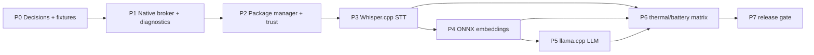

# FUNG Mobile — On-device AI Roadmap

## 1. Purpose and Authority

This roadmap operationalizes `docs/Mobile/ON_DEVICE_AI_RUNTIME_SPEC.md` `0.1.0b`. It is dependency-based, not a release-date promise. Every phase requires its exit evidence before the next phase can make a user-visible capability claim.

| Item | Value |
| --- | --- |
| Complexity | C-3 — Architecture-Driven Implementation |
| Risk | HIGH |
| Owner | ATHER, with Product/Legal/QA decisions shown as gates |
| Current state | Approved beta; P1 capability broker is in implementation, no Android model runtime/package is installed |

## 2. Delivery Principles

1. Core capture, notes, graph and playback remain functional with no model installed.
2. Ship one workload at a time: STT first, embeddings second, local LLM last.
3. Package capability is enabled by measured device eligibility, not phone branding.
4. Every AI result has source/model/runtime provenance through GenesisBlockDB.
5. Desktop remains an optional, clearly labelled fallback for unsupported mobile work.

## 3. Dependency Roadmap

| Phase | Deliverable | Estimated effort | Entry condition | Exit evidence | Status |
| --- | --- | --- | --- | --- | --- |
| P0 — Decision freeze | approved model/license candidates, Thai fixtures, reference device matrix, policy limits | 3–5 days | spec approved | signed decision record, fixture manifest, legal disposition | Pending approval |
| P1 — Capability broker | native runtime host abstraction, queue/cancel states, resource diagnostics, feature flags | 5–7 days | P0 model-independent decisions | CPU smoke worker, capture-priority test, redacted diagnostics | Pending |
| P2 — Package trust | signed manifest, download/staging/hash, atomic activation/uninstall, storage guard | 5–7 days | P0 license/catalog contract | tamper, low-storage, cancellation and rollback tests | Pending |
| P3 — Offline STT | Whisper.cpp arm64 integration, Thai STT Lite/Standard package, transcript provenance | 8–12 days | P1/P2 + STT license approval | airplane-mode fixture, transcript transaction, AI Lite/Standard benchmarks | Pending |
| P4 — Local embeddings | ONNX Runtime Mobile encoder, vector-space contract, semantic candidate retrieval | 6–9 days | P1/P2 + embedding license approval | vector provenance, no-fact-promotion and tier benchmarks | Pending |
| P5 — Optional local LLM | llama.cpp worker, bounded prompts/outputs, evidence-linked summaries, cancellation | 8–12 days | P1/P2 + LLM policy/license approval | AI Standard/Pro benchmark, safety and provenance suite | Pending |
| P6 — Device qualification | battery/thermal/memory/storage matrix, failure recovery and UX truth states | 7–10 days | P3; repeat for P4/P5 if enabled | 30-minute workload evidence per tier and rollback drill | Pending |
| P7 — Release readiness | package catalog governance, documentation, privacy/security review and staged rollout | 5–7 days | relevant workload phases + P6 | release packet, disable/revoke drill, support diagnostics | Pending |

## 4. Milestones

| Milestone | Definition of done | User-visible outcome |
| --- | --- | --- |
| M0 — Design approved | P0 decisions approved | no runtime change; correct eligibility communication |
| M1 — Safe package platform | P1/P2 pass | user can inspect/install/remove a signed package, but no package is released until legal approval |
| M2 — Offline transcription beta | P3 and STT portion of P6 pass | supported devices transcribe Thai audio offline; unsupported devices retain source audio and named unavailable state |
| M3 — Offline semantic retrieval beta | P4 and embedding portion of P6 pass | opted-in local semantic candidates with provenance; no automatic factual graph relation |
| M4 — Local LLM controlled beta | P5 and LLM portion of P6 pass | selected high-tier devices can request bounded local assistance |
| M5 — Release readiness | P7 passes | governed package catalog and supportable rollout |

## 5. Device-Qualification Sequence

| Stage | Devices | Required workload | Outcome |
| --- | --- | --- | --- |
| D0 | existing low-end Core reference device | no-model regression | verifies AI additions do not degrade core capture/UI |
| D1 | one AI Lite device | STT Lite + embedding | establishes minimum real device baseline |
| D2 | one AI Standard device | STT Standard + embedding + LLM Lite | establishes general Android recommendation |
| D3 | one AI Pro device | LLM Standard plus all supported workloads separately | establishes optional high-tier boundary |
| D4 | at least three additional OEM/SoC variations | smoke + resource denial paths | catches backend/vendor differences |

No phase accepts a simulator as proof for thermal, battery, storage throughput or native runtime behavior.

## 6. Cross-Phase Gates

| Gate | Must be true before next phase |
| --- | --- |
| License | model artifact, tokenizer and runtime redistribution/use terms are recorded and approved |
| Privacy | no content telemetry; diagnostics redaction and app-private storage reviewed |
| Data integrity | accepted outputs commit through Genesis with source/model/runtime provenance |
| Core protection | capture remains responsive and no model installed path passes regression |
| Resource | tier benchmark and stop/defer behavior pass on physical devices |
| Truth UX | unsupported state names the missing package, device tier or resource condition without fabricated output |

## 7. Critical Path and Deferral Rules

The critical path is P0 → P1 → P2 → P3 → P6 → P7 for offline STT. Embeddings and local LLM do not block offline STT release.

- If Thai STT licensing or quality fails, ship no mobile STT package; retain standalone capture and Desktop delegation.
- If embedding quality or vector support fails, defer semantic retrieval without weakening note/graph functions.
- If local LLM exceeds AI Standard resource gates, keep it AI Pro only or defer it; do not lower capture protections.
- If an OEM backend fails, disable acceleration for that device family while retaining the tested CPU path where it meets the tier benchmark.

## 8. Roadmap Acceptance

The roadmap is ready for approval when Product accepts the V1 scope, Legal accepts the package-review gate, and QA accepts the reference-device/tier evidence plan. Approval authorizes P0 only; each later milestone still requires its stated evidence.

## Version Diff

### `0.0.0` → `0.1.0b`

- Added a dependency-based roadmap from model decision freeze through governed Android release.
- Separated STT, embeddings and local LLM so an unavailable later capability cannot block standalone core or offline STT.

## CHANGELOG

| Version | Date | Status | Summary | Commit Hash | Agent |
| --- | --- | --- | --- | --- | --- |
| 0.1.0b | 2026-07-21 | beta | Approved Android on-device AI phased delivery roadmap; P1 implementation started | pending | ATHER |
