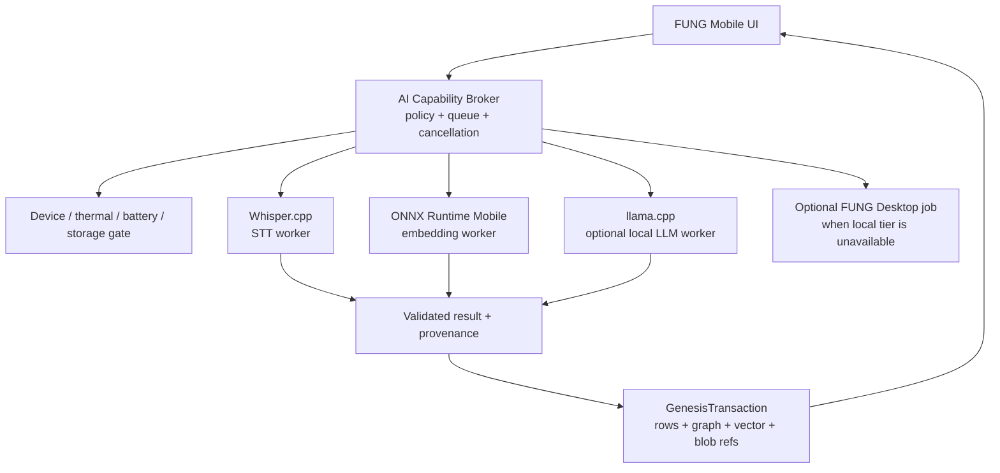

# FUNG Mobile — On-device AI Runtime Specification

## 1. Authority and Classification

| Item | Decision |
| --- | --- |
| Complexity | C-3 — Architecture-Driven Implementation |
| Change risk | HIGH — native binaries, model licensing, battery/thermal, package integrity and provenance |
| Product owner | Boss (Founder) |
| Technical owner | ATHER |
| Parent product contract | `docs/Mobile/PRODUCT_UX_SPEC.md` |
| Parent architecture | `docs/Mobile/TECHNICAL_DESIGN.md` `1.0.0b` |
| Persistence boundary | `docs/Mobile/FULL_FEATURE_WIRING_SPEC.md` `0.3.0b` |
| Status | Approved beta — capability broker implementation is authorized; runtime/model binaries remain separately gated |

## 2. Context and Problem

FUNG Mobile already provides local capture, notes, graph navigation and GenesisBlockDB-backed durable state. Its current standalone voice capability is a bounded Thai command grammar; transcription, embedding and long-form reasoning remain unavailable without a selected model/provider or FUNG Desktop.

The product contract requires useful offline operation without Desktop, Internet or cloud. It also prohibits fabricated AI output. A mobile AI addition must therefore be a separately installed, inspectable capability with explicit model provenance, device eligibility and a safe fallback to source audio and manual notes.

The problem is not merely embedding a model. The app must avoid disrupting foreground capture, avoid exhausting RAM/storage or overheating a phone, retain model/license evidence, and write every derived artifact through the existing Genesis transaction boundary.

## 3. Goals and Scope

### In scope — Android V1

- Offline Thai/multilingual speech-to-text after the user installs an approved package.
- Local semantic embeddings for opted-in notes/transcripts after an approved package is installed.
- Optional small local LLM for bounded summarization, rewrite and command assistance on eligible devices.
- Versioned model-package manifest, integrity verification, consent, storage budgeting, uninstall and diagnostics.
- Thermal, battery, memory and active-capture arbitration.
- Genesis provenance for model runs, transcript revisions, embeddings and derived suggestions.
- A device benchmark that determines the effective capability tier rather than trusting a marketing model name.

### Out of scope — V1

- Always-listening, wake-word detection or background inference.
- Automatic speaker identity, source separation, DSP render and owned-voice TTS.
- Cloud fallback that uploads source audio without a separate explicit product decision.
- iOS model packaging; the interfaces may be portable but iOS implementation is a separate approved workstream.
- Replacing FUNG Desktop for large models, long batches or provider-governed tasks.

## 4. Architecture Decision

FUNG uses three native runtimes behind one capability broker. Each runtime has a narrow job type, package manifest, resource budget and provenance record; no runtime writes product state directly.

| Workload | Chosen runtime | V1 role | Why |
| --- | --- | --- | --- |
| Speech-to-text | Whisper.cpp | offline transcription and timestamped segments | compact native library, offline multilingual model family, predictable CPU fallback |
| Embeddings | ONNX Runtime Mobile | note/transcript embedding and semantic retrieval candidates | dedicated mobile inference runtime, quantized encoder support, optional NNAPI acceleration |
| Local LLM | llama.cpp | optional bounded summary/rewrite/intent assistance | quantized small language models, streaming/cancellation control and CPU fallback |

All three must support an arm64 CPU path. NNAPI or vendor acceleration may improve an eligible device but is never a correctness dependency. The implementation must not ship a device-specific binary path that lacks a tested CPU fallback.

### 4.1 Resource arbitration

1. Native audio capture and checkpoint reconciliation always have highest priority.
2. No STT, embedding or LLM worker may start while a recording is actively capturing unless a future device-specific concurrency benchmark explicitly approves that pair.
3. Pausing or cancellation must leave no partially accepted transcript, vector or summary visible at stable consistency.
4. When the device crosses a resource gate, the broker cancels or checkpoints the local job and offers a named action: retry later, install a smaller package, or delegate to paired Desktop.
5. Desktop remains an optional executor, never a second data authority.

## 5. Model Package Contract

A package is an immutable, user-visible artifact. The package manager validates it before activation and records its exact identity in GenesisBlockDB.

| Field | Requirement |
| --- | --- |
| `package_id` | stable vendor-neutral identifier |
| `task_kind` | `stt`, `embedding`, or `llm` |
| `runtime_kind` | `whisper_cpp`, `onnx_runtime_mobile`, or `llama_cpp` |
| `model_id` / `model_version` | upstream identity and immutable version |
| `artifact_sha256` | required checksum for every downloaded artifact |
| `size_bytes` | declared compressed and installed sizes |
| `quantization` | required where the model supports it |
| `languages` | declared language coverage; Thai must be explicit for Thai STT claims |
| `minimum_tier` | `ai_lite`, `ai_standard`, or `ai_pro` |
| `license_id` / `license_text_hash` | distribution and use evidence; no unreviewed package is installable |
| `model_card_uri` | package-local model card/provenance reference |
| `capabilities` | timestamps, streaming, embeddings dimension, max context, or other bounded claims |
| `signature` | release-channel signature over the manifest and artifact hashes |

Download is staged to an app-private temporary area, checked for signature/hash/space, then atomically promoted. A failed or cancelled download cannot become selectable. Uninstall removes the package bytes only after the user confirms; historical model-run provenance remains, with the package marked unavailable rather than rewritten.

### 5.1 Initial package portfolio

| Capability | Initial class | Device tier | Product constraint |
| --- | --- | --- |
| Thai STT Lite | multilingual Whisper quantized package | AI Lite | offline transcript; slower than realtime is acceptable if clearly queued |
| Thai STT Standard | higher-quality multilingual Whisper quantized package | AI Standard | primary offline transcript package |
| Embedding Standard | quantized multilingual sentence encoder | AI Lite | opt-in semantic index; no relation is promoted to fact automatically |
| Local LLM Lite | 1–2B parameter-class quantized instruct model | AI Standard | bounded rewrite, summary and intent only |
| Local LLM Standard | 3B parameter-class quantized instruct model | AI Pro | short summaries and evidence-grounded assistance; not batch processing |

Exact upstream model family, quantization and redistribution terms are release decisions. This specification intentionally does not approve a model merely by naming a runtime.

## 6. Device Eligibility and Minimum Specification

The base FUNG application retains its existing Android support floor. The following requirements apply only when enabling on-device AI. Startup eligibility must combine declared hardware, free resource checks and a short local benchmark.

| Tier | Minimum hardware and OS | Permitted local capabilities | Storage reservation | Not permitted |
| --- | --- | --- | --- | --- |
| Core | existing app floor; no AI requirement | capture, notes, graph, playback and manual editing | normal project storage | all model inference |
| AI Lite | Android 10 / API 29+, arm64-v8a, 6 GB physical RAM, at least 3 GB available memory headroom, 8 GB free internal storage | STT Lite or embedding, one worker at a time | package size + 2 GB working/headroom | LLM, concurrent capture/inference, long batch jobs |
| AI Standard | Android 12 / API 31+, arm64-v8a, 8 GB physical RAM, at least 4.5 GB available memory headroom, 12 GB free internal storage | STT Standard, embedding, LLM Lite | package size + 3 GB working/headroom | LLM Standard during sustained heat or low battery |
| AI Pro | Android 13 / API 33+, arm64-v8a, 12 GB physical RAM, at least 6 GB available memory headroom, 16 GB free internal storage | STT Standard, embedding and LLM Standard | package size + 4 GB working/headroom | unbounded batch processing or simultaneous heavy workers |

SoC names are not the eligibility source of truth. A device is accepted only if its benchmark passes the required workload under the relevant tier. The release matrix may list tested equivalents, but an unlisted device may qualify by benchmark and a listed device may be denied by current thermal/storage state.

## 7. Runtime Safety, Thermal and Battery Policy

| Signal | Warning action | Stop / defer action |
| --- | --- | --- |
| Thermal status | at `MODERATE`, reduce worker concurrency to one and lower generation/token limits | at `SEVERE` or worse, cancel/defer all inference and preserve source state |
| Battery | below 30%, warn before LLM or long STT | below 20% and not charging, do not start a new heavy job |
| Available RAM | below the package minimum headroom, do not load model | memory-pressure callback: cancel worker and release runtime resources |
| Free storage | below package reservation, block install/start and show required bytes | mid-job storage failure: fail safely, preserve input and diagnostics |
| Active capture | show queued state | never execute heavy inference without an approved future concurrency profile |

The app records redacted performance diagnostics: package ID/version, effective backend, duration, audio/input size, peak memory band, thermal band, battery band, cancellation reason and result checksum. It must not log source audio, prompt content or full transcript by default.

### V1 performance gates

| Workload | AI Lite | AI Standard | AI Pro |
| --- | --- | --- | --- |
| STT completion rate | no crash/OOM across 15-minute fixture | same | same |
| STT real-time factor | ≤ 2.0 for approved Lite fixture | ≤ 1.25 | ≤ 0.9 |
| Embedding | 100 notes in ≤ 5 minutes with no capture active | 100 notes in ≤ 2 minutes | 100 notes in ≤ 75 seconds |
| LLM time to first token | not offered | ≤ 8 seconds for bounded prompt | ≤ 5 seconds for bounded prompt |
| 30-minute workload battery drain | ≤ 15% | ≤ 12% | ≤ 10% |
| Thermal outcome | never remain `SEVERE` for more than 60 seconds; job must defer | same | same |

Fixtures, package size and test temperature must be versioned with the release evidence; benchmarks are not transferable between model versions.

## 8. Data, Provenance and Privacy Contract

- Input audio, transcript and notes remain in the app-private sandbox and Genesis-managed logical identity boundary.
- A local run records `model_id`, version, package hash, runtime kind, backend, device tier, input manifest hash, timestamps, configuration hash and outcome.
- STT creates immutable transcript revision candidates; user edits create a separate revision.
- Embeddings enter only a declared Genesis vector space and remain linked to their source revision and model run.
- LLM summaries, proposed relations and intent interpretations are marked inferred, carry evidence references and require the existing confirmation rules where applicable.
- No source audio, transcript or prompt leaves the device under this capability. Desktop delegation remains a separately confirmed action with visible destination and grant.

## 9. Security and License Controls

1. Only package manifests signed by the approved release channel can be installed.
2. Package integrity, license evidence and device compatibility are verified before activation.
3. Model artifacts, temporary inference files and crash residues stay in app-private storage; diagnostics redact content.
4. The UI exposes model origin, package size, license summary, local execution location and uninstall action before activation.
5. Legal/product review must approve each model family, redistribution method, Thai-language claim and any generated-content policy before release.
6. A package or runtime vulnerability triggers remote catalog revocation where a catalog is available; offline clients mark the package as blocked at the next catalog update and retain source data.

## 10. Testing and Acceptance

| Layer | Required proof |
| --- | --- |
| Unit | manifest validation, signature/hash failure, capability selection, resource state transitions and cancellation idempotency |
| Native integration | arm64 runtime load/unload, model execution, JNI/FFI error mapping and no direct persistence bypass |
| Data integrity | every accepted result is one Genesis transaction with source/model provenance; cancellation produces no partial stable result |
| Device matrix | one device per AI tier plus the existing low-end Core device; airplane mode and permission/storage failure cases |
| Thermal/battery | 30-minute workload per enabled package; record ambient condition, thermal band, battery delta and throttling behavior |
| UX | unavailable reason, download space/license consent, queued/deferred state, cancellation and Desktop delegation truth |
| Security | tampered package, unsigned manifest, revoked package, diagnostic redaction and no raw model path leakage |

V1 cannot claim offline AI generally until Thai STT Standard and Embedding Standard pass their declared tier acceptance. Local LLM is separately feature-flagged and cannot block capture, notes or source playback.

## 11. Risks and Mitigations

| Risk | Impact | Mitigation |
| --- | --- | --- |
| Model license prevents redistribution | High | legal gate before catalog entry; package remains unavailable without approved evidence |
| OOM or thermal damage perception | High | tier benchmark, hard runtime budgets, capture priority and defer policy |
| Thai STT quality is insufficient | High | Thai fixture evaluation, transparent confidence/provenance, Desktop fallback; do not label draft transcript as fact |
| APK/package size becomes unacceptable | High | optional package download, one active package per task class and storage reservation |
| Runtime native crash | High | process boundary/error mapping, device matrix and feature flag rollback |
| Semantic retrieval creates false relations | High | embeddings are candidates only; relation proposal/confirmation remains mandatory |
| Vendor acceleration inconsistency | Medium | CPU correctness path, backend diagnostics and per-device benchmark |

## 12. Rollout and Rollback

- Ship the capability broker disabled by default in an internal Android channel.
- Enable one signed STT Lite package only after package/security/device gates pass.
- Expand to STT Standard and embeddings through catalog eligibility, not by changing a completed recording.
- Enable local LLM only on AI Standard/Pro after separate memory, battery, safety and Thai evaluation evidence.
- Rollback disables the affected runtime/package capability, prevents new runs and preserves source data plus prior provenance. It never deletes recordings, notes or confirmed Genesis state.

## 13. Open Decisions

| ID | Decision needed | Owner | Blocks |
| --- | --- | --- | --- |
| ODAI-OQ-01 | approved Thai STT model family, quality metric and redistribution terms | Product + Legal | STT package catalog |
| ODAI-OQ-02 | approved multilingual embedding model and vector dimension | Technical owner | semantic retrieval |
| ODAI-OQ-03 | local LLM model family, safety policy and Thai evaluation set | Product + Technical owner | LLM package |
| ODAI-OQ-04 | whether app-private audio/model encryption is mandatory for all projects | Product + Security | storage implementation |
| ODAI-OQ-05 | reference devices for each tier and release distribution channel | Product + QA | device matrix |

## 14. Approval Gate

This specification, roadmap and backlog were approved on 2026-07-21. The first code slice is the capability broker and signed package contract; no model binary is added until license and device-gate decisions are recorded.

## Version Diff

### `0.0.0` → `0.1.0b`

- Introduced a candidate Android on-device AI architecture for STT, embeddings and optional local LLM.
- Defined package provenance, device tiers, storage, thermal/battery, privacy, rollback and acceptance gates.

## CHANGELOG

| Version | Date | Status | Summary | Commit Hash | Agent |
| --- | --- | --- | --- | --- | --- |
| 0.1.0b | 2026-07-21 | beta | Approved for capability-broker implementation; model/runtime package gate remains explicit | pending | ATHER |
