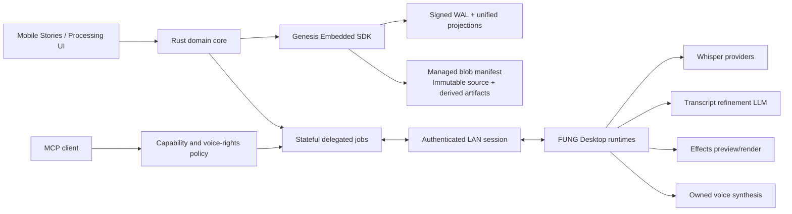

# FUNG Mobile — Stories, Processing, and Agent Voice Proposal

## 1. Classification

| Field | Value |
| --- | --- |
| Product owner | Boss (Founder) |
| Technical owner | ATHER |
| Complexity | C-3 — Architecture-Driven Implementation |
| Change risk | HIGH |
| Parent product | `docs/Mobile/PRODUCT_UX_SPEC.md` |
| Parent architecture | `docs/Mobile/TECHNICAL_DESIGN.md` |
| Audio pipeline | `docs/Desktop/AUDIO_AI_PIPELINE.md` |
| Peer timeline | `docs/Mobile/SPEAKER_TIMELINE_PROPOSAL.md` `0.1.0b` |
| Approval state | Visual/feature scope approved previously; `1.0.0b` database-boundary correction awaiting approval |

เหตุผลที่เป็น C-3/HIGH: งานเพิ่ม non-destructive timeline editing, audio DSP, model package selection, AI text revision, voice-profile ownership และ MCP execution consent ข้าม Mobile/Desktop boundary

## 2. Interpretation of the Reference Images

ภาพอ้างอิงถูกใช้เป็น **capability reference** ไม่ใช่ visual source ที่ต้องคัดลอกโดยตรง

| Reference capability | FUNG interpretation |
| --- | --- |
| Stories Editor | touch-first multivoice sequence editor บน metadata/derived clips |
| Audio Effects Pipeline | non-destructive effect chain ที่ Desktop render และ Mobile preview/control |
| Whisper sizes | provider package manifest พร้อมสถานะ installed/compatible/remote |
| Refined transcripts | proposal diff ที่ยืนยันหรือปฏิเสธเป็นรายช่วงได้ |
| Agents speak in owned voices | MCP tool ที่ใช้เฉพาะ voice profile ซึ่งผู้ใช้เป็นเจ้าของหรือมีสิทธิ์ |

## 3. Scope Boundary

### In Scope

- สร้าง Story Sequence จาก speaker turns หรือ transcript segments
- reorder derived clips และ speaker lanes โดยไม่แก้ source recording
- split, trim-boundary และ duplicate derived clip
- undo/redo และ append-only edit revision
- effect chain: pitch shift, reverb, delay, compressor และ low-pass
- bypass effect, reorder chain, save local preset และ preview/render ผ่าน Desktop
- เลือก Whisper profile จาก package manifest ตาม hardware/runtime compatibility
- แสดง installed state, size, language support และ execution location ตามข้อมูลจริง
- transcript refinement แบบ original/proposed diff
- accept/reject proposal เป็นรายช่วงหรือเป็นชุด โดยเก็บ provenance
- MCP agent voice session พร้อม grant, speaking indicator, stop/mute และ audit log
- voice profiles ที่มี ownership/license provenance เท่านั้น
- standalone story metadata editing และ transcript review เมื่อ Desktop ไม่พร้อม

### Out of Scope

- full DAW mixer, automation lanes, mastering, arbitrary plugin hosting หรือ sample-accurate destructive editing
- แก้หรือลบ source audio จาก Stories Editor
- claim ว่าทุก Whisper model ติดตั้งแล้วโดยไม่มี package evidence
- implicit cloud inference หรือ implicit model download
- automatic transcript rewrite ที่แทน original โดยไม่ยืนยัน
- biometric speaker identity
- cloning เสียงบุคคลอื่นโดยไม่มี consent/rights evidence
- autonomous MCP speech ที่ไม่มี active user grant หรือไม่มี visible stop control
- Desktop UI redesign และ Desktop runtime rewrite ใน proposal นี้

## 4. Approved Candidate Concepts

### M9 — Stories Editor

`docs/Mobile/concepts/dark/06-stories-editor-dark.png`

Primary anatomy:

1. Story title and transport
2. shared time ruler/playhead
3. anonymous voice lanes with draggable derived clips
4. selected clip with trim handles
5. inspector: split, trim, move, effects, export
6. immutable-source truth notice

### M10 — Processing Studio

`docs/Mobile/concepts/dark/07-processing-studio-dark-v2.png`

Primary anatomy:

1. tabs: Transcribe, Refine, Effects, Agent Voice
2. explicit execution location and offline truth
3. Whisper package/profile selector
4. original/proposed transcript review
5. ordered non-destructive effect chain
6. MCP voice grant, owned profile, speaking state and kill controls

Concepts use the project’s approved dark tokens: charcoal porcelain surfaces, restrained indigo/sage/warm-metal accents, red reserved for recording/destructive state, no neon or glassmorphism.

## 5. Product Workflows

### 5.1 Story Editing

`Recording → Speaker Timeline → Create Story Sequence → Arrange derived clips → Optional effects → Preview → Export`

- sequence stores references to immutable source spans
- moving or trimming changes only sequence metadata
- overlapping clips are explicit; no hidden overwrite
- export creates a new artifact with manifest and checksum
- undo/redo is backed by durable revisions, not ephemeral UI history alone

### 5.2 Whisper Profile Selection

`Open Processing Studio → Inspect compatible profiles → Select runtime/profile → Confirm download if required → Start job`

Each profile must state:

- provider/model identifier and version
- package size and checksum
- installed/not-installed state
- supported runtime and hardware compatibility
- supported languages from manifest
- execution location: Mobile, Desktop LAN, or explicit cloud provider

The UI must not infer compatibility from marketing names alone.

### 5.3 Transcript Refinement

`Transcript → Local/Desktop LLM proposal → Diff review → Accept/reject spans → New transcript revision`

Rules:

- original text remains readable and recoverable
- proposal is labelled `inferred/proposed`
- refinement may remove filler or fix punctuation only under the selected policy
- meaning-changing edits require explicit span confirmation
- accepted text becomes a new revision with model run, prompt policy and evidence links

### 5.4 Effects

`Select derived clip/voice profile → Edit ordered effect chain → Preview → Save preset or render artifact`

- preview and render have separate job states
- all parameters are bounded and typed
- chain supports bypass per node and whole-chain bypass
- original/cleaned source remains untouched
- presets are local and scoped to project or owned voice profile

### 5.5 MCP Agent Voice

`Agent requests fung.voice.speak → Policy checks client/project/profile grant → UI shows speaking session → User may mute/stop → Audit is retained`

Hard safety rules:

- default deny
- grants are capability-scoped and revocable
- request must include text, project and voice profile reference
- voice profile must carry ownership/license/consent provenance
- active speech always has a visible identity, text preview or audit reference, and stop control
- the agent cannot create or clone a voice through this tool
- no background always-on listening is introduced

## 6. Architecture Decision

### Decision

Keep Mobile as touch-first controller/editor while GenesisBlockDB is the single operational database boundary. Delegate heavy inference, DSP preview/render, model package management and voice synthesis to the paired FUNG Desktop through stateful jobs. Mobile retains source access and manual editing when disconnected; Desktop is an executor, not another source of truth.

### Parent/Peer Impact

- Extends `Audio AI Pipeline` after transcription/diarization and before export.
- Reuses `speaker_turns`, `model_providers`, `model_runs`, `jobs`, paired devices and capability grants.
- Extends Speaker Timeline only with derived story sequences; source timeline invariants remain unchanged.
- Does not change Desktop-first/local-first/privacy-first shared truths.

## 7. Proposed Data Additions

### `story_sequences`

- `id`, `project_id`, `title`, `duration_ms`
- `current_revision`, `created_at`, `updated_at`

### `story_clips`

- `id`, `sequence_id`, `source_recording_id`
- `source_start_ms`, `source_end_ms`, `timeline_start_ms`
- `speaker_id`, `effect_chain_id`, `revision`
- invariant: source range is immutable; edits create/update derived metadata revision

### `story_revisions`

- `id`, `sequence_id`, `operation`, `payload_json`
- `author_device_id`, `created_at`

### `effect_chains` / `effect_nodes`

- chain ownership: project, derived clip, or voice profile
- ordered nodes with `kind`, typed `parameters_json`, `bypassed`
- supported initial kinds: `pitch_shift`, `reverb`, `delay`, `compressor`, `low_pass`

### `model_packages`

- provider/model/version, size, checksum, manifest
- runtime location and compatibility evidence
- install state and license reference

### `transcript_refinement_proposals`

- transcript segment/revision reference
- original/proposed text, policy, model run
- `proposed | accepted | rejected | partially_accepted`

### `voice_profiles`

- profile metadata and synthesis provider
- `rights_basis`: `owned_recording | licensed_pack | explicit_consent`
- consent/license evidence reference and revocation state

### `agent_voice_sessions`

- MCP client, project, voice profile and grant
- requested text hash, state, timestamps and stop actor
- output artifact reference when retained

## 8. Command and Job Contracts

### Mobile Commands

- `mobile_story_create`
- `mobile_story_query`
- `mobile_story_clip_move`
- `mobile_story_clip_split`
- `mobile_story_clip_trim`
- `mobile_story_undo`
- `mobile_story_redo`
- `mobile_model_packages_query`
- `mobile_model_package_install_request`
- `mobile_refinement_start`
- `mobile_refinement_review`
- `mobile_effect_chain_update`
- `mobile_effect_preview_start`
- `mobile_story_export_start`
- `mobile_voice_profiles_query`
- `mobile_agent_voice_grant_set`
- `mobile_agent_voice_stop`

### Stateful Job Types

- `story.preview`
- `story.export`
- `model.install`
- `transcript.refine`
- `audio.effect_preview`
- `audio.effect_render`
- `voice.synthesize`

Every job carries immutable input manifest hash, executor, provider/model provenance, checkpoint and explicit failure state.

### MCP Tool Candidate

`fung.voice.speak`

Required input:

- `project_id`
- `voice_profile_id`
- `text`
- optional `retain_output=false`

Policy requirements:

- authenticated MCP client
- active `voice.speak` capability grant
- project and voice-profile scope match
- voice rights state valid
- lifecycle permits visible speech session

## 9. UX and Accessibility Requirements

- primary editor touch targets at least 44×44 logical pixels
- drag/trim exposes accessible button alternatives and numeric time fields
- lane identity never relies on color alone
- effects expose text labels, bypass state and bounded value controls
- model list distinguishes installed, available, incompatible and unknown
- transcript diff supports screen-reader original/proposed navigation
- speaking state exposes client, profile, stop and mute actions
- reduced-motion disables decorative waveform animation but not state indication
- Light/Dark/System appearance applies to both screens

## 10. Acceptance Criteria

### Stories Editor

- create a sequence from real speaker turns
- move, split and trim a derived clip without changing source hashes
- undo/redo restores the durable sequence state after restart
- overlapping clips remain explicit
- export produces a new checksummed artifact

### Models and Refinement

- model availability comes from a verified manifest
- no-model and disconnected states keep manual editing usable
- refinement shows original/proposed text and provenance
- reject leaves active transcript unchanged
- accept creates a new revision and retains source evidence

### Effects

- ordered chain, bypass, preview and render states work
- preview cancellation does not create a completed artifact
- preset save/load is deterministic
- original source checksum is unchanged

### Agent Voice

- unauthorized MCP call is denied
- revoked/expired voice rights block synthesis
- active session always exposes stop and mute
- stop interrupts playback/synthesis and records the actor
- no voice cloning endpoint is exposed

## 11. Verification Strategy

- Rust schema/invariant/property tests for source immutability and revisions
- contract tests for model manifests and effect parameter bounds
- negative authorization tests for MCP and voice rights
- Desktop/Mobile LAN disconnect and resumable job suite
- golden transcript-diff tests that detect meaning-changing rewrite
- deterministic DSP fixture tests plus source/output checksum comparison
- browser fidelity and interaction checks at 393×852 in Light/Dark
- Android/iPhone real-device drag, pinch, background audio and interruption tests
- accessibility tree and reduced-motion audit

## 12. Rollout

1. Story sequence schema and non-destructive editor
2. Model package manifest/profile selector
3. Transcript refinement proposal/review
4. Effect-chain control plus Desktop preview/render adapter
5. Voice profile rights model and MCP policy
6. Agent speaking session UX and negative security suite
7. real-device performance, battery and interruption evidence

Each phase remains independently feature-flagged until its acceptance suite passes.

## 13. Open Gates

| ID | Gate | Current truth |
| --- | --- | --- |
| SPV-01 | DSP implementation | no approved DSP runtime/provider is currently selected |
| SPV-02 | Whisper packages | workspace currently proves faster-whisper, not all profiles shown in the reference |
| SPV-03 | Refinement LLM | requires a selected local/Desktop provider and policy fixtures |
| SPV-04 | Voice synthesis | no approved owned-voice engine/package has been selected |
| SPV-05 | Voice rights evidence | legal/product retention and revocation policy needs approval |
| SPV-06 | MCP speech consent | default grant duration and per-client UX needs approval |
| SPV-07 | Desktop transport | mutual-authenticated execution remains an integration gate |

## 14. Definition of Done

- approved M9/M10 concepts implemented faithfully
- source audio immutability proven by tests
- real provider/package states replace all reference/demo values
- transcript proposals remain visibly inferred until accepted
- DSP, refinement and synthesis carry provider/model provenance
- MCP voice authorization negative suite passes
- browser Light/Dark and Android/iPhone interaction evidence passes
- implementation status and version diff are updated
- no Full DAW, implicit cloud or unowned voice behavior is introduced

## Version Diff

### `0.0.0` → `0.1.0b`

- Added a bounded non-destructive Stories Editor proposal.
- Added model-package selection and transcript-refinement review contracts.
- Added ordered effects-chain preview/render contracts.
- Added rights-scoped MCP agent voice sessions and explicit safety controls.
- Preserved local-first operation, source immutability and Desktop-optional core behavior.

### `0.1.0b` → `1.0.0b`

- Replaced Mobile-owned SQLite/revision storage with GenesisBlockDB as the single operational boundary.
- Clarified that Desktop is a provider executor and cannot become a second source of truth.
- Required story, refinement, effect and voice mutations/artifacts to commit through canonical Genesis transactions and blob identity.

## CHANGELOG

| Version | Date | Status | Summary | Commit Hash | Agent |
| --- | --- | --- | --- | --- | --- |
| 0.1.0b | 2026-07-20 | candidate | Initial stories, processing, and agent voice proposal with M9/M10 concepts | N/A — workspace is not an initialized Git repository | ATHER |
| 0.1.0b | 2026-07-20 | beta | User-approved proposal implemented with provider-dependent gates preserved | N/A — workspace is not an initialized Git repository | ATHER |
| 1.0.0b | 2026-07-20 | candidate | Structural correction to GenesisBlockDB operational-boundary ownership | N/A — no commit created | ATHER |
