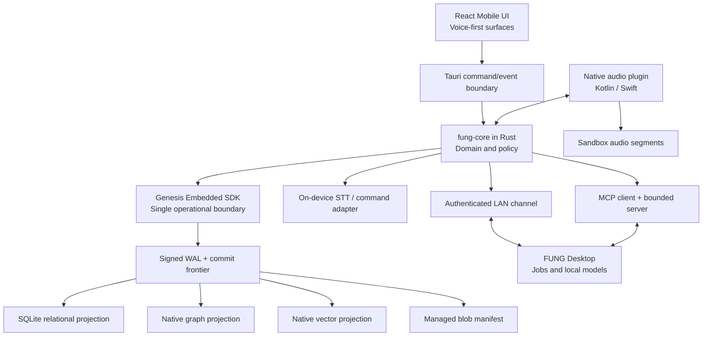
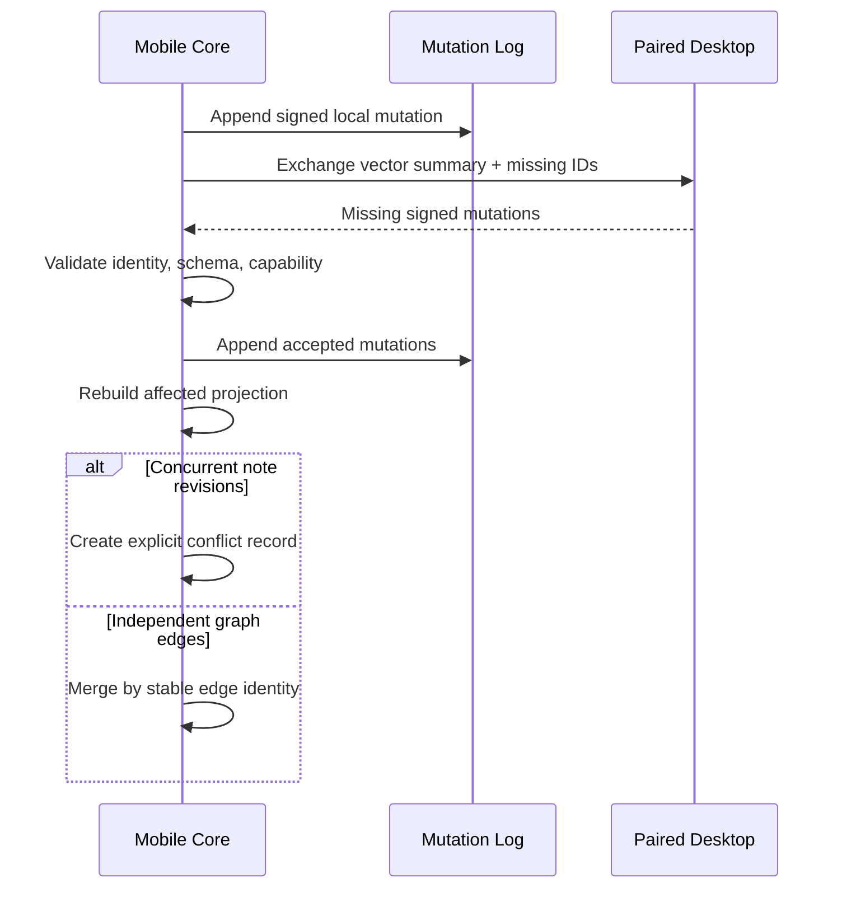

# Technical Design — FUNG Mobile

## 1. Document Header

| Field | Value |
| --- | --- |
| Product owner | Boss (Founder) |
| Technical owner | ATHER |
| Implementation team | FUNG Mobile — ยังไม่กำหนดรายชื่อ |
| Parent architecture | `docs/Desktop/ARCHITECTURE.md` |
| Product requirement | `docs/Mobile/PRODUCT_UX_SPEC.md` `0.1.0b` (`beta`) |
| Visual contracts | `docs/Mobile/CONCEPT_REVIEW.md`, `docs/Mobile/DARK_AND_CRITICAL_STATES_REVIEW.md` |
| Tracking ticket | ยังไม่กำหนด |
| Complexity | C-3 — Architecture-Driven Implementation |
| Change risk | HIGH |
| Approval state | `1.0.0b` beta — structural GenesisBlockDB boundary correction approved and implemented |

เหตุผลที่เป็น C-3/HIGH: งานครอบคลุม iOS/Android lifecycle, การอัดเสียงต่อเนื่อง, native service, ฐานข้อมูลและ graph sync, LAN security, MCP, local AI และการใช้ domain contract ร่วมกับ Desktop

## 2. Context

FUNG Desktop วางฐานไว้ที่ Tauri v2 + React/TypeScript, Rust application services, GenesisBlockDB unified operational boundary (ซึ่งมี SQLite relational subsystem ภายใน), stateful jobs และ MCP. Mobile ต้องเป็นผลิตภัณฑ์ standalone ที่ทำงานหลักได้เอง แต่ใช้ Desktop ผ่าน LAN เป็น optional compute extension ได้โดยไม่เปลี่ยน Desktop ให้เป็นแหล่งความจริงเพียงจุดเดียว

เอกสารนี้แปลง UX ที่อนุมัติแล้วให้เป็น architecture, contract, failure behavior, security boundary และแผนพิสูจน์ที่ตรวจสอบได้ โดยไม่เริ่มเขียน production code

### Current Platform Evidence

- Tauri v2 รองรับ mobile shell และ native plugin ด้วย Kotlin/Java บน Android และ Swift บน iOS; shared Rust สามารถเชื่อม native code ผ่าน JNI/FFI ได้ตามความจำเป็น: [Tauri mobile plugin development](https://v2.tauri.app/develop/plugins/develop-mobile/)
- Android จำกัดการเริ่ม microphone foreground service จาก background และต้องเริ่มในช่วงที่แอปมีสิทธิ์ while-in-use: [Android foreground-service restrictions](https://developer.android.com/develop/background-work/services/fgs/restrictions-bg-start)
- iOS ระงับแอปทั่วไปเมื่ออยู่ background และอนุญาตเฉพาะ background mode ที่ประกาศและใช้อย่างจำกัด: [Apple background execution modes](https://developer.apple.com/documentation/xcode/configuring-background-execution-modes)
- MCP remote connection ใช้ Streamable HTTP; `stdio` เหมาะกับ local spawned process และ SSE เดิมถูกลดสถานะ: [MCP TypeScript SDK server transports](https://ts.sdk.modelcontextprotocol.io/server)

## 3. Problem Statement

ระบบต้องแก้ปัญหาสี่ข้อพร้อมกัน:

1. ผู้ใช้ต้องอัดเสียง จัดการโปรเจกต์ สร้างโน้ต และดูความสัมพันธ์ของโน้ตได้โดยไม่มี Desktop/Internet
2. การปิดจอ สลับแอป หรือ process ถูกยุติ ต้องไม่ทำให้ระบบกล่าวอ้างผิดว่าเสียงปลอดภัยหรือสูญหาย
3. Desktop compute และ MCP บน LAN ต้องมีการยืนยันตัวตน สิทธิ์แบบจำกัด และสถานะงานที่ resume ได้
4. Graph relation ต้องแยกข้อเท็จจริงที่ผู้ใช้ยืนยัน อนุมาน และหลักฐานต้นทาง โดยไม่ merge แบบทำข้อมูลหายเงียบ ๆ

หากใช้ UI/WebView เป็นเจ้าของการอัดเสียงหรือ durable writes โดยตรง ระบบจะเสี่ยงจาก OS lifecycle. หากสร้าง Mobile stack แยกจาก Desktop ทั้งหมด ระบบจะเกิด domain drift ระหว่าง GenesisBlockDB, job model และ MCP contracts

## 4. Goals and Success Metrics

### Product Goals

- Standalone core ทำงานได้ใน airplane mode หลังติดตั้ง assets ที่จำเป็นแล้ว
- การอัดเสียงมี durable boundary และ recovery truth ที่ตรวจสอบได้
- ผู้ใช้เชื่อม Desktop เพื่อ delegate งาน local LLM/STT/summary ได้ แต่ยกเลิกหรือ disconnect แล้ว Mobile ยังใช้งานข้อมูลต้นทางได้
- Mobile เป็น MCP client และเป็น bounded MCP server ขณะ lifecycle อนุญาต
- Graph แสดง confirmed/inferred/evidence relation อย่างแยกแยะได้

### Initial Technical Targets

| Metric | Candidate target | Gate |
| --- | --- | --- |
| Recording start after permission | p95 ≤ 2 วินาที | Phase 0/2 |
| Continuous capture | 3 ชั่วโมงต่อเนื่องบนเครื่องอ้างอิง | Phase 0/7 |
| Durable-tail uncertainty after forced termination | ≤ 5 วินาที | Phase 0/2 |
| Recent-note query at 10,000 nodes | p95 ≤ 100 ms | Phase 4 |
| One-hop graph query at 10,000 nodes | p95 ≤ 200 ms | Phase 4 |
| Local voice UI acknowledgement | ≤ 500 ms | Phase 3/7 |
| Delegated job recovery | ไม่เริ่มงานซ้ำเงียบ ๆ; resume จาก durable checkpoint | Phase 5 |
| Data loss on confirmed-safe chunks | 0 ใน kill/restart suite | Phase 2/7 |

ค่าแบตเตอรี่และความร้อนจะวัดใน Phase 0 ก่อนตั้ง release threshold เพื่อไม่สร้างตัวเลขที่ไม่มีหลักฐาน

## 5. Scope

### In Scope — V1

- iOS และ Android app shell
- local project library, recording, chunk ledger, playback, note editing และ export
- GenesisBlockDB unified operational boundary สำหรับ relational, graph, vector, blob metadata และ provenance
- push-to-talk voice command และ local command grammar ขั้นพื้นฐาน
- optional on-device STT เมื่อผู้ใช้ติดตั้ง model package ที่รองรับ
- LAN pairing กับ FUNG Desktop, device trust และ delegated stateful jobs
- MCP client ไปยัง Desktop และ bounded MCP server บน Mobile
- crash recovery, low-storage, interruption และ disconnected-job states
- light/dark appearance และ accessibility contract ที่อนุมัติแล้ว

### Out of Scope — V1

- wake word ที่ฟังตลอดเวลา
- cloud account, cloud sync หรือ cloud inference เป็นค่าเริ่มต้น
- collaboration แบบหลายผู้ใช้พร้อมกันผ่าน Internet
- background MCP server ที่รับ connection ได้ตลอดเวลา
- automatic semantic relation ที่เปลี่ยนเป็น fact โดยไม่ให้ผู้ใช้ยืนยัน
- audio/video call recording หรือการข้ามข้อจำกัดของ OS
- Desktop UI redesign และ Desktop runtime rewrite

### Future Considerations

- end-to-end encrypted remote relay
- cross-user collaboration และ organization policy
- larger on-device LLM เมื่อ hardware profile เหมาะสม
- OS intents/widgets/shortcuts หลัง core lifecycle เสถียร

## 6. Requirements — EARS Contract

| ID | EARS requirement | Verification |
| --- | --- | --- |
| R-MOB-001 | The Mobile system shall create, open, record, annotate, graph, play, and export a project without Desktop or Internet. | airplane-mode E2E |
| R-MOB-002 | When recording is active, the native recording service shall persist audio segments and durable checkpoints independently of WebView lifecycle. | lock-screen/kill tests |
| R-MOB-003 | When the app restarts after interruption, the system shall report the last confirmed-safe boundary and shall label any tail beyond it as uncertain. | recovery fault injection |
| R-MOB-004 | While storage is below the safe reserve, the system shall warn with estimated remaining time and shall stop at a recoverable boundary before writes become unsafe. | low-storage simulation |
| R-MOB-005 | When Desktop is unavailable, Mobile shall retain local source access and shall pause delegated jobs without silently restarting them. | LAN disconnect E2E |
| R-MOB-006 | When a user pairs a Desktop, the system shall require explicit confirmation and establish a mutually authenticated encrypted channel. | security integration test |
| R-MOB-007 | The system shall deny unauthenticated LAN API and MCP requests. | negative auth suite |
| R-MOB-008 | While Mobile is an MCP server, the system shall expose only user-approved project capabilities and shall show active/suspended state. | capability and lifecycle test |
| R-MOB-009 | When the OS suspends Mobile MCP, the system shall show that no active access is occurring and shall require explicit resume. | background lifecycle E2E |
| R-MOB-010 | The graph system shall distinguish confirmed, inferred, evidence, and superseded relations in storage and presentation. | schema/UI contract tests |
| R-MOB-011 | When concurrent edits conflict, the system shall preserve both revisions and create a resolvable conflict instead of silently applying last-write-wins. | merge property test |
| R-MOB-012 | Where a voice command changes or deletes durable data, the system shall require visible confirmation before execution. | command safety E2E |
| R-MOB-013 | If no compatible local model exists, the system shall keep recording and note functions available and shall state why AI output is unavailable. | no-model E2E |
| R-MOB-014 | The system shall keep external telemetry disabled by default and shall allow the user to export local diagnostics explicitly. | privacy test |

## 7. Architecture Decision

### Decision

ใช้ **Tauri v2 Mobile + React/TypeScript presentation + shared Rust domain core** เป็น architecture target แบบมีเงื่อนไข โดยต้องผ่าน Phase 0 feasibility spike บนเครื่องจริงก่อน

งานที่ต้องอยู่ native:

- Android: Kotlin foreground recording service และ audio interruption integration
- iOS: Swift audio session/engine และ background audio lifecycle
- Keychain/Keystore, network discovery และ OS permission bridge ตามความจำเป็น

งานที่ FUNG Rust เป็นเจ้าของ:

- domain policy และการประกอบ typed mutation/query ผ่าน Genesis embedded SDK
- job state machine, provenance, merge/conflict records
- LAN session authorization และ MCP capability gateway

งานที่ GenesisBlockDB engine เป็นเจ้าของ:

- signed WAL, commit sequence และ stable/eventual frontier
- versioned relational schema/migrations ภายใน SQLite subsystem
- native graph/vector projections, managed blob manifest, replay/rebuild และ unified backup
- FUNG ห้ามเปิด SQLite handle หรือ synchronize relational/graph/vector stores เอง

งานที่ React/TypeScript เป็นเจ้าของ:

- visual state, navigation, forms, accessibility และ voice feedback presentation
- ห้ามเป็นผู้ถือ durable recording state เพียงจุดเดียว
- ห้ามเขียน domain tables ข้าม Rust service

### Architecture Overview



### Hard Boundary

WebView suspension must not interrupt native audio capture or Genesis-owned durable state. FUNG must open one Genesis handle and must not open SQLite, graph or vector stores independently. If the chosen bridge cannot prove this behavior on both platforms, the architecture does not pass Phase 0.

## 8. Alternatives Considered

| Option | Strength | Cost/Risk | Decision |
| --- | --- | --- | --- |
| Tauri v2 + shared Rust core | Reuses Desktop domain/contracts; smallest semantic drift; native plugins available | mobile audio/lifecycle bridge requires real-device proof; iOS toolchain requires macOS/Xcode | Preferred behind spike |
| React Native + Expo prebuild | Mature mobile UI/audio ecosystem; Expo Audio and SQLite provide mobile-focused capabilities | duplicates domain logic or needs Rust bridge; higher Desktop/Mobile contract-drift risk | Fallback shell |
| Native Swift + Kotlin | Strongest OS integration | two UI/runtime implementations; highest cost and drift | Rejected for V1 |
| PWA | Fastest surface reuse | insufficient reliable background recording and local service control | Rejected |

Fallback trigger: หาก Tauri spike ไม่ผ่าน hard criterion ตั้งแต่ 2 ข้อขึ้นไป หรือไม่สามารถให้ native service เข้าถึง shared durable core ขณะ WebView ถูก suspend ให้หยุด implementation และจัดทำ stack-change proposal เป็น React Native/Expo prebuild โดยคง Rust core ผ่าน native bridge ก่อนเริ่ม Phase 1

## 9. Component Design

### 9.1 Mobile App Shell

- จัดการ route: Home, Notes, Voice/Capture, Graph, Devices, MCP/Privacy
- อ่าน projection จาก Rust service และรับ typed events
- เก็บเฉพาะ ephemeral UI state ใน JS

### 9.2 Native Recording Service

- ขอ permission แบบ just-in-time
- ถือ audio session, interruption callbacks และ foreground/background notification
- เขียน segment ระยะเป้าหมาย 30 วินาที พร้อม safe checkpoint ไม่เกินทุก 5 วินาที
- ส่ง event `capture.progress`, `capture.checkpointed`, `capture.interrupted`, `capture.storage_warning`
- ไม่แก้ graph หรือ transcript โดยตรง

### 9.3 Recording Coordinator

- Rust state machine: `idle → preparing → recording → paused/interrupted → finalizing → completed/recovery_required`
- ตรวจ monotonic sequence, checksum, duration และ durable offset ของแต่ละ segment
- recovery scan เชื่อถือเฉพาะ segment/checkpoint ที่ผ่าน integrity validation

### 9.4 GenesisBlockDB Mobile

- เป็น operational boundary เพียงจุดเดียวที่ FUNG ใช้เปิด/ปิด/write/query/backup/restore
- SQLite relational subsystem, native graph, native vector, managed blob manifest และ signed WAL เป็น internals ของ Genesis engine
- ทุก row/graph/vector/blob mutation ใช้ `GenesisTransaction`, canonical `EntityId` และ commit sequence เดียวกัน
- FUNG ลงทะเบียน relational schema package และใช้ Typed Query IR; ห้าม direct SQLite writes/raw DDL/DML
- ทุก relation มี `relation_kind`, `epistemic_status`, provenance และ author/device
- UI ขอ unified projection ผ่าน FUNG service ที่เรียก Genesis SDK; ไม่ query internal store โดยตรง

### 9.5 Voice Command Router

- local push-to-talk เป็น default
- grammar ขั้นพื้นฐานต้องทำงานโดยไม่ใช้ LLM เช่น เริ่ม/หยุดอัด เปิดโน้ต สร้างโน้ต ค้นชื่อโปรเจกต์
- ambiguous หรือ destructive intent ต้องเข้าสถานะ confirm
- LLM routing เป็น optional adapter และต้องแสดง execution location

### 9.6 Desktop Pairing and Delegated Jobs

- discovery ใช้ local network discovery ที่ OS รองรับ แต่ discovery record ไม่ถือเป็น trust
- pairing สร้าง device identity, single-use challenge และ user confirmation บนทั้งสองฝั่ง
- job request อ้าง `job_id`, immutable input manifest, model/runtime request และ checkpoint policy
- Desktop ส่ง progress/checkpoint; Mobile ไม่ประมาณ progress เองเมื่อ connection หาย

### 9.7 MCP Gateway

- Mobile เป็น Streamable HTTP client ไปยัง Desktop
- Mobile server bind เฉพาะ interface/ช่วงเวลาที่ผู้ใช้เปิดใช้งาน
- ทุก tool/resource ผ่าน capability policy เดียวกับ local UI services
- ไม่มี `stdio` server บน Mobile และไม่มี always-on promise

## 10. Data Design

### Logical FUNG Entities

รายการต่อไปนี้เป็น logical schema package และ public entity contract ไม่ใช่คำอนุญาตให้ FUNG สร้าง/เขียน SQLite tables โดยตรง Graph/vector representations อยู่ใน Genesis native projections และ resolve ด้วย `EntityId` เดียวกัน

| Entity | Purpose | Key fields |
| --- | --- | --- |
| `projects` | project aggregate | `project_id`, title, created_at, updated_at |
| `recordings` | capture session | `recording_id`, project_id, state, safe_offset_ms |
| `audio_segments` | durable file ledger | segment_id, sequence, path, checksum, duration_ms, status |
| `notes` | stable note identity | note_id, project_id, current_revision_id |
| `note_revisions` | immutable content revision | revision_id, note_id, body, hlc, author_device_id |
| Graph node | native graph projection identity | entity_id, entity_type, label |
| Graph edge | native relation assertion | edge_id, source, predicate, target, epistemic_status |
| `evidence_refs` | source anchor | evidence_id, recording_id, start_ms, end_ms, checksum |
| `mutation_log` | replication input | mutation_id, device_id, hlc, payload, signature |
| `conflicts` | explicit unresolved concurrency | conflict_id, entity_id, competing_revision_ids, status |
| `devices` | paired identity | device_id, public_key, trust_state, last_seen_at |
| `jobs` | local/delegated state | job_id, executor, state, checkpoint, input_manifest_hash |
| `capability_grants` | MCP/LAN consent | grant_id, client_device_id, project_scope, capabilities, expires_at |

### Graph Epistemic Status

- `confirmed`: ผู้ใช้หรือ deterministic source ยืนยัน
- `inferred`: model/rule เสนอและยังไม่เป็น fact
- `evidence`: ชี้กลับไปยังช่วงเสียง/ข้อความต้นทาง
- `superseded`: เคยถูกต้องใน revision ก่อน แต่ถูกแทนที่
- `disputed`: มี revision หรือผู้ยืนยันขัดกัน

ห้ามเปลี่ยน `inferred` เป็น `confirmed` โดยอัตโนมัติ

### Identity and Ordering

- ใช้ globally unique IDs ที่สร้าง offline ได้; concrete library/format จะปิดใน Phase 0
- ใช้ Hybrid Logical Clock (HLC) เพื่อ ordering ข้าม device โดยไม่ถือว่านาฬิกาเครื่องตรงกัน
- ordering ไม่ใช่ conflict resolution; concurrent note revisions ต้องเก็บทั้งคู่

### Storage Ownership

- Genesis signed WAL เป็น internal durability authority; SQLite/graph/vector projections และ migrations เป็น Genesis-owned
- FUNG ส่ง schema package, typed transactions และ typed queries ผ่าน Genesis API เท่านั้น
- audio อยู่ใน Genesis-managed blob directory หรือ approved app-private sandbox; manifest เก็บ logical ID, relative path, checksum, MIME, size และ lifecycle
- migration/backup ต้องเป็น coherent Genesis bundle และห้ามลบ original audio

## 11. Interfaces and Contracts

### Tauri Command Examples

| Command | Request | Response |
| --- | --- | --- |
| `mobile_capture_start` | project_id, input_profile | recording_id, started_at, safe_offset_ms |
| `mobile_capture_stop` | recording_id, expected_state | final state, safe_duration_ms, segment_count |
| `mobile_graph_query` | project_id, focus_node_id, depth≤2 | typed nodes/edges/evidence |
| `mobile_voice_intent_confirm` | intent_id, confirmation | result or rejection reason |

### LAN Control API — Candidate V1

Base path: `/mobile/v1`. Transport must be encrypted and mutually authenticated after pairing.

#### `POST /mobile/v1/jobs`

Request:

```json
{
  "job_id": "offline-generated-id",
  "project_id": "project-id",
  "operation": "summarize",
  "input_manifest_hash": "sha256:...",
  "preferred_runtime": "desktop-local",
  "capability_grant_id": "grant-id"
}
```

Response `202`:

```json
{
  "job_id": "offline-generated-id",
  "executor": "desktop:device-id",
  "state": "queued",
  "checkpoint": null
}
```

Idempotency: `job_id` เดิม + manifest เดิมคืน state เดิม; `job_id` เดิม + manifest ต่างกันตอบ `409 JOB_ID_CONFLICT`

#### `GET /mobile/v1/jobs/{job_id}`

คืน durable state, last-known checkpoint, executor และ `observed_at`. หาก Desktop หาย Mobile แสดง state สุดท้ายพร้อม `connection_state=unreachable` โดยไม่สร้าง progress ใหม่

### MCP Candidate Surface

| Tool/resource | Default | Scope |
| --- | --- | --- |
| `fung.projects.list` | denied until grant | selected projects only |
| `fung.notes.search` | denied until grant | metadata/content separately grantable |
| `fung.graph.query` | denied until grant | max depth/result count |
| `fung.capture.status` | denied until grant | read-only |
| `fung.jobs.submit` | denied until grant | allowlisted operation/runtime |

Tool input/output ต้อง map ไปยัง domain service เดียวกับ local UI; ห้ามมี MCP-only write path

## 12. Sync and Conflict Model



Rules:

- sync เป็น peer exchange เฉพาะ paired devices ไม่ใช่ implicit cloud sync
- mutation immutable; correction สร้าง mutation ใหม่
- delete ใช้ tombstone พร้อม retention policy ที่จะกำหนดก่อน implementation
- invalid signature/schema/capability ถูก reject และบันทึก local audit
- original audio ไม่ sync อัตโนมัติ; user/job manifest ระบุชัดว่าถ่ายโอนอะไร

## 13. Security and Privacy

### Threat Boundaries

- untrusted LAN peer และ spoofed discovery advertisement
- malicious/overbroad MCP client
- lost or compromised phone
- model output ที่พยายามยกระดับ inference เป็น fact
- replayed job/pairing request
- exported diagnostics ที่อาจมีข้อมูลส่วนบุคคล

### Required Controls

- สร้าง per-device key pair และเก็บ private key ใน Keychain/Android Keystore
- pairing ใช้ single-use challenge, visual confirmation และ pin device identity
- LAN endpoints ปฏิเสธ unauthenticated request, ตรวจ Host/origin ที่เกี่ยวข้อง และไม่ bind โดย default
- grants จำกัด project, capability, expiry และ revoke ได้ทันที
- permission microphone/local-network ขอเมื่อจำเป็น พร้อมเหตุผลที่เข้าใจได้
- app data ใช้ OS app-private protection; app-level DB/audio encryption เป็น Phase 0 performance/security decision และต้องไม่ถูกตัดออกเงียบ ๆ
- external telemetry ปิดโดย default; diagnostic export ต้อง preview/redact ได้
- secrets, raw transcript และ audio path ห้ามอยู่ใน routine log
- inferred output เก็บ provenance: model/runtime/version, input refs, created_at และ confidence เมื่อมีความหมาย

### Security Decisions Still Requiring Spike

- concrete authenticated-channel implementation และ library
- SQLCipher/app-level audio encryption performance บนเครื่องขั้นต่ำ
- certificate/key rotation และ lost-device revocation flow

## 14. Error and Recovery Design

| Failure | Truth shown to user | Recovery behavior |
| --- | --- | --- |
| Microphone denied | ยังไม่ได้เริ่มอัด; ไม่มีเสียงถูกบันทึก | เปิด Settings/ลองใหม่ |
| Low storage | saved chunks ปลอดภัยถึง boundary; แสดงเวลาประมาณ | stop safely/manage storage/continue if safe |
| Process killed | ระบุ safe boundary และ uncertain tail | scan/checksum/rebuild ledger |
| Audio interruption | แสดง interrupted/paused ตาม OS event | resume explicitly or finalize |
| DB migration failure | project ยังไม่ถูกอัปเกรด | restore metadata backup; keep audio untouched |
| Desktop disconnect | source ยังอยู่ Mobile; progress ค้าง ณ observed state | reconnect/resume/cancel |
| Job result manifest mismatch | result ไม่ถูกนำเข้า | quarantine and re-request |
| MCP suspended | ไม่มี active access | explicit reopen |
| Pairing authentication failure | ไม่สร้าง trust | rate-limit, expire challenge, retry visibly |
| Model unavailable | recording/notes ยังใช้ได้ | install model or delegate to paired Desktop |

## 15. Performance and Resource Design

- segment writer ใช้ bounded buffers และ backpressure; memory ไม่โตตามระยะเวลาอัด
- graph query default depth 1 และจำกัด result; depth 2 ต้อง explicit
- WAL checkpoint ทำเมื่อไม่ขัด audio critical path และ monitor failure
- thumbnail/waveform generation เป็น resumable background job
- model inference ต้องถูก preempt หรือ pause เมื่อ capture resource budget เสี่ยง
- network sync ใช้ manifests/checksums ก่อนถ่ายไฟล์ใหญ่
- battery, thermal throttling, storage throughput และ memory peak ต้องเก็บจากเครื่องจริง ไม่ประเมินจาก simulator

## 16. Observability and Operations

Observability เป็น local-first; ไม่มี remote telemetry โดย default

| Signal | Warning threshold | Critical/action |
| --- | --- | --- |
| Safe checkpoint lag | > 7 วินาที 2 ครั้งติด | > 10 วินาที: แจ้งและ safe-stop หากไม่ฟื้น |
| Segment commit latency | p95 > 500 ms ใน 5 นาที | write/checksum failure: enter recovery-safe state |
| Remaining capture capacity | < 15 นาทีโดยประมาณ | ถึง reserve boundary: safe-stop |
| WAL checkpoint | retry 1 ครั้ง | failure ต่อเนื่อง: block non-capture writes/export diagnostics |
| Recovery integrity failures | ≥1 segment | quarantine segment; show exact safe boundary |
| Pairing auth failures | 3 ครั้ง/5 นาทีต่อ peer | expire challenge และ cooldown |
| MCP denied requests | เก็บ count แบบไม่มี payload | spike ผิดปกติ: suspend grant และแจ้งผู้ใช้ |

Local diagnostics ประกอบด้วย app/runtime version, device/OS profile, state transitions, error codes และ redacted timing metrics. ผู้ใช้ต้องกด export เอง

## 17. Testing Strategy

### Unit and Property Tests

- recording/job state machines และ illegal transitions
- graph epistemic transitions และ provenance invariants
- HLC ordering, tombstone และ conflict preservation
- capability matching/expiry/revocation
- manifest hash/idempotency

### Integration Tests

- native recorder ↔ Rust chunk ledger
- Genesis schema migration, signed-WAL replay, projection recovery and unified backup
- UI command/event contract
- Desktop local API/MCP compatibility
- paired identity, replay rejection และ grant scope

### Real-Device E2E Matrix

- Android และ iOS minimum target + current target device อย่างน้อยฝั่งละ 2 รุ่นก่อน release
- 3 ชั่วโมง screen-on, screen-locked และ app-switch capture
- incoming call/audio interruption, Bluetooth route change, headphone removal
- force-stop/process kill/reboot recovery ตามที่ OS อนุญาต
- storage pressure และ permission revoke ระหว่าง session
- LAN loss/reconnect ระหว่าง upload/job/result import
- MCP foreground → background suspension → explicit resume
- airplane mode complete standalone workflow
- dynamic type, screen reader, reduced motion, dark contrast และ Thai wrapping

### Security Tests

- unauthenticated LAN/MCP access
- replayed pairing token/job request
- overbroad project/tool request
- DNS/Host manipulation ตาม transport exposure
- tampered result/segment manifest
- lost-device revocation propagation

### Phase 0 Hard Criteria

ทุกข้อต้องมี artifact จากเครื่องจริง:

1. Android และ iOS อัด 60 นาทีขณะล็อกจอโดย native service ที่ถูกต้องตาม OS
2. WebView ถูก suspend/terminate แล้ว native capture + durable checkpoint ยังทำงานตาม contract
3. forced termination กู้ confirmed-safe audio ได้ 100% และ uncertain tail ไม่เกิน 5 วินาที
4. native Kotlin/Swift เรียก shared Rust core หรือ durable bridge ที่รักษา invariant เดียวกันได้
5. Genesis signed WAL, relational/graph/vector projections และ blob ledger กู้สู่ coherent frontier ภายใต้ kill/storage/interruption suite
6. MCP/LAN endpoint bind, authenticate, suspend และ revoke ได้ตาม lifecycle contract

หมายเหตุ: Android build ทำได้บน Windows ตาม prerequisites; iOS build/release ต้องใช้ macOS, Xcode และอุปกรณ์/บัญชีที่เหมาะสม: [Tauri prerequisites](https://v2.tauri.app/start/prerequisites/)

## 18. Rollout and Implementation Plan

### Phase 0 — Feasibility and Stack Gate (ประมาณ 2–3 สัปดาห์)

- สร้าง disposable spike สำหรับ native recording ทั้งสอง OS
- พิสูจน์ WebView suspension, Rust bridge, WAL/chunk recovery และ LAN/MCP lifecycle
- วัด battery/thermal/storage/encryption cost
- ออก `PHASE_0_EVIDENCE.md` และ Architecture Review decision

Exit: hard criteria ผ่านทั้งหมด หรือเปิด stack-change proposal; ห้ามไหลเข้าสู่ production implementation โดยไม่มี decision

### Phase 1 — Shared Core Boundary (1–2 สัปดาห์)

- แยก/ยืนยัน Rust domain services ที่ใช้ร่วม Desktop/Mobile
- เพิ่ม mobile-specific contract versioning โดยไม่ทำลาย Desktop V1
- schema migration harness, event envelope และ diagnostic codes

### Phase 2 — Recording and Recovery Core (2–3 สัปดาห์)

- production native services, coordinator, chunk ledger, recovery scanner
- low-storage/interruption/routes และ safe-boundary UI events
- 3-hour soak suite

### Phase 3 — Mobile Shell and Voice UX (2 สัปดาห์)

- navigation, tokens, light/dark, accessibility
- push-to-talk local command grammar และ confirmation state
- Home/Capture critical states ตาม approved concepts

### Phase 4 — Notes and GenesisBlockDB Graph (2–3 สัปดาห์)

- revisions, nodes, edges, evidence anchors, conflict records
- Notes/Detail/Graph surfaces และ query performance tests

### Phase 5 — Pairing and Delegated Desktop Jobs (2–3 สัปดาห์)

- authenticated pairing, grants, transfer manifests และ stateful job resume
- Devices/Runtime surfaces และ disconnect/reconnect suite

### Phase 6 — MCP (1–2 สัปดาห์)

- Streamable HTTP client และ bounded server
- capability mapping, audit, suspend/revoke UX และ security suite

### Phase 7 — On-device AI and Release Hardening (2–3 สัปดาห์)

- optional STT/model packages, resource arbitration และ fallback truth
- full device matrix, privacy review, migration/rollback rehearsal

ช่วงเวลาเป็น effort range สำหรับทีมขนาดเล็กและจะปรับหลัง Phase 0; ไม่ใช่ release commitment

### First Approved Task Slice

หลังเอกสารนี้ได้รับอนุมัติ ให้แตก Phase 0 เป็นงานตรวจสอบได้ขนาด 2–4 ชั่วโมงต่อ task:

1. scaffold disposable Android/iOS mobile spike และบันทึก toolchain evidence
2. native recorder writes segment + checkpoint โดยไม่พึ่ง UI
3. WebView suspend/kill experiment พร้อม timestamped artifact
4. Rust/native bridge durability experiment
5. recovery fault-injection harness
6. authenticated LAN/MCP lifecycle experiment
7. battery/thermal/storage/encryption benchmark
8. architecture review และ go/fallback decision

## 19. Deployment, Migration, and Rollback

### Deployment

- internal development builds ก่อน; distribution channel ต้องกำหนดแยกตาม iOS/Android
- feature flags ปิด Desktop delegation, MCP server และ on-device model ได้เป็นราย capability
- schema version และ contract version แสดงใน diagnostics

### Migration

- additive migration เป็น default
- metadata snapshot ก่อน migration; original audio immutable
- migration ทุกตัวมี forward test, failure injection และ restore test
- Mobile/Desktop exchange เฉพาะ contract version ที่ negotiate แล้ว

### Rollback Triggers

- confirmed-safe chunk loss หรือ recovery boundary กล่าวอ้างผิด 1 ครั้ง
- unauthenticated project/MCP access 1 ครั้ง
- migration ทำให้เปิด project ไม่ได้โดยไม่มี recovery path
- background capture ผิด platform policy หรือกิน resource เกิน release threshold

### Rollback Steps

1. ปิด capability ที่เกี่ยวข้องด้วย local feature flag/build rollback
2. หยุด schema rollout และ restore metadata snapshot
3. เก็บ original audio/segments ไว้ทั้งหมด
4. export redacted diagnostics และ reproduction packet
5. กลับสู่ app version ที่รองรับ schema เดิม หรือใช้ compatibility reader ที่พิสูจน์แล้ว
6. เปิดใช้อีกครั้งหลัง RCA, test artifact และ approval

## 20. Risks and Mitigations

| Risk | Probability | Impact | Mitigation |
| --- | --- | --- | --- |
| Tauri mobile/native bridge ไม่เสถียรขณะ WebView suspend | Medium | High | Phase 0 hard gate + RN fallback |
| iOS background behavior ต่างตาม device/OS | High | High | real-device matrix; native audio ownership; no always-on claim |
| Android OEM kills foreground service | Medium | High | notification/service compliance, OEM matrix, recovery boundary |
| DB/audio encryption กระทบ sustained capture | Medium | High | benchmark before selection; separate critical write path |
| Graph sync เกิด silent overwrite | Medium | High | immutable revisions + explicit conflicts; no silent LWW |
| LAN spoofing/overbroad MCP access | Medium | Critical | mutual authentication, scoped grants, bind-off default, security suite |
| Desktop/Mobile contract drift | Medium | High | shared Rust/domain contracts + compatibility tests |
| Model workloadแย่ง resource กับ recording | High | High | capture priority, bounded queues, preemption/resource policy |
| iOS toolchain unavailable | Medium | High | identify macOS/Xcode/device owner before Phase 0 start |
| Scope expands to cloud/wake-word | Medium | Medium | enforce V1 out-of-scope and separate proposal |

## 21. Dependencies

- approved Mobile product/visual docs
- current Desktop contracts: `contracts/local-api-v1.yaml`, `contracts/local-mcp-v1.yaml`, `contracts/stateful-job-model-v1.yaml`, `contracts/genesisblockdb-entities-v1.yaml`
- Rust core extraction boundary from Desktop runtime
- Android Studio/SDK/NDK and test devices
- macOS/Xcode/CocoaPods, Apple signing access and iOS test devices
- security review for pairing/channel/encryption decision
- legal/privacy review for recording consent and diagnostics export

## 22. Open Questions Before Phase 0 Exit

| ID | Question | Blocking point |
| --- | --- | --- |
| OQ-01 | Minimum iOS/Android versions and reference devices? | Release matrix |
| OQ-02 | ใครเป็น owner ของ macOS/Xcode/signing environment? | iOS spike |
| OQ-03 | App-level encryption บังคับทุก project หรือเป็น protected-project mode? | Storage design |
| OQ-04 | On-device STT model/ภาษา/ขนาดขั้นต่ำที่ยอมรับ? | Phase 7 |
| OQ-05 | Tombstone retention และ device-revocation retention เท่าใด? | Sync/privacy |
| OQ-06 | Mobile MCP server ยอมให้ทำงานเฉพาะ foreground หรือระหว่าง active capture service ด้วย? | MCP lifecycle |
| OQ-07 | Distribution target: internal, TestFlight/Play testing หรือ public store? | Deployment |

คำถามเหล่านี้ไม่ขวางการอนุมัติ architecture candidate แต่คำตอบที่ระบุว่า blocking ต้องปิดก่อน phase นั้นเริ่ม

## 23. Acceptance, Exit, and Definition of Done

### Documentation Acceptance Criteria

- requirement ทุกข้อมี verification path
- standalone, Desktop-enhanced, MCP และ graph boundaries ไม่ขัดกัน
- long-running capture ไม่ขึ้นกับ WebView
- stack decision มี measurable gate และ fallback
- security, testing, monitoring, migration และ rollback ระบุครบ
- parent Desktop contracts ถูกอ้างอิงโดยไม่เปลี่ยนเงียบ ๆ

### Architecture Exit Criteria

- ผู้ใช้อนุมัติเอกสารนี้
- Phase 0 hard criteria มี evidence ครบ
- architecture review เลือก go/fallback อย่างชัดเจน
- blocking owner/toolchain questions ของ Phase 0 ถูกปิด
- risk register และ implementation tasks ถูกปรับจากผลจริง

### Definition of Done — Mobile V1

- R-MOB-001 ถึง R-MOB-014 ผ่าน automated/real-device evidence ตามประเภท
- 3-hour capture, crash recovery, low-storage และ disconnect suites ผ่าน
- no known critical security/privacy defect
- docs/contracts/migrations/rollback runbook ตรงกับ artifact จริง
- UX light/dark/critical states ผ่าน accessibility และ Thai-content checks
- ไม่มีการกล่าวอ้าง always-on, recovered, synced หรือ confirmed เกินหลักฐาน runtime

## 24. Approval Gate

เวอร์ชัน `0.1.x` เคยได้รับอนุมัติเมื่อ 2026-07-20 แต่ระบุ GenesisBlockDB เป็น domain layer เหนือ FUNG-owned SQLite ซึ่งขัดกับ upstream unified operational boundary. ผู้ใช้อนุมัติการแก้ ownership เป็น `1.0.0b` และ production runtime ได้ cut over ไปยัง Genesis handle เดียวแล้ว

สถานะ implementation และหลักฐานล่าสุดอยู่ที่ `docs/Mobile/IMPLEMENTATION_STATUS.md` `0.4.0b`; physical-device Genesis APK, U6/U8/U9/U10/U12, external providers และ iOS gates ยังคงเป็นเงื่อนไขก่อนประกาศ Mobile V1 ว่าเสร็จสมบูรณ์

## Version Diff

| Version | Change |
| --- | --- |
| 0.1.0b | Added Mobile C-3 technical design: conditional Tauri stack decision, native audio boundary, shared Rust/GenesisBlockDB core, LAN/MCP security, sync/conflict model, testing, monitoring, rollback, and phased implementation gate. |
| 0.1.0b approval update | Promoted status from `candidate` to `beta` after user authorization to implement all phases. |
| 0.1.1b | Replaced the obsolete approval prompt with the implementation evidence ledger while preserving the real-device and macOS exit gates. |
| 1.0.0b | Replaced FUNG-owned SQLite/graph persistence with GenesisBlockDB as the single operational boundary, signed WAL authority and internal relational/graph/vector/blob projections. |
| 1.0.0b approval update | Promoted corrected boundary from `candidate` to `beta` after approval and production cutover evidence. |

## CHANGELOG

| Version | Date | Status | Summary | Commit Hash | Agent |
|---------|------|--------|---------|-------------|-------|
| 0.1.0b | 2026-07-20 | candidate | Initial FUNG Mobile technical-design proposal. | N/A | ATHER |
| 0.1.0b | 2026-07-20 | beta | User approved the architecture and authorized all implementation phases. | N/A | ATHER |
| 0.1.1b | 2026-07-20 | beta | Linked verified implementation status and removed the completed approval prompt. | N/A | ATHER |
| 1.0.0b | 2026-07-20 | candidate | Corrected database ownership to the GenesisBlockDB unified operational boundary | N/A — no commit created | ATHER |
| 1.0.0b | 2026-07-21 | beta | Approved Genesis ownership boundary implemented; remaining acceptance gates linked to implementation status 0.4.0b | N/A — no commit created | ATHER |
