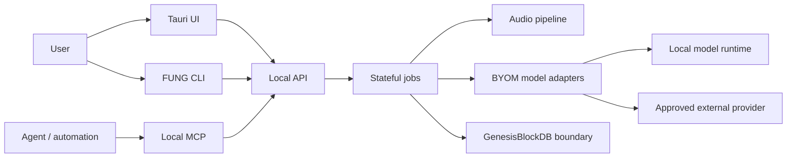

# AI and Agent Architecture

## Boundary



## Rules

1. UI, CLI, MCP, and agents call the approved local API/command boundary; they
   do not open GenesisBlockDB or model files through an ungoverned side path.
2. Long-running capture, transcription, diarization, summarization, and export
   work is represented as a durable or resumable job with explicit state.
3. Agents may propose actions and retrieve evidence through scoped tools. They
   cannot infer approval from transcript text, model output, or a tool name.
4. External network calls are default-deny, capability-scoped, minimised, and
   human-approved where the existing external-retrieval requirements require it.
5. Every model result carries model/runtime provenance and a degraded or
   unavailable state when the model cannot complete.
6. Human authority remains required for sensitive identity claims and external
   delivery. The candidate Meeting Agent extension permits bounded session-policy
   approval for eligible output, not inferred approval from conversation; sensitive
   or out-of-policy payloads require review. Legacy per-call MCP rules are unchanged.

## Runtime responsibility matrix

| Concern | Owning boundary | Evidence |
|---|---|---|
| Capture permission and source channels | Tauri/runtime | device/UAT record |
| Job state and retry | Stateful job engine | job transition evidence |
| Model invocation | BYOM adapter | model card + run manifest |
| Persistence and lineage | GenesisBlockDB | record/export manifest |
| External tool approval | policy and approval boundary | audit chain |
| Human-visible confidence/degradation | UI artifact | visual/UAT evidence |

## Meeting Agent and delivery domains — candidate

See [D12/D13 in the domain map](../architecture/MEETING_INTELLIGENCE_DOMAINS.md) and the [Meeting Agent spec](../specs/2026-09-21-meeting-agent-participation-spec.md).

```text
committed transcript / addressed question
 -> proposed trigger -> deterministic policy -> scoped knowledge evidence
 -> grounded draft -> exact-payload approval OR valid bounded session grant
 -> audience/source/freshness recheck -> durable outbox -> bound meeting adapter
```

The model never owns join credentials, arbitrary network URLs, publication permission or destination selection. Public actions require a visible non-human agent identity and active session. An API participant label is not a Person confirmation or an access principal.

Modes are observe, draft, asked_only and proactive_bounded; publication defaults off. Bounded-auto is an explicitly approved policy evaluated on every send, with sources, audience, classification, expiry, rate and budget limits. It does not waive per-call approval in the existing external MCP path or authorize general writes.

Google Meet is the first target. Direct official-media and managed-bot capabilities differ; [API strategy](../decisions/2026-09-21-google-meet-agent-api-strategy.md) is authoritative for target routes. Managed transport introduces a separately approved gateway with verified ingress/lease cleanup, not an internet-exposed local API.

Agent worker failure must leave capture healthy when the underlying source/storage is healthy. Stale drafts, self-echo, unknown delivery and revoked grants have explicit terminal/review states. Optional spoken output is independently gated from TTS rights and speaker recognition.

## Non-goals

This document does not choose a new agent framework, authorize a cloud model,
or replace the current FUNG contracts. Such changes require a requirement,
decision, implementation plan, and verification evidence.

## Version Diff

| Version | Change |
| --- | --- |
| 0.2.0b | Added candidate D12/D13 policy, participation and durable delivery boundaries without weakening legacy MCP approvals. |

## CHANGELOG

| Version | Date | Status | Summary | Commit Hash | Agent |
|---|---|---|---|---|---|
| 0.2.0b | 2026-09-21 | candidate | Added candidate D12/D13 policy, participation and durable delivery boundaries without weakening legacy MCP approvals. | working-tree | RWANG |
| 0.1.0b | 2026-08-23 | candidate | Added AI/agent runtime boundary and responsibility matrix. | pending | ATHER |
