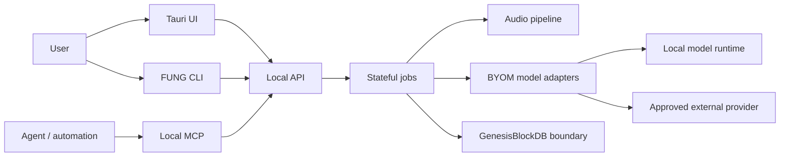

# AI and Agent Architecture

## Boundary

## Rules

1. UI, CLI, MCP, and agents call the approved local API/command boundary; they
   do not open GenesisBlockDB or model files through an ungoverned side path.
2. Long-running capture, transcription, diarization, summarization, and export
   work is represented as a durable or resumable job with explicit state.
3. Agents may propose actions and retrieve evidence through scoped tools. They
   cannot infer approval from transcript text, model output, or a tool name.
4. External network calls are default-deny, capability-scoped, minimised, and
   human-approved where the existing external-retrieval requirements require it.
5. Every model result carries model/runtime provenance and a degraded or
   unavailable state when the model cannot complete.
6. Human review remains the authority for speaker identity, sensitive content,
   external delivery, and claims that affect people or business decisions.

## Runtime responsibility matrix

| Concern | Owning boundary | Evidence |
|---|---|---|
| Capture permission and source channels | Tauri/runtime | device/UAT record |
| Job state and retry | Stateful job engine | job transition evidence |
| Model invocation | BYOM adapter | model card + run manifest |
| Persistence and lineage | GenesisBlockDB | record/export manifest |
| External tool approval | policy and approval boundary | audit chain |
| Human-visible confidence/degradation | UI artifact | visual/UAT evidence |

## Non-goals

This document does not choose a new agent framework, authorize a cloud model,
or replace the current FUNG contracts. Such changes require a requirement,
decision, implementation plan, and verification evidence.

## CHANGELOG

| Version | Date | Status | Summary | Commit Hash | Agent |
|---|---|---|---|---|---|
| 0.1.0b | 2026-08-23 | candidate | Added AI/agent runtime boundary and responsibility matrix. | pending | ATHER |
