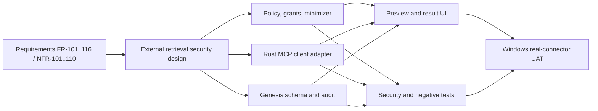

# Appendix D — FUNG Runtime Traceability

*Refreshed by RWANG doc-graph on 2026-08-26. `Implemented locally` means current-main code and focused local evidence exist; it does not mean real external/provider/runtime verification passed.*

## Historical Documentation Conflict — Resolved in This Reflight

Task 4 truth-synced FR-106--FR-114 and FR-116 to current default-off code-level evidence and corrected FR-101 so both recording entry points route to `LiveMeetingPanel`. The post-fix audit re-ran `npm run test:desktop-bootstrap` (5/5) and `npm run test:external-tools` (5/5), then confirmed that the requirements, source, and focused tests agree. The historical graph `contradicts` edge remains retained with `status: resolved`; this matrix still does not claim real-connector, visual/keyboard, summary/export review after restart, artifact-secret-scan, or real-device completion.

## Scoped Executable Annotation Evidence — H3 Contract GREEN

`npm run test:traceability` passes **1/1** for the expanded annotation contract.
The contract confirms canonical source/test intent only; it does not add runtime
or UAT proof. Its 68 `@req` occurrences are separate from retained manual,
code-inspection, and test-run graph mappings.

| Surface | `@req` occurrences | Graph effect |
|---|---:|---|
| Nine implementation files | 57 | `implements` edges with `source: annotation`, status `annotation-intent` |
| Two test files | 11 | `verifies` edges with `source: annotation`, status `annotation-intent` |
| **Expanded contract total** | **68** | **26/26 unique scoped FR/NFR IDs; source/test intent only** |

The expanded annotation edges cover **25/26** scoped IDs through implementation
comments and **11/26** through test comments; together they cover **26/26**
unique IDs. `FR-101` is currently anchored by the desktop-bootstrap test
annotation rather than an implementation-file annotation. The focused contract
node records the 1/1 assertion that the eleven target files carry canonical IDs
required by the contract. Annotation coverage remains source/test intent only
and does not replace retained manual, code-inspection, or test-run mappings.

## Phase 4 Google Drive and Native Session Broker

This supplemental matrix records the approved local implementation chain added
after the original Live Meeting traceability scope. Code remains the source of
runtime truth. Approval and local/static evidence do not promote external,
provider, staging, device, release, or production status.

| Decision scope | Authoritative documents | Implemented by | Verified by | Current status |
|---|---|---|---|---|
| D-GDA-01 through D-GDA-07 | `2026-08-23-google-drive-native-authorization-amendment.md` | `GoogleDrivePanel.tsx`, `googleDriveFlow.ts`, `drive_oauth.rs`, `native_auth.rs` | `googleDriveContract.test.mjs`, Rust Drive tests | Approved and implemented locally; provider/deployment gates open |
| D-GDA2-01 through D-GDA2-10 | `2026-08-23-google-drive-authority-schema-amendment.md` | W1 authority migrations and `google-drive-authorize` Edge function | `w1AuthoritySchema.test.mjs`, committed pgTAP evidence | Local/source evidence retained; staging RLS/grant/UAT open |
| D-GDA3-01 through D-GDA3-03 | `2026-08-24-enrollment-proof-nonce-amendment.md` | proof-nonce migration, native enrollment proof, device-enrollment Edge path | `authFlow.test.mjs`, `w1AuthoritySchema.test.mjs` | Approved and implemented locally; current host skips executable PostgreSQL check without Docker |
| D-GDA6-01 through D-GDA6-06 | `2026-08-25-native-session-broker-registered-entrypoint-evidence-amendment.md` | `auth_session.rs`, `drive_oauth.rs`, registered Tauri broker entrypoints | final Terra cycle-3 report; current Rust Drive 16/16 | PASS locally; fix budget exhausted; any source/test change needs a new amendment |
| AC-GDA6-11 external boundary | final D-GDA6 Terra cycle-3 report and Phase 4 plan | Not established by local code | Clean Windows keyring, Supabase/Edge/RLS, Google provider, clean-install, device, signing/release evidence | OPEN externally |

The Recording2 catalog task document deliberately points to local-only
`.tmp-transcript/` provenance as plain paths. Those artifacts are not graph
nodes and are not portable repository evidence.

## Functional Requirements

| Req ID | Title | Implemented By | Tested By | Status |
|---|---|---|---|---|
| FR-101 | One real Live Meeting entry | `App.tsx`, `LiveMeetingPanel.tsx` | `desktopBootstrap.test.mjs` verifies the microphone rail opens P1 `live-capture` | Implemented; component UAT remains |
| FR-102 | Source-aware live capture | `live_meeting.rs` | Rust module tests/headless smoke route | Implemented and annotated; two-channel/real-device UAT required |
| FR-103 | Bounded live transcript | `live_meeting.rs`, `LiveMeetingPanel.tsx` | No component/E2E test | Implemented and annotated; visual/device verification gap |
| FR-104 | Best-effort topic intelligence | `meeting_intel.rs`, `LiveMeetingPanel.tsx` | Parser helpers only | Implemented path; explicit unavailable/local-model verification remains |
| FR-105 | Cited local knowledge question | `meeting_intel.rs`, `LiveMeetingPanel.tsx` | Helper tests only | Implemented and annotated; cited-result integration/restart review gap |
| FR-106 | Suggest without execution | `meeting_tool_suggest` plus manual evidence/field operator flow creates a hash-only preview and starts no child process | Zero-process-before-approval integration plus frontend source/state tests | Implemented behind default-off flags |
| FR-107 | External call preview | Canonical preview hash binds exact minimized arguments/evidence/scope/expiry, is displayed, and is recomputed at execute | Hash, changed-preview, durable execution, and frontend workflow tests | Implemented; visual UAT pending |
| FR-108 | Per-call approval | Default-deny execute accepts one exact preview; UI exposes deny, approve, cancel, and meeting-scope revoke | Policy matrix, one-time fixture integration, and frontend workflow test | Implemented; keyboard UAT pending |
| FR-109 | Allowlisted read-only MCP connector | Bounded stdio adapter validates exact configured semantic tool after MCP initialize/list | Write-advertisement, mismatch, document, and CRM fixtures | Stdio backend implemented; HTTP absent |
| FR-110 | Controlled result panel | Sanitized result DTO, Genesis result table, hostile-result sanitizer, inert `<pre>` payload and text-only source provenance | HTML/file/JavaScript URL and byte/depth/item limits plus frontend source gate | Implemented; visual UAT pending |
| FR-111 | External tool audit chain | Execution and terminal events plus sanitized result/run persist through Genesis | Completion/failure audit integration and raw-content absence | Backend chain implemented |
| FR-112 | Scoped expiring revocable grant | Policy expiry/revoke checks plus Genesis disconnect revocation | Policy matrix and connector-scoped revoke integration test | Trust foundation implemented |
| FR-113 | OS keyring credential ownership | OS-keyring backend, zeroized resolved secret, non-secret service/account reference, transient password registration field | Keyring set/get/delete, Genesis lifecycle, and frontend command-surface tests | Implemented; whole-artifact scan pending |
| FR-114 | Connector failure isolation | MCP child owns no live-capture lock and process exit terminalizes only its run/preview | Connector-exit test preserves active recording status/duration | Structural/integration evidence; real-device UAT pending |
| FR-115 | Evidence-backed post-meeting package | `meeting_intel.rs`, `LiveMeetingPanel.tsx` | Headless smoke route exists; relaunch retained base rows | Summary/export review after restart remains partial |
| FR-116 | Connector settings and diagnostics | Typed non-secret connector summary plus local stdio list/register/revoke/disconnect operator surface | Connector/keyring/grant/disconnect integration and frontend source tests | Core lifecycle implemented; detailed health and real UAT pending |

## Non-Functional Requirements

| Req ID | Verification owner | Current status |
|---|---|---|
| NFR-101 | Offline/connector-kill integration + E2E | Every outbound path traced and registered in [E-egress-register](E-egress-register.md), pinned by `tests/egressRegister.test.mjs`; network-disabled and device UAT still remain — a source trace is not a run |
| NFR-102 | Payload minimizer and zero-byte-before-approval tests | Exact field minimizer and zero fixture-process-before-approval assertion pass |
| NFR-103 | Secret leak scan + keyring lifecycle tests | Keyring lifecycle and typed secret-field gates pass; whole-artifact scan remains S5 |
| NFR-104 | Worker isolation + UI response measurement | Separate blocking worker and recording-row isolation pass; UI/device timing remains |
| NFR-105 | Timeout/cap/cancellation contract tests | 15-second product cap, bounded I/O, timeout, cancellation, cleanup, result depth/item/byte caps pass |
| NFR-106 | Keyboard/Thai/1200×780 UAT | Thai copy, visible focus CSS, responsive breakpoints, reduced motion, and build pass; automated visual/keyboard UAT unavailable in this environment |
| NFR-107 | Audit-chain integration tests | Typed Genesis execution/completion/failure chain with hashes/provenance passes |
| NFR-108 | Hostile result sanitizer tests | Active HTML, unsafe URL, byte, depth, and item fixtures pass; UI renders sanitized payload and source refs as inert text; visual UAT pending |
| NFR-109 | Windows build plus no-connector regression | Windows/Tauri launch and relaunch smoke pass; packaging/no-connector regression remains |
| NFR-110 | CI suites plus real-connector UAT | Focused local suites and full Rust 195/195 pass; approved real-connector UAT remains pending |

## Business Rules and Acceptance Coverage

| IDs | Target evidence |
|---|---|
| BR-101–BR-104 | Policy matrix, grant state machine, approval UI, revoke/expiry tests |
| BR-105–BR-108 | Failure isolation, result provenance, secret scan, egress negative tests |
| AC-101–AC-103 | Entry, live fixture, and local Knowledge Base acceptance |
| AC-104–AC-110 | External preview/approval/minimization/deny/write-filter/isolation/security gates |
| AC-111–AC-112 | Base Genesis rows survive relaunch; summary/export review and keyboard/layout UAT remain |

## Coverage Summary

| Metric | Value | Planning gate |
|---|---|---|
| FRs with any implementation evidence | 16/16 | Includes partial Live Meeting intelligence and connector health/UAT boundaries |
| FRs with adequate end-to-end verification | 1/16 | FR-101 entry regression passes; external fixture integration plus UI source tests do not replace Windows UAT |
| NFRs with feature-specific unit/integration evidence | 5/10 | NFR-102/103/105/107/108 have partial gates; none removes the feature flag yet |
| External MCP/CRM FRs implemented through backend plus operator surface | 11/11 | Detailed health, restart, device, secret-scan, and real-connector UAT remain S5 gates |
| External MCP focused verification | 23/23 Rust plus 5/5 frontend | Feature cluster green; full Rust library regression is now 195/195 after the Windows `py.exe` fallback |
| Retained manual/inspection graph coverage | 22/26 code, 16/26 test requirement mappings | Existing `manual`, `code-inspection`, and `test-run` edges remain unchanged |
| Scoped executable annotation coverage | 57 implementation + 11 test `@req` occurrences | 25/26 implementation IDs and 11/26 test IDs; together 26/26 unique IDs across eleven exact files; source/test intent only |
| Annotation contract | `npm run test:traceability` 1/1 | Validates canonical IDs and required occurrences; no runtime/UAT closure |

## Change DAG

## Version Diff

`0.1.10b -> 0.1.11b`: corrected implementation-versus-test annotation counts;
FR-101 is test-anchored while the combined contract remains 26/26.

`0.1.9b -> 0.1.10b`: recorded 195/195 full Rust regression and bounded
desktop relaunch evidence; summary/export review after restart, visual,
device, and real-connector gates remain explicitly open.

`0.1.8b -> 0.1.9b`: recorded that the executable annotation contract now
explicitly requires all 68 observed occurrences, including `NFR-110` in
`tests/externalMeetingTools.test.mjs`; the source/test-intent and runtime/UAT
boundaries are unchanged.

`0.1.7b -> 0.1.8b`: expanded the scoped executable annotation inventory to
68 occurrences across eleven exact files, covering all 26 scoped FR/NFR IDs
through implementation and test comments. This remains source/test intent only;
runtime and UAT boundaries are unchanged.

`0.1.6b -> 0.1.7b`: added scoped H3 annotation coverage from the exact
eight-file GREEN contract, with annotation mappings explicitly separated from
manual/inspection edges and all runtime/UAT gates retained.

`0.1.5b -> 0.1.6b`: recorded the post-fix agreement of requirements, source,
and focused regressions; retained the former graph contradiction as resolved
historical evidence and left H3 plus all release/UAT gates open.

`0.1.4b -> 0.1.5b`: recorded the unresolved candidate-requirements versus current-working-tree implementation conflict and refreshed the evidence boundary; no requirement coverage was invented.

## CHANGELOG

| Version | Date | Status | Summary | Commit Hash | Agent |
|---|---|---|---|---|---|
| 0.2.0b | 2026-08-26 | candidate | Expanded traceability with the Phase 4 Google Drive/D-GDA6 local-versus-external evidence boundary and local-only Recording2 provenance | `888aded` | ATHER |
| 0.1.11b | 2026-08-12 | candidate | Corrected implementation-versus-test annotation counts and retained 26/26 union coverage. | pending | ATHER |
| 0.1.10b | 2026-08-12 | candidate | Recorded full Rust closure and bounded relaunch evidence while retaining UAT blockers. | pending | ATHER |
| 0.1.9b | 2026-08-12 | candidate | Recorded exact 68-required/68-observed annotation-contract parity. | pending | ATHER |
| 0.1.8b | 2026-08-12 | candidate | Expanded scoped annotation inventory to all 26 FR/NFR IDs; retained source/test-intent and runtime/UAT boundaries. | pending | ATHER |
| 0.1.7b | 2026-08-12 | candidate | Added scoped annotation coverage and retained all runtime/UAT boundaries. | pending | ATHER |
| 0.1.6b | 2026-08-12 | candidate | Post-fix reflight records resolved historical contradiction; H3 and UAT gates remain open. | pending | ATHER |
| 0.1.5b | 2026-08-12 | candidate | Recorded open requirements-to-code contradiction; refreshed audit boundary. | pending | ATHER |
| 0.1.4b | 2026-08-11 | candidate | Truth-synced Sprint 4 operator workflow and UAT boundary. | pending | ATHER |
| 0.1.3b | 2026-08-11 | candidate | Truth-synced Sprint 3 bounded backend and focused verification evidence. | pending | ATHER |
| 0.1.2b | 2026-08-11 | candidate | Truth-synced Sprint 2 trust-foundation and active test evidence. | pending | ATHER |
| 0.1.1b | 2026-08-11 | candidate | Truth-synced Sprint 1 contract, schema, entry, and RED-gate evidence. | pending | ATHER |
| 0.1.0b | 2026-08-11 | candidate | Added Live Meeting external retrieval traceability baseline. | pending | ATHER |
