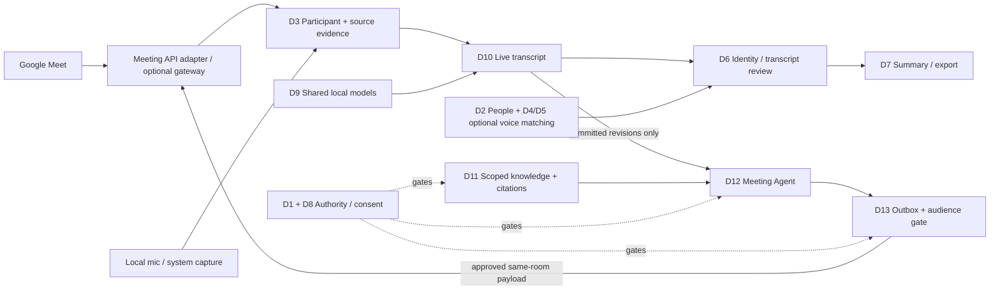

# FUNG — Meeting Intelligence Domain Map

## 1. Status, assumptions and scope

เอกสารออกแบบ C-3 / HIGH; full D1–D13 capability ยัง **ไม่ใช่ implementation หรือ production acceptance**. bounded R3 native SI/D8 AccountCommitFence foundation เป็นข้อยกเว้นเฉพาะที่ implement และผ่าน independent bounded N4/G1 local review แล้ว แต่ไม่เปิดใช้งาน M1–M5 หรือ provider/production path. ผู้ใช้เลือก Google Meet เป็นแพลตฟอร์มแรกและยอมรับการใช้ API วันที่ 2026-09-21 การเลือกนี้ไม่ใช่การอนุมัติค่าใช้จ่าย สมัคร vendor ส่งเสียงจริง หรือเปิดบริการสาธารณะ

[ASSUMPTIONS]

1. Desktop เป็นเจ้าของ recording, transcript, knowledge และ policy; Mobile/Web ยังไม่รับ scope ใหม่โดยอัตโนมัติ
2. ผู้เข้าประชุมไม่ต้องสมัคร FUNG เพื่อมีชื่อใน transcript; account, participant และบุคคลจริงเป็นคนละแนวคิด
3. MVP ตอบเป็นข้อความพร้อมหลักฐานและลิงก์เอกสารใน Meet chat; native attachment และเสียงตอบมี capability/gate แยก
4. Local-only mode ยังใช้งานได้; managed meeting bot เป็นโหมด online ที่ต้องเปิดเองและแจ้งข้อมูลออกนอกเครื่อง

Parent: [Desktop architecture](../Desktop/ARCHITECTURE.md).
Current truth: [Desktop progress](../Desktop/08-real-progress.md).
รายละเอียด D1–D9: [People and Voice Identity](../specs/2026-09-21-speaker-identity-domain-design.md).

## 2. Domain ownership

คง D1–D9 จากแบบ speaker identity; เพิ่ม D10–D13 เป็นขอบเขตโค้ด/สัญญาใน **modular monolith** ไม่ใช่ 13 microservices และไม่สร้างฐานข้อมูลคู่ขนาน

| ID / domain | Owns | Consumes / publishes | Must not own |
| --- | --- | --- | --- |
| D1 Account & Local Access | local principal, vault unlock, account binding, device authority | authenticated actor context | เดาว่าเจ้าของบัญชีคือคนที่กำลังพูด |
| D2 People Directory | person profile, aliases, manual provider-person binding | person display projection | voice vectors, credentials, auto-merge ด้วยชื่อ |
| D3 Meeting Participation & Evidence | recording roster, provider sessions, tracks, anonymous turns, source clock/gaps | source audio + attributed evidence | ยืนยันคนจริงจาก display name หรือ video tile |
| D4 Voice Enrollment | enrollment, sample quality, versioned voice profiles | eligible encrypted reference | เก็บเสียงทุกคนเป็น voiceprint อัตโนมัติ |
| D5 Speaker Recognition | scoped embedding comparison, unknown, candidates | proposals to D6 | authentication, access grants |
| D6 Identity Review | human confirmation, rejection, stale mapping, revisions | confirmed-person overlay | เขียนทับ raw ASR หรือ provider evidence |
| D7 Meeting Intelligence & Output | summaries, action candidates, graph/export snapshots | evidence-bound artifact | join/send หรือค้นคลังนอก scope เอง |
| D8 Consent & Data Lifecycle | purpose grants, ACL, audience/share policy, encryption, retention/revoke | deterministic allow/deny decisions | ใช้ LLM เป็น policy authority |
| D9 Model Runtime & Jobs | shared model cache, worker scheduling, cancellation, provenance | typed run results | โหลดโมเดลหนึ่งสำเนาต่อ speaker |
| D10 Live Transcription | utterance revisions, provisional/committed states, cursor/recovery, live SLO | committed transcript events | ให้ partial text กลายเป็น published answer |
| D11 Knowledge & Evidence | selected collections, source versions, retrieval, citations, metric resolution | permission-filtered evidence bundles | อนุญาตแชร์เพียงเพราะอ่านได้ |
| D12 Meeting Agent & Participation | session/join lifecycle, explicit/contextual triggers, plans, grounded drafts | publication intent to D13 | ข้าม policy, ถือ API success เป็นเข้าห้องสำเร็จ |
| D13 Conversation Delivery | bound room/channel, exact payload, approval, durable outbox, receipts | delivery result/correction | เปลี่ยนห้อง/DM/email เองเมื่อส่งไม่ได้ |

D13 เป็นเจ้าของผลส่งออกนอกแอป; D7 ยังเป็นเจ้าของไฟล์ export ในเครื่อง ไม่รวมสองอย่างให้มีสิทธิ์เหมือนกัน

## 3. Context and trust boundaries

Meeting text, participant names, documents และ connector results เป็น **untrusted data** ไม่ใช่คำสั่งเปลี่ยนสิทธิ์/endpoint/เครื่องมือ Agent สังเคราะห์แผนได้ แต่การค้น การอ่าน การแนบ และการส่งถูกตรวจแยกโดย code policy

## 4. Identity and conversation keys

| Object | Stable key / invariant |
| --- | --- |
| Account | FUNG authenticated/local principal; ไม่ใช่ source speaker |
| Person | vault-scoped reusable person ID; optional |
| Conference occurrence | provider + provider account/tenant + immutable conference occurrence; meeting URL/code อย่างเดียวไม่พอสำหรับ recurring meetings |
| Participant session | conference occurrence + provider participant ID + join generation/session ID |
| Track | source session + track generation; stream slot/CSRC ไม่เป็น global person ID |
| Speaker evidence | recording + track/turn + evidence revision |
| Utterance | recording + source session + utterance ID; monotonically increasing revision |
| Agent run | session + trigger ID + transcript revision set + policy version |
| Destination | provider account + occurrence + channel type/ID + thread when available + audience policy revision |
| Delivery | destination binding + trigger + artifact revision + application idempotency key |

Provider label แสดงอัตโนมัติได้ในฐานะ “ชื่อจาก Meet” ไม่ต้องสร้าง voiceprint แต่ห้ามแสดง “ยืนยันบุคคลแล้ว” ถ้ายังไม่ผ่าน D6; shared room endpoint อาจมีหลายคนจริงต่อ participant เดียว

## 5. Persistence and deployment

- Domain data ทั้งหมดบน Desktop ผ่าน GenesisBlockDB adapter/WAL/blob custody เดียว; proposal schemas ต้อง register/migrate ไม่ direct SQLite
- Existing `voice_profiles` เป็น TTS; recognition ใช้ `voice_identity_profiles` ตามแบบเดิม
- Proposed domain aggregates: `meeting_sessions`, `meeting_participant_sessions`, `transcript_revisions`, `transcript_event_log`, `knowledge_collections`, `knowledge_documents`, `knowledge_document_versions`, `knowledge_chunks`, `knowledge_metric_observations`, `knowledge_index_runs`, `knowledge_evidence_bundles`, `meeting_agent_runs`, `meeting_agent_grants`, `meeting_delivery_outbox`, `meeting_delivery_receipts`
- New adapter/gateway is optional. Official Meet media can use direct client transport; managed bot requires publicly reachable verified ingress and Desktop outbound WSS. Do not pretend LAN-only FUNGWIRE or localhost is reachable by provider.
- Gateway may retain encrypted short-lived transport buffers and a minimal durable bot-control/lease journal for stop/recovery, **not** a second transcript/people/knowledge authority. This is a proposed external deployment boundary, not current FUNG infrastructure.
- Local model weights remain one shared cache per model/revision; project/session records hold references. Provider-specific SDK/package binaries are versioned runtime dependencies, not copied model directories.

## 6. Functional ownership and authoritative specs

| Capability | Source of requirements | Requirement IDs |
| --- | --- | --- |
| Account/person/enrollment/review | [Speaker spec](../specs/2026-08-23-speaker-identification-and-voice-profile-spec.md), [domain design](../specs/2026-09-21-speaker-identity-domain-design.md) | SI-API-01–08 plus existing speaker acceptance |
| Live transcript and recovery | [Live transcription](../specs/2026-09-21-live-meeting-transcription-spec.md) | LT-01–16 |
| Knowledge, citations, numeric questions | [Knowledge evidence](../specs/2026-09-21-meeting-knowledge-evidence-spec.md) | KE-01–14 |
| Participation, triggers and delivery | [Meeting Agent](../specs/2026-09-21-meeting-agent-participation-spec.md) | MA-01–18 |
| Google Meet route/capability decisions | [API strategy](../decisions/2026-09-21-google-meet-agent-api-strategy.md) | GM-01–08 |
| Existing manual external MCP | [Legacy requirements](../Desktop/LIVE_MEETING_EXTERNAL_RETRIEVAL_REQUIREMENTS.md) | FR-101–116 unchanged |

หากขัดกัน: consent/security constraints ชนะ convenience; feature specs กำหนด target contract; progress doc/source กำหนด implementation truth ไม่ใช้ roadmap เป็นหลักฐานว่า API ทำงานแล้ว

## 7. Delivery dependencies and exit gates

1. **M0 Contracts / privacy / provider spike:** approve specs, select provider/deployment/retention, prove actual Meet join + participant attribution + same-room chat; no production media.
2. **M1 Live transcript:** local capture revision/cursor/recovery + shared model scheduling; LT suite and hardware SLO.
3. **M2 People + knowledge:** manual provider/person review; selected document import/index/citations/ACL/metric fixtures. Voice enrollment is optional and not on the critical path for API-attributed speech.
4. **M3 Observe/draft:** Meet adapter + authenticated ingress + local transcription + local grounded answer; external publish OFF.
5. **M4 Approved meeting output:** explicit ask + exact-payload approval + chat link/receipt; real-room participant/guest/permission UAT.
6. **M5 Bounded proactive output:** approved session policy + final-span trigger + audience gate + rate/budget limits + kill switch; adversarial/no-duplicate qualification.
7. **M6 Optional:** native file attachment only where proven; TTS output separately approved and tested; broader platforms/cross-device are not implicit MVP.

M1/M2 work can proceed after contract approval independently of managed provider availability. M4/M5 cannot be marked complete by local copilot screenshots or Google Chat output instead of Meet chat.

## 8. Cross-domain invariants and acceptance

- Unknown speaker does not stop transcription or local questions; failed agent does not stop local capture.
- Model, provider and manual attribution remain distinguishable through review/export and reruns.
- Every published fact has immutable evidence refs; stale/withdrawn docs and corrected transcript invalidate unsent drafts.
- Every external action rechecks actor, grant, destination, audience, payload hash and source sharing rights.
- Capture permission, voice recognition, external media access, cloud inference, knowledge read and room publication are independent purposes.
- Disconnection/expiry/logout/stop blocks new agent actions. Existing local recording follows its own explicitly selected lifecycle.
- Docs-only verification does not satisfy schema, security, real-provider, device, release or model qualification.

## 9. Documentation verification — 2026-09-21

Scope: 5 new documents and 18 related document updates in this turn, based on working-tree source at `b336f33`; pre-existing runtime changes are not part of this documentation delivery. The later bounded R3 foundation is tracked separately by commit `85c96ed` and the independent N4/G1 report.

- Required frontmatter fields, version/change history and balanced Markdown fences checked across all 23 task documents.
- 146 local document links / 41 unique targets and 6 local heading anchors checked; no missing targets.
- Markdown table shape checked; repaired the existing extra column in Meeting Mode's version-history row.
- `git diff --check -- docs` passed; new-document whitespace checked separately.
- `node --test tests/egressRegister.test.mjs`: 8/8 passed on the current working tree. This is source-contract evidence, not a packet capture or proof of the proposed gateway.
- New feature runtime, schema migrations, model-quality/latency, provider account, real Google Meet, packaged app and deployment tests: **NOT_RUN**.

## Version Diff

| Version | Change |
| --- | --- |
| 0.1.0b -> 0.1.1b | Synced the domain boundary with the later bounded R3 native SI/D8 foundation while keeping the full D1–D13 capability and production gates open. |
| 0.0.0 → 0.1.0b | Unified D1–D13 ownership, API participant identity, live/knowledge/agent/delivery contracts and staged gates. |

## CHANGELOG

| Version | Date | Status | Summary | Commit Hash | Agent |
| --- | --- | --- | --- | --- | --- |
| 0.1.1b | 2026-09-23 | candidate | Clarified the bounded R3 foundation exception versus the documentation-only full meeting-intelligence domain surface. | working-tree | RWANG |
| 0.1.0b | 2026-09-21 | candidate | Proposed integrated meeting domain architecture; documentation only. | working-tree; base b336f33 | RWANG |
