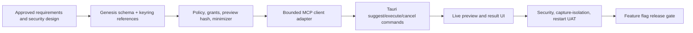

# Implementation Plan — FUNG Live Meeting External Retrieval

| Field | Value |
|---|---|
| Version | 0.1.7b |
| Generated | 2026-08-11 |
| Generated by | RWANG implementation-plan |
| Complexity | C-3 / HIGH |
| Source requirements | `docs/Desktop/LIVE_MEETING_EXTERNAL_RETRIEVAL_REQUIREMENTS.md` |
| Source design | `docs/superpowers/specs/2026-08-11-live-meeting-external-retrieval-design.md` |
| Parent architecture | `docs/Desktop/ARCHITECTURE.md` |
| UX/design | `docs/Desktop/07-meeting-mode.md`, `DESIGN.md` |
| Preflight | WARNING — `docs/DOC_PREFLIGHT_2026-08-11.md` v0.3.5b records 0 current CRITICAL findings; the executable annotation contract is GREEN for all 26 FR/NFR IDs across implementation/test intent, while runtime/UAT release gates remain open, so completion and flag promotion remain blocked |
| Dependency graph | `docs/.doc-graph.json` |
| Risk buffer | 25% included |

## 1. Scope Summary

### 1.1 By the Numbers

| Metric | Count |
|---|---|
| Functional requirements | 16 |
| Non-functional requirements | 10 |
| Business rules | 8 |
| Acceptance criteria | 12 |
| Planned Tauri commands | 8 |
| New Genesis entities | 4 plus 1 existing-table extension |
| External integration boundary | Generic read-only MCP; document and CRM UAT fixtures |
| Base complexity points | 134 |
| Buffered delivery points | 168 |
| Planned duration | 5 two-week sprints / approximately 10 weeks |

### 1.2 Existing Baseline to Preserve

- Tauri/React Desktop shell and GenesisBlockDB boundary.
- Microphone plus optional system-audio capture.
- Long-lived local transcription worker and live transcript events.
- Best-effort topic/open-point/action extraction.
- Manual local transcript/knowledge-graph questions with sources.
- Post-meeting overview, timeline/key points, decisions/actions, provenance, and Markdown export.
- OS keyring dependency and existing non-secret external-connection metadata pattern.

Existing code is a starting point, not acceptance evidence. No existing route is marked complete without the requirement-specific tests in this plan.

### 1.3 Out of Scope

- External writes, CRM updates, email/calendar actions, webhooks, full transcript/audio egress.
- Vendor-specific production connectors.
- Automatic execution from transcript keywords.
- Screen capture, auto-record, sales coaching, personality scoring, biometric identity.
- Electron/Node/Call.md source port, direct SQLite, or a second persistence/runtime stack.

## 2. Complexity Model

| Workstream | Scope | Technical risk | Dependency | AI/ML | Base points |
|---|---:|---:|---:|---:|---:|
| Baseline entry/degradation truth | 5 | 2 | 1 | 0 | 8 |
| Genesis schema, grant, audit, provenance | 8 | 5 | 1 | 0 | 14 |
| Keyring and secret lifecycle | 5 | 5 | 3 | 0 | 13 |
| Policy, preview hash, minimization | 8 | 5 | 1 | 0 | 14 |
| MCP transport/client and cancellation | 8 | 5 | 3 | 0 | 16 |
| Result sanitizer/untrusted rendering | 5 | 5 | 1 | 0 | 11 |
| Suggestion and evidence selection | 5 | 2 | 1 | 2 | 10 |
| Connector Settings UI | 5 | 2 | 1 | 0 | 8 |
| Live preview/result UI | 8 | 5 | 1 | 0 | 14 |
| Security/negative/secret tests | 8 | 5 | 3 | 0 | 16 |
| Capture-isolation and restart UAT | 8 | 5 | 1 | 0 | 14 |

**Base:** 134 points. **25% risk buffer:** 34 points. **Delivery budget:** 168 points.

## 3. Dependency Analysis

### 3.1 Critical Path

### 3.2 Parallel Work

- Result sanitizer fixtures can run beside schema/policy work after output limits are fixed.
- UI can build static typed states after Tauri DTOs are frozen; execution wiring waits for policy and adapter.
- Local fixture MCP server and hostile-output fixtures can run beside the production client adapter.
- Documentation/contract updates and traceability checks run every sprint, not at the end.

### 3.3 Dependency Rules

- No MCP call code before default-deny and preview-hash policy tests are RED then GREEN.
- No credential registration UI before keyring-only lifecycle and leak tests pass.
- No Live Meeting execution button before denial, expiry, revoke, and write-tool rejection pass.
- No feature-flag enablement before connector failure is proven not to interrupt capture.

## 4. Phase Overview

| Phase | Sprint | Focus | Testable deliverable |
|---|---|---|---|
| P0 — Truth and contracts | S1 | Entry path, typed contracts, Genesis migration, RED security matrix | One real recording entry and registered schema with no external call capability |
| P1 — Trust foundation | S2 | Grants, preview hash, minimizer, keyring, audit, sanitizer | A preview can be created/denied/revoked with zero network bytes |
| P2 — Bounded read execution | S3 | Read-only MCP adapter, timeouts, cancellation, fixtures, Tauri commands | Approved fixture lookup returns a sanitized, audited result |
| P3 — Operator UI | S4 | Connector Settings, Live suggestion/preview/result, accessibility, failure states | Keyboard-only end-to-end read through UI behind flag |
| P4 — Hardening and beta gate | S5 | Hostile server, secret scan, capture isolation, restart, real connector UAT | Release evidence pack and explicit flag decision |

## 5. Sprint Detail

### Sprint 1 — Truth, Contracts, and RED Gates (2026-08-11 to 2026-08-24)

**Goal:** Remove the mock entry ambiguity and establish persistence/API/security contracts before any network execution exists.

**Capacity:** 29 buffered points.

| Task | Requirement IDs | Role | Points | Dependencies |
|---|---|---|---:|---|
| S1.1 Route the fixed microphone control to the real Live Meeting panel; add regression | FR-101, AC-101 | Frontend | 3 | Existing bootstrap fix |
| S1.2 Define typed connector/preview/run/result/error DTOs and version the local MCP contract proposal | FR-106–FR-116 | Tech Lead/Rust | 5 | Approved docs |
| S1.3 Register Genesis schema extension and migration tests for grants/previews/runs/results | FR-111–FR-113, NFR-107 | Rust/Data | 8 | Genesis adapter |
| S1.4 Add RED policy matrix tests for deny, expiry, revoke, write filter, changed preview | FR-106–FR-112, BR-101–BR-104 | Security/Rust | 5 | Typed DTOs |
| S1.5 Add RED keyring lifecycle and secret-leak fixtures | FR-113, NFR-103, BR-107 | Security/Rust | 5 | Connector metadata contract |
| S1.6 Truth-sync annotations/traceability for touched files | NFR-110 | QA/Docs | 3 | All S1 tasks |

**Sprint total:** 29 points.

**Definition of Done**

- AC-101 passes.
- Schema registration/upgrade/idempotency tests pass through GenesisBlockDB.
- All policy and leak cases exist as failing tests before implementation work in S2.
- No external network/tool call can occur in the product.
- Docs, graph, traceability, build, Rust tests, and `git diff --check` are clean for the scoped branch.

**Execution evidence (2026-08-11):**

| Task | Current evidence | Status |
|---|---|---|
| S1.1 | Microphone rail selects P1 `live-capture`; desktop bootstrap regression passes | Implemented |
| S1.2 | Typed connector/suggestion/preview/run/result/error DTOs; only three read-only capabilities deserialize | Implemented |
| S1.3 | Genesis schema v9 round-trips grant → preview → run → sanitized result and reinstalls idempotently | Implemented |
| S1.4 | Five named policy RED cases fail under explicit `--ignored`; normal suite keeps them ignored until S2 | RED gate recorded |
| S1.5 | Six keyring/leak lifecycle stages fail under explicit `--ignored`; no keyring backend exists in S1 | RED gate recorded |
| S1.6 | Real-progress, graph, and traceability updated; frontend build, 5 desktop, 5 auth, 4 mobile, 2 design, and 176 Rust active tests pass | Completed |

**Sprint 1 verification result:** DoD met for the approved scope. `git diff --check` and JSON graph validation pass; the external module still exposes no command/transport. The repository-wide formatter check remains a pre-existing out-of-scope debt across unrelated Rust files and was not mass-applied.

### Sprint 2 — Policy, Keyring, Minimization, and Sanitization (2026-08-25 to 2026-09-07)

**Goal:** Make suggestion/preview/deny/approve state safe and auditable while external execution remains disabled.

**Capacity:** 34 buffered points.

| Task | Requirement IDs | Role | Points | Dependencies |
|---|---|---|---:|---|
| S2.1 Implement default-deny grant/policy state machine | FR-106, FR-108, FR-112, BR-101–BR-105 | Rust/Security | 8 | S1 RED matrix/schema |
| S2.2 Implement exact preview hash and payload minimizer | FR-107, FR-108, NFR-102 | Rust/Security | 8 | S2.1 |
| S2.3 Implement keyring reference lifecycle and disconnect/revoke | FR-113, FR-116, NFR-103 | Rust | 5 | S1 schema/leak fixtures |
| S2.4 Implement structured audit/provenance repository | FR-111, NFR-107 | Rust/Data | 5 | S1 schema |
| S2.5 Implement size/depth/link/HTML sanitizer with hostile fixtures | FR-110, NFR-105, NFR-108 | Rust/Security | 8 | Typed result DTO |

**Sprint total:** 34 points.

**Definition of Done**

- AC-104, AC-106, AC-107, AC-109, and AC-110 pass at unit/integration level.
- Policy preview and denial paths emit zero network bytes because no transport or execution command exists.
- Revoked/expired/changed previews cannot execute.
- Write capabilities remain invisible and denied.
- No credential/raw transcript appears in Genesis rows, logs, events, snapshots, or errors.

**Execution evidence (2026-08-11):**

| Task | Current evidence | Status |
|---|---|---|
| S2.1 | Active policy matrix defaults to deny and covers missing approval, expired/revoked grants, changed preview hashes, write capability rejection, and one exact approved read-only path | Implemented and tested |
| S2.2 | Canonical SHA-256 preview hash binds connector/tool/capability/arguments/evidence/approved fields/project/recording/expiry; minimizer rejects unapproved and sensitive fields | Implemented and tested |
| S2.3 | OS-keyring abstraction zeroizes resolved secrets; Genesis stores only service/account reference; disconnect revokes only target connector grants and clears the reference | Implemented and integration-tested |
| S2.4 | Typed audit repository persists bounded provenance, hashes, field names, timing, byte count, and stable errors through Genesis `audit_events`; raw arguments/output/transcript are not accepted | Implemented and integration-tested |
| S2.5 | Sanitizer neutralizes active HTML and `file:`, `javascript:`, and `data:` URLs; enforces 256 KiB, depth 16, and 1,000-item limits | Implemented and tested |

**Sprint 2 verification result:** Trust-foundation tests pass 14/14 and the full Rust library suite passes 186/186. Desktop bootstrap 5/5, auth 5/5, mobile 4/4, design-system 2/2, frontend build, focused formatting, and diff hygiene pass. The source gate confirms there is still no MCP transport or Tauri command, so no external network execution exists in this sprint.

### Sprint 3 — Bounded MCP Read Execution (2026-09-08 to 2026-09-21)

**Goal:** Execute one approved read-only fixture call through Rust without touching capture/UI threads.

**Planned work — 34 points**

- Allowlisted stdio MCP initialize/list/call adapter; Streamable HTTP remains flag-gated until review (FR-109).
- Timeout, byte/depth/item caps, cancellation, process cleanup, and normalized errors (NFR-104, NFR-105).
- `meeting_tool_suggest/execute/cancel/revoke/runs_list` Tauri commands (FR-106–FR-114).
- Document-search and mock CRM-status fixture servers (AC-104, AC-105).
- Connector-kill isolation test proving capture/transcript/stop remain operational (FR-114, AC-108).

**Gate:** Approved fixture result is sanitized, persisted, audited, cancellable, and cannot execute twice from the same one-time preview.

**Execution evidence (2026-08-11):**

| Task | Current evidence | Status |
|---|---|---|
| S3.1 | Rust stdio adapter performs MCP `2025-11-25` initialize/initialized/list/call and permits only the exact configured semantic read tool; write advertisement is ignored | Implemented and tested |
| S3.2 | 15-second product cap, bounded newline/stdout/stderr, cancellation, timeout, child kill/wait, stable errors, and join-safe runtime cleanup | Implemented and tested |
| S3.3 | Suggest persists a hash-only one-time preview; execute rechecks policy/hash, persists running/terminal run plus sanitized result and structured audit; duplicate preview cannot spawn twice | Implemented and tested |
| S3.4 | Five approved Tauri commands registered; suggest/execute are guarded by default-off `FUNG_EXTERNAL_MEETING_TOOLS=1`; Streamable HTTP remains absent | Implemented and tested |
| S3.5 | Document-search and CRM-status fixtures pass; zero processes start before approval; connector exit and sanitizer rejection fail the run without mutating the active recording row | Implemented integration evidence; real-device capture UAT remains S5 |

**Sprint 3 verification result:** The focused external MCP cluster passes 22/22 and Genesis v9 migration remains covered. The current repository-wide Rust run passes 188/194; six FUNGWIRE local-transcription tests fail because `D:\FUNG\.venv-whisper\Scripts\python.exe` is absent in this environment. This does not close the full regression gate, and it is recorded rather than waived. Sprint 4 UI, Streamable HTTP, full secret scan, 30-minute live capture, restart, and a real connector remain unimplemented.

### Sprint 4 — Live Meeting and Settings UI (2026-09-22 to 2026-10-05)

**Goal:** Deliver the controlled operator workflow behind `externalMeetingTools`.

**Planned work — 36 points**

- Connector catalogue/health/register/revoke/disconnect Settings surface (FR-116).
- Live suggestion, evidence selection, exact preview, approve/deny, running/cancel, result, failure, source inspection (FR-106–FR-110).
- Clear degraded/unavailable states for topic/local model/connector without implying capture failure (FR-104, FR-114).
- Keyboard/focus/Thai/reduced-motion/1200×780 component and browser tests (NFR-106, AC-112).
- Restart/reopen provenance and post-meeting evidence review (FR-115, AC-111).

**Gate:** Keyboard-only UI completes document and mock CRM reads with source/policy/time visible; denial and failure remain first-class states.

**Sprint 4 implementation result:** The independently default-off React surface is embedded in Live Meeting with local stdio connector list/register/disconnect, exact field and transcript-evidence selection, preview/deny/per-call approve, running/cancel, meeting-scope revoke, sanitized result, inert source references, policy/evidence/time provenance, and local run history. The Rust command boundary now registers all eight planned commands and returns the sanitized durable result plus grant provenance. Focused external MCP tests pass 23/23; frontend external-tool tests pass 5/5; desktop bootstrap 5/5, auth 5/5, mobile 4/4, design-system 2/2, and production build pass. The full Rust library regression is now **195/195** after the Windows `py.exe` launcher fallback. A close/relaunch smoke reopened `fung.exe` with title `FUNG` and preserved base Genesis rows; the dataset had no summary rows, so AC-111 is only partially evidenced. Automated Windows/browser screenshot capture and keyboard automation remain unavailable, while physical-device and approved real-connector prerequisites are absent; those gates remain open rather than waived.

### Sprint 5 — Security Hardening and Real UAT (2026-10-06 to 2026-10-19)

**Goal:** Produce release evidence, not merely passing implementation tests.

**Planned work — 35 points**

- Hostile MCP suite: write advertisement, injection text, malformed schema, redirect, timeout, oversized output, active HTML/file URL (NFR-102–NFR-108).
- 30-minute two-channel capture with connector start/kill/restart and local-model degradation (NFR-101, AC-102, AC-108).
- Zero-byte-before-approval measurement and secret scan over DB/log/export/UI state (AC-104, AC-109).
- One approved real read-only MCP server UAT for document or CRM-like status lookup (AC-105).
- Packaging/Windows no-connector regression, threat review, docs/contracts/graph update, feature-flag decision (NFR-109, NFR-110).

**Gate:** All AC-101–AC-112 have evidence; final reviewer confirms no write path, no secret leak, no unapproved egress, and no capture regression.

## 6. Team Structure

The point model yields a base of two implementation developers over five sprints. HIGH security/privacy risk adds specialist review capacity.

| Role | FTE | Responsibility |
|---|---:|---|
| Tech Lead / Rust architect | 1.0 | Control plane, contracts, reviews, dependency gates |
| Rust integration/security developer | 1.0 | Policy, MCP adapter, keyring, sanitizer, schema |
| React/TypeScript developer | 1.0 | Settings and Live Meeting operator surfaces |
| QA/automation | 0.5 | Contract, hostile, E2E, traceability, release evidence |
| Security/privacy reviewer | 0.5 | Threat model, minimization, secret and egress gates |
| UX/accessibility reviewer | 0.25 | Approval clarity, keyboard/focus, Thai, layout |
| AI/model evaluator | 0.25 | Suggestion/topic false-positive and degradation checks |

**Total:** 4.5 FTE-equivalent. In the repository’s agent workflow, roles may be isolated agents, but Boss remains the approval owner for transport/UAT server and final feature-flag enablement.

## 7. Milestones

| ID | Milestone | Sprint | Estimated date | Gate criteria |
|---|---|---|---|---|
| M1 | Trust contracts registered | S1 | 2026-08-24 | Real entry, schema migration, RED security tests |
| M2 | Zero-egress preview | S2 | 2026-09-07 | Deny/revoke/write-filter/minimizer/keyring/sanitizer gates |
| M3 | First approved fixture read | S3 | 2026-09-21 | Audited sanitized document/CRM fixture result; capture isolation |
| M4 | Operator workflow complete | S4 | 2026-10-05 | Keyboard-only Settings + Live Meeting flow behind flag |
| M5 | Beta decision | S5 | 2026-10-19 | AC-101–AC-112 evidence and independent security/final review |

Dates are estimates, not release commitments. A failed security/capture gate extends the schedule; it is not waived to preserve a date.

## 8. Risk Register

| ID | Risk | Prob | Impact | Score | Mitigation | Owner |
|---|---|---|---|---:|---|---|
| R1 | Transcript/prompt injection influences a tool | 4 | 5 | 20 | Suggest-only, semantic allowlist, exact preview, policy not LLM-owned | Security |
| R2 | Secret enters logs/DB/UI/export | 3 | 5 | 15 | Keyring-only, redaction types, leak scan, no raw debug serialization | Security/Rust |
| R3 | MCP work interrupts capture | 3 | 5 | 15 | Separate bounded worker, no capture lock, kill-during-capture E2E | Rust/QA |
| R4 | Malicious/untrusted result executes content | 3 | 5 | 15 | Sanitizer, active-content denial, capped structured result | Security/Frontend |
| R5 | Third-party MCP protocol/server changes | 3 | 4 | 12 | Versioned adapter, fixtures, capability negotiation, one transport first | Rust |
| R6 | Provider tool claims read-only but has side effects | 3 | 5 | 15 | Semantic capability allowlist and approved UAT server; no arbitrary tools | Security |
| R7 | Data minimization misses hidden argument | 3 | 5 | 15 | Typed argument schema, field preview, normalized request hash | Security/Rust |
| R8 | Genesis migration/data-model drift | 2 | 4 | 8 | Registered schema, upgrade/idempotency/rollback tests | Data/Rust |
| R9 | AI suggestion quality/Thai false positives | 3 | 3 | 9 | Manual path first, suggestions flag OFF, evaluation set, easy dismiss | AI/UX |
| R10 | UI approval fatigue leads to unsafe habits | 3 | 4 | 12 | Clear minimal preview, no dark patterns, first release per-call | UX/Security |
| R11 | Scope expands to writes/vendor integrations | 4 | 4 | 16 | BR-103/BR-108, phase gates, backlog separate from first release | Tech Lead/Boss |
| R12 | Performance/output scale harms UX | 2 | 4 | 8 | 15-second/256 KiB bounds, cancellation, pagination/summary | Rust/Frontend |
| R13 | Regulatory/participant consent gap | 2 | 5 | 10 | Visible recording consent and external-call state; policy/legal review | Boss/Privacy |
| R14 | GPU/local model unavailable | 3 | 2 | 6 | Manual external preview may work without AI; capture/local evidence remain | AI/Rust |
| R15 | Team/agent context drift | 3 | 3 | 9 | One task/branch, doc graph, targeted staging, independent final review | Tech Lead |

## 9. Deployment and Rollout Strategy

| Environment | Purpose | Trigger |
|---|---|---|
| Local fixture | RED/GREEN development with deterministic MCP servers | Developer/agent task |
| CI | Unit, contract, migration, hostile, build, diff, leak checks | Every PR |
| Windows UAT | Real capture plus one approved MCP server | Manual gated candidate |
| Beta | Operator opt-in with flags OFF by default | Boss approval after M5 |

### Feature Flags

| Flag | Default | Removal/enable gate |
|---|---|---|
| `externalMeetingTools` | OFF | AC-101–AC-112 and final security review |
| `externalMcpHttp` | OFF | HTTPS/allowlist/redirect review and tests |
| `meetingToolSuggestions` | OFF | Thai evaluation and dismissibility UAT |

Rollback disables flags and connector execution while preserving local capture, transcript, audit history, and previously sanitized results. Schema migration requires forward/backward compatibility evidence before release packaging.

## 10. Requirement-to-Sprint Mapping

| Req ID | Sprint | Status entering plan |
|---|---|---|
| FR-101 | S1 | Partial |
| FR-102 | S5 verification | Source path and annotation evidence are current; two-channel/real-device UAT remains |
| FR-103 | S4–S5 verification | Bounded UI path and annotation evidence are current; visual/device UAT remains |
| FR-104 | S4–S5 | Topic path is implemented; explicit unavailable-state/local-model verification remains |
| FR-105 | S3/S5 verification | Local search path and annotation evidence are current; cited-result integration/UAT remains |
| FR-106 | S1–S4 | Manual suggestion/evidence workflow implemented behind default-off UI flag |
| FR-107 | S1–S4 | Exact preview and execute-time rehash implemented through operator UI |
| FR-108 | S1–S4 | One-time per-call approve/deny/revoke workflow implemented |
| FR-109 | S1–S3 | Allowlisted stdio adapter implemented; HTTP intentionally absent |
| FR-110 | S2–S4 | Sanitizer and inert sanitized result/provenance UI implemented |
| FR-111 | S1–S3 | Typed runtime execution/terminal audit chain implemented |
| FR-112 | S1–S3 | Expiry/revoke policy and disconnect revoke implemented |
| FR-113 | S1–S4 | Keyring lifecycle and transient registration UI implemented |
| FR-114 | S2–S5 | Recording-row isolation integration passes; real-device UAT pending |
| FR-115 | S4–S5 | Summary/export path is implemented; restart dataset has no summary row, so post-meeting review remains |
| FR-116 | S2–S4 | Local stdio catalogue/register/revoke/disconnect operator surface implemented; real health diagnostics pending |
| NFR-101 | S3/S5 | Local capture path and connector isolation are implemented; network-disabled/real-device UAT remains |
| NFR-102 | S2/S5 | Minimizer and zero-process-before-approval fixture gate implemented; artifact scan pending |
| NFR-103 | S1/S2/S5 | Keyring lifecycle implemented; whole-artifact leak scan pending |
| NFR-104 | S3/S5 | Blocking worker and recording-row isolation implemented; real-device timing pending |
| NFR-105 | S2/S3/S5 | Result and transport I/O limits, timeout, cancellation, and cleanup implemented |
| NFR-106 | S4/S5 | Thai labels/focus/reduced-motion/static checks pass; keyboard/1200×780 visual UAT remains |
| NFR-107 | S1–S3/S5 | Typed audit/hash execution and terminal chain implemented; restart UAT pending |
| NFR-108 | S2/S4/S5 | Hostile result sanitizer implemented; UI rendering test pending |
| NFR-109 | S5 | Windows/Tauri launch and relaunch smoke pass; packaged no-connector regression remains |
| NFR-110 | Every sprint; final S5 | Focused policy/frontend/annotation checks pass; approved real-connector UAT remains |

## 11. Approval and Execution Protocol

Before Sprint 1 code:

- [x] Boss approves requirements v0.1.0b.
- [x] Boss approves security design v0.1.0b.
- [x] Boss selects first MCP transport: `stdio` first.
- [x] Boss requires a second confirmation before opening result links.
- [x] Boss approves selecting the real read-only MCP server before S5 UAT.
- [x] Boss approves this implementation plan and Sprint 1 execution.
- [x] Boss approves Sprint 2 trust-foundation execution.
- [x] Boss approves Sprint 3 bounded stdio execution.

Each sprint follows documentation/spec review → isolated branch/task → TDD RED/GREEN → targeted tests → full relevant regression → doc/graph update → independent review → Boss gate. Do not merge, enable flags, or widen capability scope without explicit approval.

## 12. Validation Self-Check

- [x] Every FR/NFR has a sprint assignment.
- [x] Dependencies are ordered and critical path is explicit.
- [x] HIGH risks are front-loaded in S1/S2.
- [x] Each sprint produces a testable vertical increment.
- [x] 25% risk buffer is included.
- [x] Risk register contains security, AI, third-party, performance, migration, team, scope, integration, and regulatory risks.
- [x] Milestones have evidence gates rather than date-only completion.
- [x] Feature flags default OFF.
- [x] Sprint 1 does not permit an external tool call.
- [x] Candidate documents were approved before Sprint 1 code began.

## Version Diff

| Version | Change |
|---|---|
| 0.1.7b | Recorded the all-26 executable annotation contract, 195/195 Rust regression, bounded relaunch persistence smoke, and exact visual/device/real-connector blockers; feature-flag promotion remains blocked. |
| 0.1.6b | Reconciled the controlled preflight pointer to v0.3.1b: 0 current CRITICAL findings, with H3 manual traceability and runtime/UAT release gates still open; no flag-promotion or release gate is closed. |
| 0.1.5b | Replaced the historical WARN/zero-critical preflight premise with the current v0.3.0b CRITICAL gate; completion and flag promotion remain blocked pending its disposition. |
| 0.1.4b | Recorded Sprint 4 connector lifecycle, eight-command boundary, controlled Live Meeting operator workflow, frontend and focused backend evidence, successful dev-app launch, and the remaining visual/restart/real-device/real-connector gates. |

## CHANGELOG

| Version | Date | Status | Summary | Commit Hash | Agent |
|---|---|---|---|---|---|
| 0.1.8b | 2026-08-12 | candidate | Clarified that the 26/26 annotation contract is the combined implementation/test intent contract. | pending | ATHER |
| 0.1.7b | 2026-08-12 | candidate | Recorded expanded annotation coverage, full Rust closure, restart smoke, and environment-bounded UAT blockers. | pending | ATHER |
| 0.1.6b | 2026-08-12 | candidate | Pointed the controlled plan preflight to v0.3.1b (0 current CRITICAL) while retaining H3 and runtime/UAT gates. | pending | ATHER |
| 0.1.5b | 2026-08-12 | candidate | Pointed planning control to the current v0.3.0b CRITICAL preflight gate. | pending | ATHER |
| 0.1.4b | 2026-08-11 | candidate | Recorded Sprint 4 operator UI and honest UAT boundary. | pending | ATHER |
| 0.1.3b | 2026-08-11 | candidate | Recorded Sprint 3 bounded stdio execution and honest verification boundary. | pending | ATHER |
| 0.1.2b | 2026-08-11 | candidate | Recorded Sprint 2 trust-foundation implementation and verification evidence. | pending | ATHER |
| 0.1.1b | 2026-08-11 | candidate | Recorded approval decisions and Sprint 1 execution evidence. | pending | ATHER |
| 0.1.0b | 2026-08-11 | candidate | Added dependency-ordered phases, sprint detail, team, milestones, risks, rollout, and full FR/NFR mapping. | pending | ATHER |
