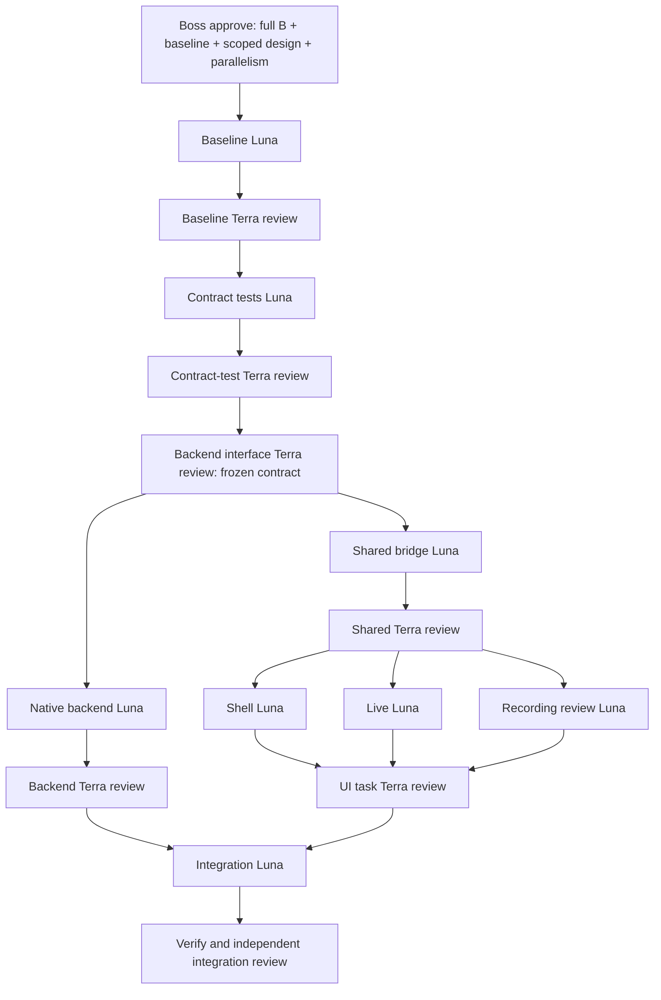
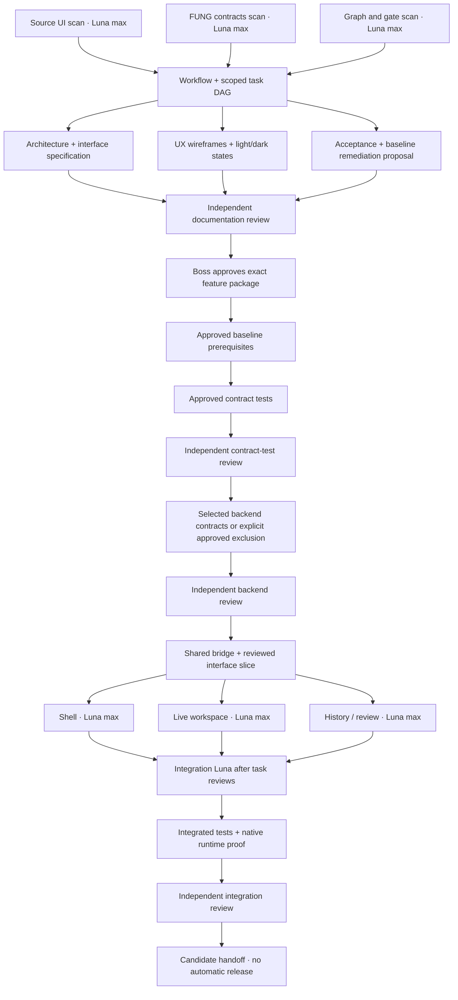

# Call.md → FUNG: Luna max task DAG

## Current execution overlay — approved 2026-09-17

Version diff0.2.1b ->0.2.2b: after explicit Boss approval of the contrast RCA,
UI_LIVE FIX3 may use the already isolated integrated root candidate for its
exact three-file lease (LiveWorkspace.css, callmdLiveWorkspace.test.mjs,
callmd-ui-live.md). All other source leases are released; this avoids stale
isolated inputs and an unnecessary transfer. This narrow scheduling exception
does not broaden product scope. Main remains documentation-only; fresh Luna/max
implements, then fresh Terra/high review and main browser checks run in parallel
on frozen source. Native/CI gates and no-commit/no-deployment boundaries persist.

Boss's latest `approve` approves cover v0.2.0b, full P1-B, scoped three-surface
SVG/PNG, the four-file baseline preservation repair and interface-first
backend/UI parallelism. See the [approval record](../verification/implementation-reports/2026-09-17-callmd-approval.md).
Earlier pending/unselected wording below is historical proposal context, not
another approval requirement. Native scope is HIGH risk. No security waiver,
Drive restoration, schema/cloud/CSP expansion, commit/push/release is authorized.

Current pinned implementation base is `376ef30db13670e4dea816ceff440f44ce73fffd`
(document-only descendant of the original product base). Main `05ed107a` and
its `d10bbf8` CI fix are reference candidates only; no wholesale main merge.

Current DAG has **26 nodes / 30 dependency edges**. BASELINE runs from its
approved RCA while a Luna documentation lane aligns the contract/acceptance
wording with this approved order. Independent coherence review must pass before
contract/native/shared code dispatch; this is verification, not another scope ask.

The total cap is three active Luna workers, not three per branch. Queue UI work
if native work still occupies a slot. Exact disjoint source leases and isolated
worktrees remain mandatory. All native/security review gates are retained.
`BACKEND_RECORDING` as well as `SHARED_CONTRACT` waits for
`BACKEND_INTERFACE_REVIEW`; this is the explicit prerequisite implied by
reviewing the interface before the fork.

Baseline exact code/test scope: `.github/workflows/ci.yml`,
`tests/ciCoverage.test.mjs`, `tests/nativeSessionCustody.test.mjs`, and the
single relevant custody script in `package.json`. No lockfile change.
Preserve Drive-free native custody assertions; do not adopt a gate deletion
as equivalent proof. Package/CI leases transfer serially to Integration later.

No commit is authorized: worker outputs are base-SHA plus exact diff/artifact
hashes. An authorized Luna integration owner transfers reviewed source bytes
and verifies hashes; the controller does not implement source changes. Isolated
worktrees may consume a verified dependency snapshot without inventing a commit.
Uncommitted reports say UNCOMMITTED; a digest is never labeled a commit SHA.

## 1. Historical proposal authority and outcome

Boss requested parallel multi-agent work with **Luna max as the primary worker**
and Codex as an orchestrator who does not edit implementation code. This is a
scoped supplement to [the approved Luna–Terra workflow](2026-08-23-fung-luna-terra-multiagent-workflow.md),
not a replacement for its review gates or the master plan's upstream gates.

- Boss approved workflow v0.1.0b with the message `ap[prove` on 2026-09-17,
  in response to the proposal to run the specification/UX documentation wave.
  This is workflow approval, not selection or approval of a feature package.
- Current authority: repository/source scans, workflow, task packets, and
  parallel `DOC_CONTRACT`, `DOC_UX`, `DOC_ACCEPTANCE` drafting plus independent
  read-only documentation review.
- Feature implementation authority: **NOT YET GRANTED**. AGENTS R5 requires
  reviewed documentation and Boss approval before code. This request does not
  waive that gate.
- Complexity: **C-3**. Workflow risk **MEDIUM**; UI-only slices **MEDIUM**;
  migrations, session identity, provider/egress changes **HIGH** and separately gated.
- Scan-wave success: three real parallel Luna scans, evidence-backed
  dependencies, an acyclic task graph, exclusive write ownership, and a durable
  handoff. Next-wave success: concrete interface/UX/acceptance documents and
  reviewable mockups, independently reviewed before Boss feature approval.
  Product build/runtime acceptance is not claimed.
- This is an agent-operated workflow and machine-readable planning manifest,
  **not an installed autonomous scheduler or a recurring automation**.

## 2. Pinned baseline and boundaries

| Item | Value |
|---|---|
| Repository base | `c378af9fac3c00db063948f49f9ee857ebad9126` |
| Working branch | `codex/callmd-ui-dag` |
| Working directory | `C:/Users/pc/.codex/worktrees/9000/fung` |
| Reference, read-only | `F:/call.md-main` |
| Main checkout, read-only | `C:/Users/pc/workspace/fung` |
| Current run ledger | [Call.md orchestration report](../verification/implementation-reports/2026-09-17-callmd-ui-orchestration.md) |
| Task manifest | [callmd-ui-task-dag.json](2026-09-17-callmd-ui-task-dag.json) |

The branch was created from the clean local main checkout. Clean Git status is
not proof of passing CI. No application code, deployment, provider setting,
credential, production data, main-branch change, commit, or push is authorized
by this workflow document alone.

Required parent/peer inputs, read before dispatch:

1. `AGENTS.md` and the user-supplied core directives.
2. `docs/plans/2026-08-09-fung-master-implementation-plan.md`, especially §9.
3. `docs/Desktop/ARCHITECTURE.md`.
4. `docs/Mobile/IMPLEMENTATION_STATUS.md`.
5. `docs/Desktop/08-real-progress.md`.
6. `docs/plans/2026-08-23-fung-luna-terra-multiagent-workflow.md`.
7. `docs/design/FRONTEND_REDESIGN_BRIEF.md` and `docs/brand-kit/README.md`.
8. The three scan reports linked in the ledger and contracts they identify.
9. `docs/decisions/2026-09-17-google-drive-scope-cancellation.md`.

## 3. Proposed product slice

[ASSUMPTIONS]

1. First target is **FUNG desktop**, preserving mobile/web routes and existing
   capabilities. Cross-platform redesign is not implied.
2. Borrow Call.md's information hierarchy and interaction patterns, not its
   Electron/VideoDB/tRPC backend or branding. Preserve Tauri, React, Rust,
   Genesis persistence, and FUNG's Quiet Archive identity.
3. Start by resurfacing FUNG capabilities. New data models and AI behavior
   require their own reviewed contracts; “important features” is not blanket
   authority for all Call.md integrations.

| Priority | Candidate scope | Boundary |
|---|---|---|
| P1 existing-contract subset | Sidebar/workspace shell; live transcript with adjacent insights; session status and controls; current-recording review; existing project-wide Q&A, recording-scoped summaries and export actions | Bind to real FUNG contracts; show each action's true scope and preserve permission, lazy-load and error semantics |
| P1 scope decision, unresolved | Full multi-recording history, desktop playback, recording-scoped Q&A, reopen behavior | Missing desktop contracts; either explicitly include a reviewed backend/bridge slice or explicitly approve a current-recording-only scope. No silent narrowing or invented API |
| P2 | Bookmarks, agenda/checklist persistence, derived conversation metrics, proactive assistance | Not in P1. Each needs a product decision, ownership/persistence design, and tests before becoming a schedulable node |
| Deferred | Call.md cloud STT, VideoDB, screen recording, calendar/OAuth, auto-triggered MCP/webhooks | No provider, schema, or security expansion without separate approval |
| Canceled | Google Drive provider/backup implementation | Must not be revived by old graph or roadmap entries |

Source patterns must be reimplemented against FUNG interfaces unless source
reuse provenance and license requirements are resolved. Local package metadata
alone is not clearance to copy an entire upstream application.

The source scan confirms that the supplied screenshot does **not** match the
current mounted live composition. Bookmark, screenshot-like sentiment/Avoid
Saying cards, and the full metrics rail are not verified mounted features.
The current app uses a different live composition and cloud-coupled services.
Treat the screenshot as a design reference, never an implementation contract.
Call.md's ASCII-whitespace word counting is not a Thai-safe WPM definition.

The FUNG contract scan found that `App.tsx` exposes projects and their active
recording, not a recording list. The desktop Play control is unavailable.
The local API has tokenized recording/audio routes, but the desktop Tauri
bridge has no corresponding list/playback contract; renderer fetch must not
be introduced implicitly. `meetingAsk` is project-scoped. Summaries are
recording-scoped, while export artifact listing is project-scoped. The
documentation wave must resolve these differences before Boss approval.

## 4. Roles and scheduling policy

| Role | Execution contract |
|---|---|
| Codex orchestrator | Scan/synthesize DAG, pin bases, write task packets/docs, acquire file locks, dispatch, review evidence, and report. Never author or repair product/test implementation code |
| Primary worker/fixer | `gpt-5.6-luna`, `reasoning_effort=max`; at most **3 concurrent** workers; one bounded partition per task |
| Contract/Integration Luna | Same model; sole owner of shared contracts or integration files during its node. Semantic conflicts and code fixes return here, never to the orchestrator |
| Terra reviewer | Existing workflow's `gpt-5.6-terra`, read-only, independent task and integrated-candidate review. No reviewer is reported as run without a real dispatch and evidence |
| Boss | Feature-document approval, changed scope, credentials/external effects, physical UAT, merge/release |

Do not silently downgrade Luna's effort or substitute another model. If the
requested model is unavailable, record `BLOCKED_MODEL` and ask for a choice.
Worker saturation is `WAITING_CAPACITY`, not a defect.

A task is `READY` only when all of the following hold:

1. Every dependency has its required accepted output at the pinned revision.
2. Its feature/scope authority exists; no upstream acceptance gate is open.
3. Its exact write set is approved and has no intersection with a running task.
4. Its base SHA, contract digest, input artifact digests, and ownership lease
   are recorded. No unresolved `TBD` interface or path reaches code dispatch.
5. Capacity is available and the worker receives all required input documents.

Review-node clarification: a read-only reviewer may become READY when its
immediate worker inputs are in REVIEW with complete, hash-pinned handoffs and
released write leases. It does not require those same inputs to have already
passed its own review. A PASS/accepted WARN promotes reviewed inputs and the
review node to ACCEPTED. All downstream implementation nodes still require
ACCEPTED dependencies and actual feature authority. This distinguishes
delivery from acceptance without an implicit review-readiness deadlock.

The same read-only readiness rule covers `VERIFY`: it may consume a frozen
`INTEGRATE` handoff in REVIEW after the integrator releases source writes.
Its predeclared generated-output/report lease allows test execution, not source
changes or acceptance. Verification results then enter REVIEW for independent
`INTEGRATION_REVIEW`; failed or NOT_RUN gates remain visible. This clarifies
the already approved I -> V -> review sequence; it grants no feature, native
profile, source-fix or release authority and waives no acceptance criterion.

Only the orchestrator changes scheduling state. Actual task states are
`PLANNED`, `READY`, `RUNNING`, `REVIEW`, `ACCEPTED`, `WAITING_APPROVAL`,
`WAITING_DEPENDENCY`, `WAITING_CAPACITY`, `BLOCKED`, or `INVALIDATED`.
Workers return `DONE`, `DONE_WITH_CONCERNS`, `NEEDS_CONTEXT`, or `BLOCKED`;
`DONE` does not automatically mean reviewed/accepted.

Use three disjoint report files for the current scan wave. For implementation,
give each Luna an isolated worktree from the same reviewed contract commit.
Do not share a mutable checkout or build output directories between coding
workers. Record the worktree/branch in its lease; never clean another task's
checkout. A worktree gives isolation, not permission to overlap ownership.

When a dependency changes, invalidate affected descendants, cancel their
unconsumed leases, and re-review/retest against the new dependency. Retain old
evidence as historical, never relabel it as evidence for the new SHA.

After this proposal snapshot, the runbook/manifest are frozen control-plane
inputs. Any orchestrator revision must record time, reason, changed fields,
old/new digests, and affected-node invalidation in the ledger; the orchestrator
cannot grant itself feature approval by editing the manifest.

## 5. Dependency structure

The JSON manifest is the authoritative list of nodes, edges, partitions, and
task-specific acceptance checks. This diagram summarizes the execution order;
review sub-gates remain explicit in the manifest.

`docs/.doc-graph.json` describes documentation/code relationships, not a
scheduler. Its cycles, stale content, deleted paths, and historical Drive nodes
must not be translated into implementation edges. The scan report supplies an
audit; this workflow does not rewrite that generated graph or its coverage
claims.

The scan of the existing graph found 105 nodes / 335 relationships, no unknown
edge endpoints, six removed Drive paths, and 26 node-hash mismatches using a
documented SHA-256-prefix comparison (the generator's algorithm is undeclared).
Three cyclic document-reference components exist; the 14 `depends_on` edges
are acyclic. These are source-audit facts, not product/runtime evidence.

The final task manifest has **25 nodes / 28 dependency edges**. The initial
22-node draft was extended after the FUNG scan identified missing desktop
contracts. `BACKEND_RECORDING` and `BACKEND_REVIEW` are not implementation
claims: unresolved selection blocks dispatch. If Boss explicitly excludes all
missing capabilities, these nodes record/review non-applicability with no code
and require honest unavailable/current-recording UI states.
The documentation-wave controller audit also added `CONTRACT_TEST_REVIEW`,
making the existing independent task-review rule explicit before backend work.
This does not authorize tests or code in the current documentation wave.

## 6. File ownership and contracts before parallel code

Planned partitions in the manifest are **candidate allocations**, not an
authorization to edit code now. The feature specification must freeze exact
interfaces and confirm every path before the Boss approval node.

- Shell Luna: new desktop shell component/style/tests; no `App.tsx` changes.
- Live Luna: existing `LiveMeetingPanel.tsx`, dedicated live subcomponents,
  scoped styles/tests; preserve one event/session owner and existing security gates.
- History/review Luna: dedicated history/review component/style/tests; consume
  the selected and reviewed data/action contract. Functional history/playback
  waits for the backend/bridge slice; current-recording-only scope requires
  explicit approval. No invented query or playback API.
- Backend Luna: only if approved, new `src-tauri/src/recording_review.rs`,
  explicit command registration in `src-tauri/src/lib.rs`, and selected Q&A
  scope changes in `src-tauri/src/meeting_intel.rs`. One high-risk lease; no
  schema/Genesis migration or implicit renderer loopback-client change.
- Contract Luna: shared TypeScript/command contracts only where approved.
  Persistence changes are not smuggled into UI work.
- Integration Luna: `App.tsx`, root styles, route mounting and only explicitly
  approved shared-file changes. No other lane may edit these files.
- `src-tauri/src/lib.rs`, `genesis_adapter.rs`, lockfiles, package/Cargo
  manifests, CI configuration, CSP/capabilities, and migrations are locked by
  default. A task must explicitly acquire them; a directory-wide wildcard is
  not sufficient.

New tests live in task-owned paths and enter the CI inventory through a
dedicated integration owner. Tests must not weaken existing assertions, turn
errors into empty states, or add timeouts to disguise broken contracts.

Explicit serial lease transfers: `.github/workflows/ci.yml` moves from
`BASELINE` to `INTEGRATE` only after baseline review and lease release;
`src/tauri.ts` moves from `SHARED_CONTRACT` to `INTEGRATE` only after the shared
contract and UI task reviews. A transfer binds the accepted predecessor SHA.
No simultaneous leases are allowed. `VERIFY` also receives an isolated lease
for generated `dist/`, `src-tauri/target/`, logs and a disposable test profile;
`code_writes=false` means no source edits, not no generated runtime files.

## 7. Task packet and review/fix loop

Each dispatch includes the following, with no placeholders left unresolved:

- ID; goal; complexity/risk; scope authority and approval reference.
- Base SHA; dependency SHAs/digests; input docs and frozen interface version.
- Exact writable paths; forbidden paths; worktree; exclusive lease owner.
- AC, measurable SC, exit criteria; test commands and environment requirements.
- Report path; evidence schema; reviewer role; rollback and escalation boundaries.

Worker report fields: result status, agent ID/model/effort, base/result SHA
(`UNCOMMITTED` when appropriate), changed paths, commands/exit codes, per-AC
evidence, tests `PASS/FAIL/SKIPPED/NOT_RUN`, known gaps, rollback notes, and
version diff. Never invent a commit, reviewer verdict, API capability, or run.

Terra returns `PASS`, `WARN`, `FAIL`, or `BLOCKED` under the existing review
contract. An explicitly accepted non-blocking `WARN` retains its evidence and
owner. A failure opens a **fresh Luna fixer** packet, with the same bounded
partition and reproduction. Maximum three unsuccessful fix cycles, then
escalate; do not expand scope or let the orchestrator repair code.

A runtime bug requires an evidence-backed RCA under `.brain/rca/` before a fix.
Review acceptance is invalid after an unreviewed semantic conflict resolution.
Git assembly is allowed only for clean, reviewed commits and only within the
user's actual commit/merge authority; this run makes no commit or push.

## 8. Verification and exit gates

### Current documentation-only run

Verify JSON parsing, unique IDs, known edge endpoints, acyclicity, a reachable
approval gate for every code-writing node, declared disjoint parallel lanes,
existing evidence references, and Git scope. Record actual results in the ledger.
No product test, build, hosted CI, native runtime, or device success is implied.

### Future implementation candidate

Use the exact baseline prerequisites and commands in the gate scan. In
particular, check command existence before copying stale CI steps. Do not
waive a failing upstream test just because the UI patch did not cause it.

At the scanned base, CI references `test:google-drive` and
`test:native-session-custody`, neither defined in `package.json`. The existing
coverage test does not validate CI-to-package command closure. This is a
separate baseline issue, not a UI patch. Documentation work may proceed; code
cannot claim green baseline until this is resolved. The current DAG waits for
explicit remediation approval in the reviewed package. A separately approved
baseline-only task may run earlier through a recorded DAG revision; do not
silently fix CI or restore canceled Drive code.

Required proof includes:

- Focused contract/behavior tests before and after each slice; frontend build;
  CI suite inventory; lazy bootstrap, summary scoping, job actions, egress,
  traceability, and relevant Rust tests/format/clippy.
- Native Tauri cold boot with optional environment absent: visible non-zero
  root and local access without forced login. The historical RCA
  `.brain/rca/2026-08-10-desktop-callmd-ui-blank-screen.md` demonstrates why
  build success alone is insufficient; it is not a claim of a current defect.
- Real session start/stop/reopen, event isolation, transcript provenance,
  selected history/review, playback where approved and supported, Q&A scope
  labeling/isolation according to its selected contract, summary isolation,
  export and restart persistence on the exact candidate.
- Light/dark, normal/empty/loading/error, Thai text, keyboard/focus, existing
  surfaces reachable, fixed desktop viewport and preserved mobile/web routing.
- No cloud egress without existing explicit opt-in; no secrets in artifacts;
  no physical-speaker claim from mic/system channels; no fabricated metrics.
- Test results tied to integrated SHA and environment. Keep source review,
  local tests, mocked-browser checks, native/device runs, hosted CI, and
  production evidence separate.

Missing hardware/provider/toolchain is an explicit gate, not a test pass.
P1 acceptance is not acceptance of the entire redesign brief, P2 features,
master-plan release gates, or canceled Google Drive work.

## Version Diff

- `0.2.0b → 0.2.1b`: clarify read-only VERIFY readiness on a frozen integration
  handoff; no changed node, edge, implementation scope or hard gate.

- `0.1.2b → 0.2.0b`: record actual full-B/baseline/design approval; activate
  interface-first fork/join with 26 nodes/30 edges and independent coherence gate.

- `0.1.1b → 0.1.2b`: clarify delivery-versus-review readiness and make the
  contract-test review gate explicit; no expanded implementation authority.
- `0.1.0b → 0.1.1b`: record Boss workflow approval and authorize the parallel
  documentation/review wave; feature implementation authority remains absent.
- `new → 0.1.0b`: scoped Luna `max` primary-worker DAG, three-worker cap,
  exclusive ownership, approval/review gates, dependency invalidation,
  implementation partitions, selected-backend dependency, and current-run evidence handoff.
- Product code/version: unchanged. Existing global governance: unchanged.

## CHANGELOG

| Version | Date | Status | Summary | Commit Hash | Agent |
|---|---|---|---|---|---|
| 0.2.1b | 2026-09-17 | beta | Clarify read-only verification readiness without self-acceptance | UNCOMMITTED; base 376ef30 | Codex orchestrator |
| 0.2.0b | 2026-09-17 | beta | Approved full-B execution and safe native/UI fork-join; no automatic commit/release | UNCOMMITTED; base 376ef30 | Codex orchestrator |
| 0.1.2b | 2026-09-17 | beta | Clarify read-only review readiness and explicit contract-test review | UNCOMMITTED; base c378af9 | Codex orchestrator |
| 0.1.1b | 2026-09-17 | beta | Record workflow approval and documentation-wave authority; no feature/code approval | UNCOMMITTED; base c378af9 | Codex orchestrator |
| 0.1.0b | 2026-09-17 | candidate | Document Call.md-to-FUNG Luna max workflow; no implementation changes | UNCOMMITTED; base c378af9 | Codex orchestrator |
