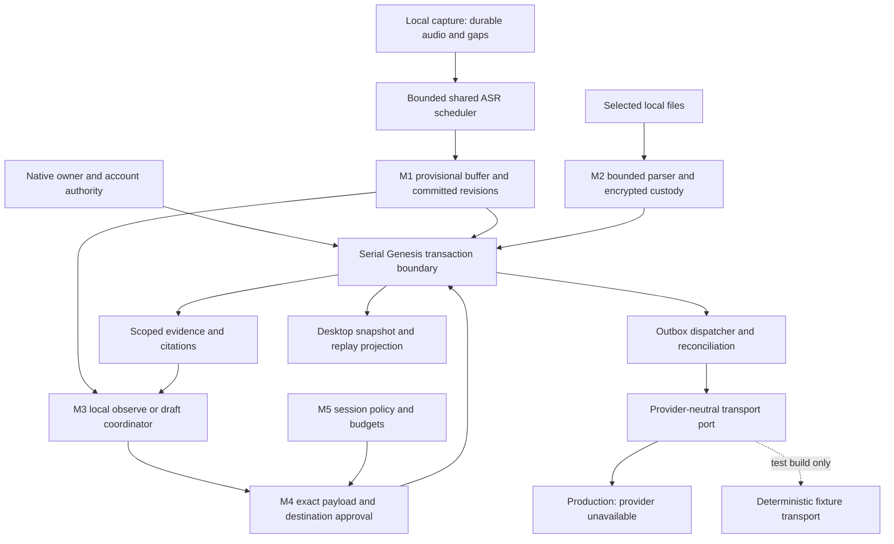

# M1–M5 local implementation and adapters

## 1. User direction and approval boundary

ผู้ใช้ยืนยันวันที่ 2026-09-24 ว่า **รวม M1–M5** และเลือก
**ทำ local และ adapter ก่อน ยังไม่เปิดบริการภายนอก**.
ผู้ใช้กำหนดจังหวะงานเป็น implementation ให้ครบ แล้วทดสอบรวมตอนท้าย;
ใช้ fixtures ใน repository สำหรับเสียงก่อน.

This is the concrete expanded implementation plan approved by the user under
[AGENTS.md R5](../../AGENTS.md). The earlier literal “approve” was recorded
against the bounded [live-worker routing fix](../specs/2026-09-24-operational-live-worker-routing-remediation.md),
whose implementation is already complete. The later explicit approval covers
this plan's local M1–M5 implementation and adapter scope. It does not weaken the
accepted R3 security boundary or authorize external provider activation.

Approval of this plan will cover local implementation, the additive migration,
new executable regression fixtures, Desktop integration, and one consolidated
verification campaign. It will not require another approval for each listed
task. A material contract/security/schema expansion outside this plan requires
an explicit amendment; routine implementation choices do not.

The existing frozen workflow/DAG and its historical reports are not rewritten
or presented as newly passed. This plan is a new, bounded execution track. It
retains independent review and serial integration, and changes test cadence
to the user's current instruction. Provider-specific deployment and real-room
acceptance remain a later track.

## 2. Parent and peer contracts

| Layer | Input | Preserved requirement |
| --- | --- | --- |
| Parent | [Master plan](2026-08-09-fung-master-implementation-plan.md), [Desktop architecture](../Desktop/ARCHITECTURE.md) | Desktop first; feature branch; Genesis is the sole persistence authority |
| Domain | [D1–D13 map](../architecture/MEETING_INTELLIGENCE_DOMAINS.md) | Actor, speaker, source, query permission and publication permission are distinct |
| M1 | [LT spec](../specs/2026-09-21-live-meeting-transcription-spec.md) | LT-01–16: custody, revisions, replay, recovery, scheduling and provenance |
| M2 | [KE spec](../specs/2026-09-21-meeting-knowledge-evidence-spec.md) | KE-01–14: selected corpus, immutable evidence, numeric lineage and ACL |
| People | [SI domain design](../specs/2026-09-21-speaker-identity-domain-design.md), [native contract](../../contracts/meeting-intelligence-v1.yaml) | Reviewed identity overlay; explicit native unlock and same-broker fence |
| M3–M5 | [MA spec](../specs/2026-09-21-meeting-agent-participation-spec.md), [GM decision](../decisions/2026-09-21-google-meet-agent-api-strategy.md) | Bound sessions/destinations, deterministic policy, durable outbox and honest receipts |
| Compatibility | [Current Desktop](../Desktop/08-real-progress.md), [Mobile](../Mobile/IMPLEMENTATION_STATUS.md) | Existing capture, recording-scoped QA, read-only external MCP, mobile transport and offline profile roles |

Global constraints: Thai user-facing labels; named exports; follow existing
component CSS conventions; no service-role credentials in frontend; existing
surface-param routes remain ungated. Secrets stay in native/server secure
storage. No model download per speaker, no alternate SQLite/vector database,
no automatic cloud inference, no source permission changes.

## 3. Deliverables and precise completion meaning

| Milestone | Deliverable in this scope | Evidence still separate |
| --- | --- | --- |
| M1 | Revision-aware local transcript, batched durable commits, correction, cursor replay/snapshot, catch-up and explicit gaps | Thai accuracy, latency targets and 3-hour hardware soak |
| M2 | Reviewed People links, explicitly selected local documents, immutable citations, lexical search, typed metric evaluation, local evidence preview | Private real-source UAT and optional parsers/connectors not qualified |
| M3 | Local observe/draft coordinator and provider-neutral adapter normalization/lifecycle boundary | Vendor authentication/SDK, actual Meet admission and remote media |
| M4 | Exact-payload approval, destination-bound durable outbox, receipt/reconciliation state machine | Real same-room text/link delivery and remote audience access |
| M5 | Explicit bounded session policy, committed-input triggers, expiry/rate/budget limits, revoke/kill/restart handling | Real provider metering, operational watchdog deployment and room adversarial UAT |

The production application starts with external transport unavailable. Local
drafting and preview work without a vendor. “Adapter ready” means its typed
boundary and normalization behavior exist, not that a Google Meet connection
has been implemented or verified. A deterministic in-process fake transport
is test-only, never a production success path or user-visible joined/sent state.
The offline adapter fails join/send with `PROVIDER_NOT_CONFIGURED`.

Native file attachments, voice/TTS replies, biometric enrollment, calendar
crawling, other meeting platforms, public artifact hosting, Mobile M1–M5 UI,
vendor procurement, public gateway/TLS setup and release are outside this slice.
Previously open Desktop/Mobile acceptance gates remain tracked; this scope
does not erase them or describe fixtures as device evidence.

## 4. Verified integration gaps at base 2c2559f + existing routing diff

Read-only source inspection identified these prerequisites; these are not new
test results or a claim that the bounded R3 acceptance was invalid.
The [static integration RCA](../../.brain/rca/2026-09-24-meeting-transcript-integration-contract.md)
records exact source evidence and the deferred runtime verification boundary.

| Source | Existing behavior | Required integration work |
| --- | --- | --- |
| `live_meeting.rs::persist_and_emit_segments` | Legacy segment UUIDs, then separate chunk-transcribed stamp | Stable input identity; atomic batch including zero-result completion; emit after commit |
| `genesis_adapter.rs::commit_meeting_transcript` | One revision and newly consumed source sequences per request | Batch 0..N utterances per chunk; revision-only changes reuse verified durable coverage |
| Same function / `transcript_event_log` | Event cursor checked against a source cursor; unique index is recording+cursor | Separate per-source input sequence from one recording-wide event sequence |
| `meeting_intelligence_schema.rs` | v11 schemas/contracts and identity-safe commit foundation | Production services, trusted command boundaries and UI still need wiring |
| `meeting_intel.rs::meeting_ask_recording` | Recording-scoped answer path | Keep unchanged; add separate selected-knowledge commands |
| `LiveMeetingPanel.tsx` | Legacy live-segment subscription and initial transcript load | Snapshot/replay handshake, revision reducer, correction UI and health |
| Cargo/runtime manifests | No general document parser pipeline established by this inspection | Explicit parser capability/staging; accepting a file extension is not support |

## 5. Architecture and execution order

Order: contract/schema → M1 and M2 implementations → M3 coordinator/adapter
→ M4 outbox → M5 policies → serial Desktop integration → freeze → consolidated
verification → focused repair/retest → independent final review. Source review
may happen during implementation; no incremental acceptance/test campaign is
scheduled. A discovered design contradiction is resolved before dependent code.

## 6. Persistence and authority contract

### 6.1 Additive v12 migration

Preserve registered v1–v11 schemas exactly. Add v12 through the existing Genesis
registration sequence, with a new package identity and `previous_version=11`.
Do not hand-edit storage files or regenerate a historical schema definition.
Keep the pinned Genesis dependency unless a separately documented engine
limitation is established.

Reuse v11 meeting/source/revision/projection, knowledge, grant/run/destination,
outbox/receipt and identity aggregates. Add these narrowly scoped records:

| Record | Required fields/invariant |
| --- | --- |
| `meeting_recording_cursors` | recording PK, next committed cursor, minimum retained cursor, generation/revision; one allocator across all sources |
| `meeting_input_batches` | immutable batch ID, recording/source/generation, first/last sequence, input digest, operation digest, stable transaction ID, outcome; duplicate identity with changed payload conflicts |
| `meeting_control_events` | recording+cursor unique, kind, bounded payload, transaction ID, committed timestamp; includes silence/gaps/status/tombstone groups and references revision IDs where present |
| `meeting_session_contexts` | session PK, owner/vault binding, account binding where present, explicitly selected collections, temporal/business context, authority/policy revision, status |
| `meeting_private_assets` | opaque ID, vault/owner/project, purpose and entity/version, relative custody location, key reference, ciphertext digest/size, state/retention; no private title or plaintext payload |

One authoritative ordered v2 stream uses `meeting_control_events` for all event
kinds; v11 transcript events remain a compatibility/audit projection written
atomically for new revisions. Never merge two independently allocated cursors.
Migration seeds the allocator above the existing recording maximum. Historical
v11 events are adopted deterministically with stable references and a completion
marker in the same transaction; reopening cannot create a second stream.
For recordings with only legacy segments, initialize an explicitly labelled
legacy snapshot. Do not fabricate ASR provenance or verified coverage for them.

Do not assume the engine can add/alter historical columns. Full session policy,
outbox approval and metric provenance use their existing JSON/reference fields
with a versioned validated payload, or the new session-context aggregate.
Before freeze, enumerate table/resource limits and every FK/index invariant.
If an additional table or incompatible column change is needed, amend the plan
before implementing that change.

### 6.2 Three serialized mutation operations

1. **Ingest batch:** validate finalized audio/gap custody, source generation,
   sequences and model provenance; allocate recording cursors; write coverage,
   0..N raw revisions, effective projections, committed events, processed cursor
   and chunk completion atomically. Empty ASR output is processed silence,
   distinct from missing input. Provisional events are never a durable final.
2. **Revise existing utterance:** require expected revision, owned scope and
   existing complete coverage; retain raw ASR; append corrected/refined revision
   and event without advancing audio input sequences. Human-reviewed text
   rejects later automatic replacement. Resegmentation uses one tombstone and
   replacement group so old and new utterances are never jointly effective.
3. **Policy/evidence/delivery mutation:** current source/version/ACL, grant,
   audience, payload and destination revisions are checked in the same guarded
   transaction as the intent/state transition. Source revocation or correction
   invalidates unsent evidence and drafts; already-sent content is not rewritten.

Capture the Genesis frontier before validation reads. Preserve transaction ID,
timestamp and payload after uncertain commit; reconcile durable identity before
retry. A known CAS rejection may reread and create a new checked attempt;
uncertainty never triggers blind retry with new IDs. No in-memory mutex alone
substitutes for durable CAS/idempotency.

### 6.3 Trusted authority and payload custody

Native code derives actor, account generation, vault and canonical data root.
Renderer inputs are resource selectors and requested policy only; they cannot
assert owner/ACL/reviewed identity or supply key references. Add explicit native
unlock/lock command wiring around the accepted unlock session. Restart begins
locked and does not restore publication grants as active.

Preserve the accepted same-broker AccountCommitFence and short vault fence for
protected operations. Extend guarded service operations to knowledge reads,
drafts and policy writes without exporting private key/decryption helpers to
UI. Capture may continue independently, but locked/revoked evidence cannot
produce a new private read result or publication intent.

Ordinary transcript storage follows its existing contract. New private corpus
bytes, excerpts, query text, drafts and payloads are encrypted before persistent
custody/WAL; metadata contains opaque references and necessary bounded indexes.
Use a separate key purpose and fresh nonce, with owner/vault/entity/version AAD;
do not reuse People, device-signing or backup keys. Missing key means unavailable,
never plaintext fallback. No new private plaintext Debug/log/panic output.

No auth lock spans parser/model/network work. Long work captures an authority
generation and revalidates before exposing results and committing mutations.
Final send authorization and transport handoff have an explicit linearization
point; revocation cancels work not handed off. Anything possibly handed off is
delivery-unknown until reconciled, not claimed recalled.

### 6.4 Native provisioning, key lifecycle and recovery

First use offers explicit local vault creation/unlock. Native device identity
supplies the principal; account binding is optional and comes only from the
registered broker. Zero owned vaults requires provisioning; multiple eligible
vaults requires an explicit owned selection, never first-row selection. Creating
a vault is separate from granting knowledge access or enabling the agent.

Create purpose-separated 256-bit keys with OS randomness in native keyring,
verify retrieval, then commit the opaque key/asset metadata under the captured
authority and Genesis frontier. Record a recoverable provisioning intent;
interruption must not overwrite an existing key or create duplicate active
vaults. Reconcile a possibly committed identity before deleting an orphan key.
People metadata retains its accepted envelope/key purpose; document and draft
assets use a distinct knowledge/meeting purpose. Rotation writes a new immutable
key generation; references to existing ciphertext remain resolvable. Lost keys
produce `KEY_UNAVAILABLE`, never silent key regeneration.

Extend the existing encrypted backup container with a versioned optional
meeting-asset section: referenced ciphertext assets plus a native-generated key
recovery package inside the authenticated encrypted archive. The backup source
includes allowlisted People metadata and meeting/knowledge recovery keys, never
provider tokens, account refresh tokens or device-signing keys. The backup source
must be unlocked and owner-authorized; keys never enter renderer DTOs, logs,
unencrypted staging or standalone export files. Preserve legacy archive readers;
old binaries reject the new container explicitly. Include hashes, length bounds,
purpose/version and vault/account binding in the manifest.

Restore verifies archive authentication, manifest and ciphertext into a fresh
target before installing keys in native secure storage. A colliding key reference
with different bytes fails closed; do not overwrite user keys. Preserve original
AAD and account binding. A different device/account requires the existing
explicit restore/ownership reconciliation flow; successful decryption alone
does not grant ownership. Interrupted restore remains inactive/recoverable and
does not expose a partly restored vault. Reopen starts locked with agent off.
Prove this round trip on isolated fixtures before calling new assets recoverable.

## 7. Implementation packets

All paths below are repository-relative. New files are proposed ownership
boundaries, not claims that those modules exist. Only the serial integrator
edits shared registration/schema/UI entry points. Reviewers do not repair their
own review target; protected input hashes are recorded before review.

| Packet | Paths / owner boundary | Work and completion check after freeze |
| --- | --- | --- |
| P0 contract/migration | `contracts/meeting-intelligence-v2.yaml`, `src-tauri/src/meeting_intelligence_schema.rs`, `src-tauri/src/genesis_adapter.rs` | v12, batch/revise/control operations, authoritative cursor, guarded persistence; old data reopen and R3 regressions |
| P1 transcript | `src-tauri/src/live_transcript.rs` (new), `src-tauri/src/live_meeting.rs`, `scripts/transcribe_live.py` | source custody, provisional/revision protocol, bounded scheduler, replay/correction/catch-up; duplicate and crash matrix |
| P2 knowledge/People | `src-tauri/src/meeting_knowledge.rs` (new), `scripts/extract_knowledge.py` (new), native identity APIs, `backup_payload.rs`/`backup.rs` | encrypted document versions, key provisioning/recovery, bounded parsers/search, citations/metric arithmetic, reviewed links and revoke; ACL/parser/lineage/restore matrix |
| P3 adapter | `src-tauri/src/meeting_adapter.rs` (new) | normalized capability/session/frame/participant/receipt types; unconfigured production transport and test-only fixture transport |
| P4 agent/delivery | `src-tauri/src/meeting_agent.rs`, `src-tauri/src/meeting_delivery.rs` (new) | local modes, evidence drafts, immutable approval/destination, outbox/reconciliation, rate/budget/kill controls |
| P5 Desktop | `src/lib/meetingIntelligence.ts`, `src/components/MeetingIntelligencePanel.tsx` and peer CSS (new), existing `LiveMeetingPanel.tsx` | real native commands, revision display, selected corpus, private draft/approval/history/readiness UI |
| P6 integration | `src-tauri/src/lib.rs`, Tauri capabilities, `package.json`, runtime staging/requirements, CI suite registration | sole registration writer; bounded native commands and parser packaging; preserve existing profile/capture/QA behavior |
| P7 verification/docs | new focused test files and `docs/verification/implementation-reports/2026-09-24-meeting-intelligence-local-adapters.*` | consolidated logs, source hashes, independent review, requirements verdicts and version diff |

### P1 details

- Keep the current chunked-live path compatible. Add an explicit revisioned
  profile with <=2-second durable fragments, bounded rolling decode windows,
  provisional replace/discard and committed-only legacy output. Do not quietly
  change every existing session or claim 1-second text without measurement.
- Single staged model cache; bounded inference concurrency and queue capacity.
  Source sequence/media time orders work; wall-clock timestamps are diagnostics.
  Pause, resume, stop tail, model crash, OOM and pending seconds are explicit.
- Snapshot uses a frozen high watermark and bounded pages; replay is ordered
  strictly after cursor. Subscribe/buffer before snapshot, then replay/apply
  newer buffered events. Expired/foreign/future cursors are typed errors.
- Defaults from LT: last 200 utterances in UI; warn at >15s lag; suppress proactive
  at >30s. Profile switches occur only at recorded safe boundaries and use staged
  approved models. Old recordings/exports remain readable.

### P2 details

- Local text/Markdown and text-bearing PDF ingestion only from explicitly
  chosen files/custody roots; no recursive disk discovery. Native file picker
  grants a bounded import handle, not a renderer-supplied arbitrary path.
- Use an isolated parser process: 25 MiB, 500-page and 60-second caps, bounded
  output/memory, no network/macros/embedded execution. Select and pin the PDF
  parser/dependency in the implementation manifest before staging; record its
  license and parser fingerprint. No OCR claim for scanned-only PDFs. DOCX,
  XLSX and automatic CSV ingestion return unsupported until separately qualified.
- Preserve original hash, exact version, line/page/character locators and
  extraction warnings. Lexical retrieval runs only over authorized selected
  collections, with at most 8 chunks/12,000 context characters and a 10s deadline.
- UI permits explicit typed metric observations with source locator and review.
  Metric, organization, period/calendar, currency/scale and actual/budget must
  agree before arithmetic. Use checked decimal/integer arithmetic; zero divisor,
  overflow, conflicting sources and fiscal ambiguity produce typed outcomes.
  No language model invents a numeric operand or authorizes a tool.
- “ปีที่แล้ว” uses the meeting timezone/date. Ambiguous metric/company/calendar
  produces clarification. Exact source-backed excerpts are usable without LLM;
  optional local model wording remains bound to cited claims.
- Reuse the reviewed People identity overlay, never merge by display name.
  Provider labels stay source labels; unknown/shared-room evidence remains
  anonymous. Voice enrollment is not a prerequisite.

### P3–P5 details

- Define `probe_capabilities`, `prepare`, `join`, `status`, `leave`, normalized
  input events, `publish_text`, `publish_link`, `reconcile` and cleanup status.
  Separate supported capability from configured/qualified readiness. File/audio
  output is unsupported in this MVP.
- Normalize source account/occurrence/participant/session/generation/sequence,
  codec/dimensions and timestamps. Invalid/oversized/replayed/cross-scope inputs
  fail closed; unmapped spans are unknown and dropped media creates a gap.
  A raw DTO is not an authenticated provider event. Only a trusted transport
  implementation may create authenticated ingress; no public debug injection.
- Local lifecycle: off/observe/draft. asked-only/proactive policies may be
  configured and evaluated locally, but external dispatch stays unavailable.
  No local setting can turn a test transport into a configured provider.
- Trigger only current committed non-self/non-bot evidence: 2s debounce,
  30s expiry, 60s semantic cooldown, one active run and <=3 retrieval attempts.
  Explicit questions replace pending low-priority work; transcript edits cancel
  stale triggers. These are implementation limits, not measured quality claims.
- Manual approval binds exact payload hash, evidence versions, destination
  occurrence/account/channel, audience revision and expiry. Editing any bound
  value invalidates approval. Local preview never claims a sent message.
- Persist outbox before handoff; one checked lease per destination. Timeout or
  crash after possible handoff means delivery_unknown; block automatic resend.
  Accepted and delivered require different evidence. Fixture receipts are marked
  fixture-only and cannot appear as real Meet receipts.
- Recheck read/share rights, unknown guests, policy mode/topics/classification,
  approved HTTPS link hosts, freshness and budget before each attempt. No local
  file URLs or fake secure links; artifact preview is local, no upload service.
- Session policy expires by meeting end or 4h, shorter source/grant expiry wins.
  Maximum 2 proactive messages/minute and 20/hour, configurable downward.
  No configured tariff/cost authority means external actions unavailable; do not
  assume zero cost. Local work has time/token/retrieval limits.
- Revoke/stop/logout cancel unsent work; restart needs explicit unlock and
  re-enable. Lease timer uses 10s heartbeat/60s expiry with deterministic clock
  tests; later gateway deployment must independently enforce remote bot leave.

## 8. Test-once campaign and evidence gates

Write executable regression fixtures with the implementation; defer execution
until P0–P6 are integrated and source is frozen. Static read-only review is
allowed during implementation. Run one campaign with independently reported
lanes, not one process whose zero exit hides skipped checks.

| Lane | Required checks |
| --- | --- |
| Data/security | populated v11→v12/reopen/idempotent adoption, multi-source cursor ordering, zero/multiple-segment ingest, same-coverage corrections, rollback/uncertain commit, owner/account/vault switch and protected R3 race tests; project-scoped transcript snapshot/replay, grant/selection/ACL/version/chunk/asset revalidation at encrypted draft persistence, vault-lock and account-lifecycle delayed-publication rejection, cross-process keyring-create exclusion; interrupted provisioning, missing/colliding key, encrypted backup/new-target restore/reopen |
| M1 | partial/final/out-of-order/resegmentation, snapshot race/pagination/expiry, crash/replay, human correction vs late ASR, gaps/queue bounds/stop tail; staged runtime silence fixture for plumbing only |
| M2 | cross-project/vault deny without title/snippet leak, changed bytes/source revoke, exact citations, parser bounds/malicious inputs, source conflicts/decimal arithmetic/Thai year ambiguity, encrypted WAL canaries |
| M3–M5 | cross-occurrence/participant generation, echo exclusion, committed freshness, approval tamper, audience changes, revoke at handoff, delivery uncertainty/restart/no-duplicate, lease/rate/budget limits, unconfigured provider always unavailable |
| Compatibility/build | all registered Node suites, ordinary-Python worker fixtures, full native library regressions, formatting/clippy, TypeScript/Vite build, native build and packaging/resource contracts |
| UI | bounded Desktop flow: selected recording → revisions/correction → references → cited private draft → exact preview → unavailable external action → revoke/restart; lock-then-delayed-draft and stale-subscription checks. Record mock-browser fixture evidence separately from native Tauri-window and accessibility acceptance. |
| Review | independent source/security review on frozen hashes, report findings and residual gates; serialize protected plaintext reads/publications against account transitions; no fabricated G1/G2 or historical report reuse |

Use the existing `scripts/meeting-intelligence-test-runtime.ps1` with explicit
manifest, isolated target and ordinary Python paths. It sets test-only
process-local PATH/TAURI_CONFIG and restores them; it does not provision a
production runtime. Serialize Cargo owners and native-session-custody tests.
Do not run mock-import fixtures using embedded production Python that ignores
PYTHONPATH. Preserve staged models and runtime manifests.

If a lane fails, document the actual cause in `.brain/rca`, fix within approved
scope, and rerun affected checks plus the necessary integrated regression.
“One campaign” does not mean leaving a failure unverified or promising exactly
one command invocation. Report PASS/FAIL/BLOCKED/NOT_RUN separately.

No Thai speech/reference fixture is currently established by this task. Silence
can verify runtime/protocol/custody, not WER/CER, speaker accuracy, latency SLA,
semantic trigger quality or real meetings. Do not synthesize a passing quality
claim. Physical Android, real cloud fallback, clean-install restore, native
installed-artifact interaction, 3-hour soak and public release remain distinct.

## 9. Rollback and non-destructive recovery

- Before first migration outside fixtures, create an owner-approved encrypted
  backup and verify recoverability to a separate clean target. Development uses
  fresh isolated fixture databases; never migrate the user's live DB implicitly.
- v12 is additive. Disable the new feature path to fall back to compatible
  capture, retain durable revisions/evidence and mark new features unavailable.
  Do not claim an older binary can open a newer registered schema.
- Binary downgrade requiring v11 uses the verified pre-migration backup at a
  separate target, with explicit treatment of post-backup data. Never drop tables
  or overwrite the active vault to make a rollback appear successful.
- Private ciphertext blobs are finalized before their Genesis references become
  visible; failed transactions leave quarantined orphans, not broken committed
  references. Cleanup is bounded by recorded ownership and retention, not broad
  recursive deletion.
- On uncertainty preserve evidence, IDs and encrypted custody; reopen/reconcile
  before continuing. No automatic join, reauthorization, send or plaintext export.

## 10. Acceptance checklist and reporting

- [x] User chose M1–M5 local + adapters and deferred external activation.
- [x] Parent/peer contracts and current native/schema/worker/UI boundaries inspected.
- [x] Read-only documentation review completed by separate `contract_map` agent;
  provisioning and recovery findings incorporated, no remaining material finding
  in that review scope. This is not runtime verification or formal G1/G2.
- [x] Expanded implementation plan/schema contract approved by the user on 2026-09-24.
- [x] M2 completion amendment approved; People lifecycle and Windows PDF sandbox are implemented in the source freeze.
- [x] P0–P6 implemented and integrated; requirements map covers LT/KE/MA/GM IDs.
- [x] Consolidated local campaign completed; failures repaired and verified.
- [x] Frozen-hash review findings across People reads, metric computation, draft publication, and refresh-failure UI invalidation were remediated.
- [x] Final consolidated campaign passed after remediation, including the account-lifecycle UI fixture.
- [ ] Native Tauri-window flow and accessibility acceptance remain NOT_RUN.
- [x] Independent final source/security review passed on the post-remediation hashes; separate-logon-session mutex runtime remains NOT_RUN.
- [x] Progress/report/version diff updated; external and hardware gates remain explicit.

## Implementation status at the 2026-09-25 source freeze

The approved working tree contains the v12 integration, revisioned transcript
path, local knowledge import/search and typed metric operations, local agent
flow, provider-neutral adapter, persistent preview/outbox path, session policy
controls and Desktop integration. Metric operands are stored as authenticated
ciphertext bound to the vault and observation ID; only the native save/compute
boundary opens them. These implementation claims passed the consolidated
local campaign; they do not establish real-room, device or release acceptance.
The approved M2 amendment closes the
source-level People and PDF implementation gaps: profile key provisioning and
recovery, profile CRUD/archive, reviewed speaker links, Windows AppContainer
PDF parsing with bounded stdin and a Job Object, and Desktop review/import UI.
The amendment and its limits are recorded in
[M2 completion](2026-09-24-meeting-intelligence-m2-completion-amendment.md).

## Final local campaign results — 2026-09-25

The final consolidated fixture campaign passed after the documented fixture
and test-synchronization repairs and after remediating account-transition races
in People reads, metric computation and private draft publication. Refresh
failure now emits an account-lifecycle event so the panel clears bound-account
data. The [implementation report](../verification/implementation-reports/2026-09-24-meeting-intelligence-local-adapters.md)
contains the refreshed source hash manifest, requirement-family crosswalk and
remaining gates.

| Lane | Result |
| --- | --- |
| Rust library | PASS — 576 passed, 0 failed, 1 ignored |
| Meeting-knowledge integration | PASS — 17/17 |
| AppContainer security probe | PASS — the probe denied host-file and loopback access when run with access to the per-user Windows profile store; the restricted sandbox fails closed |
| Knowledge extraction | PASS — 7/7 on Python 3.12.14 with pypdf 6.10.0; staged CPython 3.11.9 parser fixtures also pass 7/7 |
| Native validation | PASS — offline all-target check, clippy with `-D warnings`, formatting, diff check and local `cargo build` |
| Desktop/worker suites | PASS — all 32 registered `test:*` suites; one Docker-backed W1 PostgreSQL case skipped because Docker is unavailable |
| Desktop production build | PASS — `npm run build` (TypeScript and Vite) |
| Mock-browser UI fixture flow | PASS — cited local draft created, then auth-session change cleared it and locked the selected vault |
| Native Tauri-window flow and accessibility | NOT_RUN — the mock browser fixture is not the installed/native Desktop surface |
| Independent final source/security review | PASS — post-remediation source hashes reviewed; no blocker found across People, metrics, draft publication, or refresh event wiring |
| Cross-logon-session keyring concurrency | NOT_RUN — global-namespace source check and same-session subprocess regression passed, but simultaneous separate Windows logon sessions were not exercised |

This result covers local behavior and repository fixtures. Thai WER/CER,
physical-device acceptance, real Google Meet admission/media, external delivery,
provider-side controls, installed-artifact interaction and release remain
NOT_RUN. The Windows profile test fails closed under the restricted sandbox;
it passed when the consolidated suite could access the per-user AppContainer
profile store. No host data ACL fallback is used.

External Meet joining, real provider receipts, provider qualification, real
room send/reconciliation, physical device acceptance, staged model quality,
installed-artifact validation and release remain intentionally unavailable or
NOT_RUN. Local preview approval is not a send receipt.

“Local implementation complete” requires runnable native and Desktop flows, not
only type definitions or fixture stubs. “M1–M5 fully accepted” still requires
the separately listed hardware, source, provider, room and deployment evidence.
Never mark the master M3–M5 real-room gates complete from this local campaign.

## Version Diff

| Version | Change |
| --- | --- |
| 0.2.7b → 0.2.8b | Closed account-transition races in People reads, metric computation and draft publication; added refresh-failure invalidation; final local campaign and independent source review passed. |
| 0.2.6b → 0.2.7b | Added broker lifecycle fencing for People plaintext reads and draft publication plus account-change UI clearing after a final review found a P1 race; consolidated retest and source re-review pending. |
| 0.2.5b → 0.2.6b | Closed four reviewed security findings, added project-scope/ACL/vault-lock/global-keyring regressions, and recorded final campaign, mock-browser flow and source review results; native Tauri/accessibility and product gates remain open. |
| 0.2.4b → 0.2.5b | Recorded all 7 pinned parser fixtures passing and refreshed the Rust campaign log; implementation source hashes are unchanged. |
| 0.2.3b → 0.2.4b | Added the LT/KE/MA/GM evidence crosswalk and marked interactive Desktop UI/accessibility as NOT_RUN; the source campaign results are unchanged. |
| 0.2.2b → 0.2.3b | Recorded the passing consolidated local campaign, Windows AppContainer probe, exact source hash manifest and remaining independent/external/device gates. |
| 0.2.1b → 0.2.2b | Recorded source freeze for P0–P6, approved M2 People/PDF completion, and one pending consolidated validation campaign. |
| 0.2.0b → 0.2.1b | Added vault-bound encryption for stored numeric metric observations and narrowed bounded computation queries to the requested dimensions. Regression coverage is authored; campaign remains deferred. |
| 0.1.1b → 0.2.0b | Added current implementation status and unaccepted M2 PDF/People requirements with explicit provider/device/release boundaries. |
| 0.1.0b → 0.1.0 | Recorded user approval for the local M1–M5 implementation and provider-neutral adapter scope; retained the external activation gate. |
| 0.1.0 → 0.1.1b | Recorded approval in the acceptance checklist and documented current implementation gaps without claiming P0–P6 acceptance. |

## CHANGELOG

| Version | Date | Status | Summary | Commit Hash | Agent |
| --- | --- | --- | --- | --- | --- |
| 0.2.8b | 2026-09-25 | beta | Closed People/metric/draft account-transition races and refresh invalidation gap; final local campaign and source review passed | working-tree | RWANG |
| 0.2.7b | 2026-09-25 | beta | Remediated account-transition plaintext race with broker fence and UI invalidation; final tests and review pending | working-tree | RWANG |
| 0.2.6b | 2026-09-25 | beta | Closed reviewed transcript scope, vault-lock publication, evidence-revalidation and keyring race findings; final local campaign and source review pass; native UI/accessibility remain open | working-tree | RWANG |
| 0.2.5b | 2026-09-25 | beta | Pinned parser fixtures passed 7/7; refreshed Rust verification log; independent review and UI acceptance remain open | working-tree | RWANG |
| 0.2.4b | 2026-09-25 | beta | Added scoped requirement crosswalk; independent review and interactive UI acceptance remain open | working-tree | RWANG |
| 0.2.3b | 2026-09-25 | beta | Consolidated local suites and native checks passed; independent final review and external/device/release gates remain open | working-tree | RWANG |
| 0.2.2b | 2026-09-25 | beta | Source-froze P0–P6 with People lifecycle and Windows PDF sandbox; consolidated campaign and independent review remain pending | working-tree | RWANG |
| 0.2.1b | 2026-09-24 | beta | Added encrypted metric operand persistence and bounded dimension-filtered computation; tests/build remain deferred until freeze | working-tree | RWANG |
| 0.2.0b | 2026-09-24 | beta | Approved implementation in progress; PDF sandbox and People review flow remain open; campaign deferred until freeze | working-tree | RWANG |
| 0.1.0 | 2026-09-24 | beta | User-approved local M1–M5 implementation and adapter work; consolidated verification deferred until implementation freeze | working-tree | RWANG |
