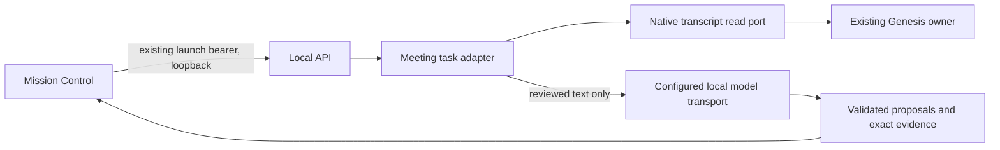

# Meeting & Task Manager local adapter

The user approved the brand-kit Meeting & Task Manager v0.3 spec on 2026-09-30.
Canonical scope: `D:/zuri-brand-kit/output/draft/meeting-task-manager-spec.md`
and `meeting-task-manager-architecture.md`. This work implements the FUNG side
only in the isolated `feature/meeting-task-manager-local` worktree at base
`1ca55145`. It does not modify the dirty primary checkout, activate providers,
start or replace the running desktop, send messages, commit, push or deploy.

Parent: [master plan](2026-08-09-fung-master-implementation-plan.md) §9 and
[architecture](../Desktop/ARCHITECTURE.md). Peers: existing `local_api.rs`, native
`genesis_adapter::meeting_transcript_snapshot`, and the restricted local
`meeting_agent_model` transport. Existing upload/read/audio routes remain intact.

Global constraints: Thai user-facing labels; named exports; follow existing
component CSS conventions; no service-role credentials in frontend; existing
surface-param routes remain ungated. Secrets stay in native/server secure
storage. No model download per speaker, no alternate SQLite/vector database,
no automatic cloud inference, no source permission changes.

## Architecture and contract

- Add authenticated `/integrations/meeting-task-manager/v1/capabilities`,
  `/recordings/{id}/snapshot`, and POST `/action-drafts`.
- New routes are loopback-only even if the existing optional LAN listener is
  enabled. Existing origin policy already permits `http://127.0.0.1:4319`;
  no origin wildcard or production origin is added.
- Snapshots use native revisions when present, explicit legacy fallback
  otherwise. Native port's 200-utterance window reports bounded coverage rather
  than claiming a full meeting. Legacy empty speech remains empty, never ready.
- Snapshot hashes cover source scope, ordered content, native revisions and
  coverage; `capturedAt` does not change content identity. Source instance
  identity is a non-secret hash of canonical ledger-root identity.
- Reviewed input is limited to 200 distinct existing source segment IDs,
  unchanged source timecodes, 96,000 UTF-8 text bytes and a 256 KiB HTTP body.
  Text and speaker labels may be reviewed locally. The review hash is SHA-256
  of compact UTF-8 JSON array `[reviewRevisionId, segments.map(s =>
  [segmentId,startMs,endMs,text,speakerLabel ?? null])]` in request order.
- Source hash/project/recording/instance and review hash are checked before and
  after model work. Draft IDs derive from request/source/review identity, never
  model-generated identifiers. Tasks are created only in Mission Control.
- Local `ollama-summary-intent` configuration selects the exact installed model
  or the existing FUNG default when no model is configured. Restrict endpoint
  to literal loopback, HTTP, no userinfo/query/fragment, proxy or redirects;
  readiness must pass. No cloud fallback, tool execution, automatic assignment,
  native transcript edits, or external dispatch flag changes.
- Output must be bounded strict JSON, at most 30 items; every proposal needs
  exact quote evidence from the reviewed version. Date inference stays null;
  explicit owner/due text remains a suggestion requiring human confirmation.

## Tasks and verification

- [x] Add contract tests for scope, native/legacy identity, review hashes,
  bounds, malformed model output, evidence, source change and deterministic IDs.
- [x] Implement native adapter/model call and the authenticated HTTP routes.
- [x] Run focused Rust tests, formatting/diff checks and independent review.
- [x] Record exact outcomes; real model/audio/browser/installed desktop remain
  separate evidence gates until actually exercised.

Rollback: remove the new module/routes and local model helper visibility changes;
there is no data migration and no source/task write through this adapter.

## Version diff

0 → 0.1.0: approved bounded adapter plan, test targets and explicit local-only
boundaries. No earlier programme or external-service acceptance is promoted.

Implementation verification: [bounded local report](../verification/implementation-reports/2026-09-30-meeting-task-manager-local-adapter.md).

Approved-scope QA amendment: an explicit ignored browser fixture uses temporary
source data and an obviously synthetic local model transport. Browser flow,
cross-language review hashing, authenticated audio and bounded shutdown were
verified; this does not establish real model/Whisper/installed runtime evidence.
