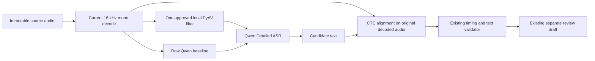

# Qwen Low-Clarity Sample Remediation

## 1. Goal and approval boundary

Determine whether a small, deterministic, local audio-conditioning step fixes
the Qwen transcript misses that the user identified on the bt10m and bt3m
LOTUSDIS examples without damaging the other microphone results or CTC timing.
Keep the Detailed route disabled until the worker, text, and timing gates pass.

This approved plan confines an offline experiment to the existing Qwen
candidate worker. It does not change the General `turbo`/`medium` route, live
transcription, committed transcript authority, the official LOTUSDIS manifest,
other microphone inputs, model weights, package contents, or external services.
The user approved this plan before implementation.

## 2. RCA summary and current evidence

The user reports that all five selected microphone files contain the same
utterance, heard as `ทาครีมแล้วก็ไปเรียนเลยอะไรเงี้ย`, and identifies Qwen
transcription errors on bt10m and bt3m. The official LOTUSDIS reference ends in
`อะไรอย่างนี้` and will remain untouched. The full 55-clip Qwen run beat Turbo
GPU on the existing relative WER/CER gate, but that gate has no absolute or
per-clip transcript-accuracy requirement.

The worker passes decoded source audio directly to Qwen. Its later Thai CTC
stage aligns the supplied Qwen text; it cannot repair wrong words. The pinned
candidate runtime already has PyAV 18.1.0 with local `afftdn` and `speechnorm`
filters available. No signal-quality analysis has isolated the reason for
these two errors, so this work tests those two existing filters rather than
assuming the user's low-clarity diagnosis identifies a specific noise source.

See the [Qwen miss RCA](../../.brain/rca/2026-09-30-qwen-bt-low-clarity-misses.md),
[current qualification report](../verification/implementation-reports/2026-09-30-qwen-thai-candidate.md),
[Qwen worker qualification plan](2026-09-30-qwen3-asr-fung-worker-qualification.md),
and [audio pipeline contract](../Desktop/AUDIO_AI_PIPELINE.md).

## 3. Proposed bounded experiment

1. Reproduce the current raw-audio outputs for the five paired microphone
   clips using the pinned Qwen revision and unchanged generation settings.
2. Test two candidate-only transforms independently: PyAV `afftdn` and
   `speechnorm`. Do not chain them in this experiment. Do not add packages or
   download another model.
   Select the mode through the candidate manifest's
   `/audio/preprocessingProfile` (`raw`, `afftdn`, or `speechnorm`); a missing
   field on an already-staged manifest means `raw`. The Rust worker passes the
   selected value to Python and rejects provenance that reports another mode.
3. Send each transformed in-memory copy to Qwen while retaining the original
   decoded audio. Run CTC alignment on the original audio and the resulting
   Qwen text so all timestamps refer to the source timeline. Reject a variant
   if duration/sample mapping changes, alignment fails, or its spans violate
   the existing `WhisperOutput` validator.
4. For all three variants (raw, `afftdn`, `speechnorm`), record outputs for
   all five mics. Score against both the untouched LOTUSDIS references and the
   five-row user-heard phrase sensitivity only. Do not replace corpus labels.
5. If a transform is promising, run it through the actual FUNG Rust worker on
   all 55 paired clips and recompute aggregate and per-mic WER/CER against
   both Turbo GPU and the unchanged raw-Qwen worker.

### Candidate data flow

## 4. Acceptance criteria

1. Reproduce the checked-in raw outputs for the five IDs before comparing any
   transform. Preserve the source WAV hashes.
2. Compare raw, `afftdn`, and `speechnorm` with the same ASR model revision,
   language, decode settings, GPU profile, and CTC aligner revision.
3. A candidate transform must correct the user-identified bt10m and bt3m
   content errors to the user's satisfaction, avoid new material errors in
   the other three spot checks, and pass qualitative timing review on all five
   source WAVs. No timestamp-accuracy claim is allowed without reference
   timestamps.
4. The selected transform must not worsen the 55-clip official-reference
   aggregate WER/CER or either metric in any microphone stratum against raw
   Qwen. It must also continue to beat Turbo GPU under the approved
   aggregate/per-mic comparison gate.
5. The actual FUNG worker must emit one nonblank prediction per ID, preserve
   source-bounded ordered nonzero spans, and pass the relevant Rust/Python
   tests, Desktop build, formatting, and diff checks.
   Newly staged manifests default to `raw`; the qualification worker remains
   unavailable unless the same profile is present in its result provenance.
6. If neither transform meets every gate, retain raw Qwen as benchmark evidence,
   keep Detailed unavailable, and record the negative result. Do not silently
   fall back to another model or auto-correct transcript text.

The five-row phrase sensitivity remains supplemental. The official
LOTUSDIS reference file and the existing official 55-clip score remain
unchanged. Passing this bounded experiment would not qualify full-corpus
accuracy, a holdout, long-recording soak, packaged runtime, or release.

## 5. Dependencies, impact, and risk

| Layer | Proposed impact |
| --- | --- |
| Parent Audio AI pipeline | Candidate-only use of already-present local PyAV filters; preserves the immutable source and existing transcript authority. Noise reduction remains optional and does not block General ASR. |
| Qwen worker | Adds an opt-in preprocessing variant and records its exact filter/profile in candidate provenance. Alignment remains on original source audio. |
| Scoring | Keeps the official LOTUSDIS evaluator/manifest intact and reports the user-heard phrase only as a five-row sensitivity. |
| Desktop / General / Mobile | No change to General/live route, Mobile, Genesis schema, or installer. |
| Dependencies / providers | No new model, package, network service, or provider. PyAV filter availability was verified in the pinned local runtime. |

Risk is **HIGH** because even candidate-side audio conditioning can change
lexical output and word timing. Complexity is **C-3** because the ASR input,
alignment source, provenance, and qualification contract must remain
consistent. No data migration is expected. A code change requires this plan
to be approved first.

## 6. Execution after approval

1. Implement the two isolated transforms and provenance in the Qwen worker;
   preserve raw input bytes and avoid changing General/live paths.
2. Add deterministic transform tests for repeatability, finite samples,
   unchanged duration, and unchanged source files; keep malformed results
   fail-closed.
3. Run the five-clip paired experiment and review outputs/timing. If no variant
   passes, stop and report without expanding scope.
4. Only for a promising variant, run the actual 55-clip Rust worker pilot,
   score official plus sensitivity references, and run the approved local
   verification campaign.
5. Update qualification results and keep Detailed disabled until every
   acceptance criterion passes.

## 7. Experiment outcome — 2026-10-01

The pinned Qwen ASR and Thai CTC revisions ran on the NVIDIA GeForce RTX 5060
Ti with all five source WAVs. `raw` reproduced the previous five transcripts
exactly, and the before/after SHA-256 hashes of all five source files match.
All three profiles emitted ordered, source-bounded CTC spans. This is
structural evidence only; there are no reference timestamps, and user timing
approval remains open.

| Profile | Official LOTUSDIS WER / CER | User-heard sensitivity WER / CER | BT3m / BT10m result | Decision |
| --- | ---: | ---: | --- | --- |
| `raw` | 27.50% / 24.12% | 22.50% / 16.13% | `ทันทีแล้วก็ไปเรียนเลย` / `พาทีแล้วก็ไปเรียนเลยอะไรอย่างเงา` | Reproduced baseline; misses remain. |
| `afftdn` | 32.50% / 32.94% | 27.50% / 21.29% | `ผ่านชีพแล้วก็ไปเรียนเลย` / `หาซีเขาก็ไปเรียนเลย` | Worse; rejected. |
| `speechnorm` | 27.50% / 24.12% | 22.50% / 16.13% | `ทันทีแล้วก็ไปเรียนเลย` / `ภาคีแล้วก็ไปเรียนเลยอะไรอย่างเงา` | Does not correct both misses; rejected. |

The official references remained `ทาครีมแล้วก็ไปเรียนเลยอะไรอย่างนี้`.
The user-heard phrase `ทาครีมแล้วก็ไปเรียนเลยอะไรเงี้ย` was used only for the
five-row sensitivity score. Neither transform met the acceptance gate, so the
55-clip Rust-worker filter pilot was not run. No preprocessing mode was
selected, the candidate remains `raw`, and Detailed routing remains disabled.
Full commands and machine-readable output are recorded in the
[qualification report](../verification/implementation-reports/2026-09-30-qwen-thai-candidate.md)
and the local run artifacts under
`C:\Users\pc\AppData\Local\FUNG\thai-asr-benchmark\lotusdis-th-2026-09\runs\qwen-low-clarity-remediation-20261001`.

## Version Diff

| Version change | Change |
| --- | --- |
| 0.1.2 → 0.1.3 | Recorded that neither built-in filter fixed both reviewed misses, preserved raw as the candidate baseline, and kept Detailed disabled. |
| 0.1.1 → 0.1.2 | Specified manifest selection, legacy raw default, and Rust-checked preprocessing provenance. |
| 0.1.0 → 0.1.1 | Recorded user approval and began the bounded candidate-only implementation. |
| none → 0.1.0 | Proposed a local, candidate-only PyAV preprocessing experiment for user-identified bt10m/bt3m errors, with source-audio preservation, CTC timing validation, official-reference protection, and fail-closed route gates. |
