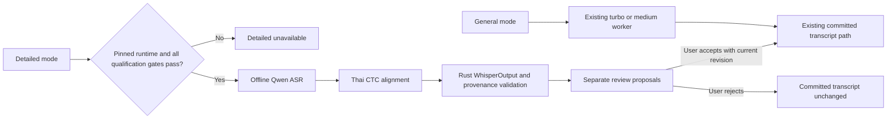

# Qwen3-ASR FUNG Worker Qualification

## 1. Goal and approval boundary

Integrate the pilot-selected Qwen3-ASR 1.7B into FUNG's isolated candidate
worker path, validate its output against FUNG's existing `WhisperOutput`
contract, and qualify a Thai CTC alignment feasibility path before enabling
Detailed-mode routing. Reproduce the paired LOTUSDIS pilot comparison against
the FUNG `large-v3-turbo` GPU worker.

This is an approved local-only implementation. It does not activate a network
service, change the General `turbo` route, change Genesis schemas, or add model
artifacts to an installer. It does not promote the candidate to production or
claim corpus-wide accuracy. Candidate output remains a separate Detailed-mode
draft and can reach the committed transcript only through the existing human
review path. Detailed routing stays disabled until every listed technical and
human-review gate passes.

The user's approval authorizes the listed local source changes, isolated
runtime staging, Qwen ASR and the named Thai CTC candidate download to the
candidate runtime, and one consolidated verification campaign. The CTC model
is a feasibility candidate, not an approved production aligner. FUNG
Detailed-mode routing may use it only after every acceptance gate in this plan
passes. Approval does not authorize provider activation, normal
application-bundle inclusion, or a release claim.

## 2. Current evidence and root of the gap

- The approved model-selection pilot selected `Qwen3-ASR-1.7B` at revision
  `bcd2b5b7f32b480ab5790554cfa8347f246a14f3`: 55/55 non-blank outputs, WER
  48.04%, CER 40.00%, and lower error than Turbo in all five microphone
  strata. This used standalone Transformers inference.
- FUNG has an opt-in Transformers worker and candidate runtime for
  `biodatlab/whisper-th-large-combined`, named `thai-large-candidate`. It is a
  different checkpoint and its 55-clip pilot result failed the selection gate.
- The FUNG detailed-worker entry point currently invokes that Biodatlab worker
  with CPU execution. It parses the existing `WhisperOutput` JSON and uses
  candidate time spans to match draft text against committed transcript
  segments.
- Qwen's official forced-aligner card lists 11 supported languages; Thai is
  not among them. Qwen ASR output in the local pilot was text-only. The earlier
  plan's assumption that this aligner could provide Thai timestamps was
  unsupported and is withdrawn.
- `wannaphong/wav2vec2-large-xlsr-53-th-cv8-newmm` is a possible local CTC
  source: its model card documents Thai, `AutoModelForCTC`, Apache-2.0, and
  PyThaiNLP word-tokenized training labels. That establishes model/task
  compatibility only; it does not establish forced-alignment support,
  transcript-to-vocabulary mapping, or usable timing for Qwen text.
- The current candidate runtime, Qwen pilot harness, and official Qwen runtime
  dependency set are not yet one reproducible, pinned FUNG worker environment.

Evidence references: [model-selection qualification](../specs/2026-09-30-thai-asr-model-selection-qualification.md),
[model-profile contract](../specs/2026-09-21-whisper-model-profiles.md),
[Desktop progress](../Desktop/08-real-progress.md),
[official Qwen3-ASR repository](https://github.com/QwenLM/Qwen3-ASR),
[official ASR model card](https://huggingface.co/Qwen/Qwen3-ASR-1.7B), and
[official forced-aligner model card](https://huggingface.co/Qwen/Qwen3-ForcedAligner-0.6B-hf),
[Thai CTC candidate model card](https://huggingface.co/wannaphong/wav2vec2-large-xlsr-53-th-cv8-newmm),
and [Thai alignment design RCA](../../.brain/rca/2026-09-30-qwen-thai-alignment-plan-gap.md).

## 3. Approved implementation contract

1. Add an explicit candidate identity for Qwen3-ASR 1.7B. Keep
   `thai-large-candidate` as the separate Biodatlab candidate. Neither
   candidate may become the default General profile. The Detailed flow uses
   Qwen only after its worker and alignment gates pass; otherwise it remains
   unavailable and fails closed.
2. Stage Qwen and the Thai CTC feasibility candidate in their own local
   candidate runtime with a pinned Python/dependency manifest. Do not reuse or
   mutate `.venv-whisper`. Load both checkpoints from local paths only, with
   Hugging Face offline mode enabled. Record exact repository revisions,
   license references, selected files, sizes, and SHA-256 hashes in the
   candidate manifest.
3. Pin the ASR checkpoint to the model-selection revision above. Pin the
   `wannaphong/wav2vec2-large-xlsr-53-th-cv8-newmm` to revision
   `18381b4cfbe8b2e7462827f2c6dea681a31ef5b9`. If either model/dependency
   revision cannot be pinned or loaded offline, stop without modifying an
   existing runtime.
4. First qualify whether the Thai CTC candidate can produce frame-level
   alignment paths for Qwen text. Validate the candidate vocabulary and Thai
   text normalization/tokenization mapping; reject ambiguous or out-of-vocab
   targets. Normalize alignment targets with NFC plus only the validated
   Thai sequence replacement `U+0E4D U+0E32` → `U+0E33`; preserve the original
   Qwen text byte-for-byte in emitted segment text. Compare candidate
   alignment spans with source audio on the fixed LOTUSDIS pilot, and review
   at least one clip from each microphone stratum. This model is not an
   independent reference transcript and its own ASR accuracy is not an
   alignment-quality measure. If any gate fails, retain Qwen as text-only
   benchmark evidence and do not route it into Detailed mode.
5. Only after that feasibility gate passes, convert Qwen output to the existing
   `WhisperOutput` shape:
   `durationMs` and ordered `segments` containing `startMs`, `endMs`, `text`,
   and nullable `confidence`. Use the qualified Thai CTC path for timing; do
   not synthesize whole-file timestamps when alignment fails. Use PyThaiNLP
   `newmm` boundaries for target construction only if validated by the
   feasibility gate, then map aligned tokens back to the original ASR text
   without changing its canonical spelling. Refuse Detailed proposals if that
   mapping is ambiguous or the emitted segment texts do not concatenate back
   to the original Qwen transcript after the documented whitespace handling.
6. Reject malformed output: blank candidate rows, negative/out-of-range times,
   zero-duration, reversed or non-finite times, unordered spans, or a mismatch
   between the aligned text and the ASR text after the documented
   normalization. Never repair an invalid span by adding an arbitrary
   millisecond. A failed alignment may still be retained as benchmark text
   evidence, but it cannot enter the Detailed proposal path.
7. Record the Qwen backend, ASR revision, Thai CTC revision, and device in
   candidate provenance. Keep the current expected-revision and human-review
   checks. Do not write candidate text directly to committed transcript rows.
8. Keep model/runtime artifacts outside normal packaging. Package inclusion is
   a separately approved release decision.

No transcript schema, Genesis authority, external-provider path, or live
transcription route changes are included.

### Worker boundary

## 4. Acceptance criteria

### Worker and alignment

1. Unit/contract tests cover routing to the Qwen worker, missing-runtime
   fail-closed behavior, offline local-path loading, `WhisperOutput` parsing,
   CTC vocabulary/Thai text mapping, preservation of the original Qwen text,
   and invalid/missing timestamp rejection.
2. Before enabling Detailed routing, the Thai CTC feasibility run must align
   the pinned Qwen text for all 55 paired LOTUSDIS clips: every target token is
   covered exactly once in order, each span is bounded by its source clip,
   spans are nonzero-duration and nondecreasing, and no timing is synthesized.
   Review one clip per microphone stratum against its source audio. This checks
   feasibility and qualitative timing only; there are no reference timestamps
   to calculate alignment error.
3. The production FUNG Detailed worker path completes the 55 paired LOTUSDIS
   clips using the pinned ASR and aligner artifacts. It emits exactly one
   prediction for every reference ID, no blank text, and spans satisfying
   `0 <= startMs < endMs <= durationMs` in nondecreasing order for every
   non-empty prediction.
4. Thai alignment preserves the normalized ASR text and maps every emitted
   span within the source audio duration and the chunk's recording offset.
   Review one clip from each microphone stratum against its source audio.
   This is qualitative alignment review; no word-timing accuracy claim is made
   without reference timestamps.
5. In a Detailed-mode fixture, Qwen creates review proposals only. The
   committed transcript remains unchanged until an accepted proposal passes
   the existing expected-revision check.

### Accuracy and consolidated verification

6. Recompute WER with the LOTUSDIS reference evaluator's normalization,
   PyThaiNLP `newmm`, and Jiwer. Recompute CER with the approved pilot
   normalization. Score the same 55 IDs/audio and references against the
   Turbo GPU baseline.
7. The FUNG-worker Qwen output meets the approved pilot selection gate:
   aggregate WER and CER lower than Turbo and neither metric worse in any of
   the five microphone strata. If it fails, do not select Qwen for Detailed
   mode, regardless of the standalone pilot score.
8. Re-run the relevant Rust, Python-worker, and Desktop suites plus build,
   formatting, and diff checks together after implementation. Record the exact
   commands, model/dependency revisions, device, latency, metrics, output
   completeness, source hashes, and all environment limitations.

### Qualification evidence recorded 2026-09-30

The pinned FUNG worker passed the 55-clip LOTUSDIS structural and text-quality
gates: 55/55 outputs, no blank predictions, 364 ordered source-bounded
nonzero segments, and exact text parity with standalone Qwen. Qwen scored
48.04% WER / 40.00% CER versus Turbo GPU at 72.83% / 59.55%; both metrics
were lower in each of the five microphone strata. The consolidated local
Rust, Python, and Desktop checks passed. See the [qualification report](../verification/implementation-reports/2026-09-30-qwen-thai-candidate.md)
for commands, hashes, and per-microphone scores.

The user listened to the five same-utterance microphone examples and reported
the spoken phrase as `ทาครีมแล้วก็ไปเรียนเลยอะไรเงี้ย`, while the official
LOTUSDIS reference says `ทาครีมแล้วก็ไปเรียนเลยอะไรอย่างนี้`. The user
identified Qwen text errors on bt10m and bt3m due to unclear audio. Word-level
CTC timing was not explicitly reviewed. The approved five-clip `afftdn` and
`speechnorm` experiment completed on 2026-10-01: neither transform corrected
both clips, and `afftdn` worsened the five-clip WER/CER. No filter was selected;
raw remains the baseline and the official corpus reference is unchanged. The
manifest records `microphoneSpotChecks=partial-human-review` and
`detailedRouting=false`; timing review and a qualifying remediation remain
required before this Qwen Detailed route can be enabled. Detailed results and
the separate sensitivity calculation are in the
[qualification report](../verification/implementation-reports/2026-09-30-qwen-thai-candidate.md).

Passing this plan qualifies only the pinned local FUNG batch/Detailed worker on
the bounded pilot. Full LOTUSDIS evaluation, untouched-holdout accuracy,
long-recording soak, native device acceptance, application packaging, and
release remain separate gates.

## 5. Dependencies and impact

| Layer | Impact |
| --- | --- |
| Parent architecture | Preserves Desktop-first local inference, job/worker boundary, Genesis as the only persistence authority, and local-first defaults. No architecture or schema change. |
| Peer model-profile contract | Adds a separately identified Qwen candidate and changes the Detailed candidate only after qualification. Existing General turbo/medium behavior stays unchanged. |
| Rust worker routing | Adds candidate-specific runtime/script resolution and records Qwen provenance; preserves fail-closed behavior and current transcript review authority. |
| Python/runtime | Adds a Qwen worker, an isolated pinned dependency environment, and ASR plus aligner model artifacts. Requires dependency/license/hash and disk/RAM/GPU preflight. |
| Packaging/release | No artifact inclusion or release qualification in this work. |

Risk is **HIGH** because this adds a second model family/artifact, a CTC
alignment feasibility path, a candidate runtime, and candidate
process-selection behavior. No database migration is expected. If
implementation requires changing transcript schema or Genesis ownership,
stop and propose a plan amendment first.

## 6. Proposed execution sequence

1. **Passed.** Pin and preflight ASR, Thai CTC candidate and Python dependencies; verify
   disk, RAM and GPU capacity before staging model files.
2. **Structural checks passed; audio review pending.** Implement and run the isolated CTC alignment feasibility spike against the
   paired LOTUSDIS clips. Stop before Detailed routing if its gate fails.
3. **Passed.** If feasibility passes, implement the isolated runtime manifest, worker,
   output validator and Rust candidate routing; add deterministic fixture
   tests.
4. **Passed.** Once implementation and documentation are complete, run one consolidated
   local test/build campaign that includes the production FUNG worker on the
   fixed 55-clip pilot, output-contract checks, and WER/CER plus per-microphone
   scoring.
5. **Partial review; remediation needed.** User listening found transcript
   errors on bt10m and bt3m. Review CTC timing placement and address the
   low-clarity recognition errors before considering Detailed routing.
6. **Recorded.** Update the model-profile contract, Desktop progress and qualification
   report with exact results and remaining boundaries.

## Version Diff

| Version change | Change |
| --- | --- |
| none → 0.1.0 | Proposed isolated Qwen3-ASR 1.7B FUNG worker integration, forced-alignment validation, Detailed-mode draft boundary, and a production-worker LOTUSDIS pilot acceptance gate. |
| 0.1.0 → 0.1.1 | Removed the unsupported Thai Qwen ForcedAligner assumption; proposed a Thai CTC feasibility gate before any Detailed-mode integration and documented the alignment RCA. |
| 0.1.1 → 0.1.2 | Pinned the Thai CTC candidate revision and specified the single Thai Unicode compatibility mapping for alignment targets while preserving emitted Qwen text. |
| 0.1.2 → 0.1.3 | Recorded user approval, isolated runtime staging, implementation state, and fail-closed routing gates; qualification and consolidated verification remain in progress. |
| 0.1.3 → 0.1.4 | Recorded the passing 55-clip FUNG worker and LOTUSDIS WER/CER qualification, consolidated local checks, and the five remaining human audio reviews; Detailed routing remains disabled. |
| 0.1.5 → 0.1.6 | Recorded the negative low-clarity filter experiment; the original accuracy comparison remains separate and Detailed stays disabled. |
| 0.1.4 → 0.1.5 | Recorded user listening evidence of bt10m/bt3m transcription errors, the discrepancy between heard speech and LOTUSDIS reference, and a separate five-row sensitivity score; timing approval and remediation remain open. |
