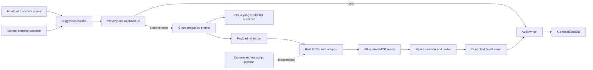
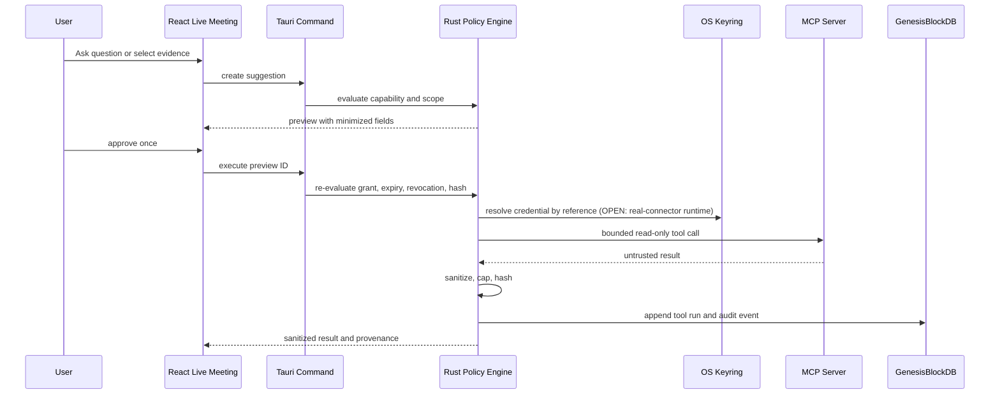
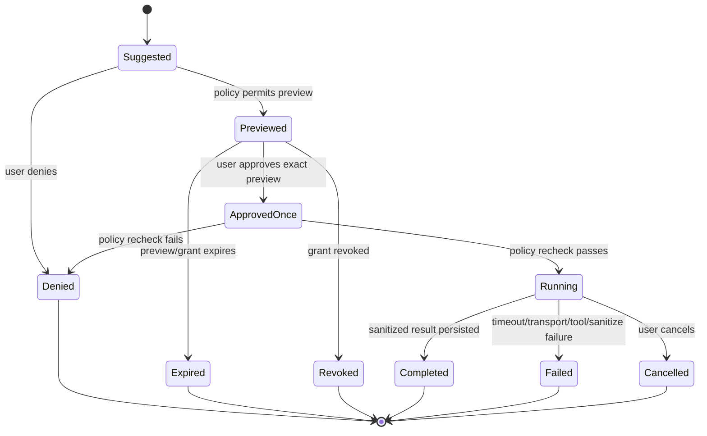

# Live Meeting External Retrieval — Security and Technical Design

## Architecture Decision

Implement a FUNG-native, read-only external MCP client behind the existing Tauri/Rust control plane. The React UI never opens an MCP/network connection and never receives credentials. GenesisBlockDB remains the sole persistence boundary. OS keyring owns secrets.

Call.md remains an interaction reference only. No Electron, tRPC, VideoDB, component source, branding, or automatic transcript-trigger execution is adopted.

## Design Goals

- Answer document-location and CRM-status questions without stopping the meeting.
- Preserve capture/transcript durability when every intelligence or connector dependency fails.
- Make every byte leaving the device visible and approved in the first release.
- Preserve stable evidence, policy, connector, tool, and result provenance.

## Non-Goals

- External writes, webhook delivery, autonomous actions, screen capture, calendar automation, vendor-specific connectors, or full-transcript egress.
- A second database, Node/Electron runtime, direct SQLite handle, or browser-owned credential store.
- Treating MCP output as trusted or as verified fact.

## Component Architecture

## Components

| Component | Responsibility | Must not do |
|---|---|---|
| Suggestion builder | Convert a manual question/selected span into a proposed capability and minimal arguments | Execute or authorize a tool |
| Connector catalogue | List allowlisted servers, transports, read capabilities, schema, health, and data class | Store secret values |
| Preview coordinator | Display exact tool, connector, arguments/fields, selected evidence, expiry, and policy | Hide implicit fields or auto-confirm |
| Grant/policy engine | Enforce default deny, capability, project/meeting, expiry, revocation, read-only, and per-call confirmation | Trust server-advertised write safety |
| Payload minimizer | Construct the approved request and reject audio/full transcript/unapproved fields | Expand context silently |
| MCP client adapter | Execute bounded MCP initialize/list/call over approved stdio or Streamable HTTP transport | Run on capture/UI thread or bypass policy |
| Result sanitizer | Cap bytes/depth/items, strip active HTML/scripts/file URLs, normalize text and links | Render server output directly |
| Audit/provenance writer | Persist decision, refs, hashes, timestamps, outcome, and non-secret diagnostics | Store credential or raw full transcript |
| Result panel | Show origin, retrieval time, policy, sources, sanitized data, failure/retry controls | Present output as verified fact |

## Runtime Boundary

The preview hash binds connector ID, tool name, normalized arguments, selected evidence refs, approved fields, capability, meeting/project, and expiry. Execution rejects any changed preview.

## Transport Decision

The connector catalogue may describe:

- `stdio`: local executable from an explicit allowlist with an absolute path and fixed arguments.
- `streamable_http`: HTTPS or loopback endpoint from an explicit host allowlist.

Sprint 3 ships only the stdio transport, using MCP protocol revision `2025-11-25`: UTF-8 newline-delimited JSON-RPC, `initialize`, `notifications/initialized`, `tools/list`, then one allowlisted `tools/call`. The executable must be an absolute existing path, the child environment is cleared, stdout/stderr are bounded, and timeout/cancellation kill and reap the process. Streamable HTTP remains disabled and unimplemented. The policy/result contracts remain transport-independent.

## Capability Model

Initial capabilities are semantic, not vendor-specific:

| Capability | Example tool behavior | Data class | Side effect |
|---|---|---|---|
| `documents.search` | Find document metadata by approved query terms | selected meeting text | read-only |
| `documents.get_metadata` | Read title, location, owner, modified time, and approved link | document ID | read-only |
| `crm.customer_status.read` | Read approved status fields for one customer key | customer key and field allowlist | read-only |

All other capabilities, including server-advertised create/update/delete/send tools, are hidden and denied.

## Policy State Machine

## Persistence Design

Reuse `external_connections` for non-secret account/connector identity after a schema extension. Add Genesis-owned entities:

| Entity | Required fields |
|---|---|
| `meeting_tool_grants` | id, project_id, recording_id, connector_id, capabilities_json, granted_at, expires_at, revoked_at |
| `external_tool_previews` | id, project_id, recording_id, connector_id, tool_name, capability, arguments_hash, approved_fields_json, evidence_refs_json, state, expires_at, created_at |
| `external_tool_runs` | id, preview_id, project_id, recording_id, connector_id, tool_name, capability, request_hash, output_hash, status, started_at, finished_at, error_code, result_ref |
| `external_tool_results` | id, run_id, mime_type, sanitized_payload_json, source_refs_json, byte_size, created_at |

Continue using `audit_events` for policy decisions and lifecycle events. Store only a keyring service/account reference on the connector record. Never store credential values in GenesisBlockDB.

Schema migration must use the registered Genesis relational package and normal adapter path. Application code must not open SQLite directly.

## Tauri Command Surface

| Command | Purpose | Output |
|---|---|---|
| `external_connectors_list` | List allowlisted connector health/capabilities | non-secret connector summaries |
| `external_connector_register` | Validate config and store credential in keyring | connector ID/status |
| `external_connector_disconnect` | Revoke grants, remove keyring secret, retain audit | disconnected status |
| `meeting_tool_suggest` | Build policy-evaluated preview from question/evidence | preview object; no network call |
| `meeting_tool_execute` | Execute one exact approved preview | run ID/result or bounded error |
| `meeting_tool_cancel` | Cancel a running read | terminal state |
| `meeting_tool_revoke` | Revoke meeting/project grant | revocation receipt |
| `meeting_tool_runs_list` | Read local audit/result history | sanitized summaries |

Except for `external_connector_register`, no command accepts a raw credential. `external_connector_register` may receive one optional transient credential only to write it directly to the OS keyring; it is then zeroized/dropped and is neither persisted nor logged. All other commands use non-secret connector, preview, grant, or run identifiers and approved arguments only.

Current code proves the transient-registration and keyring-reference lifecycle, but does not prove credential resolution/use during production stdio execution: `meeting_tool_execute` builds its stdio configuration from non-secret connector metadata without calling `resolve_connector_credential`. Resolving and using a stored credential for a real connector is therefore an explicit open real-connector/UAT gate, not an implemented execution claim.

Sprint 4 registers all eight commands. Suggest, execute, and registration return `CAPABILITY_DENIED` unless backend flag `FUNG_EXTERNAL_MEETING_TOOLS=1`; the React surface is independently absent unless `VITE_FUNG_EXTERNAL_MEETING_TOOLS=1`. Both defaults are OFF. Registration accepts only an absolute existing stdio executable, the three semantic read capabilities, non-secret connector metadata, and a transient optional credential that is written to the OS keyring. Execution accepts the exact approved arguments again, recomputes the preview hash, and never persists raw arguments.

## UI Design

### Live Meeting

The Sprint 4 Live Meeting panel includes a bounded “ค้นด้วยเครื่องมือภายนอก” surface beside “ถาม FUNG”:

1. Suggestion card: why it appeared and selected evidence.
2. Preview sheet: connector, tool, capability, fields leaving device, expiry, and per-call approval.
3. Running state: cancellable, capture-independent.
4. Result card: source/tool/time/policy/evidence before sanitized content.
5. Failure state: states whether local capture/transcript remain safe.

### Settings

The first operator surface includes a local stdio connector catalogue, approved capabilities, credential-reference status, register, meeting-scope revoke, and disconnect. Never reveal the stored secret. Detailed health diagnostics remain part of real-connector UAT.

### Accessibility

Approval, denial, cancel, source inspection, link opening, and dismissal are keyboard-operable with visible focus. State uses text plus color. The result panel traps no focus and returns focus to the invoking control when closed.

## Security Architecture

### Threats and Controls

| Threat | Control |
|---|---|
| Transcript keyword causes unintended action | Suggest-only; execution requires exact preview approval |
| Prompt/tool injection in transcript | LLM output cannot grant; policy derives capability from allowlist and user action |
| Malicious MCP server advertises write tool | Semantic read-only capability allowlist; reject side-effect tools |
| Secret leakage | OS keyring; structured redaction; no secret serialization/logging/export |
| Over-broad data egress | Field/evidence preview, payload minimizer, request-hash binding |
| Result XSS/link abuse | Sanitizer, no active HTML/scripts/file URLs, explicit external-link confirmation |
| DNS/redirect exfiltration | Endpoint allowlist, redirect denial/revalidation, HTTPS remote only |
| Run after revoke/expiry | Policy recheck immediately before connect/call |
| Resource exhaustion | 15-second timeout, 256 KiB result cap, depth/item limits, cancellation |
| Capture disruption | Separate bounded worker; no capture lock/thread dependency |

## Error Handling

Stable error codes:

- `CONNECTOR_NOT_FOUND`
- `CONNECTOR_UNHEALTHY`
- `CAPABILITY_DENIED`
- `APPROVAL_REQUIRED`
- `PREVIEW_CHANGED`
- `GRANT_EXPIRED`
- `GRANT_REVOKED`
- `WRITE_TOOL_DENIED`
- `EGRESS_FIELD_DENIED`
- `TOOL_TIMEOUT`
- `TOOL_CANCELLED`
- `RESULT_TOO_LARGE`
- `RESULT_UNSAFE`
- `KEYRING_UNAVAILABLE`

Errors shown during a meeting must explicitly state that local recording/transcript remain safe when that is true.

## Observability and Audit

Record structured, non-secret events for suggestion, preview, deny, approve, execute, cancel, timeout, failure, completion, revoke, and disconnect. Include correlation/run ID, connector ID, capability, tool name, project/recording, evidence IDs, field names, request/output hashes, timestamps, duration, result byte count, and error code.

Do not record credential values, auth headers, full transcript/audio, unrestricted arguments, or raw unsanitized output.

## Testing Strategy

### Unit

- Policy matrix, expiry/revoke, read/write classification, preview hash, minimizer, redactor, sanitizer, limits, error mapping.

### Contract

- MCP initialize/list/call fixtures for stdio/HTTP, invalid schema, redirect, timeout, cancellation, oversized/hostile output.

### Integration

- Genesis schema/migration, keyring reference lifecycle, audit chain, connector kill/restart, duplicate execution/idempotency.

### UI

- Suggest/preview/deny/approve/result/failure states, keyboard/focus, Thai copy, 1200 × 780 layout, reduced motion.

### End-to-End

- Local document fixture lookup.
- Mock CRM read-only status lookup.
- Zero-byte-before-approval network assertion.
- Secret leak scan.
- Connector failure while capture continues.
- Restart and inspect persisted provenance/result.

## Feature Flags and Rollout

| Flag | Default | Removal gate |
|---|---|---|
| `externalMeetingTools` (`FUNG_EXTERNAL_MEETING_TOOLS=1` backend plus `VITE_FUNG_EXTERNAL_MEETING_TOOLS=1` UI) | OFF | All denial, revoke, minimization, sanitizer, secret, and capture-isolation gates pass |
| `externalMcpHttp` | OFF | TLS/allowlist/redirect/security review passes |
| `meetingToolSuggestions` | OFF | Thai false-positive evaluation and dismissibility UAT pass |

Roll out local fixture connector first, then one operator-configured read-only MCP server. No provider-specific production connector ships in this scope.

## Dependencies

- `LIVE_MEETING_EXTERNAL_RETRIEVAL_REQUIREMENTS.md`
- `ARCHITECTURE.md`
- `CALLMD_ARCHITECTURE_COMPARISON.md`
- `DESIGN.md`
- `contracts/local-mcp-v1.yaml`
- GenesisBlockDB schema/adapter
- OS keyring
- Live Meeting panel and meeting-intelligence runtime

## Open Review Items

- First transport is confirmed as stdio only; Streamable HTTP remains disabled and unimplemented.
- The runtime-boundary credential-resolution step is a target behavior only: current production stdio execution does not demonstrate resolving or using a stored credential. Treat credentialed real-connector execution as open until its focused evidence and UAT exist.
- Sprint 4 renders source references as inert text. Any future external-link opening must add explicit confirmation before navigation.
- Select the real MCP server used for UAT; vendor-specific product integration remains out of scope.

These items affect task ordering and UAT fixtures but do not weaken default-deny, per-call approval, read-only, minimization, or keyring requirements.

## Version Diff

| Version | Change |
|---|---|
| 0.1.3b | Clarified the transient registration credential exception and marked credential resolution/use in production stdio execution as an open real-connector/UAT gate. |
| 0.1.2b | Recorded the Sprint 4 eight-command boundary, independently default-off backend/UI flags, local stdio connector lifecycle, operator preview/approve/cancel/revoke/result workflow, and inert sanitized provenance rendering while retaining real-connector, HTTP, and device UAT gates. |

## CHANGELOG

| Version | Date | Status | Summary | Commit Hash | Agent |
|---|---|---|---|---|---|
| 0.1.3b | 2026-08-12 | candidate | Clarified transient credential registration and the open execution-use boundary. | pending | ATHER |
| 0.1.2b | 2026-08-11 | candidate | Truth-synced Sprint 4 connector and operator UI boundaries. | pending | ATHER |
| 0.1.1b | 2026-08-11 | candidate | Truth-synced bounded stdio MCP execution and default-off command boundary. | pending | ATHER |
| 0.1.0b | 2026-08-11 | candidate | Added security and technical design for read-only external MCP retrieval during Live Meeting. | pending | ATHER |
