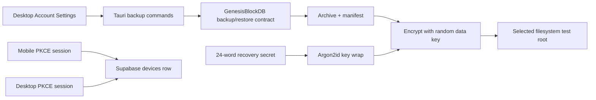

# Phase 4 — Filesystem Test Backup and Mobile Account Design (Superseded)

Google Drive was canceled on 2026-09-17. This document remains as historical
design provenance; the active Phase 4 target is local encrypted filesystem
backup/restore plus mobile account/device work. No Drive implementation,
provider deployment, or Drive UAT may be started from this document.

## Decision Record

| Decision | Approved v1 choice |
| --- | --- |
| Production storage target | No active cloud target; Google Drive was canceled |
| Development/test storage target | User-selected local filesystem root only; encrypted archives and non-secret manifests only |
| Drive permission | Not applicable to the active product |
| Archive scope | Full Genesis export plus Genesis-managed audio/blob artifacts |
| Recovery | User-held 24-word recovery secret; never device-only |
| Backup authority | Desktop only; mobile account work is identity/device reconciliation, not a second backup writer |

The initial filesystem adapter exists solely to exercise an encrypted archive
and clean-target restore path without provider OAuth. It must use a root chosen
through the native folder picker, write only below that root, and be labelled
"Development/Test local storage". It is not cloud storage, sync, or a
production recovery claim.

## Architecture

The desktop process is the sole v1 archive producer and restorer. It calls a
new GenesisBlockDB-owned export/restore contract; FUNG code does not inspect or
mutate Genesis SQLite, graph, vector, or blob projections directly. The local
filesystem is only a test transport for an already-encrypted archive.

### Approved development/test layout

- Storage root: `D:\FUNG-Phase4-TestStorage\FUNG-DEV-TEST`
- Completed archive: `archives\<archive-id>.fungbk`
- Non-secret manifest: `manifests\<archive-id>.manifest.json`
- Same-filesystem temporary write: `staging\<archive-id>.partial`
- Clean restore parent: `D:\FUNG-Phase4-TestRestore`
- Restore target: `restore-<archive-id>` beneath that parent; it is created
  only by successful Genesis restore and therefore must not exist beforehand.

These roots are outside the Git checkout, contain no source data at setup, and
are labelled development/test only. The runtime still obtains a user-selected
root through the native folder picker; these are the initial approved proof
locations, not web-supplied paths.

## Archive and Cryptography

### Proposed envelope

1. GenesisBlockDB creates a consistent full-export snapshot and returns its
   manifest plus managed artifacts through its own contract.
2. FUNG creates a versioned archive manifest containing archive ID, format
   version, source manifest digest, artifact inventory, byte size, creation
   timestamp, and encryption parameters. It contains no OAuth token or
   recovery secret.
3. FUNG generates a random 256-bit data-encryption key and encrypts archive
   payloads using an authenticated streaming AEAD implementation. The proposed
   v1 primitive is XChaCha20-Poly1305 with unique nonces and manifest metadata
   bound as associated data.
4. The 24-word recovery secret is converted to key material using Argon2id with
   versioned, stored salt and cost parameters. It wraps the random data key;
   the recovery secret is never stored after the setup/recovery interaction.
5. The encrypted archive, encrypted data-key envelope, and manifest are
   written together beneath the selected test root. Only an atomically
   completed write whose bytes match the manifest is marked `verified` locally.

The selected primitive parameters, word-list source, streaming library, and
memory/time cost must be pinned in the implementation plan and covered by test
vectors before code begins. The design intentionally does not invent crypto.

### Restore sequence

1. User selects a FUNG archive discovered beneath the previously selected test
   root. The UI states that this is development/test local storage.
2. FUNG downloads to a temporary location, verifies archive format and digest,
   derives the wrapping key from the entered recovery secret, and authenticates
   the envelope before invoking Genesis restore.
3. GenesisBlockDB performs restore into a clean target. FUNG compares the
   restored Genesis manifest, notes, graph identities, and artifact inventory
   to the source manifest before reporting success.
4. Any failure leaves existing local state untouched and reports a non-secret
   terminal reason. There is no in-place overwrite restore in v1.

## Filesystem Test Transport

- Select the root only through Tauri's native folder picker; no arbitrary path
  supplied by the web UI is accepted.
- Create a FUNG-owned child folder and canonicalize every archive path before
  write or read. Reject traversal, symlink escape, and files outside the
  selected root.
- Write an encrypted archive to a temporary file in the same filesystem, flush
  it, verify the digest, then atomically rename it into the FUNG-owned folder.
- Store only non-secret destination metadata locally: selected-root identifier,
  archive ID, relative filename, digest, byte count, and terminal state.
- A missing, moved, or unreadable root reports an unavailable destination; it
  never infers deletion of Genesis data.

## Historical Google Drive Production Transport — CANCELED

The former Drive transport was never an active product target after the
2026-09-17 cancellation. Do not create OAuth clients, request Drive scopes,
store Drive credentials, deploy Drive functions, or run provider UAT from this
document. Any previously written provider details are historical provenance
only; local encrypted filesystem backup is the active transport.

## Account and Device Reconciliation

The Phase 1 Supabase PKCE session and `devices` table remain authoritative for
both surfaces. On mobile startup, a valid session reuses the existing
`fung.device.id` only after verifying the row still belongs to the current
user; otherwise it registers one Android row and refreshes the local cache.
Missing, expired, or revoked sessions show signed-out/degraded state and do not
create a device row or remote backup work. Sign-out/revocation clears only the
local auth/device cache allowed by the existing contract and does not infer
deletion of any external historical data.

## Failure and Security Model

| Condition | Required response |
| --- | --- |
| Genesis backup/restore contract missing | Disable backup/restore and state that U9 is blocked. |
| Selected test root missing/unreadable | Mark destination unavailable; retain local data and verified history. |
| Filesystem write interruption | Keep the previous verified archive; remove or quarantine the unverified temporary artifact without claiming a backup. |
| Digest/AEAD/recovery-secret failure | Stop before Genesis mutation; preserve current local state. |
| Local test archive unavailable | Show non-restorable status; do not infer that local source was deleted. |
| Duplicate/stale mobile device cache | Reconcile against the current signed-in user's `devices` row; do not trust cache alone. |

## Test Strategy

- Genesis contract tests: deterministic full-export fixture and clean-target
  restore prove note, graph, and artifact identity.
- Crypto tests: known vectors, wrong-secret rejection, tamper rejection, nonce
  uniqueness, and no secret serialization scan.
- Filesystem adapter tests: root canonicalization, traversal/symlink rejection,
  atomic-write interruption, digest mismatch, and missing-root truth state.
- UI tests: local backup progress, failed backup truth, explicit
  recovery-secret acknowledgement, and restore confirmation.
- Account tests: desktop/mobile session restoration, duplicate-device prevention,
  stale cached ID recovery, and revoked session behavior.
- Controller/UAT: clean-install desktop restore from a filesystem test archive;
  Android/mobile account and Dashboard identity check. Passing automated tests
  alone does not close U9 or release gates.

## Implementation Gates

1. Boss approves this design and the task plan derived from it.
2. GenesisBlockDB provides/reviews the required backup and clean-target restore
   contract; until then, Phase 4 implementation may only expose an unavailable
   state, not a mock archive.
3. Boss confirms a non-production filesystem test root and a separate clean
   restore target. No cloud-provider setup is required for this test-only
   destination.
4. The implementation runs as an isolated, documented Phase 4 branch/worktree;
   no code is mixed into the still-open Phase 3 controller acceptance work.

## Requirements Traceability

| Requirements | Design section |
| --- | --- |
| R4-01, R4-07, R4-07a, R4-10 | Filesystem test transport; Failure model |
| R4-02, R4-04, R4-06 | Architecture; Archive; Failure model |
| R4-03, R4-05 | Archive and Cryptography; Restore sequence |
| R4-07, R4-08, R4-09 | Historical provider decision; canceled and not active |
| R4-11, R4-12, R4-13 | Account and Device Reconciliation |

## Version Diff

| Version | Change |
| --- | --- |
| 0.2.3b | Google Drive scope canceled; this design is superseded and local filesystem backup is the active Phase 4 target. |
| 0.2.2b | Selected named development/test storage and clean-restore locations with an encrypted-only file layout. |
| 0.2.1b | Boss approved the bounded filesystem development/test transport; Google Drive production transport remains TODO and Genesis contract remains mandatory. |
| 0.2.0b | Proposed filesystem transport for development/test only; Google Drive production transport is TODO. Genesis contract remains mandatory. |
| 0.1.1b | Approved Google Drive v1 design; implementation remains gated by the task plan and controller prerequisites. |
| 0.1.0b | Initial Google Drive v1 technical design; code and external configuration remain gated. |

## CHANGELOG

| Version | Date | Status | Summary | Commit Hash | Agent |
| --- | --- | --- | --- | --- | --- |
| 0.2.3b | 2026-09-17 | superseded | Canceled Google Drive scope and retained this design as historical provenance; no provider implementation or UAT may start from it. | a9f9b80 | Codex |
| 0.2.2b | 2026-08-14 | beta | Added approved external dev/test roots and exact encrypted archive naming; no production provider work. | N/A | ATHER |
| 0.2.1b | 2026-08-13 | beta | Filesystem test transport approved; no implementation authority before Genesis U9 contract. | N/A | ATHER |
| 0.2.0b | 2026-08-13 | candidate | Proposed bounded filesystem test transport and deferred Google Drive production adapter. No implementation authority. | N/A | ATHER |
| 0.1.1b | 2026-08-13 | beta | Design approved; no implementation authority until task plan approval. | N/A | ATHER |
| 0.1.0b | 2026-08-13 | draft | Approved-option design proposal; no implementation authority. | N/A | ATHER |
