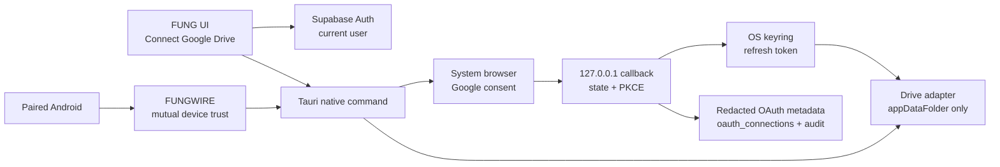

# Phase 4 — Google Drive OAuth + IAM + Device Handshake Specification

| Field | Value |
|---|---|
| Version | 0.2.1b |
| Status | Approved — local implementation beta; external provider/device gates remain open |
| Complexity | C-3 — Architecture-Driven Implementation |
| Change risk | HIGH — OAuth tokens, account ownership, device authorization, backup/restore |
| Author | ATHER |
| Product owner | Boss |
| Parent architecture | `docs/Desktop/ARCHITECTURE.md` |
| Parent plan | `docs/plans/2026-08-09-fung-master-implementation-plan.md` |
| Phase plan | `docs/plans/2026-08-13-phase-4-google-drive-backup-mobile-account.md` |
| Peer contract | `docs/Mobile/OAUTH2_JWT_AUTHORIZATION_SPEC.md` |
| Current implementation status | Native PKCE/keyring adapter, fail-closed callback/provider validation, Supabase metadata function, and Desktop UI are implemented locally; real Google OAuth/Drive UAT is not yet proven |

## 1. Decision summary

FUNG ต้องมี OAuth handshake และ IAM enforcement สำหรับ Google Drive แต่ไม่สร้าง
ระบบ identity หรือ IAM ชุดใหม่ โดยใช้ boundary เดิมดังนี้:

1. **FUNG account identity:** Supabase Auth และ RLS เป็นผู้ยืนยันผู้ใช้และ owner
2. **Google Drive authorization:** Google OAuth 2.0 Authorization Code + PKCE
   เริ่มจากหน้า FUNG UI และเปิด system browser เพื่อ consent
3. **OAuth callback handshake:** ใช้ one-time `state`, PKCE verifier,
   loopback/deep-link callback และ TTL สั้น ๆ; ไม่ใช่ FUNGWIRE handshake
4. **Device trust:** ใช้ pairing session และ FUNGWIRE handshake ที่มีอยู่แล้ว
   สำหรับ Desktop–Android เท่านั้น
5. **Drive token custody:** refresh token อยู่ใน native OS keyring ของ Desktop
   เท่านั้น; access token อยู่ใน memory ระหว่างงาน; ไม่เข้า Supabase, Genesis,
   archive, frontend state หรือ log
6. **Google scope:** ขอเฉพาะ `drive.appdata`; ไม่อ่านหรือเขียนไฟล์ทั่วไปใน
   My Drive
7. **Mobile execution:** มือถือส่งคำขอ backup/restore ผ่าน paired Desktop ได้
   แต่ไม่เคยได้รับ Drive token

ข้อสรุปคือมี security boundary สองแบบที่ต้องทำงานร่วมกัน แต่ไม่ซ้ำหน้าที่:



## 2. Verified current state (2026-08-23)

จากการตรวจ source และเอกสารปัจจุบัน:

| Boundary | Evidence | State |
|---|---|---|
| FUNG account IAM | `supabase/migrations/20260722000000_auth_control_plane.sql` | Implemented for user/device ownership and read-only OAuth metadata |
| OAuth metadata | `oauth_connections`, `oauth_audit_events` with RLS; `supabase/functions/google-drive-metadata/index.ts` | Implemented as redacted, authenticated metadata/audit write path; deployment remains external |
| Google account login | `src/components/AccountLoginPanel.tsx`, `src/lib/authFlow.ts` | Implemented for FUNG login, not Drive file authorization |
| Device pairing | `src/components/DevicePairingPanel.tsx`, `pairing_sessions` | Implemented and used for device identity/revocation |
| FUNGWIRE | `src-tauri/src/fungwire_client.rs`, `fungwire_server.rs` | Implemented for paired device transport |
| Filesystem backup UI | `src/components/BackupPanel.tsx` | Implemented as Development/Test transport |
| Google Drive adapter | `src-tauri/src/drive_oauth.rs` and `src/lib/googleDriveFlow.ts` | Local implementation beta; real provider configuration/UAT remains open |
| Google Drive OAuth callback | Native loopback listener in `src-tauri/src/drive_oauth.rs` | Implemented with PKCE/state/TTL; Google Cloud client registration remains external |

Google login ของ FUNG ยังคงแยกจาก Google Drive authorization; Drive ต้องผ่าน
ปุ่มเชื่อมต่อเฉพาะ, ขอเพียง scope `drive.appdata`, และเก็บ token ใน Desktop
keyring เท่านั้น.

## 3. Goals

- ให้ผู้ใช้กดเชื่อมต่อ Google Drive จากหน้า UI ได้อย่างชัดเจนและ opt-in
- พิสูจน์ OAuth consent, callback, token lifecycle และ revoke ด้วยบัญชีจริง
- ผูก connection กับ FUNG user และ Desktop device ที่เป็นเจ้าของอย่างตรวจสอบได้
- สำรอง archive ที่เข้ารหัสแล้วไปยัง Google Drive `appDataFolder`
- ให้ paired Android ขอ backup/restore ได้โดยไม่เห็น provider token
- ให้ clean-install สามารถ reconnect ผ่าน UI แล้ว restore ได้จริง
- เก็บ audit ที่ตรวจสอบย้อนหลังได้โดยไม่เก็บ token หรือข้อมูลเนื้อหา

## 4. Non-goals

- ไม่บังคับ login หรือ cloud storage สำหรับ Local mode
- ไม่ใช้ OpenAI/Anthropic credential กับ Google Drive flow
- ไม่สร้าง IAM/user directory ใหม่
- ไม่ใช้ OAuth แทน Desktop–Android pairing หรือ FUNGWIRE mutual trust
- ไม่รองรับ OneDrive, S3 หรือ custom endpoint ใน slice นี้
- ไม่อ่านหรือเขียนไฟล์ทั่วไปใน My Drive
- ไม่เก็บ source audio, transcript, note, archive plaintext หรือ token ใน Supabase
- ไม่ส่ง Drive token ผ่าน FUNGWIRE หรือเก็บไว้ใน Mobile

## 5. User-visible UI contract

เพิ่ม surface ใน Settings/Backup ที่แยกจาก Local filesystem test transport:

### 5.1 Disconnected

- แสดง `Google Drive — ยังไม่ได้เชื่อมต่อ`
- แสดง scope ที่จะขอ: `App data ของ FUNG เท่านั้น`
- ปุ่ม `เชื่อมต่อ Google Drive`
- ลิงก์ privacy/permission explanation ก่อนเปิด browser

### 5.2 Authorizing

- แสดง `กำลังรอการยืนยันใน browser…`
- ปุ่ม `ยกเลิก`
- หมดอายุอัตโนมัติเมื่อ state/PKCE session เกิน TTL

### 5.3 Connected

- แสดง provider account label แบบ redacted
- แสดง scope และเวลาที่ authorize ล่าสุด
- ปุ่ม `สำรองข้อมูลไป Google Drive`
- ปุ่ม `กู้คืนจาก Google Drive`
- ปุ่ม `ยกเลิกการเชื่อมต่อและลบ token ในเครื่อง`
- แสดงสถานะสุดท้ายจากการทำงานจริง ไม่ใช้ข้อความ success จากการเริ่ม job

### 5.4 Error/denied

- แยก `ผู้ใช้ปฏิเสธ`, `callback หมดอายุ`, `token refresh ล้มเหลว`,
  `Drive unavailable`, `archive integrity failed`
- ไม่แสดง authorization code, token, provider response ดิบ หรือ secret ใน UI/log
- มี `เชื่อมต่อใหม่` และ `ดู audit ล่าสุด` ตามสิทธิ์ผู้ใช้

## 6. OAuth handshake contract

### 6.1 Start

ผู้ใช้ต้อง authenticated ใน FUNG ก่อนเริ่ม flow. Native command สร้าง
correlation ID, random `state`, PKCE `code_verifier`, และ one-time callback
listener บน loopback ที่ bind เฉพาะ `127.0.0.1` หรือใช้ registered deep link
ตาม platform contract.

ข้อบังคับ:

- `state` ต้องสุ่ม, ผูกกับ current user/device และใช้ครั้งเดียว
- ใช้ `S256`; ห้าม `plain`
- session มี TTL ไม่เกิน 10 นาที และยกเลิกได้จาก UI
- callback รับได้เฉพาะ port/session ที่ command เปิดไว้
- redirect URI ต้องตรงกับ OAuth client ที่ approved แบบ exact match
- authorization code ต้องถูก consume ครั้งเดียว

### 6.2 Consent

Google consent ขอ scope เดียว:

```text
https://www.googleapis.com/auth/drive.appdata
```

FUNG ต้องอธิบายก่อน consent ว่า archive อยู่ใน hidden application data
ของ FUNG และผู้ใช้จัดการผ่านการเชื่อมต่อ/ยกเลิกจาก FUNG ได้.

### 6.3 Exchange and custody

หลัง callback ผ่านการตรวจ `state`, `code_verifier`, issuer, audience และ exact
redirect แล้ว:

1. แลก code เป็น token ผ่าน approved native PKCE path หรือ provider-specific
   server-side exchange ที่ได้รับอนุมัติเท่านั้น
2. เก็บ refresh token ใน OS keyring โดย key ต้องผูกกับ FUNG user, device และ
   provider
3. access token อยู่ใน memory และมี expiry-aware refresh
4. เขียนเฉพาะ redacted metadata และ audit event ผ่าน controlled server-side path
5. ล้าง callback state, verifier, code และ token จาก memory เมื่อจบ flow

ห้ามใส่ client secret ใน Vite bundle, Tauri frontend, repository, `.env`
สาธารณะ หรือ chat. ถ้า Google client แบบ installed app ไม่ต้องใช้ secret ให้
ใช้ public-client + PKCE ตาม native OAuth contract.

## 7. IAM and authorization model

### 7.1 Reuse existing identity

ใช้ `auth.uid()` เป็น owner หลักของ `oauth_connections` และ `devices`.
ไม่เพิ่ม `fung_user`, `drive_user` หรือ mapping identity ชุดที่สอง.

ค่า metadata ที่เสนอ:

| Field | Value |
|---|---|
| `provider` | `google_drive` |
| `approved_scopes` | [`drive.appdata`] |
| `status` | `active`, `revoked`, `expired`, หรือ `error` |
| `provider_subject_reference` | ค่า redacted/hashed ที่ไม่ใช่ email เต็ม |
| `client_type` audit | `desktop` หรือ `mobile` ตามผู้เริ่มคำขอ |

`oauth_connections` และ `oauth_audit_events` ยังคง user-readable แต่ server-
written ตาม migration เดิม. ห้ามเปิด insert/update ให้ browser client โดยตรง.

### 7.2 Authorization checks

ทุก Drive operation ต้องตรวจตามลำดับ:

1. มี authenticated FUNG session
2. user เป็น owner ของ `google_drive` connection
3. Desktop device มี registration และยังไม่ revoked
4. local keyring entry ตรงกับ user/device ปัจจุบัน
5. operation อยู่ใน capability ที่อนุญาต (`backup.write` หรือ `backup.restore`)
6. archive ผ่าน encryption, digest และ clean-target rules ก่อน upload/restore

หากข้อใดไม่ผ่าน ให้ fail closed และไม่เรียก Google Drive.

### 7.3 Mobile delegation

มือถือส่งเพียง job manifest, archive reference และ capability-bound request ผ่าน
FUNGWIRE. Desktop ตรวจ peer public key, pairing state, session/capability และ
เป็นผู้เรียก Drive API. Drive access token ไม่อยู่ใน request, response, Genesis
job payload หรือ mobile storage.

## 8. Data and token lifecycle

```text
UI connect
  -> OAuth session (memory, <=10 min)
  -> Google code
  -> keyring refresh token (encrypted OS storage)
  -> access token (memory only)
  -> encrypted archive
  -> Drive appDataFolder
```

Disconnect ต้องทำทั้งสองด้าน:

- revoke/forget provider credential ตาม provider contract
- ลบ refresh token จาก OS keyring
- mark metadata `revoked` ผ่าน controlled path
- บันทึก `connection_revoked` audit event
- ล้าง in-memory access token และ pending jobs ที่อ้าง connection เดิม

Clean install ต้องไม่ restore token จาก archive. ผู้ใช้ต้อง sign in/connect ใหม่
ผ่าน UI หลังติดตั้ง และจึงเลือก restore encrypted archive.

## 9. Component and command boundaries

Implementation slice หลัง approval ต้องเพิ่มเฉพาะ boundary ต่อไปนี้:

| Layer | Proposed responsibility |
|---|---|
| React UI | connection state, consent explanation, connect/disconnect, backup/restore actions |
| Tauri command bridge | start/cancel/status OAuth, keyring access, bounded Drive operations |
| Rust OAuth module | PKCE/state/callback validation, token refresh, redacted errors |
| Rust Drive adapter | `appDataFolder` list/upload/download/resumable transfer, retry/timeout |
| Existing backup module | produce/verify encrypted archive and clean-target restore |
| Existing FUNGWIRE | authenticate paired device and delegate bounded job; never carry token |
| Supabase controlled path | upsert redacted metadata and audit events with caller validation |

No module may open Genesis SQLite directly or create a second backup authority.

## 10. Acceptance criteria

| ID | Acceptance criterion | Evidence |
|---|---|---|
| AC-4-GD-01 | User starts Drive connect from FUNG UI and sees real Google consent | screen recording + audit event |
| AC-4-GD-02 | Denied, expired, cancelled, invalid-state and callback-replay paths fail closed | focused tests + UI evidence |
| AC-4-GD-03 | Only `drive.appdata` is requested and displayed | OAuth request capture + UI |
| AC-4-GD-04 | No token/code/plaintext archive appears in repo, Supabase, Genesis, logs, or mobile payload | secret scan + storage inspection |
| AC-4-GD-05 | Connected UI performs encrypted upload and reports provider result | Drive file metadata + digest/audit |
| AC-4-GD-06 | Connected UI downloads and restores into a clean target with matching manifest identity | restore report + digest |
| AC-4-GD-07 | Revoked user/device/capability cannot perform Drive operation | negative authorization tests |
| AC-4-GD-08 | Paired Android can request a bounded operation without receiving Drive token | FUNGWIRE trace + mobile storage inspection |
| AC-4-GD-09 | After clean install, user reconnects through UI and restores successfully | clean-install UAT recording |
| AC-4-GD-10 | Disconnect removes local token and records redacted revoke audit | keyring inspection + audit row |

Automated tests are implementation evidence only; AC-4-GD-01, 05, 06, 08 and
09 require real account/device/provider evidence before Phase 4 or release can
be marked complete.

## 11. External gates and required inputs

Implementation cannot claim production readiness until these are supplied and
verified:

- approved Google Cloud OAuth installed-app client and exact redirect contract
- consent-screen configuration and any Google verification requirement
- approved provider-specific exchange path (native PKCE or bounded server path)
- authenticated Supabase production environment with controlled metadata writer
- a real Google account for consent/upload/download/revoke UAT
- clean-install machine path and a physical paired Android device

These are external gates, not OpenAI/Anthropic credentials and not blockers for
FUNG Local mode.

## 12. Implementation and verification sequence

1. [x] Approve the Google Drive provider contract and exact scope.
2. [x] Implement ephemeral PKCE/state callback and keyring lifecycle with tests.
3. [x] Add controlled metadata/audit write path for `provider=google_drive`.
4. [x] Add UI connection state and separate Google Drive backup target surface.
5. [x] Implement encrypted archive upload/download against `appDataFolder`.
6. [x] Bind the Desktop operation to the existing device identity boundary;
   paired Android delegation remains on existing FUNGWIRE contracts.
7. [ ] Run real provider UAT, clean-install restore, and Android/device proof;
   then update Phase 4 truth documents from evidence.

## 13. Approval decisions

Approved by Boss on 2026-08-23. The implementation follows these decisions:

- [x] Direct native PKCE with a public installed-app client is the default;
      server-side exchange is used only if Google/client policy requires it.
- [x] The only Drive permission is `drive.appdata`.
- [x] `oauth_connections`/`oauth_audit_events` are reused for redacted metadata;
      no new identity model or token table is added.
- [x] Desktop is the sole Drive token holder and operation executor; Android
      uses existing pairing/FUNGWIRE capability-bound delegation.
- [x] Google Drive UI is a separate production surface from the existing
      Development/Test filesystem backup panel.

## 14. Implementation evidence (2026-08-23)

- `src-tauri/src/drive_oauth.rs` implements loopback Authorization Code + PKCE,
  exact callback/scope/provider-file checks, OS keyring custody, refresh,
  appDataFolder listing, resumable upload, digest-checked download, and
  clean-target restore.
- `supabase/functions/google-drive-metadata/index.ts` accepts only authenticated
  desktop/mobile metadata events and writes redacted connection/audit state with
  a server-generated correlation ID; it never receives provider tokens.
- `src/components/GoogleDrivePanel.tsx` and `src/lib/googleDriveFlow.ts` expose
  connect/cancel/disconnect/upload/restore controls and keep the existing
  filesystem test surface separate.
- Local evidence: W1 focused Rust tests 8/8, full Rust library tests 370/370,
  `npm run test:google-drive` 3/3, `npm run test:backup-flow` 17/17, and
  `cargo check --lib` passed; prior build and broader Node evidence remain
  unchanged and are not provider/device proof.
- External gates still open: Google Cloud client/consent configuration, Supabase
  migration/function deployment, real consent/upload/download/revoke UAT, clean
  install restore, and physical Android/FUNGWIRE proof.

## Version Diff

- `0.2.0b` -> `0.2.1b`: hardened the local native boundary with exact callback
  path validation, explicit returned-scope validation, provider file-ID and
  appDataFolder metadata binding, digest binding, and resumable-upload offset
  fail-closed checks; recorded W1 local verification evidence.

## CHANGELOG

| Version | Date | Status | Summary | Commit Hash | Agent |
|---|---|---|---|---|---|
| 0.2.1b | 2026-08-23 | beta | Hardened local native Google Drive callback, scope, provider metadata, digest, and resumable-upload boundaries; recorded W1 verification. | working-tree | Luna 5.6 |
| 0.2.0b | 2026-08-23 | beta | Approved and implemented the local native PKCE/keyring adapter, authenticated metadata/audit function, separate Desktop UI, and digest-checked Drive archive transport; real provider/device/release gates remain open. | working-tree | ATHER |
| 0.1.0b | 2026-08-23 | candidate | Proposed Google Drive UI OAuth, IAM reuse, keyring custody, and device-bound delegation contract; approved before implementation. | working-tree | ATHER |
