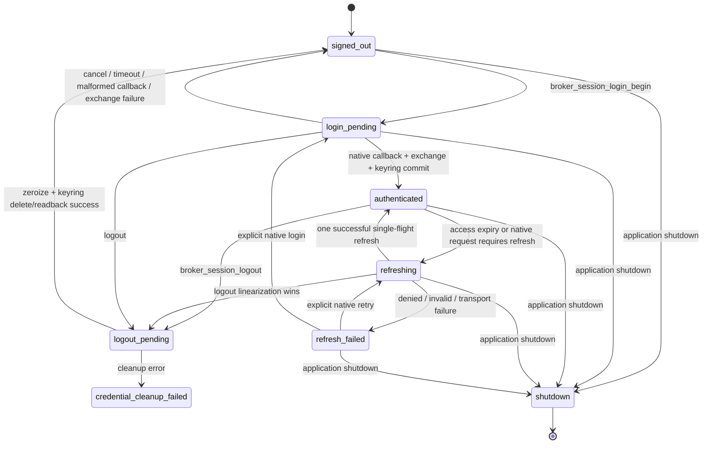

# Native Session Broker Amendment — Desktop/Tauri

## Status, root cause, and boundary

Candidate only. No code, configuration, migration, test, deployment, or
promotion is authorized until Boss approves the corrected candidate by its exact
SHA-256. The correction is documentation-only and addresses Terra findings
P0-NSB-01 through P1-NSB-02 from review commit `360c494`.

The upstream S2-F2 Terra FAIL at `3e2b38c` proves two defects: access and refresh
tokens cross the native/WebView boundary through the serializable
`auth-callback` payload, and callback code is copied into ordinary `String`
values. The current source still has the consumer graph that makes a partial
replacement unsafe:

| Current consumer surface | Evidence in the working tree | Required broker consequence |
|---|---|---|
| Desktop login and enrollment | `src/lib/authFlow.ts`, `src/components/AccountLoginPanel.tsx`, `src-tauri/src/native_auth.rs` | Replace `setSession`, `sessionProof`, the token-bearing event, and direct enrollment calls with native-owned state and redacted results. |
| Desktop pairing and device management | `src/components/DevicePairingPanel.tsx`, `src/lib/deviceReconcile.ts`, `src-tauri/src/lib.rs` | Broker cloud pairing/device authority and keep the local paired-device database as an internal projection only. |
| Desktop Drive | `src/lib/googleDriveFlow.ts`, `src/components/GoogleDrivePanel.tsx`, `src-tauri/src/drive_oauth.rs` | Remove WebView session proofs and preserve the inherited per-operation authority, grant, replay, and restore-intent order. |
| Desktop local backup/restore | `src/lib/backupFlow.ts`, `src/components/BackupPanel.tsx`, `src-tauri/src/backup.rs`, `src-tauri/src/filesystem_backup.rs` | Keep local-only commands typed and secret-redacting; do not confuse them with cloud Drive authorization. |
| Browser and deferred Mobile | `src/web/*`, `src/lib/supabase.ts`, `src/mobile/MobileApp.tsx`, and the current Mobile imports from `src/lib/authFlow.ts` | Preserve their current browser-session behavior. This amendment makes no Mobile readiness claim. |

The scope is Desktop/Tauri. Browser web routes retain their browser Supabase
session model. Mobile secure session custody and physical-device proof remain
deferred to a separate amendment. D-GDA4 decisions in this document remain
pending until Boss approves this exact candidate hash.

## Corrected architecture and non-negotiable invariants

```text
Desktop Tauri WebView
  -> desktopSessionBroker.ts: typed request, no session/token fields
  -> Tauri broker commands: closed operation allowlist
  -> native auth_session/native_auth/drive adapters
       |- refresh token: OS keyring only
       |- access token: zeroizing native memory only
       |- code/verifier/signature/context: zeroizing native memory only
       `- typed HTTPS/RPC/provider calls after server authorization

Browser web routes
  -> src/lib/supabase.ts and browser AuthGuard/AuthCallback (unchanged)

Deferred Mobile
  -> MobileApp.tsx + existing Mobile authFlow/supabase adapter (unchanged)
```

1. No access token, refresh token, authorization code, PKCE verifier, bearer
   header, signature, private key, `sessionProof`, raw provider response,
   `AuthorizedDriveContext`, or recovery phrase is returned in a Desktop public
   DTO, Tauri event, log, browser storage, Genesis record, or metadata row.
   A recovery phrase is accepted only as a write-only ephemeral input to the
   explicitly listed local/restore command and is never echoed or retained.
2. The Desktop broker has a closed, versioned, typed operation allowlist. It is
   not a generic URL, HTTP, SQL, PostgREST, RPC, header, bearer-token, signing,
   or error-forwarding proxy.
3. Every broker request gets a native-generated request ID, generation, owner,
   deadline, cancellation token, and operation binding. A caller cannot choose
   an account, device, keyring slot, grant, provider origin, nonce, or restore
   authority value.
4. Native derives the account from the native session, derives the device from
   the local key and server-owned row, and derives Drive context from the
   server's decision for that exact operation. Client identity fields are never
   authority inputs.
5. The refresh token is stored only in the OS keyring. The access token exists
   only in zeroizing native memory and is borrowed for a native request; it is
   never copied into a WebView-visible value.
6. Callback bytes are received into a zeroizing buffer and parsed without
   ordinary `String` copies of the code. Code, verifier, token material,
   request state, socket data, and temporary provider responses are erased on
   every terminal path.
7. Logout and application shutdown stop new work, linearize against refresh or
   callback completion, clear pending requests, zeroize native memory, delete
   the refresh-token keyring entry, verify its absence, and publish only a
   redacted signed-out result. A cleanup failure is fail-closed and is not
   reported as successful logout.
8. A refresh failure never falls back to `supabase.auth.setSession`, a browser
   session, a token DTO, or a generic retry proxy. Invalid/revoked refresh
   material is deleted; transient failure leaves no usable access token and
   enters `refresh_failed` until an explicit native retry or login.
9. At most one refresh is in flight per session generation. Concurrent broker
   callers join that flight and receive the same redacted result or public
   error; they do not start parallel refreshes.
10. Every Drive operation obtains a fresh one-use server-derived context. Denial
    occurs before any keyring read/write/delete, provider token refresh, provider
    request, archive read, or restore write.
11. The Desktop graph contains no `setSession`, browser-session persistence,
    `sessionProof`, token-bearing DTO, or Desktop listener for the legacy
    `auth-callback` session event. The deferred Mobile target may retain its
    existing Mobile-only callback adapter until its own approved amendment.
12. No old secret-bearing command remains as an alias beside a broker command.
    Each current command is explicitly replaced, retained with the safe
    contract below, or deregistered; the registered Tauri command inventory and
    Desktop import graph are acceptance-tested.

## 1. Normative operation contract

### 1.1 Contract conventions

The tables below are normative. “Native-derived” means the value is created or
resolved inside the broker and cannot be supplied by the WebView. “Redacted
output” is the complete public result shape for the operation; no unspecified
field may be added. Public errors are stable codes, never provider, SQL, URL,
HTTP, token, or raw exception text. `requestId` and opaque local handles are
identifiers, not credentials.

For all rows:

- malformed or extra fields are rejected before work;
- caller-supplied `userId`, `deviceId` as authority, `publicKey`, fingerprint,
  grant, permission, keyring slot, endpoint, nonce, URL, redirect, state,
  session proof, bearer token, or provider response is rejected;
- cancellation is accepted only for the native-owned request or operation
  generation; a late completion cannot revive it;
- idempotent retries return the same safe result or a stable public error and
  never duplicate a grant, reservation, connection, pairing, archive, or
  restore; and
- operation-specific server denial is returned as `authorization_denied`,
  `authorization_unavailable`, `proof_replayed`, `operation_expired`, or the
  exact public code listed in the row.

### 1.2 Auth, enrollment, pairing, and device matrix

| Stable broker operation | Replaces current call/path; caller input and validation | Native-derived state, authority, and action | Redacted output and public errors | Cancellation/idempotency; legacy disposition |
|---|---|---|---|---|
| `broker_session_login_begin` | `auth_begin_google_login`; no input. | Native request ID, exact loopback port/path, state, PKCE verifier/challenge, trusted Supabase/Google origin and expiry; open exactly one native URL/listener. | `{requestId, expiresAtMs}`; `auth_listener_unavailable`, `auth_url_open_failed`, `auth_request_in_progress`, `auth_config_invalid`. | A second begin is rejected; cancel/timeout/close erase state. Old command is deregistered; no `auth-callback` token event. |
| `broker_session_login_cancel` | `auth_cancel_google_login`; `requestId` must name the caller's active native request. | Native request ownership and generation; cancel listener before exchange/commit. | `{requestId, status:"cancelled"}`; `auth_request_not_found`, `auth_transition_in_progress`. | Idempotent for the same terminal request; old command is deregistered. |
| `broker_session_status` | Desktop `supabase.auth.getSession` and `onAuthStateChange`; no input. | Native session state, user ID/email from native token/user lookup, access expiry, and keyring presence; no browser client. | `{state, userId, email, accessExpiresAtMs}` with nullable non-secret fields only; `signed_out`, `auth_refresh_unavailable`, `keyring_unavailable`. | Read-only and idempotent. Existing Desktop browser-session calls are removed; browser/Mobile calls remain in their own graph. |
| `broker_session_logout` | Desktop `supabase.auth.signOut`; no input. | Current session generation, pending request registry, access memory, refresh keyring entry, native Drive state. | `{state:"signed_out"}` only after keyring delete/readback; `auth_logout_incomplete`, `auth_transition_in_progress`. | Repeated logout is signed-out idempotency; old WebView sign-out path is deregistered. |
| `broker_enrollment_request` | `device_enrollment_proof` plus `device-enrollment` pending call; only `deviceLabel`, normalized NFC, 1–80 bytes, no controls. | Native account ID, Ed25519 public key/fingerprint, issued/expiry times, nonce, canonical envelope, signature, and current session; D-GDA3 proof validation and atomic nonce reservation. Call the reviewed Edge/RPC path, creating only `pending`. | `{requestId, status:"pending", authorityState:"pending"}`; `auth_required`, `device_identity_unavailable`, `proof_replayed`, `invalid_enrollment_proof`, `enrollment_unavailable`, `authorization_denied`. | Same native request can return its committed pending result; new nonce is a new attempt. No client proof, user, or fingerprint authority. Old command and direct Edge call are deregistered from Desktop. |
| `broker_enrollment_status` | Desktop `devices` lookup by fingerprint; no input. | Current native account and native fingerprint; server-owned row and revocation state. | `{status:"pending"|"drive_trusted"|"pairing_only"|"revoked"|"legacy", deviceId:null|string}`; `auth_required`, `authorization_unavailable`. | Read-only; old direct table read is removed from Desktop. |
| `broker_device_list` | `paired_device_list` plus direct cloud `devices` reads; no input. | Current account, server-owned visible device rows, and native local paired projection. | Array of `{id,label,platform,authorityState,pairedAt,revokedAt,endpointState}`; never paths, keys, grants, or audit payloads. | Repeated reads are idempotent. `paired_device_list` is deregistered as a public command; local DB access becomes broker-internal. |
| `broker_pairing_create` | `create_pairing_session` RPC and WebView code/hash generation; optional display label only, validated. | Native device/account, native random pairing ID/code/hash, five-minute expiry; server RPC owns user and produces `pairing_only` state. | `{pairingId, displayCode, expiresAtMs, status:"waiting"}`; `auth_required`, `device_not_enrolled`, `pairing_unavailable`, `invalid_input`. `displayCode` is one-time UI display and is not logged or stored. | Retry with the same native request returns its waiting result; after expiry it cannot recreate by replay. Direct RPC and client audit insert are deregistered. |
| `broker_pairing_poll` | Direct `pairing_sessions` and responder `devices` reads; `pairingId` must be broker-owned. | Current account/device ownership, server status, peer metadata, and local projection; pairing can only yield `pairing_only`. | `{status:"waiting"|"confirmed"|"locked"|"expired", peer:null|{id,label,platform,fingerprint}}`; `pairing_not_found`, `authorization_denied`, `pairing_unavailable`. | Poll is read-idempotent; confirmed projection is upsert-once by session ID. Old direct reads and `paired_device_upsert` are deregistered. |
| `broker_pairing_reconcile` | Current mount-time confirmed-session/device queries; optional broker pairing ID only. | Native account/device and confirmed server session; reconcile local projection without accepting WebView identity. | `{reconciled:boolean, deviceId:null|string}`; `auth_required`, `authorization_unavailable`, `pairing_not_found`. | Idempotent by confirmed session ID; old direct queries and local upsert command are deregistered. |
| `broker_device_revoke` | Direct `devices.delete`, audit insert, and `paired_device_revoke`; `deviceId` is a selected resource ID, not authority. | Native current account, server-owned device row, revocation/rebind policy, and local projection. | `{deviceId,status:"revoked"}`; `auth_required`, `device_not_found`, `authorization_denied`, `authorization_unavailable`. | Repeated revoke returns revoked; server soft-revokes and never deletes the authoritative row. Old direct delete/audit insert and local revoke command are deregistered. |
| `broker_device_audit_list` | Any Desktop audit read; optional broker-owned device ID. Client audit writes are not accepted. | Current account and server-created audit rows; client metadata is informational only. | Redacted `{eventId,eventType,createdAt,deviceId}` rows; `auth_required`, `authorization_denied`, `audit_unavailable`. | Read-idempotent. Direct `device_audit_events.insert` is deregistered; authoritative audit is emitted by server functions. |
| `broker_fungwire_status` | `fungwire_status`; no input. | Native process/server state only; no cloud authority. | `{enabled,bind,activeJobs,connectedPeers}`; `fungwire_unavailable`. | Read-idempotent. Retained as a safe native-only command under the broker allowlist; no session or provider data. |
| `broker_fungwire_set_enabled` | `fungwire_server_set_enabled`; `{enabled:boolean}` only. | Native server control and paired-device policy; no caller device authority. | Same redacted status; `invalid_input`, `fungwire_start_failed`, `fungwire_stop_failed`. | Same desired state is idempotent; retained as safe native-only command. |
| `broker_device_endpoint_publish` | `fungwire_local_endpoint` plus direct `devices.update(lan_endpoint)`; no endpoint input. | Native bound endpoint, current device identity, current account, and server-owned pairing-only row. | `{status:"published"|"unavailable",updatedAt}`; `auth_required`, `device_not_enrolled`, `authorization_denied`, `fungwire_unavailable`. | Latest native endpoint replaces the prior one; no client URL is accepted. Old endpoint-returning command and direct update are deregistered. |
| `account_portal_open` | `open_external_account_portal`; no input. | Native trusted URL registry and configured account portal only. | `{status:"opened"}`; `auth_url_untrusted`, `auth_url_open_failed`, `portal_unconfigured`. | Repeated open is safe; current command may be retained only with this exact no-input trusted-URL contract, or replaced by the stable name. No arbitrary WebView URL. |

### 1.3 Google Drive operation matrix

Each Drive row performs a fresh server authorization request. The native session
supplies the bearer credential internally only for that request. The WebView
never supplies `sessionProof`, a user/device/connection value, a grant, a keyring
slot, a provider URL, or a nonce.

| Stable broker operation | Replaces current call; caller input and native derivation | Required authority/grant/intent and exact action | Redacted output and public errors | Cancellation/idempotency; legacy disposition |
|---|---|---|---|---|
| `broker_drive_connect_begin` | `drive_oauth_start`; no input. | Native creates exact loopback listener, PKCE pair, state, expiry and request ID; server decision `connection.authorize` is obtained before opening Google. | `{requestId,scope:"drive.appdata",expiresAtMs}`; `auth_required`, `authorization_denied`, `drive_oauth_open_failed`, `drive_oauth_already_running`. | One pending connect per generation; cancel/timeout closes listener and erases callback state. Old command is deregistered. |
| `broker_drive_connect_complete` | `drive_oauth_complete`; `requestId` only. | Native validates one callback, state, exact shape and scope; obtains fresh `connection.activate` authorization before durable credential commit; exchanges code natively. | `{connected:true,scope:"drive.appdata",provider:"google_drive"}`; `drive_oauth_cancelled`, `drive_oauth_expired`, `drive_oauth_state_mismatch`, `drive_oauth_token_exchange_failed`, `drive_oauth_offline_access_missing`, `drive_connection_activation_failed`. | Single terminal linearization: cancel before commit prevents persistence; after commit completion wins. Refresh token is committed only after authorization and readback. Old command is deregistered. |
| `broker_drive_connect_cancel` | `drive_oauth_cancel`; `requestId` only. | Native-owned pending request and terminal state. | `{requestId,status:"cancelled"}`; `drive_oauth_session_missing`, `drive_oauth_completed`. | Idempotent before terminal commit; no cancellation after commit. Old command is deregistered. |
| `broker_drive_status` | `drive_connection_status`; no input. | Fresh `connection.read` decision; only then read the native keyring state. | `{connected,scope,provider}`; `auth_required`, `authorization_denied`, `authorization_unavailable`, `drive_keyring_unavailable`. | Read-idempotent. Old command is deregistered. |
| `broker_drive_disconnect` | `drive_disconnect`; no input. | Fresh `connection.revoke` decision; only then delete provider refresh credential and clear native connection state. | `{connected:false,scope:"drive.appdata",provider:"google_drive"}`; `authorization_denied`, `drive_keyring_unavailable`, `drive_disconnect_failed`. | Repeated disconnect is already-disconnected success; old command is deregistered. |
| `broker_drive_list_archives` | `drive_archives_list`; no input. | Fresh server `backup.restore` grant (the approved `backup.read`/archive-list mapping), Windows `drive_trusted` predicate, active exact-scope connection, durable authorization reservation; then refresh provider token and list only validated appDataFolder archive metadata. | Array of `{fileId,archiveId,byteCount,digest,modifiedTime}`; `authorization_denied`, `authorization_unavailable`, `drive_not_connected`, `drive_token_refresh_failed`, `drive_list_failed`. | Each request has a new one-use nonce; same read may retry as a new request. Old command is deregistered. |
| `broker_drive_upload_archive` | `drive_upload_archive`; `{archiveId}` validated against native selected archive. | Fresh independent `backup.write` grant, trusted-device predicate, connection, nonce reservation; only after allow read keyring/provider and upload encrypted archive plus digest-bound manifest. | One `{fileId,archiveId,byteCount,digest,modifiedTime}`; `authorization_denied`, `authorization_unavailable`, `filesystem_backup_root_unavailable`, `drive_archive_already_exists`, `drive_upload_failed`. | Idempotent by archive ID plus digest; mismatched existing archive denies. Old command is deregistered. |
| `broker_drive_restore_target_select` | `backup_restore_select_target`; no input. | Native picker validates a new clean target and retains an opaque target handle; no path leaves native state. | `{status:"selected"|"unavailable",targetId}`; `restore_target_unavailable`, `restore_target_invalid`. | Re-selection invalidates the prior target handle; retained as a safe native-only picker command or folded into the broker. |
| `broker_drive_restore_intent` | `drive_restore_intent_create`; `{archiveId,targetId}` must be native-owned handles and explicit confirmation is checked natively. | Fresh `backup.restore` grant, trusted-device predicate, connection, durable nonce, and one-use native intent bound to archive, digest/metadata, clean target, expiry and operation. | `{intentId,expiresAtMs}`; `authorization_denied`, `authorization_unavailable`, `restore_not_confirmed`, `restore_intent_invalid`, `drive_archive_not_found`. | One-use and expiry-bound; replay or altered archive/target is a no-mutation denial. Old command is deregistered. |
| `broker_drive_restore` | `drive_restore`; `{intentId,archiveId,fileId,recoveryPhrase}` where the phrase is write-only and the IDs are native-owned. | Fresh `backup.restore` grant and nonce; consume the native intent before keyring/provider/download/restore-target access, verify archive/manifest/digest, download appDataFolder content, and restore only to the bound clean target. | `{archiveId,restoredBundleSha256,audio,terminalState}`; `authorization_denied`, `operation_expired`, `restore_intent_invalid`, `drive_download_failed`, `drive_manifest_invalid`, `drive_archive_digest_mismatch`, `backup_verification_failed`. | Exactly one winner; cancellation before target write leaves no restore success, and a consumed intent cannot retry. Old command is deregistered. |

### 1.4 Local backup and restore matrix

These operations do not authorize Google Drive and do not create a second
account/device authority. They remain native-only, are included here because
they are current Desktop backup consumers, and must keep their existing local
encryption, clean-target, digest, cancellation, and one-time-secret behavior.

| Stable/retained operation | Current call and input | Native action and authority | Redacted output/errors | Cancellation/idempotency; legacy disposition |
|---|---|---|---|---|
| `backup_status` | Current `backup_status`; no input. | Read native selected local root only. | `{terminalState,archive:null|metadata}`; `root_unavailable`. No paths or phrases. | Read-idempotent; retain exact safe native command. |
| `backup_list_archives` | Current `backup_list_archives`; no input. | Enumerate and validate local encrypted manifests under native root. | Archive metadata array only; `root_unavailable`. | Read-idempotent; retain exact safe native command. |
| `backup_root_select` | `filesystem_backup_select_root`; no input. | Native folder picker validates owned root and returns opaque root ID. | `{terminalState,selectedRootId}`; `root_unavailable`, `root_invalid`. | New selection replaces old native handle; retain with safe typed contract. |
| `backup_restore_target_select` | Current `backup_restore_select_target`; no input. | Native picker validates clean restore parent and returns opaque target ID. | `{terminalState,selectedTargetId}`; `restore_target_parent_unavailable`, `restore_target_invalid`. | New selection invalidates old target; retain with safe typed contract. |
| `backup_recovery_phrase_generate` | `backup_generate_recovery_phrase`; no input. | Native generates phrase, returns it once for display, and never stores/logs it. | One string only on success; `recovery_generation_failed`. | One-time display; retain exact safe command and test absence from status/metadata/logs. |
| `backup_run` | Current `backup_run`; `{recoveryPhrase}` write-only, non-empty. | Native zeroizes phrase, encrypts local archive, verifies digest/audio inventory, and writes atomically to selected root. | `{record:archiveMetadata,audio}`; `missing_recovery_phrase`, `backup_busy`, `root_unavailable`, `backup_payload_failed`. | One job per native backup generation; cancellation leaves no fabricated success. Retain with safe typed contract. |
| `backup_restore` | Current `backup_restore`; `{archiveId,recoveryPhrase}` write-only and confirmation/target must be native state. | Native zeroizes phrase, verifies archive and clean target, restores atomically, and reports actual audio outcome. | `{archiveId,restoredBundleSha256,audio,terminalState}`; `missing_recovery_phrase`, `restore_target_parent_unavailable`, `restore_target_exists`, `backup_verification_failed`. | One job per native generation; no overwrite and no success on partial verification. Retain with safe typed contract. |
| `audio_integrity_check` | Current `audio_integrity_check`; `{projectId}` non-empty. | Native Genesis/audio digest check only; no account or provider authority. | `{checked,intact,relocated,modified,missing,unverifiable,problems}`; `invalid_project`, `integrity_unavailable`. | Read/repair operation is idempotent by project and current digest; retain outside session authority. |

The registered Desktop handler must contain the stable broker names above plus
only the explicitly retained safe local commands. It must not contain the old
secret-bearing auth, enrollment, pairing, or Drive names as aliases. The
Desktop acceptance inventory must reject `auth_begin_google_login`,
`auth_cancel_google_login`, `device_enrollment_proof`, all old `drive_*`
commands, `sessionProof`, `setSession`, token-shaped DTO fields, and the
Desktop `auth-callback` event. The Mobile target is tested separately and is
not promoted by this rule.

## 2. Native session state machine and custody protocol

### 2.1 States and command behavior



| State | Native-owned data | Commands allowed and exact behavior | Transition/terminal rule |
|---|---|---|---|
| `signed_out` | No access memory; no active refresh entry; no pending request. | `login_begin` allowed; `status` returns signed out; `logout` is idempotent; protected operations return `auth_required`; no browser fallback. | Enter only after terminal cleanup/readback or initial empty startup. |
| `login_pending` | Request ID, generation, listener, state, expiry, verifier and callback buffer in zeroizing native memory. | `status` returns pending; duplicate begin returns `auth_request_in_progress`; only matching cancel, status, logout, and shutdown are accepted; all protected operations return `auth_transition_in_progress`. | Callback must match exact request/listener/state/shape once; every other terminal path erases all pending data. |
| `authenticated` | User ID/email, expiry, access token in zeroizing memory, refresh token only in keyring, generation and request registry. | Status returns redacted identity; protected operations may run; refresh is internal and single-flight; logout/shutdown stop admission. | Enter only after native user derivation and verified keyring commit. |
| `refreshing` | Prior access is unusable for new work; one native refresh owner and waiters; refresh material zeroized outside keyring. | Status returns refreshing; callers wait for the same flight or receive the same public timeout/error; no second refresh, browser client, or token event. Logout/shutdown can win the linearization point and invalidate the generation. | Success publishes only redacted authenticated state; failure clears access and enters `refresh_failed`. |
| `refresh_failed` | No usable access token; keyring contains a refresh token only when failure is classified transient and its entry remains verified. | Status returns refresh-failed; protected operations fail closed; explicit native retry may start one flight; explicit login is allowed; no automatic WebView session. | Invalid/revoked/unsupported token is deleted and read-back as absent before signed-out; transient failure preserves only the OS-keyring token and never grants access. |
| `logout_pending` | Admission gate closed; callback/refresh work is cancelled or drained; generation invalidated. | Status reports transition; all new protected work is rejected; repeated logout joins the same cleanup. | Access, callback, request, and Drive session memory is zeroized; keyring delete is followed by absence readback before signed-out. |
| `credential_cleanup_failed` | No usable access token; cleanup failure is retained only as a non-secret status. | Every protected operation fails closed; status exposes only cleanup failure; retry cleanup or process shutdown is allowed. | Never report logout/shutdown success while a refresh entry may remain. |
| `shutdown` | No new work; request registry and zeroizing memory being destroyed; no public session. | No broker operation starts. A late callback/refresh result is discarded by generation check. | Terminal process boundary; no browser recovery or event containing secrets. |

### 2.2 Request ownership, startup, refresh, cancellation, and shutdown

1. The native broker owns a monotonic session generation and a map keyed by
   native UUID request IDs. Each entry binds operation, generation, deadline,
   listener/worker handle, cancellation token, and terminal flag. The WebView
   may echo a request ID only to cancel its own active request; it cannot create
   or rebind an entry.
2. Startup begins in `signed_out` with command admission closed. Native reads
   the OS-keyring active slot into zeroizing memory, verifies the slot pointer
   and readback, and performs a native refresh/user lookup. A missing entry
   remains signed out. A successful refresh uses the rotation order below and
   only then enters `authenticated`. No browser storage is read or created.
3. Login receives callback bytes into a zeroizing buffer, validates the exact
   origin, loopback port, path, state, one callback, and allowed parameter set,
   exchanges the code using the native verifier, derives the user from the
   native token response plus TLS-authenticated `/auth/v1/user`, and rejects
   any WebView-supplied user. The native access token remains zeroizing memory.
4. Initial refresh-token persistence is ordered: `write staged generation` ->
   `read staged` -> constant-time verify -> `commit active slot/pointer` ->
   `read active` -> verify -> delete prior generation/staged remnants -> verify
   absence. If any write/readback/commit step fails, access is zeroized and the
   broker returns `keyring_unavailable` without a browser session. The old
   verified slot remains usable only when the active pointer was not committed.
5. Rotation is single-flight. Native reads the verified active refresh token
   into zeroizing memory, sends the refresh request natively, validates the
   returned scope/user and optional rotated refresh token, then performs the
   same staged-write/readback/active-commit/readback/old-delete order. The new
   access token is installed only after the keyring commit succeeds. If the
   provider returns an invalid/revoked token, native deletes the entry and
   verifies absence; if transport/temporary failure occurs, it clears access,
   enters `refresh_failed`, and preserves only the verified keyring entry for
   an explicit retry.
6. Every waiter in `refreshing` is released only with the same redacted status
   or public error. A timeout/cancelled caller cannot cancel another caller's
   request or cause the refresh result to be emitted. A refresh completion whose
   generation is no longer current is zeroized and discarded.
7. Logout closes admission and atomically invalidates the generation before
   cancelling/draining login, refresh, Drive OAuth, and broker requests. It
   zeroizes access, callback bytes, verifier, request metadata, and Drive
   in-memory context; deletes and reads back the refresh keyring entry; then
   clears cached redacted status. Failure enters `credential_cleanup_failed`.
8. Shutdown uses the same linearization as logout, additionally stops accepting
   new Tauri work and closes native listeners. It does not emit a final token,
   provider response, or browser session. A process-exit path that cannot prove
   keyring deletion is reported as a cleanup concern, never as a successful
   signed-out state.

### 2.3 Per-state and secret-boundary acceptance tests

`tests/nativeSessionCustody.test.mjs` and the native behavioral suite must prove:

- startup with no keyring entry, valid keyring entry, corrupt/readback-mismatch
  entry, transient refresh failure, and invalid/revoked refresh failure;
- login success, duplicate login, wrong listener/state/path, extra callback
  parameter, malformed callback, timeout, cancel-before-callback,
  cancel-during-exchange, exchange failure, and callback replay;
- refresh rotation with and without a returned refresh token, staged-write
  failure, readback failure, active-commit failure, old-slot cleanup failure,
  ten or more concurrent callers sharing one refresh, and stale-generation
  completion;
- command results in every state, logout during login/refresh/Drive OAuth,
  shutdown during each of those transitions, and cleanup readback failure;
- a source/behavioral secret scan that observes no token, code, verifier,
  bearer header, signature, recovery phrase, raw response, or session proof in
  Tauri events, public DTOs, logs, WebView storage, Genesis, or metadata.

## 3. D-GDA2/D-GDA3 inheritance and Drive safety

### 3.1 Inherited-decision crosswalk

The broker consumes these decisions; it does not reopen or weaken them.

| Inherited decision | Immutable source and approval state | Mandatory effect in this candidate | Supersession effect |
|---|---|---|---|
| D-GDA-01 through D-GDA-07 | `docs/specs/2026-08-23-google-drive-native-authorization-amendment.md`; current SHA-256 `D5FC4D1AC1B82DA45B5F6630B77668D0C05492BC97D5D61F4848C506E95A5A46`; Boss approval is recorded in its decision register/§11 on 2026-08-23, with the document still a working-tree record. | Revised Design A, fail-closed authorization, server per-request operation decision, OS-keyring custody, native restore intent, trusted URL registry, and separate deployment gate remain mandatory. | This candidate replaces only Desktop browser-session custody and consumer IPC; it does not change Drive authority or deployment policy. |
| D-GDA2-01 through D-GDA2-10 | `docs/specs/2026-08-23-google-drive-authority-schema-amendment.md`; current SHA-256 `0655B004FF60F7B802799E50BE8CF5BC1F7026297E8BE7A5A294873E25DE98ED`; implementation base `db0b949c2e899575156d07389afb2b973545da4e`; Boss approval for local implementation is recorded in §9 on 2026-08-24, deployment still gated. | Boss-only `drive_trusted` bootstrap; pairing-only/legacy/revoked/Android/FUNGWIRE/Genesis never authorize Drive; separate grants; fail-closed rebind; forward-only migrations; project-agnostic external gates. | No migration or schema amendment is introduced. The broker only calls the existing approved server contracts. |
| D-GDA3-01 through D-GDA3-03 | `docs/specs/2026-08-24-enrollment-proof-nonce-amendment.md`, SHA-256 `1430552C7ACCB1D04AC1411032AC0B8EBF44A5773AB5822E14A53455D5F67792`; Terra PASS `8625615e583cf777e085674c057989a160828787`; Boss approval record `docs/verification/implementation-reports/2026-08-24-enrollment-proof-nonce-approval-record.md`, current SHA-256 `E16573B3E15FA67020598C6C0A31EF2B8BEA0DD40A64BC7415CC4CA22FB31A1F`, present as a working-tree record and not part of the `360c494` review base. | Exact canonical proof bytes, indefinite global nonce-hash reservation, one transactional pending outcome, full native PKCE hard gate, and no self-service trust promotion remain mandatory. | The enrollment migration remains unchanged and is not included in this candidate's implementation boundary. The approval state is cited truthfully as a working-tree approval record, not upgraded to a committed approval. |
| D-GDA4-01 through D-GDA4-05 | This corrected candidate, review base `360c494`, and final candidate SHA-256 to be recorded by the separate Luna writer report. No Boss approval record exists yet for D-GDA4. | Boss must approve Desktop scope, custody, typed allowlist, migration order, and fresh Terra review against the exact final candidate hash. | Any content-hash change after approval supersedes that approval and requires a fresh Terra review; a commit alone does not authorize implementation. |

The read-only discovery brief is evidence of scope, not approval or implementation:
`docs/verification/implementation-reports/2026-08-24-s2-native-session-custody-discovery-brief.md`
with SHA-256 `426579C9E34ACACA67401258841074A89CDA9BDD6DD30A2F6BF4D9E7F0E09879`.
It explicitly required no writes, so no separate discovery implementation
commit is claimed. The current consumer snapshot and Terra review are the
reviewable evidence for this documentation correction.

### 3.2 Required Drive inheritance matrix

Every row in §1.3 is subject to this common order: native derives the current
session and device; the server verifies account ownership, Windows
`drive_trusted`, enrollment source, revocation, public-key/fingerprint match,
exact `drive.appdata` connection, named operation, expiry, and durable nonce
reservation; only the returned one-use context may reach the keyring or provider.

| Invariant | Connect/status/disconnect | Archive list/upload | Restore intent/restore |
|---|---|---|---|
| Server-derived identity | Native session user and native device proof; no WebView user/device input. | Same; local archive ID is an object selector only. | Same; archive/file/target IDs are checked against native state and server decision. |
| Device authority | `platform=windows`, `authority_state=drive_trusted`, approved source, not revoked, public key/fingerprint match. | Identical predicate on every request, not only at connect. | Identical predicate on both intent creation and restore consumption. |
| Grants | Connection operation is not a backup grant. | `backup.write` is required for upload; archive listing uses the approved `backup.restore` mapping for `backup.read`. | Independent `backup.restore` grant is required; connection state never substitutes for it. |
| One-use authorization context | Fresh context per start, complete, status, disconnect; no context crosses calls. | Fresh context and durable nonce per list/upload; audit is not the replay lock. | Fresh context plus native one-use archive/target intent and durable nonce; altered/replayed intent denies. |
| Denial order | Deny before provider URL opening where authority is required; status authorizes before keyring read; revoke authorizes before keyring delete. | Deny before refresh-token keyring read, provider token refresh, archive read, or upload. | Deny and consume/validate intent before keyring/provider/download/restore-target writes. |
| Reconnect/revocation | Connection activation/revocation cannot resurrect a revoked device or grant. | Revocation between requests is observed as denial; no connection-only write. | Revocation or grant change between intent and restore denies; no loser mutation. |
| Durable replay | Server reservation is the only replay lock; audit and process-local maps are not. | At least 50 identical concurrent authorizations produce one winner, 49 `proof_replayed`, and no loser mutation. | Same reservation rule plus one-use native intent; transaction rollback is not a post-commit migration rollback. |
| Restore binding | Not applicable. | Upload preserves encrypted archive/digest/manifest identity. | Intent binds archive ID, digest/manifest, clean target, expiry, and `backup.restore`; restore refuses any mismatch or overwrite. |

The existing migrations, schema/function names, RLS, grants, fixed search paths,
appDataFolder scope, encryption, digest checks, cancellation, and clean-target
restore contracts are inherited unchanged. This document authorizes no
migration edit, deployment, provider configuration, staging action, or
project-ref assumption.

## 4. Platform adapter and import/build boundary

The following boundary is mandatory before the Desktop browser session is
disabled:

| Graph | Allowed imports and behavior | Forbidden import/behavior |
|---|---|---|
| Desktop/Tauri | `App.tsx` -> Desktop panels -> `src/lib/desktopSessionBroker.ts` and typed local flows; native commands through the broker. `authHash.ts` may remain a pure pairing-code helper. | `src/lib/supabase.ts`, `@supabase/supabase-js`, `src/lib/authFlow.ts`, `setSession`, browser storage/session persistence, direct `supabase.from/rpc/functions`, `sessionProof`, or `auth-callback` session listener. |
| Browser web | `src/web/AuthGuard.tsx`, `AuthCallback.tsx`, `Dashboard.tsx`, and `AccountSettings.tsx` continue using the browser-only `src/lib/supabase.ts`. | Native broker commands, Tauri token custody, or claims of Desktop session custody. |
| Deferred Mobile | `src/mobile/MobileApp.tsx` continues using its current `src/lib/supabase.ts` and Mobile-compatible `src/lib/authFlow.ts` callback adapter until a separate approved amendment. | Desktop broker imports or any claim that this candidate proves Mobile secure custody/readiness. |
| Native target split | Desktop Tauri registers only the §1 broker plus safe local commands. Mobile Tauri may retain its separately scoped callback target; target-specific events are not shared into the Desktop graph. | A runtime `isDesktop` branch that leaves the browser Supabase client reachable from Desktop, a generic authenticated proxy, or a shared token DTO. |

The implementation write set must add a new `src/lib/desktopSessionBroker.ts`
adapter rather than teaching the shared browser `authFlow.ts` to branch at
runtime. `src/lib/googleDriveFlow.ts` must depend on that typed adapter and no
longer import `src/lib/supabase.ts`. `src/lib/authFlow.ts` remains the
browser/Mobile adapter; Desktop components no longer import it. The route split
in `src/main.tsx` may continue to produce browser/Mobile chunks, but the
Desktop entry graph must not import authenticated browser-session behavior.

The static/build contract test must:

1. walk the Desktop `App.tsx`/panel/flow graph and fail on forbidden imports,
   calls, fields, events, or token-shaped public DTOs;
2. inventory `generate_handler!` per target and fail on every deregistered old
   auth/enrollment/Drive command or duplicate alias;
3. prove browser `AuthGuard`/`AuthCallback` and deferred Mobile imports remain
   available and unchanged in their own graphs; and
4. prove a Tauri Desktop build can compile and render local-only operation with
   no browser Supabase session or Mobile readiness claim.

## 5. Proposed implementation and test boundary

This is a design approval packet, not implementation authorization. After Boss
approves D-GDA4 by the final hash, the bounded implementation write set is:

- New `src-tauri/src/auth_session.rs`.
- `src-tauri/src/native_auth.rs`, `src-tauri/src/drive_oauth.rs`, and
  `src-tauri/src/lib.rs` for the native broker and target-specific command
  registration.
- New `src/lib/desktopSessionBroker.ts`.
- `src/lib/authFlow.ts` and `src/lib/authParse.ts` only to preserve the
  browser/Mobile adapter and remove Desktop coupling; `src/lib/googleDriveFlow.ts`
  and `src/lib/supabase.ts` only for the explicit platform boundary above.
- `src/components/AccountLoginPanel.tsx` and
  `src/components/DevicePairingPanel.tsx` for typed broker consumers.
- `tests/authFlow.test.mjs`, `tests/googleDriveContract.test.mjs`,
  `tests/w1AuthoritySchema.test.mjs`, and new
  `tests/nativeSessionCustody.test.mjs` for the static, behavioral, custody,
  Drive-inheritance, 50-client, and platform-boundary contracts.
- Implementation and review reports for this lane only.

`src/components/GoogleDrivePanel.tsx`, `src/components/BackupPanel.tsx`,
`src/lib/backupFlow.ts`, `src/mobile/*`, `src/web/*`, `supabase/migrations/*`,
Cargo/package configuration, Tauri capabilities, project references, and
unrelated paths are not authorized unless a later Terra-reviewed dependency
proves a compile-boundary necessity and Boss approves the expanded write set.
Local backup commands in §1.4 remain safe native commands and are not silently
converted into cloud authorization.

## 6. Acceptance, success, and exit criteria

| ID | Criterion |
|---|---|
| AC-GDA4-01 | No Desktop secret-bearing value appears in Tauri events/public DTOs/frontend storage/logs/Genesis/metadata; recovery phrase is write-only and never echoed or retained. |
| AC-GDA4-02 | Callback/code/verifier/token material is zeroizing from receipt through every terminal path, including malformed callback, timeout, cancel, exchange failure, refresh failure, logout, and shutdown. |
| AC-GDA4-03 | Startup rehydrates only through native keyring readback; refresh rotation uses staged-write/readback/active-commit/readback/old-delete order; single-flight races share one result; logout/shutdown delete and verify keyring absence. |
| AC-GDA4-04 | Desktop has no `setSession`, persisted browser session, `sessionProof`, token DTO, generic proxy, old secret-bearing command, or legacy `auth-callback` event; the deferred Mobile adapter is isolated and not claimed ready. |
| AC-GDA4-05 | Every current Desktop auth, enrollment, pairing, device, Drive, backup, and restore consumer maps to exactly one §1 typed contract, with no duplicate legacy bypass and the inherited Drive order. |
| AC-GDA4-06 | Browser web behavior remains unchanged; Mobile remains deferred and its existing adapter remains in its own import/build graph. |
| AC-GDA4-07 | PostgreSQL proof/authorization evidence uses at least 50 simultaneous identical clients: one winner, 49 `proof_replayed` losers, zero loser mutation; separate negative tests prove deny-before-secret/provider and separate-grant behavior. |
| AC-GDA4-08 | Native behavioral tests cover success, startup/restart, refresh rotation/failure, single-flight, denial, malformed callback, timeout, cancel, exchange failure, logout, shutdown, cleanup failure, and stale-generation races without secret disclosure. |
| AC-GDA4-09 | Clean build, command inventory, Desktop import/build boundary, secret/path audit, independent Terra review, hash-bound Boss approval, and external-gate truthfulness pass. |

Success requires all acceptance criteria and documentation review to pass. Exit
from this documentation cycle is a corrected, hashable candidate plus a
separate Luna report. Implementation, staging, real Google OAuth/provider,
clean-install/keyring, physical device/FUNGWIRE, signing, release, merge, and
production evidence remain external gates and must not be inferred from this
document.

## 7. Decisions for Boss approval

| ID | Decision | Candidate value | Status |
|---|---|---|---|
| D-GDA4-01 | Scope | Desktop/Tauri broker now; browser unchanged; Mobile deferred | candidate |
| D-GDA4-02 | Credential custody | Refresh token OS keyring; access/code/verifier zeroizing native memory only | candidate |
| D-GDA4-03 | IPC/API model | Closed typed operation allowlist in §1; no generic proxy or token DTO | candidate |
| D-GDA4-04 | Migration order | Build platform boundary, migrate every Desktop consumer, prove parity and inherited Drive order, then disable Desktop browser sessions | candidate |
| D-GDA4-05 | Review/release | Fresh Luna implementation and independent Terra code/schema review; staging/device/provider/release separately approved | candidate |

Boss's approval record must name this candidate's final SHA-256 and the
candidate commit. It must state that D-GDA2 and D-GDA3 are inherited from the
exact references in §3.1, that D-GDA3's current approval record is a
working-tree artifact unless separately committed, and that no D-GDA4 approval
is implied by this document or by the implementation commit. Any content hash
change after approval restarts Terra document review.

## 8. External gates retained

- Boss documentation approval after the corrections and immutable candidate
  hash; then a fresh bounded Luna implementation and independent Terra
  code/schema review before integration.
- Per-project read-only Supabase migration-history, RLS, exposed-schema/Data
  API, function configuration, advisor, and execute-grant preflight before any
  separately authorized staging migration or Edge deployment.
- Deployed Edge/RPC verification that `anon`, authenticated WebView, foreign
  owners, Data API, and Edge roles cannot promote, rebind, grant, reserve, or
  bypass the required device/operation authority.
- Real Google installed-app configuration and consent; native PKCE callback,
  token exchange/refresh/revoke; Drive appDataFolder upload; and
  digest/target-bound restore evidence.
- Clean-install Windows keyring migration/reconnect/restore, physical
  Android/FUNGWIRE validation, signing, release, merge, and promotion.

No deployment, push, merge, PR, deletion, or external message is authorized by
this candidate.

## Version Diff

- `new -> 0.1.0b`: proposed the Desktop/Tauri native session broker after the
  S2-F2 Terra FAIL and read-only consumer discovery.
- `0.1.0b -> 0.2.0b`: added the exact auth/enrollment/pairing/device/Drive/
  backup/restore operation matrix; native state, request ownership, startup,
  rotation, single-flight, failure, logout, cancellation, shutdown, keyring,
  and zeroization protocol; D-GDA2/D-GDA3 provenance and Drive inheritance;
  the 50-client and deny-before-secret/provider evidence gate; the explicit
  Desktop/browser/Mobile import/build boundary; and the hash-bound Boss
  approval rule required by Terra `360c494`.

## CHANGELOG

| Version | Date | Status | Summary | Commit Hash | Agent |
|---|---|---|---|---|---|
| 0.2.0b | 2026-08-24 | candidate | Corrected P0-NSB-01 through P1-NSB-02 with exact contracts, custody lifecycle, inherited Drive controls, platform boundary, and hash-bound provenance. | pending; bound in Luna writer report | Luna 5.6 |
| 0.1.0b | 2026-08-24 | superseded by 0.2.0b | Initial Desktop native session custody candidate. | working-tree; prior SHA B2C89EBAFEE7CB0AF1648F656A802DE8CF921203AA418A1351E459382010935B | ATHER |
