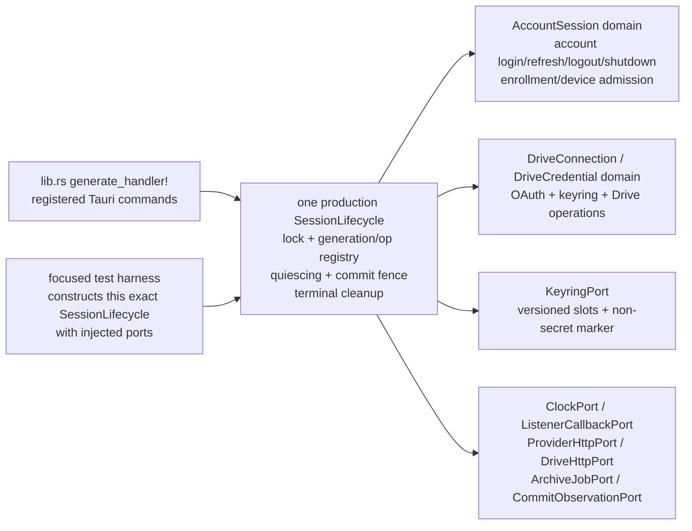

# Native Session Broker Production-Path Remediation Amendment — Desktop/Tauri

## Status and authority boundary

This is a reviewable HIGH-risk C-3 remediation authority candidate. It is a
documentation-only draft after Terra fix3 returned FAIL/BLOCK and the maximum
three authorized fix cycles were exhausted. It does not authorize implementation,
code changes, test changes, configuration, migration, deployment, release,
promotion, or production approval.

The candidate supersedes only the failed remediation authority for a possible
future fix4. It does not rewrite the fix1/fix2/fix3 audit history, invalidate the
recorded local passes, or close any production or external gate.

The exact future implementation may begin only after the approval rule in
`D-GDA5-06` is satisfied. Until then, all statements below are proposed
requirements and acceptance gates, not implementation claims.

## 1. Scope, non-scope, and provenance

### 1.1 Scope

The candidate is limited to convergence of the Desktop/Tauri production path for
the native session broker. It covers the production lifecycle used by actual
Tauri commands, the native auth and Drive custody boundaries, the registered
command path, and the bounded local evidence needed to prove that the tests and
production commands exercise the same lifecycle engine.

Browser behavior is unchanged. Mobile is deferred and receives no readiness or
secure-custody claim from this candidate. No provider configuration, Supabase or
Edge deployment, Google Console action, external transport action, release action,
or production go/no-go is in scope.

### 1.2 Trigger and immutable source record

| Evidence | Immutable source | Meaning |
|---|---|---|
| Approved D-GDA4 candidate | `7d48aa01c243ce5f32af1005b95b71082c5a5984`; candidate SHA-256 `41B91DCC09DDC5856F47A8BDFB2E1ACE021934BC696D97FFC59236C6122AA3D4` | Prior hash-bound approval record; not approval for this candidate |
| Latest implementation | `36fa29412fc46a764e1bccae94e44bf0d4d7a6e5` | Fix3 implementation evidence reviewed by Terra |
| Terra fix3 review | `07649e7526243446f719a2dcab63e6bba5b94285` | Independent FAIL/BLOCK; production lifecycle and custody hard gates remain open |
| Terra review of superseded draft | `0bdf2ad525c4f9bb263e41fdb9332e2a1fb8478e`; reviewed draft candidate SHA-256 `D590ABB67C13FC02A1AD96B2E0D6E895DCA49321C30E09F098DB5DFFF74C0172` | FAIL/BLOCK evidence for the superseded draft; not approval and not a current candidate identity |

Terra fix3 specifically found that the fourteen native behavioral tests exercised
`LifecycleCore` and fakes while actual Tauri login, refresh, logout, and shutdown
paths used separate `SessionMemory` control flow. It also found stale refresh/login
commit windows, ordinary secret-bearing `url::Url` and verifier allocations,
delayed Drive recovery-phrase custody, and non-fail-closed Drive keyring
readback. The narrow shutdown `cleanup_failed` propagation, typed IPC, and live
50-client replay proof remain preserved evidence and must not regress.

## 2. Inherited controls and retained compatibility warning

The candidate inherits the approved D-GDA2 authority/grant/replay/restore-intent
controls and D-GDA3 enrollment-proof nonce controls. It does not weaken
deny-before-keyring/provider order, one-use grants, durable replay reservation,
or digest-bound restore.

The already-passing results must remain true:

- shutdown cleanup failure returns the stable `cleanup_failed` result path and is
  not converted into successful shutdown;
- the PostgreSQL 17 50-client replay proof remains one winner, 49
  `proof_replayed` results, and zero loser mutation;
- Desktop IPC remains a closed typed operation surface with no generic forwarding;
- Browser sources remain in their browser session graph and Mobile remains
  deferred;
- the current P2 compatibility warning is retained: `GoogleDrivePanel.tsx`
  passes an ignored `invoke` argument, while `googleDriveFlow.ts` does not forward
  it. This warning is explicitly out of future write scope unless a separately
  approved scope amendment includes it.

## 3. Candidate decisions for Boss approval

| ID | Decision | Normative candidate requirement | Status |
|---|---|---|---|
| D-GDA5-01 | One production lifecycle engine and C-3 mapping | **Hard gate.** Define one `SessionLifecycle` production engine/control flow in the authorized native lane. The exact registered auth/device and Drive commands in §3.1 call this engine; the test harness constructs that same engine through named injectable ports for keyring, clock, listener/callback transport, provider HTTP, archive/job, and commit observation. A generic test-only core, duplicate `SessionMemory` path, dead lifecycle seam, or test-only success path is prohibited in the non-test production build. | candidate |
| D-GDA5-02 | Coordinated domains and linearizable protocol | **Hard gate.** Inside the one engine, coordinate the `AccountSession` and `DriveConnection`/`DriveCredential` domains. Every operation owns a generation and operation ID; provider work may run outside the lock, but every mutation passes an exact precommit check and one serialized lock/commit fence. Logout, shutdown, and Drive disconnect quiesce and invalidate earlier operations before cleanup. A stale completion cannot write staged, active, marker, or in-memory credentials after that point. | candidate |
| D-GDA5-03 | Bounded zeroizing custody boundary | **Hard gate.** Apply the B1-B5 boundary contract in §5. Secret input enters zeroizing app-owned custody at the command boundary and remains there through parser, generator, provider request, error, cancellation, timeout, logout, and shutdown. Ordinary app-owned secret copies, `serde_json::Value` token intermediaries, and app-owned `url::Url` serialization carrying callback code/state are prohibited. Framework/protocol copies are bounded by owner, lifetime, disposal/no-retention, redaction, size/time, static, behavioral, and fault evidence; no impossible claim of forcibly zeroizing framework memory is permitted. | candidate |
| D-GDA5-04 | Failure-atomic keyring and fail-closed recovery | **Hard gate.** Use versioned immutable credential slots plus a non-secret commit marker (or an equally precise design) with one verified marker linearization point. Before marker commit the old slot remains authoritative; every failure requires compensating new/orphan deletion plus verified absence. Ambiguous marker write/readback, missing/corrupt marker targets, delete/readback errors, and unproven cleanup publish no access/success and preserve `credential_cleanup_failed`/`cleanup_failed`. Only `NoEntry` means absence. | candidate |
| D-GDA5-05 | Production-path evidence and bounded matrix | **Hard gate.** The implementation and tests must prove the §3.1 architecture mapping, both credential domains and all Drive boundaries, the §6.1 failure-atomic startup/fault matrix, B1-B5 custody, exact stale interleavings, retained local passes, and typed IPC with the bounded write/test matrix. Evidence must identify source commit, exact commands, exit/status summaries, changed paths, and hashes without secret values. Local/static proof remains separate from external gates. | candidate |
| D-GDA5-06 | Approval, review, and external gates | Future implementation is authorized only after Boss approves this candidate’s exact Git commit plus the exact 64-character SHA-256 of this candidate file, and a fresh independent Terra document review covers the same bytes. Any candidate byte, metadata, line ending, or scope change invalidates the approval and requires a new hash and fresh Terra review. Provider, environment, VM, device, signing, release, deployment, and production gates remain separately open. | candidate |

## 3.1 Normative C-3 architecture and exact command-to-engine mapping

This is a C-3 architecture gate, not an implementation claim. The current
source inventory is the authority for the command names below: `lib.rs`
registers the auth/device commands at the `generate_handler!` block around
`3010-3022` and the Drive commands around `3101-3109`. Future adapters may
change their internal bodies only within the bounded write set; they must not
introduce a second lifecycle authority.

The engine is the only owner of admission, generation and operation IDs, the
lock/commit fence, publication, quiescing, and terminal cleanup. The command
functions are thin typed adapters that translate Tauri input/output and call
engine methods; they do not own a parallel `SessionMemory` or test-only core.

| Registered command(s) from `lib.rs` | Engine domain and boundary | Required ports and terminal rule |
|---|---|---|
| `broker_session_login_begin`, `broker_session_login_cancel`, `broker_session_status`, `broker_session_logout` | `AccountSession`: begin/cancel/status/logout; login and refresh credential commit; account cleanup | `ClockPort`, `ListenerCallbackPort`, `ProviderHttpPort`, `KeyringPort`, `CommitObservationPort`; logout quiesces, increments the account generation, invalidates operation IDs, clears memory, and verifies credential absence |
| `broker_enrollment_request`, `broker_enrollment_status`, `broker_device_list`, `broker_pairing_create`, `broker_pairing_poll`, `broker_pairing_reconcile`, `broker_device_revoke`, `broker_device_audit_list`, `broker_device_endpoint_publish` | `AccountSession` admission/identity sub-boundary; no Drive credential authority | `ProviderHttpPort`, `ClockPort`, `CommitObservationPort`; account logout/shutdown denies new admission and invalidates pending account operations |
| `broker_drive_connect_begin`, `broker_drive_connect_complete`, `broker_drive_connect_cancel` | `DriveConnection`: OAuth listener, callback, exchange, activation, and connection terminal state | `ClockPort`, `ListenerCallbackPort`, `ProviderHttpPort`/`DriveHttpPort`, `KeyringPort`, `CommitObservationPort`; Drive disconnect, account logout, or shutdown invalidates the pending operation before any credential commit |
| `broker_drive_status`, `broker_drive_disconnect` | `DriveCredential`: status, revoke, slot/marker cleanup and absence verification | `KeyringPort`, `ProviderHttpPort`, `CommitObservationPort`; disconnect quiesces the Drive domain, increments its generation, cancels pending completion, and cannot be reported successful without verified cleanup |
| `broker_drive_list_archives`, `broker_drive_upload_archive` | Drive data boundary: authenticated list/upload only after `DriveCredential` admission | `KeyringPort`, `DriveHttpPort`, `ArchiveJobPort`, `CommitObservationPort`; no Drive access after disconnect/logout/shutdown linearization |
| `broker_drive_restore_intent`, `broker_drive_restore` | Drive restore-intent/restore boundary; recovery phrase is B1 custody and never a credential/public DTO | `KeyringPort`, `DriveHttpPort`, `ArchiveJobPort`, `ClockPort`, `CommitObservationPort`; restore intent is one-use and restore is denied when Drive is quiescing/disconnected or account/shutdown generation is stale |

The test harness must instantiate the same `SessionLifecycle` type used by the
production adapters, with deterministic implementations of the named ports.
It must call the registered command adapters or their exact engine entrypoints
through that instance and prove the production call graph, not construct a
parallel generic `LifecycleCore`. A source inventory and non-test compiler
evidence must show that the engine is live and that no duplicate lifecycle
authority remains.

### 3.2 Coordinated domain and interleaving contract

`AccountSession` and `DriveConnection`/`DriveCredential` are separate
credential domains coordinated by one engine. Each domain owns a monotonic
generation and operation ID namespace; the engine also owns a global admission
epoch used for account logout and application shutdown. A Drive operation must
carry both its Drive generation and the current account epoch. A valid
precommit therefore requires: operation ID is pending, domain generation and
account epoch are unchanged, admission is open, the engine is not quiescing,
and the credential marker/slot state is still the expected version.

Drive boundaries are normative:

1. **Begin:** reserve a Drive operation ID and generation, authorize the
   operation, create bounded listener/callback custody, and publish only a
   redacted request status.
2. **Complete:** consume exactly one callback, verify state/PKCE and current
   generations at precommit, execute the failure-atomic credential commit from
   §6.1, then clean terminal callback custody before public connected success.
3. **Status:** read marker and referenced slot through the recovery matrix;
   status is connected only after valid-slot and cleanup verification.
4. **Disconnect:** linearize under the engine lock, quiesce Drive admission,
   invalidate all Drive operation IDs, cancel pending completion, delete active,
   staged, marker and orphan material, and verify absence. Any unproven cleanup
   returns `cleanup_failed`/`credential_cleanup_failed` and no disconnected
   success is published.
5. **List/upload:** acquire a current Drive credential through the engine,
   perform provider work outside the lock, then re-check the Drive generation and
   account epoch before returning a redacted result. No provider or keyring
   effect is admitted after disconnect/logout/shutdown.
6. **Restore-intent/restore:** issue and consume a one-use intent under the
   Drive domain; recovery phrase custody is B1-only; restore cannot begin or
   publish after Drive disconnect, account logout, or shutdown.

Account logout and shutdown stop admission for both domains at their
linearization point, increment the account epoch, and invalidate pending
AccountSession and Drive operation IDs before cleanup. Drive disconnect also
invalidates its own generation. Therefore a pending Drive completion that wakes
after Drive disconnect, account logout, or shutdown fails stale/transition
closed and cannot resurrect a Drive slot, marker, in-memory credential, access
token, connected status, or public success. If it had already linearized before
the transition, the transition cleanup must remove and verify its credential.

## 4. Required production lifecycle protocol

The future engine must make the following interleavings explicit in code and
tests. “Commit point” means the first serialized point at which a credential,
session state, or terminal outcome becomes authoritative; all listed writes and
the in-memory publish are covered by the same commit fence or an equivalent
linearizable protocol.

### 4.1 Login

1. `login_begin` reserves `(generation, operationId)` and stores callback state,
   verifier, listener ownership, and deadline in zeroizing native custody.
2. Provider/browser callback and exchange run as external work. At **precommit**,
   the completion holds the engine gate and verifies the operation is still
   pending, the generation is unchanged, the callback is exact and single-use,
   and the engine is not quiescing.
3. At **commit**, the §6.1 failure-atomic slot/marker protocol reaches its
   single verified marker linearization point before authenticated in-memory
   publish; logout/shutdown cannot interleave as a competing generation.
4. At **postcommit**, the operation is terminal, listener/callback custody is
   disposed, and only a redacted result is returned. A completion arriving after
   logout/shutdown returns a stale/transition error and performs no credential
   mutation.

### 4.2 Refresh

1. The first caller reserves one refresh flight and `(generation, operationId)`;
   other callers join it and cannot start a second provider refresh.
2. At **precommit**, the returned material is checked against the still-current
   generation and flight owner. At **commit**, the same §6.1 slot/marker
   protocol is performed under the commit fence, followed by the in-memory
   access-token publish only after cleanup and verified absence requirements pass.
3. At **postcommit**, all waiters receive the same redacted success or public
   error. Logout/shutdown winning before commit causes no keyring or memory
   resurrection; invalid/revoked material is deleted only through the typed
   fail-closed cleanup path.

### 4.3 Logout

1. Logout’s linearization point is the engine-gate transition to quiescing plus
   generation increment. It cancels pending callback work, prevents new protected
   work, and invalidates all earlier operation IDs.
2. It clears usable access memory, deletes active and staged credentials, and
   verifies absence. Only `NoEntry` proves absence; any other read/delete error
   returns the stable cleanup-failure result and non-secret failure state.
3. A login/refresh completion at precommit, commit, or postcommit is tested at
   each point. It must either win before logout’s linearization point and then be
   cleaned by logout, or lose after it with zero credential/state resurrection.

### 4.4 Shutdown

Shutdown uses the same engine and the same linearization protocol as logout, with
terminal `shutdown` state. It stops admission, invalidates pending generations,
disposes zeroizing custody, deletes and verifies keyring entries, and preserves
the already-passing `cleanup_failed` result propagation through the Tauri exit
hook. Shutdown is not cancellation and must not silently report success when
credential cleanup is unproven.

## 5. Named bounded custody boundaries B1-B5

The hard prohibition applies to app-owned ordinary copies of callback code,
PKCE verifier, token, recovery phrase, and other credential material. It does
not make an impossible claim about framework/protocol memory that the app does
not own. Each unavoidable framework/protocol boundary must instead name its
owner, maximum lifetime and size, disposal/no-retention behavior, redacted
logging/error behavior, and residual risk for external/provider UAT. The app
must never retain, log, serialize, or publish those values merely because a
framework temporarily holds a copy.

At the app boundary, use a custom `Deserialize` visitor or equivalent direct
move into `Zeroizing`/byte custody. App-owned raw body buffers are zeroized on
all success, error, cancellation, timeout, and panic/unwind cleanup paths. No
`serde_json::Value` or ordinary intermediary is permitted for token material;
no app-owned `url::Url` serialization may carry callback code or state.

| Boundary | Ownership and normative contract | Required proof |
|---|---|---|
| **B1 Tauri InvokeBody/Serde ingress buffer** | Tauri/Serde may own an ingress buffer temporarily. The app boundary must use a custom visitor or equivalent direct move into bounded zeroizing custody for callback code/state, PKCE verifier, token fields, and recovery phrase. The app must not retain an ordinary secret-bearing command parameter, `serde_json::Value`, or ordinary token intermediary. Record framework owner/lifetime and no-retention evidence; do not claim forced zeroization of framework memory the app does not own. | Static source scan; valid/malformed/oversized input; cancel/timeout/error; fault injection at deserialize and direct-move transitions |
| **B2 native callback listener/HTTP parser buffer** | The listener/parser may own a bounded request buffer only for the request lifetime. App-owned raw bytes are zeroized immediately after parsing; parser output is single-use zeroizing custody. Do not build an app-owned `url::Url` or persistent query `String` carrying callback code/state. Enforce request size and callback deadline bounds. | Exact, duplicate, malformed and oversized callbacks; disconnect/cancel/timeout/shutdown; read/parse/zeroize fault tests |
| **B3 provider HTTP response body and Serde** | HTTP client/framework buffers are unavoidable protocol copies. Bound body size and lifetime, consume once, never log or retain raw response, and record no-retention/residual-risk evidence for provider UAT. Deserialize token/error fields directly into zeroizing types; no `serde_json::Value` or ordinary token `String` may exist in app-owned code. | Static body/parser scan; success/malformed/error/oversize; cancellation/timeout; body read, Serde, disposal and crash fault tests |
| **B4 provider outbound form/request body** | The HTTP client may transiently own encoded request bytes. App-owned code must build from zeroizing fields into a bounded request, never log or retain encoded bodies, dispose immediately after send/failure, and record client ownership/lifetime where forced zeroization is unavailable. | Static form construction scan; no-secret-log test; size/time bounds; send, cancellation, timeout, disposal and fault tests |
| **B5 authorization URL handoff to OS/browser** | The OS/browser necessarily sees protocol-visible OAuth state and PKCE challenge for the authorization handoff. State/challenge may be present only in a bounded handoff buffer; PKCE verifier, callback code, access/refresh token, and recovery phrase are forbidden in the handoff and must not be serialized into an app-owned `url::Url`. Dispose the app-owned handoff buffer immediately and redact errors/logs. | URL construction/source scan; state/challenge-only handoff test; code/verifier/token/phrase absence test; open failure, cancellation, timeout and disposal fault tests |

All B1-B5 evidence must be static, behavioral, and fault-injection evidence.
“Framework memory was zeroized” is not an acceptable claim when the app does
not own that memory; the report must instead identify lifecycle/no-retention
evidence and record residual risk for external/provider UAT.

## 6. Keyring taxonomy and fail-closed behavior

The internal taxonomy must be explicit and testable:

| Backend result | Internal class | Read/status behavior | Delete/cleanup behavior |
|---|---|---|---|
| `NoEntry` | `Absent` | Normal absence; return no credential or the existing public `auth_required`/disconnected result | Idempotent success; absence verification passes |
| Transient backend condition | `Transient` | Return transient/unavailable public error; never use or overwrite a presumed absent credential | Return cleanup failure; do not claim signed out/shutdown success |
| Backend unavailable/locked/not configured | `Unavailable` | Return `keyring_unavailable` or operation-specific equivalent; fail closed | Return cleanup failure; retain non-secret failure state |
| Other read/decode/access failure | `ReadError` | Return a distinct read-failure public error; never interpret as `NoEntry` | Return cleanup failure; absence is unproven |
| Write failure | `WriteError` | No authenticated/connected commit | Abort commit and return storage failure; no partial success |
| Delete/absence-verification failure | `DeleteError`/`VerifyAbsentError` | No signed-out/shutdown success | Return `cleanup_failed` and preserve failure state |

The exact public code may remain operation-specific only when its mapping to this
taxonomy is documented and tested. Catch-all `Err(_) => absent` behavior is
prohibited.

### 6.1 Failure-atomic credential commit and deterministic startup recovery

The lock/commit fence alone is insufficient because a keyring cannot atomically
update two credential slots. `AccountSession` and `DriveCredential` each use
versioned immutable credential slots and one non-secret commit marker. A slot is
named by domain and version/operation ID and is never overwritten. The marker
contains only the domain, committed version, slot identifier, and integrity
metadata; it contains no credential or token.

The protocol has one linearization point: the successful marker write followed
by verified marker readback that names a valid, verified slot. The required
order is:

1. Under the engine commit fence, reserve a new version and write the new
   immutable slot.
2. Read the slot back and verify exact integrity. Until the marker linearizes,
   the old marker/slot remains authoritative and the new slot is uncommitted.
3. Write the non-secret marker and read it back. A verified marker naming the
   valid new slot is the only commit/linearization point.
4. After marker commit, the new slot is authoritative, but old and orphan slots
   must be deleted and verified absent before public success or credential access.
5. Before marker commit, any failure requires compensating deletion of the new
   slot and any orphan created by the operation, followed by verified absence.
   If cleanup or absence proof is unproven, enter `credential_cleanup_failed` /
   `cleanup_failed`, publish no access, connected, authenticated, or success
   result, and retain only non-secret failure state.

Any failure at a write, slot readback, marker write/readback, delete, absence
verification, or crash transition must therefore either complete that
compensating cleanup with verified absence or enter the same cleanup-failed
state; it must never silently choose a slot or publish success.

An ambiguous marker write or marker readback fails closed: the engine publishes
nothing, does not select a presumed new or old credential in memory, records a
non-secret recovery-needed state, and startup must re-read the marker and every
referenced/orphan slot before deciding. A crash at any transition is treated as
ambiguous until deterministic startup recovery proves the matrix below.

| Startup/storage state | Deterministic recovery and public result |
|---|---|
| Marker + valid referenced slot | Verify marker integrity and slot; delete/verify old and orphan slots. Publish access/status only after cleanup passes; cleanup failure is `credential_cleanup_failed`/`cleanup_failed` with no access/success. |
| Marker absent + no slots (`NoEntry` for marker and every slot) | Normal absence: publish signed-out/disconnected/auth-required state. `NoEntry` is the only absence proof. |
| Marker absent + one or more slots | No slot is authoritative. Treat all slots as orphan candidates; delete and verify every slot. Any error is cleanup failure with no access/success. |
| Marker unreadable or marker readback ambiguous | Fail closed; publish nothing and do not treat the marker as absent. Re-read marker/slots on startup/retry; unresolved cleanup/recovery remains `credential_cleanup_failed`. |
| Marker points to missing or corrupt slot | Fail closed; do not fall back to old or another slot. Delete/verify orphan material and retain recovery/cleanup failure; no access/success. |
| Orphan slots alongside a valid marker | New referenced slot is authoritative only after marker verification; delete and verify all orphans before public success/access. |
| Slot/marker delete or absence readback error | `NoEntry` alone passes. Any other result is `DeleteError`/`VerifyAbsentError`; enter cleanup failure and publish no success/access. |

The same matrix applies independently to `AccountSession` and
`DriveCredential`. Fault-injection tests must cover every write, slot readback,
marker write, marker readback, delete, absence verification, and crash/restart
transition for both domains, including failure after each earlier successful
step. The evidence must show old-authoritative-before-marker, new-authoritative-
after-verified-marker, compensating orphan cleanup, and no public success when
cleanup is unproven.

## 7. Exact future implementation write set

After the approval rule is satisfied, the future implementation may modify only:

1. `src-tauri/src/auth_session.rs`
2. `src-tauri/src/drive_oauth.rs`
3. `src-tauri/src/lib.rs`
4. `tests/nativeSessionCustody.test.mjs`
5. `tests/googleDriveContract.test.mjs`
6. the distinct future implementation report at
   `docs/verification/implementation-reports/2026-08-25-native-session-broker-production-path-remediation-implementation-luna-report.md`

No `package.json`, lockfile, Cargo/config/capability file, migration, provider
configuration, Browser file, Mobile file, `GoogleDrivePanel.tsx`, or other path
is included. If compilation or the exact production-path proof appears to
require another path, implementation stops and requests a separately approved
scope amendment; it must not expand this write set by inference.

## 8. AC-GDA5 success, exit, and evidence criteria

All criteria are exact gates for a future implementation. None is satisfied by
this drafting task.

| ID | Required success criterion |
|---|---|
| AC-GDA5-01 | **Hard gate:** The exact §3.1 registered auth/device and Drive command mapping is live: actual Tauri login, refresh, logout, shutdown, Drive credential commit/delete, list/upload/restore boundaries invoke the same `SessionLifecycle` engine methods that the test harness exercises through explicit injectable ports. Evidence names the shared call path and contains no separate generic test-only core. |
| AC-GDA5-02 | Non-test production build contains no parallel generic test-only core, dead lifecycle seams/methods, or unused production lifecycle authority. Compiler output and a source/command inventory prove the engine is live. |
| AC-GDA5-03 | **Hard gate:** Login, refresh, logout, shutdown, Drive connect/complete/disconnect, and Drive operation stale-interleaving tests pause at exact precommit, marker-commit, cleanup, and postcommit points and assert no stale credential, session state, staged/orphan slot, marker, Drive access, or public success is resurrected. |
| AC-GDA5-04 | **Hard gate:** B1-B5 custody checks cover command ingress, callback/parser, PKCE, authorization handoff, provider response/form, Drive recovery phrase, provider failure, malformed input, cancellation, timeout, logout, and shutdown. They prove direct zeroizing app custody, no token `serde_json::Value`/ordinary intermediary, no app-owned callback-code/state `url::Url`, bounded framework/protocol lifetime/no-retention, and recorded residual risk rather than impossible framework-zeroization claims. |
| AC-GDA5-05 | **Hard gate:** AccountSession and DriveCredential tests distinguish `NoEntry`, transient, unavailable, read, write, marker/readback, delete, absence-verification, corrupt/missing-slot, orphan, crash-recovery, and cleanup failures; only `NoEntry` is normal absence. The complete §6.1 failure-atomic startup/fault matrix must fail closed and preserve `cleanup_failed`. |
| AC-GDA5-06 | Shutdown cleanup failure still propagates as `cleanup_failed` through the production exit path; it is never converted to successful shutdown. |
| AC-GDA5-07 | The existing 50-client replay evidence remains one winner, 49 `proof_replayed`, and zero loser mutation, with no altered schema or provider deployment in this lane. |
| AC-GDA5-08 | Typed IPC remains closed and operation-specific; no generic invoke/HTTP/URL/header/token forwarding or secret-bearing legacy alias is registered. The ignored `GoogleDrivePanel.tsx` argument remains a P2 warning and is not changed. |
| AC-GDA5-09 | Browser source behavior is unchanged and Mobile remains deferred; no Browser/Mobile file is in the exact write set or claimed as ready. |
| AC-GDA5-10 | Required local evidence passes: `node --test tests/nativeSessionCustody.test.mjs`, `node --test tests/googleDriveContract.test.mjs`, `node --test tests/w1AuthoritySchema.test.mjs` (unchanged 50-client proof), `cargo test --manifest-path src-tauri/Cargo.toml native_behavioral_ -- --nocapture`, `cargo check --manifest-path src-tauri/Cargo.toml`, `npm run build`, and `git diff --check -- src-tauri/src/auth_session.rs src-tauri/src/drive_oauth.rs src-tauri/src/lib.rs tests/nativeSessionCustody.test.mjs tests/googleDriveContract.test.mjs`. Evidence records exact commit/path/hash output and contains no secrets. |
| AC-GDA5-11 | Local/static evidence is reported separately from external gates; no local command is described as real Supabase/Edge/RLS, Google provider, clean-VM keyring, device UAT, signing/release, deployment, or production approval. |
| AC-GDA5-12 | Exit requires fresh independent Terra review of the exact candidate bytes, Boss approval of the exact candidate Git commit and 64-character candidate SHA-256, and a separate disposition for every external gate. |

### 8.1 Required local command/evidence record

The future implementation report must record the exact invocation and exit result
for each applicable command, the relevant test count/output summary, changed-path
list, source commit, candidate commit, candidate file SHA-256, and `git diff
--check`. The report must distinguish:

- **Local/static:** source audit, command inventory, Rust/Node/build checks,
  lifecycle interleavings, custody checks, keyring taxonomy, typed IPC, and the
  retained 50-client proof;
- **External/open:** real Supabase/Edge/RLS authorization, Google provider UAT,
  clean Windows keyring/VM, supported-device UAT, signing/release, deployment,
  and production approval.

## 9. External gates remain open

The following are explicitly outside this candidate and remain open:

1. Real Supabase/Edge/RLS authorization, durable reservation, grant/revocation,
   audit, and deny-before-secret/provider evidence.
2. Google installed-app/provider UAT for consent, refresh, revocation,
   appDataFolder upload, digest-bound restore, and cancellation.
3. Clean Windows VM OS-keyring startup, rotation, logout, shutdown, and stale
   completion proof.
4. Supported-device UAT, signing, release artifact/publication, deployment,
   promotion, and explicit production approval.

## 10. Exact approval rule

Future implementation is permitted only after Boss approves the exact Git commit
of this candidate and the exact 64-character SHA-256 of this candidate file, and
a fresh independent Terra document review confirms the same bytes. Any candidate
change—including metadata, wording, line endings, scope, or decision IDs—invalidates
the approval and requires a new SHA-256 and fresh Terra review. A commit alone is
not approval; this draft’s approval status is not implementation evidence.

## Version Diff

- `0.1.0b -> 0.2.0b`: documentation-fix cycle 1 closes Terra T5-P0-01,
  T5-P0-02, T5-P0-03, and T5-P1-01 at the candidate level by adding the
  normative C-3 architecture/command/port map, coordinated AccountSession and
  Drive domains, failure-atomic slot/marker recovery matrix, and named B1-B5
  custody boundaries with hard-gate acceptance criteria.
- Corrected the bounded future write set to use the distinct future
  implementation report path, improved non-self-referential commit/hash
  provenance, and recorded Terra commit `0bdf2ad...` plus failed draft hash
  `D590...` as superseded FAIL/BLOCK evidence only.
- Preserved prior local passes, `cleanup_failed`, the 50-client replay evidence,
  typed IPC, Browser/Mobile boundaries, P2 compatibility warning, and all open
  external gates. No implementation authorization is created by this bump.

## CHANGELOG

| Version | Date | Status | Summary | Commit Hash | Agent |
|---|---|---|---|---|---|
| 0.2.0b | 2026-08-25 | candidate | Documentation-fix cycle 1 closes Terra T5-P0-01/02/03 and T5-P1-01 in the candidate text; implementation remains unauthorized and external gates remain open. | externally bound after commit; not self-embedded | Luna 5.6 |
| 0.1.0b | 2026-08-25 | candidate | Drafted HIGH-risk C-3 Desktop/Tauri production-path remediation authority candidate after Terra fix3 FAIL/BLOCK; implementation and external gates remain unauthorized/open. | superseded by 0.2.0b | Luna 5.6 |
