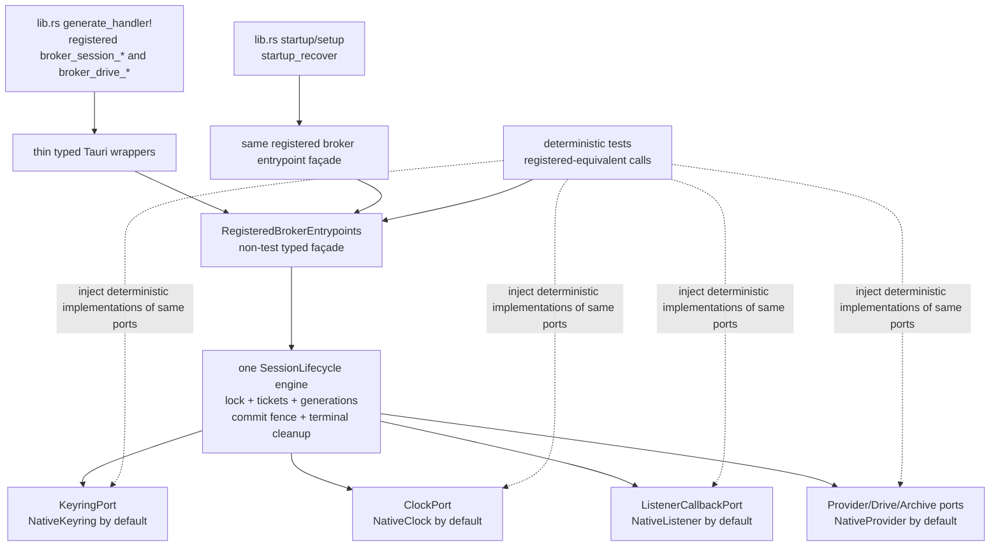

# Native Session Broker Registered-Entrypoint Evidence Amendment — D-GDA6

## Status and authority boundary

This is a reviewable HIGH-risk C-3 documentation candidate. It is a narrow
remediation authority proposal following the independent Terra D-GDA5 Fix3
FAIL/BLOCK. It does not authorize source changes, test changes, configuration,
migrations, provider actions, deployment, release, promotion, or production
approval.

No implementation starts under this documentation task. A future implementation
may start only after all approval conditions in D-GDA6-06 and §12 are satisfied.
The candidate remains `candidate` and `unapproved` until then.

This amendment does not reopen controls that already passed locally. It only
authorizes a future evidence and entrypoint convergence slice for the three
P0 findings recorded by Terra. It does not convert local evidence into
production readiness.

## 1. Trigger, scope, and immutable provenance

### 1.1 Trigger

Terra Fix3 reviewed implementation commit
`837b04476b720553997719b9be71da9470029d6e` and returned FAIL/BLOCK at commit
`c390f1f9c33d27867f6fdef7e3713ebe3414ab02`. The recorded failures are:

1. `SessionLifecycle::logout`, `shutdown`, and `disconnect_drive` are
   compiler-proven dead in the non-test build while behavioral tests call them.
2. The Drive race test does not enter the registered-equivalent
   `broker_drive_*` flow, `DriveOperationGuard::drop`, or the actual
   `upload_resumable_file` provider-send boundary.
3. Startup recovery tests use a fake-port method and direct map mutation rather
   than the same non-test composition route used by Account and every
   registered Drive domain.

All other D-GDA5 local passes and negative controls remain historical evidence;
they are not silently reclassified by this amendment.

### 1.2 Scope

The future slice is limited to making the registered production entrypoint and
its deterministic injected-adapter evidence one call graph. It covers:

- removal or convergence of dead generic lifecycle seams used only by tests;
- one production composition root with live native adapters by default and
  deterministic adapters only at the same typed ports in tests;
- registered-equivalent Drive operation, guard/drop, provider-send, drain, and
  stale-result evidence;
- the same non-test startup-recovery route for Account and each registered Drive
  domain, with injectable keyring behavior for deterministic faults;
- compiler/lint evidence proving no D-GDA6 lifecycle warning remains.

Browser source and behavior are unchanged. Mobile remains deferred. Supabase,
Edge/RLS, Google OAuth/provider, OS-keyring VM, device/UAT, signing, release,
deployment, monitoring, and production approval are out of scope and remain
open.

### 1.3 Immutable source record

| Evidence | Immutable record | Disposition |
|---|---|---|
| Prior approved D-GDA5 candidate | Commit `bcc672decd3ae35cf7875ca2f984a7919aafbe6b`; SHA-256 `B1181942C9D98601EC96D4BAB9FA81D6DFFC78FE81A098AA6F461ACA1EE976C8` | Prior approval only; not approval for D-GDA6 |
| Prior implementation | Commit `837b04476b720553997719b9be71da9470029d6e` | Historical implementation target; not D-GDA6 complete |
| Terra D-GDA5 Fix3 | Commit `c390f1f9c33d27867f6fdef7e3713ebe3414ab02` | Independent FAIL/BLOCK; Fix3-of-3 exhausted |
| Current documentation base | HEAD at drafting start `c390f1f9c33d27867f6fdef7e3713ebe3414ab02` | Candidate is based on this source state |
| D-GDA6 candidate bytes | Commit and SHA-256 are externally bound after final bytes | Must be recorded in the Luna report and exact Boss approval |

## 2. Inherited controls and non-regression boundary

The future implementation must retain, without weakening or redesigning them:

- typed zeroizing recovery-phrase ingress and the B1-B5 custody boundary;
- deny-before-keyring/provider ordering;
- `AccountOperationGuard` admission and ticket validation;
- `cleanup_failed` / `credential_cleanup_failed` terminal behavior;
- W1 authority, one-use replay reservation, and the existing 50-client local
  replay evidence;
- closed typed IPC with no generic forwarding or secret-bearing legacy alias;
- Browser unchanged and Mobile deferred;
- existing D-GDA5 failure-atomic slot/marker taxonomy, including `NoEntry` as
  the only normal absence result.

The D-GDA6 implementation must not change the W1 schema, provider deployment,
Browser files, Mobile files, `GoogleDrivePanel.tsx`, or external configuration.
The known ignored `invoke` argument compatibility warning remains out of scope.

## 3. Candidate decisions for Boss approval

| ID | Decision | Normative requirement | Status |
|---|---|---|---|
| D-GDA6-01 | One registered production entrypoint | Remove, delete, or make unreachable from the non-test build every generic lifecycle method used only by tests. Define one non-test typed broker entrypoint façade for account lifecycle, Drive lifecycle, protected Drive operations, and startup recovery. Registered Tauri wrappers and deterministic tests must call that same façade and the same domain methods. No `#[cfg(test)]` mirror authority, dead production seam, direct fake-only success path, or duplicate lifecycle engine is permitted. | candidate |
| D-GDA6-02 | One composition root with injectable adapters | Define one composition-root constructor/factory for the broker. Production construction uses `NativeKeyring`, `NativeClock`, `NativeListener`, and `NativeProvider` as the default live adapters. Deterministic tests inject adapters implementing the same named ports into that constructor and then call the same non-test entrypoint façade. Injection changes dependencies only; it must not select a second lifecycle engine, alternate lock protocol, alternate guard, or alternate recovery algorithm. | candidate |
| D-GDA6-03 | Registered-equivalent Drive race evidence | Drive tests must execute the broker-equivalent `broker_drive_*` flow through the shared façade, own a real `DriveOperationGuard`, retain its ownership through `upload_resumable_file` and the actual provider-send boundary, and release admission only through `Drop`. Deterministic barriers must cover disconnect, logout, shutdown, pre-send denial, post-send stale rejection, drain completion, no deadlock, and no credential resurrection/publication. | candidate |
| D-GDA6-04 | Registered startup-recovery evidence | Startup tests must call the same non-test `startup_recover` composition route used at application startup for Account and every registered Drive domain. An injected deterministic keyring may fault the exact production port, but tests must not call a generic recovery helper or mutate an internal map outside that port. The matrix covers staged index, slot, marker, old-slot deletion, compact-index write, restart, and post-marker failure; every ambiguous/fault result fails closed and prevents stale access/publication. | candidate |
| D-GDA6-05 | Compiler, lint, and bounded evidence | D-GDA6 lifecycle methods and adapters are live in non-test compilation, with zero warnings attributable to this slice. The implementation report itemizes unrelated existing warnings by file/symbol and proves they are unchanged and outside D-GDA6. Source, negative, behavioral, full regression, and whitespace evidence must map to exact AC-GDA6 IDs without claiming external or production proof. | candidate |
| D-GDA6-06 | Exact approval, review, and fix budget | This candidate must be committed, SHA-256 bound, and independently reviewed by a fresh Terra worker against the same bytes. Boss must approve the exact D-GDA6 IDs, exact candidate commit, and exact 64-character candidate SHA-256. Any byte, metadata, line-ending, scope, or ID change invalidates the review and approval. Future implementation has a maximum of three fix cycles; failure after cycle 3 requires a new amendment. | candidate |

## 4. Normative C-3 architecture

### 4.1 Single composition and call graph

The existing live native adapter types remain the production defaults. The
future implementation may retain `SessionLifecycle` as the engine name or use a
semantically equivalent name, but there must be one engine and one façade. The
facade is non-test code so compiler reachability is visible in the production
build.



The test harness is not allowed to instantiate a special `LifecycleCore`,
`SessionMemory`, generic test broker, or direct internal state mutation. It may
construct the same façade with deterministic ports. The proof that this is not
a second lifecycle engine is:

1. the façade methods are referenced by non-test registered wrappers and by the
   startup route;
2. deterministic tests call those same façade methods, not private test-only
   lifecycle methods;
3. the façade owns no independent state machine, generation counter, drain,
   guard, commit fence, or recovery algorithm; and
4. `cargo check` shows no D-GDA6 lifecycle method as unused.

### 4.2 Command-to-entrypoint-to-adapter matrix

The command names below are the current registered names in `lib.rs`. Future
changes must preserve their typed operation surface and route through the same
façade. A test may call the façade method directly when constructing a Tauri
runtime is impractical, but the method must be the exact one called by the
registered wrapper and must execute the same provider/guard/recovery boundary.

| Registered wrapper | Shared façade/domain entrypoint | Required default adapters | Deterministic evidence |
|---|---|---|---|
| `broker_session_login_begin`, `broker_session_login_cancel`, `broker_session_status`, `broker_session_logout` | `account.login_begin`, `account.login_cancel`, `account.status`, `account.logout` | Native keyring, clock, listener, provider, commit observation | login/cancel/logout transition and stale completion |
| `broker_enrollment_request`, `broker_enrollment_status`, `broker_device_list`, `broker_pairing_create`, `broker_pairing_poll`, `broker_pairing_reconcile`, `broker_device_revoke`, `broker_device_audit_list`, `broker_device_endpoint_publish` | account admission/device domain entrypoints | Native provider, clock, commit observation | deny after logout/shutdown; no new credential authority |
| `broker_drive_connect_begin`, `broker_drive_connect_complete`, `broker_drive_connect_cancel` | `drive.connect_begin`, `drive.connect_complete`, `drive.connect_cancel` | Native keyring, clock, listener, provider, commit observation | callback single-use, stale completion, marker commit |
| `broker_drive_status`, `broker_drive_disconnect` | `drive.status`, `drive.disconnect` | Native keyring, provider, commit observation | guard/drain transition and fail-closed cleanup |
| `broker_drive_list_archives` | `drive.protected_list` | Native keyring, Drive provider, archive/job, commit observation | real Drive admission and post-work ticket check |
| `broker_drive_upload_archive` | `drive.protected_upload` → `upload_resumable_file` | Native keyring, Drive provider, archive/job, commit observation | actual resumable provider-send barrier and stale result |
| `broker_drive_restore_intent`, `broker_drive_restore` | `drive.restore_intent`, `drive.restore` | Native keyring, Drive provider, archive/job, clock, commit observation | typed zeroizing phrase, deny after transition, no publication |
| application setup/exit route calling `startup_recover` and shutdown | `startup_recover`, `account.shutdown` | Native keyring, clock, listener, provider, commit observation | Account + every registered Drive recovery and cleanup failure |

### 4.3 Account and Drive coordination

The shared engine remains the only owner of account epoch, Account generation,
Drive generation, operation IDs, quiescing, drains, commit fence, in-memory
publication, and terminal cleanup. Account logout and shutdown invalidate both
domains. Drive disconnect invalidates the Drive domain. Every provider result
must carry a ticket that is checked before provider work, immediately before a
send, after the send, and before public result/publication.

## 5. Required lock, guard, and drain ordering

The ordering below is normative and must be visible in source and behavioral
evidence:

1. Under the lifecycle mutex, reserve a ticket and increment the appropriate
   drain. No external provider or keyring I/O occurs while holding the mutex.
2. Release the mutex before waiting for a drain. A transition first marks the
   domain/account quiescing and increments its generation, then releases the
   mutex, then waits for the captured drain to reach zero.
3. A Drive operation owns `DriveOperationGuard` from admission through the
   complete registered-equivalent provider flow. The guard's `Drop` is the only
   normal release of its drain ownership; tests must not manually release the
   drain to simulate completion.
4. The resumable upload checks the ticket immediately before every provider
   send, enters the deterministic send barrier, performs the actual provider
   send, and checks the ticket immediately after. A stale post-send result is
   discarded and cannot publish an archive, credential, or connected status.
5. After drain completion, the transition reacquires the mutex, verifies the
   terminal cleanup/absence contract, and publishes only a redacted terminal
   state. Any cleanup uncertainty returns `cleanup_failed` and retains terminal
   failure state.

```mermaid
sequenceDiagram
    participant C as Registered Drive command
    participant E as Shared entrypoint/engine
    participant G as DriveOperationGuard
    participant P as upload_resumable_file/provider
    participant X as disconnect/logout/shutdown
    C->>E: reserve ticket under lifecycle mutex
    E->>G: create guard and admit drain
    E-->>C: release mutex; perform protected work
    C->>P: pre-send ticket check
    P-->>C: deterministic provider-send barrier
    X->>E: quiesce + increment generation under mutex
    E-->>X: release mutex; wait captured drain
    P->>P: send completes
    P-->>C: post-send ticket check
    C-->>C: stale result rejected if generation changed
    C->>G: scope ends
    G->>G: Drop releases drain
    X->>E: drain reaches zero; cleanup and verify absence
    E-->>X: terminal result or cleanup_failed
```

The deterministic test must assert bounded completion for each transition. A
test that manually releases a drain, calls `finish_*` without the guard, or
calls an internal generic method is not D-GDA6 evidence.

## 6. Startup recovery route and fault matrix

`startup_recover` is the one non-test composition route. Production setup
constructs it with native adapters. Deterministic tests construct the same
composition with a keyring adapter that records the same read/write/delete/
readback operations and injects failures at the named boundaries. The test
must invoke the route, not a generic `recover_startup` helper on a fake broker.

```mermaid
sequenceDiagram
    participant A as Application startup
    participant R as startup_recover composition route
    participant E as Shared engine
    participant K as KeyringPort
    participant D as Account + every registered Drive domain
    A->>R: construct native or deterministic adapters
    R->>E: invoke same non-test recovery entrypoint
    E->>D: enumerate registered credential domains
    loop marker/index/slot reads
        E->>K: read marker, index, referenced and orphan slots
        K-->>E: typed result (NoEntry or fault)
    end
    E->>K: delete old/orphan slots and compact index
    E->>K: read back absence and committed metadata
    alt verified recovery
        E-->>R: signed-out/disconnected or redacted valid state
    else ambiguity/fault
        E-->>R: cleanup_failed; no access/publication
    end
```

The same matrix is executed independently for Account and every registered
Drive domain:

| Fault/order | Required evidence and result |
|---|---|
| staged index write/read | failure leaves no staged authority; cleanup is verified or terminal `cleanup_failed` |
| slot write/readback | old marker/slot remains authoritative before marker; failed new slot is deleted and verified absent |
| marker write/readback | ambiguous marker is not `NoEntry`; no access or public success; restart re-reads all material |
| old-slot deletion/readback | valid new marker does not publish until old/orphan deletion and absence verification pass |
| compact-index write/readback | index failure is terminal; no stale slot selected or published |
| restart after each prior success | the same startup route reconstructs state; no fake helper or direct map mutation |
| post-marker failure | committed marker is validated, cleanup failure remains terminal, and no stale/unauthorized credential is published |
| marker absent + no slots | only `NoEntry` for marker and every slot yields normal absent state |
| marker missing/corrupt target or orphan | fail closed; delete/verify material; never fall back to another slot |

The report must show operation traces without secret values: domain, operation,
fault point, marker/index/slot identifiers, result class, cleanup proof, and
public publication outcome.

## 7. Compiler, lint, and negative evidence

The D-GDA6 evidence gate requires:

- `cargo check --manifest-path src-tauri/Cargo.toml --message-format=short`
  with zero warnings attributable to D-GDA6 entrypoints, façade, guard, drain,
  or startup route;
- scoped `rustfmt --edition 2021 --check` over changed Rust paths;
- Node source-contract checks proving all registered command names remain typed,
  no legacy/generic secret-bearing alias is registered, no Browser/Mobile path
  changed, and no test-only lifecycle authority exists;
- source inventory showing each façade method has a non-test production caller;
- no new dead code, `#[cfg(test)]` lifecycle implementation, manual drain
  release in behavioral tests, direct keyring-map mutation, or fake-only
  provider-send path.

The current checkout's unrelated warning baseline is bounded and must be
itemized in the future implementation report, not hidden:

- `src/lib.rs`: `PairedDeviceInput`, `upsert_paired_device`,
  `list_paired_devices`, `revoke_paired_device`, `paired_device_upsert`,
  `paired_device_list`, `paired_device_revoke`,
  `fungwire_local_endpoint`;
- `src/device_identity.rs`: `ENROLLMENT_PROOF_TTL`,
  `NativeEnrollmentProof`, `enrollment_timestamp_ms`,
  `validate_device_label`, `sign_pending_enrollment_challenge`,
  `device_enrollment_proof`, `ensure_identity_in_dir`,
  `read_legacy_seed`, `public_key_b64_in_dir`.

These warnings are unrelated baseline observations from the drafting checkout.
The three D-GDA5 lifecycle warnings (`logout`, `shutdown`,
`disconnect_drive`) are not acceptable as baseline; they must be removed,
converged, or become live through the registered production façade. If an
additional warning appears in a changed D-GDA6 path, the implementation is
blocked until it is fixed or a new amendment explicitly changes the boundary.

## 8. Exact future implementation write set

After D-GDA6-06 is satisfied, the future implementation may modify only:

1. `src-tauri/src/auth_session.rs`
2. `src-tauri/src/drive_oauth.rs`
3. `src-tauri/src/lib.rs`
4. `tests/nativeSessionCustody.test.mjs`
5. `tests/googleDriveContract.test.mjs`
6. `docs/verification/implementation-reports/2026-08-25-native-session-broker-registered-entrypoint-evidence-implementation-luna-report.md`

The current documentation task writes only these two files:

1. `docs/specs/2026-08-25-native-session-broker-registered-entrypoint-evidence-amendment.md`
2. `docs/verification/implementation-reports/2026-08-25-native-session-broker-registered-entrypoint-evidence-luna-report.md`

No other source, test, documentation, dependency, lockfile, Cargo/config,
capability, migration, Browser, Mobile, UI, provider, or deployment path may
be modified. If implementation genuinely requires another path, stop before
editing and request a new amendment that names and justifies it.

## 9. AC-GDA6 success and evidence criteria

None of these criteria is satisfied by this drafting task.

| ID | Required future acceptance criterion |
|---|---|
| AC-GDA6-01 | The registered Tauri auth, device, Drive, and setup/exit wrappers and deterministic tests call one non-test typed broker façade; no dead generic lifecycle seam or test-only mirror authority remains. |
| AC-GDA6-02 | The production composition root defaults to `NativeKeyring`, `NativeClock`, `NativeListener`, and `NativeProvider`; deterministic tests inject only the same named ports into the same entrypoint graph and do not select a second engine. |
| AC-GDA6-03 | `cargo check` and source inventory prove every D-GDA6 lifecycle method is live in non-test compilation and no D-GDA6 warning remains. Unrelated baseline warnings are itemized and unchanged. |
| AC-GDA6-04 | The Drive race matrix executes registered-equivalent `broker_drive_*` flow, real `DriveOperationGuard` ownership/drop, and actual `upload_resumable_file` provider-send with deterministic barriers. |
| AC-GDA6-05 | Drive disconnect, account logout, and shutdown all quiesce safely, release the mutex before drain wait, complete without deadlock, and reject pre-send and post-send stale work. |
| AC-GDA6-06 | No Drive credential, marker, staged/orphan slot, access state, archive publication, connected state, or public success is resurrected after a winning transition. |
| AC-GDA6-07 | Startup recovery executes the same non-test `startup_recover` composition route for Account and every registered Drive domain with an injected keyring adapter only at the port boundary. |
| AC-GDA6-08 | Staged index, slot, marker, old-slot deletion, compact-index, restart, and post-marker fault cases fail closed; only verified `NoEntry` is normal absence; cleanup uncertainty retains `cleanup_failed`. |
| AC-GDA6-09 | Typed zeroizing recovery ingress, deny-before-keyring/provider, `AccountOperationGuard`, `cleanup_failed`, W1 authority, closed IPC, Browser unchanged, and Mobile deferred remain true. |
| AC-GDA6-10 | Required Node, Rust, cargo check, scoped rustfmt, build, and diff checks pass; evidence includes exact commands, exit results, counts, changed paths, source commit, candidate hash, and no secret values. |
| AC-GDA6-11 | Local/static evidence is explicitly separated from clean Windows VM/real OS keyring, real Supabase/Edge/RLS, real Google OAuth/provider, device/UAT, signing, release, deployment, monitoring, and production approval gates. |
| AC-GDA6-12 | Exit requires fresh independent Terra review of exact candidate bytes, Boss approval of exact D-GDA6 IDs plus candidate commit and SHA-256, and no more than three implementation fix cycles. |

## 10. Required future commands and evidence record

The implementation report must record exact invocation, exit status, duration or
bounded timeout, relevant counts, changed paths, source/implementation commit,
candidate path and SHA-256, and `git diff --check`. The minimum command set is:

```text
node --test tests/nativeSessionCustody.test.mjs
node --test tests/googleDriveContract.test.mjs
node --test tests/w1AuthoritySchema.test.mjs
node --test --experimental-strip-types tests/authFlow.test.mjs
rustfmt --edition 2021 --check src-tauri/src/auth_session.rs src-tauri/src/drive_oauth.rs src-tauri/src/lib.rs
cargo check --manifest-path src-tauri/Cargo.toml --message-format=short
cargo test --manifest-path src-tauri/Cargo.toml native_behavioral_ -- --nocapture
cargo test --manifest-path src-tauri/Cargo.toml -j 1
npm run build
git diff --check -- src-tauri/src/auth_session.rs src-tauri/src/drive_oauth.rs src-tauri/src/lib.rs tests/nativeSessionCustody.test.mjs tests/googleDriveContract.test.mjs
```

The report must separately label:

- local/static: compiler reachability, source inventory, deterministic adapters,
  registered-equivalent race/recovery traces, Node/Rust/build checks, retained
  W1 local evidence, and whitespace/provenance;
- external/open: real OS keyring on a clean Windows VM, real Supabase/Edge/RLS,
  real Google OAuth/provider transport, device/UAT, signing, release,
  deployment, monitoring, and production approval.

## 11. Risk, rollback, and boundaries

Risk is HIGH/C-3 because this changes the lifecycle composition boundary,
concurrency evidence, and startup custody proof. The narrow rollback is to
revert the single future implementation commit(s) for D-GDA6 while preserving
the D-GDA5 commits and review history. No rollback may delete user data, rewrite
the keyring, alter provider state, or touch external deployment. If a future
implementation needs a new path, discovers a second authority, cannot prove
guard/drop ordering, or exceeds three fix cycles, stop and return BLOCK; do not
expand scope by inference.

Success means the local D-GDA6 acceptance matrix is reproducibly green and the
source/command graph is honest. Acceptance additionally requires independent
Terra review and Boss exact-hash approval. Exit from this amendment does not
mean production ready: all external gates in §10 remain open.

## 12. Exact approval semantics

The candidate must first be committed as one focused candidate commit containing
the candidate document and Luna report. The final candidate file bytes are then
hashed with SHA-256 and recorded exactly in the Luna report. Fresh Terra must
independently review those same committed bytes and record PASS/FAIL with the
same path, commit, and hash.

Only after that review may Boss approve the exact string:

```text
approve D-GDA6-01 through D-GDA6-06 — commit <candidate-commit> — SHA-256 <64 uppercase hex characters>
```

Any candidate byte change, metadata change, whitespace or line-ending change,
scope change, or decision-ID change invalidates both Terra review and Boss
approval. A commit without the exact hash is not approval. Terra review or a
hash alone is not implementation authorization. The implementation budget is
maximum three fix cycles for D-GDA6, and no implementation starts before the
exact approval above.

## Version Diff

- New D-GDA6 candidate after Terra D-GDA5 Fix3 FAIL/BLOCK.
- Narrows remediation to registered production-entrypoint evidence and removes
  ambiguity around the one composition root, injected ports, Drive guard/drop,
  provider-send barriers, and startup recovery route.
- Adds exact command/domain/adapter matrices, lock/drain and recovery diagrams,
  fault and negative-test requirements, compiler warning boundaries, future
  write set, rollback, approval semantics, and a three-cycle implementation cap.
- Preserves passing custody, deny-before-provider, cleanup failure, W1, IPC,
  Browser, Mobile, and external-gate boundaries; implementation is not started.

## CHANGELOG

| Version | Date | Status | Summary | Commit Hash | Agent |
|---|---|---|---|---|---|
| 0.1.0b | 2026-08-25 | candidate | New HIGH/C-3 D-GDA6 registered-entrypoint evidence amendment after D-GDA5 Fix3 FAIL/BLOCK; implementation unauthorized. | externally bound after commit | Luna 5.6
