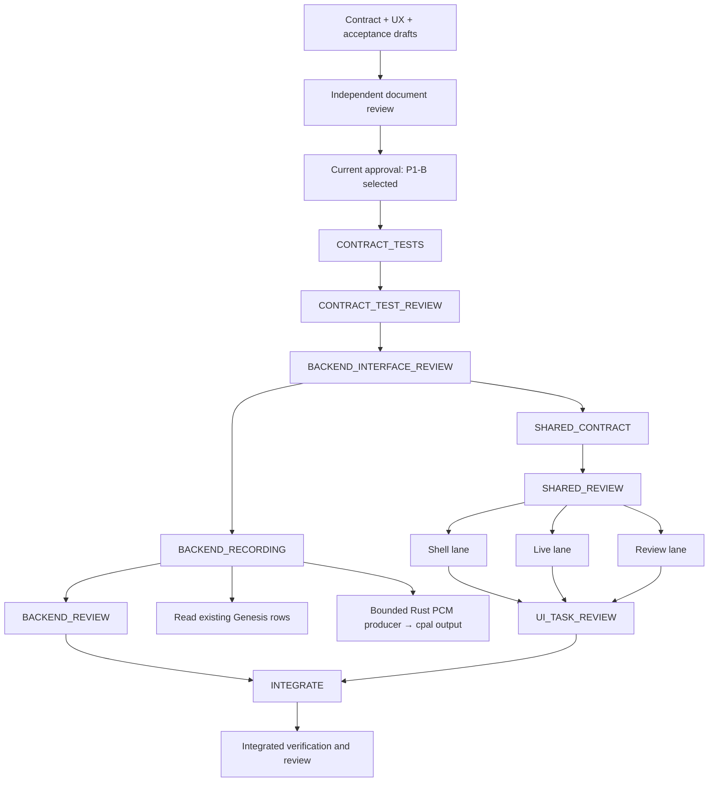

# Call.md-inspired FUNG desktop: candidate contracts

## 1. Decision and authority

The current execution authority is recorded in the [current approval
record](../verification/implementation-reports/2026-09-17-callmd-approval.md).
Boss's `approve` authorizes feature cover v0.2.0b: full P1-B, the scoped SVG/PNG
format, the exact four-file baseline preservation repair, and the interface-first
backend/UI fork-join. It does not authorize a security waiver, Drive restoration,
cloud/schema/CSP expansion, commit, push, merge, release, or deployment.

P1-B is the selected feature: a local desktop workspace with real recording history,
bounded native PCM playback, and recording-scoped Q&A. The NEW interfaces below are
the frozen candidate contracts for the downstream interface review and implementation
leases; their acceptance does not claim runtime or native evidence. P1-A remains the
historical fallback description, not the current selection. Earlier pending wording
in this document is retained as provenance only and is superseded by the current
approval record.

| Choice | Included | Explicit boundary |
|---|---|---|
| P1-A | Shell/live resurface, known current-recording review, existing summaries/export and legacy Q&A | No history enumeration or native playback; Q&A labeled local knowledge search with project transcript filter, not recording-isolated. |
| P1-B selected | A's surfaces plus all recordings within a selected project, native PCM playback, new recording-scoped Q&A | Supported PCM formats below only; no new codecs, provider, cloud, schema, durable session entity, or annotation persistence. |

P2 bookmarks, agenda/checklists, conversation metrics, and proactive assistance are deferred.
Google Drive remains canceled. The screenshot is a visual reference, not mounted source truth.
Preserve Quiet Archive branding, Thai-first copy, Tauri/React/Rust/Genesis, optional login,
lazy local access, default-off external tools, approval previews and no renderer fetch.
This spec supersedes no implemented contract. Names/limits below remain binding
candidate interface scope for the accepted feature and must be consumed only after
the approved review/dependency gates; no critical transport choice is left implicit.

## 2. Evidence and corrected baseline

References are repository-relative at the pinned base; line ranges describe source evidence.
The prior scan is docs/verification/implementation-reports/2026-09-17-callmd-fung-contract-scan.md.

| ID | Source | Verified implication |
|---|---|---|
| E1 | docs/Desktop/ARCHITECTURE.md:21-90 | Desktop/local-first; Genesis is the persistence boundary. |
| E2 | src/App.tsx:627-720 | Project library uses activeRecordingId; no complete recording enumeration. |
| E3 | src/tauri.ts:142-221,324-338,450-475,585-705 | Existing bridge is src/tauri.ts; summary/transcript pair scope, project export list, legacy ask args. |
| E4 | src/components/LiveMeetingPanel.tsx:38-141 | Component owns four listeners; status/segment/topic handlers currently lack recording filters; late listener cleanup is not guarded. |
| E5 | src-tauri/src/live_meeting.rs:63-110,713-766,1534-1553,1607-1843 | Process-local session, durable recording ID, start/stop/status and capture channel semantics. |
| E6 | src-tauri/src/meeting_intel.rs:224-318,368-385 | Legacy transcript search optionally filters project; graph query and injected live tail do not enforce that scope. |
| E7 | src-tauri/src/meeting_intel.rs:878-929,949-1086 | Summary attribution through model runs, superseded/excluded/unattributable fields. |
| E8 | src-tauri/src/local_api.rs:542-684,899-974,1014-1086 | Tokenized web/phone list/audio routes exist; audio assembly currently allocates whole stream. |
| E9 | src-tauri/src/lib.rs:1066-1128,1949-2001,3363-3424 | Jobs return newest 30; recovery detects/adopts audio and fills transcript gaps. |
| E10 | src-tauri/src/genesis_adapter.rs:203-255,543-585,781-826,938-1009 | Existing recording/chunk/transcript/summary/export schema; v10 remains unchanged. |
| E11 | src/lib/jobActions.ts:16-118; src/components/InstrumentRail.tsx:28-43,97-105 | Five runnable jobs; marker disabled, VU inactive, desktop playback disabled. |
| E12 | src-tauri/Cargo.toml:24-25,31,38-43; src-tauri/src/live_meeting.rs:272-280 | cpal/hound/rand already dependencies; live WAV is mono integer PCM16. |
| E13 | src-tauri/tauri.conf.json:30-49; src-tauri/capabilities/default.json:1-14 | Main window and existing CSP/capabilities; no new media URL needed for proposed native output. |
| E14 | docs/plans/2026-09-17-callmd-ui-task-dag.json (CONTRACT_TEST_REVIEW/BACKEND_INTERFACE_REVIEW/BACKEND_RECORDING/SHARED_CONTRACT/BACKEND_REVIEW/UI_TASK_REVIEW/INTEGRATE nodes) | The approved cover amendment places BACKEND_INTERFACE_REVIEW after CONTRACT_TEST_REVIEW; BACKEND_RECORDING and SHARED_CONTRACT both wait for that accepted interface review, and INTEGRATE joins BACKEND_REVIEW with UI_TASK_REVIEW. Exact write leases remain disjoint. |

E4/E6 refine the prior scan: an event's recordingId on summary reload is useful but
does not prove all live events are isolated. “Project-wide Q&A” describes the exposed
argument, not a verified isolation guarantee. These are source observations, not
reproduced runtime RCA or permission to repair other callers.

## 3. Architecture and dependencies

The approved scheduling amendment is interface-first: after accepted
`CONTRACT_TEST_REVIEW`, `BACKEND_INTERFACE_REVIEW` freezes the command/DTO/error/
ownership contract and its test oracles. Only that accepted interface review may
start `BACKEND_RECORDING` or `SHARED_CONTRACT`. The backend branch then runs
`BACKEND_RECORDING → BACKEND_REVIEW` while the shared branch runs
`SHARED_CONTRACT → SHARED_REVIEW → UI_SHELL/UI_LIVE/UI_HISTORY → UI_TASK_REVIEW`.
`BACKEND_REVIEW` is a retained native/security review, not an eliminated gate;
`INTEGRATE` requires both `BACKEND_REVIEW` and `UI_TASK_REVIEW`. The cap is three
active Luna workers total, with isolated worktrees and disjoint write leases.

The earlier serial backend-before-shared/UI order remains historical provenance in
the readiness report; the current approval record supersedes its pending state for
this scheduling amendment without changing the feature or security boundaries.

No new HTTP listener, custom media scheme, asset URL, renderer audio buffer, or
tokenized renderer fetch is proposed. Tauri IPC carries control/metadata only.
Playback introduces new local command authority and device/resource ownership;
approval item SEC-1 explicitly covers it despite no network or CSP expansion.
The current local_api.rs remains a separate unchanged web/phone surface.

## 4. Common identity, errors and read states

RecordingKey is the exact pair {projectId: string, recordingId: string}.
IDs are opaque existing identifiers: validate nonempty and length <=256; do not
reject valid historical IDs merely because they are not UUIDs. Never accept paths.
NEW B commands validate project existence and recording.project_id equality in Rust;
their wrong-pair error is SCOPE_MISMATCH. The validator lives in recording_review.rs
and is reused by NEW playback/scoped-ask entry points only. Existing APIs used by
either A or B retain their current native validation and error shapes. The legacy
meetingAsk no-match path remains a successful AskAnswer with empty sources under
its current semantics; it is not the NEW B insufficient_evidence/ReviewError path.
B performs getRecording preflight before selected-recording actions, but that does
not retrofit validation into old commands or change their error contract.
UI selection is independent of live capture identity and never writes activeRecordingId.
No new session ID is persisted; selectionEpoch is a renderer-local monotonic counter.

NEW commands reject with ReviewError {code, message, retryable}; safe messages
contain no credentials, absolute paths, provider tokens or arbitrary stderr.
| Codes | Meaning |
|---|---|
| INVALID_ARGUMENT, PROJECT_NOT_FOUND, RECORDING_NOT_FOUND, SCOPE_MISMATCH | Bad input or missing/wrong identity; never successful empty data. |
| STORAGE_READ_FAILED, INVALID_RECORDING_METADATA, RESOURCE_LIMIT | Ledger failure, invalid required row, or bounded resource limit. |
| CURSOR_INVALID, CURSOR_EXPIRED | Wrong owner/project/limit or expired snapshot; explicit refresh required. |
| NATIVE_UNAVAILABLE, LEGACY_COMMAND_FAILED | Browser/native unavailable or failed existing command; preserve error state. |
| NO_EVIDENCE, PROVIDER_UNAVAILABLE, PROVIDER_FAILED, MODEL_OUTPUT_INVALID | Scoped ask outcomes described below; no cross-scope fallback. |
| PLAYBACK_* | Native playback conditions listed in section 7. |

ReadState is idle/loading/ready/error/unavailable; ready contains data and can be empty.
Request identity = RecordingKey + selectionEpoch + requestId. Discard late results
including errors if any field differs. Existing native errors remain compatible;
the new bridge normalizes them to LEGACY_COMMAND_FAILED without parsing message text.
A refresh error may retain visibly stale previous data, never silently replace it
with empty success. Native browser-preview unavailability never creates fake jobs.

## 5. Existing versus NEW interfaces

All argument/result names are documentation DTOs; no implementation signatures follow.
CamelCase is the IPC wire casing, including Rust serde serialization.

| Frontend wrapper / native command | State and arguments | Result |
|---|---|---|
| listProjects / list_projects; listJobs / list_jobs | EXISTING; no args | Project[]; Job[] (newest 30, not full history). |
| liveMeetingStart / live_meeting_start | EXISTING; projectId?, captureSystem?, language? | projectId, recordingId, jobId, micDevice; systemDevice and warning are nullable fields. |
| liveMeetingStop / live_meeting_stop; liveMeetingStatus / live_meeting_status | EXISTING; no args | Stop returns an acknowledged recordingId request, not completed stop; while the session remains owned status can be active:true, stopping:true; inactive requires active:false, stopping:false, with nullable projectId/recordingId/elapsedMs. |
| listTranscriptSegments / list_transcript_segments | EXISTING; RecordingKey | TranscriptView segments; compatibility fields are capped=false and cappedRecordingIds=[], with cap retained for wire-shape stability. |
| meetingSummaries / meeting_summaries | EXISTING; RecordingKey | rows, otherRecordings, unattributable, attributionComplete. |
| createJob / create_job | EXISTING; jobType + RecordingKey | Job; use only five existing runnable kinds. |
| listExportArtifacts / list_export_artifacts | EXISTING; projectId | Project-scoped ExportArtifact[]; no recording attribution guarantee. |
| meetingAsk / meeting_ask | EXISTING; question, projectId? | Legacy AskAnswer; not recording-isolated (E6). |
| listRecordings / desktop_recordings_list | NEW B; projectId, limit=50, cursor=null | RecordingPage. |
| releaseRecordingList / desktop_recordings_release | NEW B; snapshotId | {released: boolean}; owner-bound, idempotent. |
| getRecording / desktop_recording_get | NEW B; RecordingKey | Fresh RecordingRow. |
| askRecording / meeting_ask_recording | NEW B; RecordingKey, question, requestId | RecordingAnswer. |
| openPlayback / desktop_playback_open | NEW B; RecordingKey, channel | PlaybackState initially paused, positionMs=0. |
| controlPlayback / desktop_playback_control | NEW B; handle, expectedEpoch, action, positionMs? | PlaybackState; action is play/pause/seek. |
| getPlayback / desktop_playback_status | NEW B; handle | PlaybackState. |
| closePlayback / desktop_playback_close | NEW B; handle | {closed: boolean}; owner-bound, idempotent. |

The EXISTING rows preserve current truth and limits: jobs are newest-30 only,
transcript cap fields are compatibility-only, export artifacts are project-scoped,
and legacy meetingAsk accepts an optional project filter without recording isolation.
Every NEW B name, limit, error and lifecycle rule is part of the selected approved
candidate interface, but remains subject to the accepted interface/native review and
exact lease transfer; it must not be inferred from an existing command's shape.

Existing correction/rename/import/diarization-readiness/cancel/external-tool commands
remain reachable with their existing approvals and argument scopes (E3/E11).
Summary generation keeps generateMeetingSummary or one summary.generate job, not
three independent “recap/intent/actions” jobs. No job-engine vocabulary changes.

## 6. Recording list, cursor and review semantics

RecordingRow fields: id, projectId, source, status (raw stored string), durationMs,
createdAt (RFC3339), updatedAt (RFC3339), language (string|null), channels
(array of mic/system/file), captureState (active/stopping/inactive).
No absolute media path is returned. Channels describe ledger inventory, not verified
file availability or people. playback readiness is checked only on explicit open.
Invalid required IDs/times or negative duration reject INVALID_RECORDING_METADATA.
Recovery is a separate RecoveryReport; a completed recording row alone is not proof
that every chunk survived. List refresh does not invoke the mutating recovery scan.

Query strictly by project. First page enumerates bounded Genesis pages, sorts by
parsed createdAt descending then id ascending, and freezes a metadata snapshot.
RecordingPage = {projectId, snapshotId, asOf, items: RecordingRow[], nextCursor: string|null}.
limit is integer 1..100, default 50. Maximum snapshot: 10,000 rows and 8 MiB metadata;
exceed either limit → RESOURCE_LIMIT, never truncated “complete” history.
At most two snapshots/main-window, 5-minute idle and 15-minute absolute TTL; eviction
returns CURSOR_EXPIRED. Page size and project are immutable for a snapshot.
Cursor is a random 128-bit opaque native registry key bound to window instance,
project, snapshot and next index. Replaying a cursor returns the same page.
Newly imported recordings require Refresh/new snapshot; they cannot reorder old pages.
Release snapshots on project change/unmount; shutdown clears them. No schema/cache file.
getRecording validates the pair and returns current metadata before opening review;
if removed, show RECORDING_NOT_FOUND and retain the explicit selection/error.
Selection changes never start capture, generation or playback automatically.

Summary rows retain recordingId/superseded and all exclusion counters (E7).
Malformed timeline/action JSON shows a per-section parse error and safe raw text;
it cannot crash the workspace or imply an empty summary.
Export action captures its RecordingKey at click time; output list remains labeled
“ไฟล์ส่งออกของโปรเจกต์”. Do not infer recording attribution from filenames or dates.
No schema change is needed because B does not promise recording-scoped artifact lists.

## 7. Native playback design (NEW B; SEC-1)

Use existing cpal output plus hound WAV reading on a dedicated native owner thread.
Live chunks are indexed by recording ID and mic/system filename convention; imports
use file. Choose one explicit channel; do not mix channels or label them as people.
Supported input: integer PCM16 WAV, mono or stereo, 8–96 kHz; all chunks in a channel
must match. Choose a supported native output rate equal to source rate, map mono to
stereo when needed and convert to device F32/I16/U16. No resampler or codec download.
Even ordinary 44.1/48 kHz live PCM is unavailable when the selected/default output
device cannot accept that exact rate: return PLAYBACK_OUTPUT_UNSUPPORTED, never
silently resample. A recorded input format does not prove output compatibility.
MP3 imports and other compressed imports, float WAV and other unsupported formats
return PLAYBACK_FORMAT_UNSUPPORTED. Playback is not universally available per recording.
This is an explicit B acceptance boundary; all-format playback requires a separate
decoder design/scope choice rather than silently broadening dependencies.

Resolve recording → project storage root → registered chunk rows. The project root
must itself resolve inside AppState.data_root/projects; legacy roots outside this
custody boundary fail PLAYBACK_PATH_DENIED and require a separate migration decision.
Do not fall back
to input_path, user-supplied filename or arbitrary canonical_audio_path.
Windows containment checks use normalized final paths from opened file handles,
under the validated project's custody root; reject UNC/device paths, alternate data
streams and reparse-point escapes. Read from those same handles to avoid check/open races.
Validate regular file, ledger byte size, PCM header/frame alignment and timeline;
checksum verification is not claimed. Before each reopened chunk, repeat containment
and length/header checks. No unrestricted filesystem access reaches the renderer.
At most 20,000 chunk descriptors/8 MiB per player; exceed → RESOURCE_LIMIT.
Retain a maximum of two source handles. Read PCM in <=64 KiB blocks into a bounded
<=1 MiB queue. The audio callback performs no disk read, allocation or blocking wait.
Worker owns decoding/indexing; callback drains available frames, inserting silence
on underrun. A sustained underrun (>1 second) pauses with PLAYBACK_BUFFER_UNDERRUN.
No whole-recording PCM Vec, base64 IPC, temp WAV assembly or renderer media buffer.

Range/seek is native frame addressing, not an HTTP Range protocol:
logical [0,durationMs] maps to timestamped chunk/frame offsets; align down to a whole
PCM frame and return actual positionMs. Seek outside range is INVALID_ARGUMENT.
durationMs is the ledger timeline end, with frame lengths checked against chunk
intervals (one-frame rounding tolerance); inconsistent metadata fails validation.
If all selected-channel source chunks are missing, return PLAYBACK_SOURCE_MISSING.
Missing chunk/gap preserves its timeline, yields silence and degraded=true plus
missingRanges [{startMs,endMs,reason}]; show that warning before the first play.
Overlapping/inconsistent chunk timelines fail PLAYBACK_TIMELINE_INVALID.
At EOF state becomes ended; play at EOF starts at zero. Seek invalidates queued blocks,
increments streamEpoch and resets the position clock; stale blocks cannot be rendered.
positionMs is based on frames handed to the output callback, not a wall-clock timer;
outputLatencyMs is nullable and position must not be described as sample-exact audible time.

PlaybackState = {handle, projectId, recordingId, channel, state, positionMs, durationMs,
streamEpoch, degraded, missingRanges, outputLatencyMs, error: ReviewError|null}.
state = paused/playing/ended/error. Handle uses 128 bits from the OS CSPRNG, bound to the
native main-window instance and process; never persisted, logged, shared or a URL.
Only the injected trusted local main WebView may open/control/read/close; do not trust
a window label supplied as an argument. Validate its current document origin against
the packaged local app origin (or exact configured dev origin), excluding navigated
remote documents. Local access needs no hosted login.
One player per app; a second open fails PLAYBACK_BUSY until close.
Commands serialize. expectedEpoch mismatch → PLAYBACK_STALE_EPOCH.
Status polls every 250 ms while visible; no new global playback event listener.
Errors additionally include PLAYBACK_HANDLE_INVALID, PLAYBACK_SOURCE_MISSING,
PLAYBACK_PATH_DENIED, PLAYBACK_IO_FAILED, PLAYBACK_DEVICE_LOST, PLAYBACK_CAPTURE_ACTIVE.
Retryable is true only for transient device/I/O/buffering failures; show explicit retry.
Close is idempotent for a previously issued owner handle, rejects foreign handles.
After close acknowledgement all callbacks/handles/queues are stopped and released.
Close on selection/channel/project change, component disposal or window destruction;
shutdown releases everything and restart never resumes playback automatically.
Open preparation runs off the UI/audio threads with a 10-second deadline and cleans
up on timeout (PLAYBACK_OPEN_TIMEOUT). A late open result after selection/disposal is
immediately closed by the requesting controller, never installed into current state.

To prevent recorded playback feedback, native admission serializes playback-open and
live-capture ownership under one AppState guard. Open fails if capture is active,
starting, or stopping. Existing stop acknowledges only the stop request; while
status remains active:true, stopping:true, capture remains the owner and playback
cannot open. Only active:false, stopping:false permits the transition. Capture start
rejects with a visible existing-command error while a player exists. UI first closes
playback and awaits close acknowledgement, then requests capture start; a stop
acknowledgement alone is never treated as inactive. This requires a narrow
live_meeting.rs admission change (SEC-2); UI guards alone cannot prove race safety.
Failed capture setup releases its reservation.

## 8. Recording-scoped Q&A and current-scope preservation

NEW RecordingAnswer = {projectId, recordingId, requestId, scope:"recording",
status:"answered"|"insufficient_evidence", answer, model:string|null, sources,
graphPolicy:"excluded", liveTailPolicy:"excluded"}.
Source = {segmentId, projectId, recordingId, startMs, endMs, text, citationIndex}.
Question is trimmed, required, <=4,000 Unicode scalar values. Validate the pair first.
Retrieve persisted transcript rows filtered by BOTH IDs. Deterministically rank
candidate evidence; at most 12 source segments and 24,000 Unicode scalars enter prompt.
If corpus exceeds 100,000 rows/32 MiB metadata+text budget, return RESOURCE_LIMIT;
do not label partial search complete. No relevant evidence returns insufficient_evidence,
empty sources and model=null without answer generation; NO_EVIDENCE is a UI reason.
Use the existing configured local provider only; never auto-select cloud or download.
Unavailable/failing provider returns PROVIDER_UNAVAILABLE/PROVIDER_FAILED.
Exclude graph nodes and the process live tail entirely from this NEW command: their
current retrieval lacks recording provenance enforcement (E6), so filtering response
citations after generation is insufficient. The prompt must never receive that data.
Model references must resolve only to supplied segment IDs; invalid/missing citations
for an asserted answer return MODEL_OUTPUT_INVALID, never fabricate five fallback refs.
Expose source timestamps/text and local inference labeling; no claim of verified truth.
A may retain legacy ask with explicit wording “ค้นความรู้ในเครื่อง”; explain selected
project limits transcript search only and graph/live context may come from elsewhere.
If Boss requires strict project isolation in A, A is no longer the unchanged backend
fallback: select B or approve a separately reviewed legacy-command repair.

## 9. Live listener ownership and reopen/recovery

LiveMeetingPanel is the sole live command/listener owner, mounted once for the desktop
lifetime; closing its view hides it and never stops native capture. LiveWorkspace is
presentation only. Shell/RecordingReview must not register duplicate live listeners.
On mount subscribe first, await all subscriptions, then read liveMeetingStatus and
load the active recording transcript; buffer <=200 incoming events during bootstrap.
Deduplicate segments by (recordingId,segmentId); merge persisted text and live tail.
Filter all four live event payloads by the known live recordingId; summary completion
for an older known pair only invalidates that pair's cached read, never current content.
Unknown IDs trigger metadata/status refresh, not adoption of an arbitrary event.
On selection change increment selectionEpoch; async summaries/ask cannot overwrite
another recording. Unlisten functions resolving after disposal are invoked immediately.
Topic data stays ephemeral; after reload display “รอข้อมูลสด”, not reconstructed history.
Use backend elapsedMs on attach; interpolation is display-only and resets on status.
On restart query status and existing recovery_scan/RecoveryNotice; no “resume recording”
claim from a durable row. Explicit recovery keeps adopted audio and transcript-gap
outcomes separate. Review refreshes the affected pair after recovery acknowledgement.
These are proposed behavior requirements beyond E4, not claims the current UI passes.

## 10. Shared UI props/actions and exclusive partitions

PROPOSED shared contracts live in src/components/desktop/contracts.ts NEW.
DesktopShell props: scopeChoice A|B, project ReadState<Project[]>,
selectedProjectId:string|null independent of selection:RecordingKey|null,
activeSurface:home|live|review, liveStatus ReadState, theme, main content slot,
settings/pairing/recovery slots. Actions: selectProject, selectRecording,
showHome, showLive, showReview, stopAndLeave, openSettings, openPairing,
importMedia, setTheme. Navigation itself never starts capture or network calls.
LiveWorkspace props: RecordingKey|null, phase, elapsedMs, devices, segment feed,
topic ReadState, summaries ReadState, ask ReadState, capabilities, operation errors.
Actions: start(options,closeReviewPlayer), stop, stopAndLeave,
ask(selection:RecordingKey,question,requestId):Promise<RecordingAnswer>,
generateSummary, closeView. Ask state is ReadState<RecordingAnswer> for selected B.
Start awaits a successful player close acknowledgement; stopAndLeave resolves
only on active:false AND stopping:false, not on the stop-request acknowledgement.
RecordingReview props: selection, recording/list/transcript/summaries/export ReadStates,
playback ReadState, ask ReadState, scopeChoice. Actions: refresh/listNext/select,
correctSegment, renameSpeaker, queueExistingJob, ask, playbackOpen/control/close.
Every async action captures its key/epoch; capabilities carry available plus reasonCode.
Shared normalizeReviewError preserves a runtime-valid ReviewError; an unknown
legacy failure becomes fixed safe LEGACY_COMMAND_FAILED without parsing or
echoing raw errors, paths, tokens or stderr. Legacy bridge behavior is unchanged.
Shell is presentational; LiveMeetingPanel owns live state, RecordingReview owns review
requests/player disposal, App owns selection/theme/routes. No duplicate native stores.

| Exclusive owner | Exact proposed source/test paths |
|---|---|
| Backend B | src-tauri/src/recording_review.rs NEW; src-tauri/src/desktop_playback.rs NEW; src-tauri/src/lib.rs; src-tauri/src/meeting_intel.rs; src-tauri/src/live_meeting.rs. Rust behavioral tests colocated in these modules. |
| Contract tests | tests/callmdDesktopContracts.test.mjs NEW; no implementation files. |
| Shared bridge | src/tauri.ts; src/components/desktop/contracts.ts NEW. |
| Shell | src/components/desktop/DesktopShell.tsx NEW; src/components/desktop/DesktopShell.css NEW; tests/callmdDesktopShell.test.mjs NEW. |
| Live | src/components/LiveMeetingPanel.tsx; src/components/LiveMeetingPanel.css; src/components/desktop/LiveWorkspace.tsx NEW; src/components/desktop/LiveWorkspace.css NEW; tests/callmdLiveWorkspace.test.mjs NEW. |
| Review | src/components/desktop/RecordingReview.tsx NEW; src/components/desktop/RecordingReview.css NEW; tests/callmdRecordingReview.test.mjs NEW. |
| Integration | src/App.tsx; src/styles.css; src/components/InstrumentRail.tsx; tests/callmdDesktopIntegration.test.mjs NEW. Shared bridge changes only after serial lease transfer/re-review. |

SettingsPanel.tsx/.css and InstrumentRail.css require no edits in this proposal;
preserve existing settings and rail styling while rewiring the existing control.
LiveMeetingPanel.css also styles external tools: Live owner must retain those selectors.
jobActions.ts, meetingSummaries.ts, job_engine.rs, local_api.rs, genesis_adapter.rs,
schemas, Cargo/lockfiles and CSP/capabilities are excluded from proposed edits.
SEC-1 names the approved bounded scope for desktop_playback.rs NEW/local main
command authority/resource bounds; native implementation remains review-gated.
SEC-2 names the approved bounded scope for the live_meeting.rs admission guard and
lib.rs AppState lifetime wiring; native admission remains review-gated.
UI-1 names the approved bounded scope extension for existing
LiveMeetingPanel.css and InstrumentRail.tsx; UI implementation remains
dependency/review-gated.
No CSP/capability expansion is proposed; if native registration proves to need one,
return a named exact-path amendment for review, never enable remote/window-wide access.
Package/CI test registration is a separately approved integration lease; this spec
grants no CI repair and no weakening of existing egress or bootstrap tests.
The manifest records SEC-1/SEC-2/UI-1 and the integration-test path as the exact
bounded lease set. The current approval accepts these boundaries; code still
requires an exact lease transfer and accepted dependencies, so no code dispatch
follows from this spec alone. Under the current approved fork,
`BACKEND_INTERFACE_REVIEW` is required after
`CONTRACT_TEST_REVIEW` before either the backend or shared-contract worker starts;
native implementation review remains `BACKEND_REVIEW`, and integration waits for
both `BACKEND_REVIEW` and `UI_TASK_REVIEW`.

## 11. AC, SC, exit criteria and Boss choices

AC-1: Selected P1-B scope, PCM format boundary, ask scope, and SEC-1/SEC-2/UI-1 are recorded.
AC-2: List pages are scoped, deterministic, replayable; expiry/errors cannot look empty.
AC-3: Wrong pair/foreign handle/path escape/stale epoch fail before data/audio access.
AC-4: Playback stays within stated buffers/handles; seek, gaps, device loss, capture
race, disposal and restart are exercised with real native output where available.
AC-5: Scoped ask prompt/source capture contains zero foreign recording/graph/live-tail
content; no provider means explicit failure, not broader fallback.
AC-6: Transcript/summary scope and project export labeling survive selection races.
AC-7: One listener owner, late cleanup, close/reopen, explicit recovery and default-off
external tools remain correct; Thai/light/dark/focus and lazy local boot stay usable.
SC: all selected AC have passing reproducible evidence at one integrated revision;
zero cross-recording leaks; measured bounded playback buffers; zero new renderer fetch.
Documentation exit: this coherence amendment plus worker report is delivered for
independent Terra review and references are checked; it is not self-accepted.
Implementation exit: reviewed selected contracts, tests/build and native evidence pass;
provider/device/CI exclusions remain explicit; release requires separate authority.

Current approval disposition (see the [current approval
record](../verification/implementation-reports/2026-09-17-callmd-approval.md)):

- [x] P1-B selected: history, compatible native PCM16 WAV playback, and recording-scoped Q&A.
- [x] Unsupported-format/device states, SEC-1/SEC-2, and UI-1 remain exact bounded scope.
- [x] Scoped SVG/PNG delivery, exact baseline preservation repair, and the interface-first fork/join are approved.
- [ ] Independent amendment coherence review and downstream implementation/review gates remain open.

UNKNOWN: output-device format availability, native timing/performance, capture-stop
admission under the active:true/stopping:true interval, packaged command authorization
behavior, and old-ledger path compatibility; these need implementation verification.
The cpal/hound declarations and current PCM16 source shape support the selected
boundary but do not prove device acceptance, callback behavior, or race safety. No
schema extension is needed for selected B semantics. If per-recording artifact
provenance or persisted live history is required, that is a separate decision.
NOT_RUN: product tests/build/runtime/provider/network/CI and native/device evidence.
Independent amendment review and downstream implementation/review gates remain
pending. Feature selection/approval is recorded in the current approval record;
static documentation checks are in the worker report.

## Version diff and changelog

0.1.2b → 0.1.3b: reconcile section 10 shorthand with accepted P1-B intent,
FIX1 consumer types and the shared-contract RCA. This is documentation fidelity,
not a new feature or native interface change; native command/DTO/security/test
inputs remain unchanged. Shared review verifies this bounded reconciliation.

new → 0.1.0b: concrete A/B contracts, bounded native PCM design, graph/live-tail guard,
cursor/recovery rules, shared props, exclusive partitions and named approval items.
0.1.0b → 0.1.1b: final coherence corrections for legacy no-match semantics,
stop-request versus inactive capture, current API limits, candidate lease wording,
and explicit native-feasibility unknowns.
0.1.1b → 0.1.2b: align current approval authority and the approved
`CONTRACT_TEST_REVIEW → BACKEND_INTERFACE_REVIEW` fork; preserve native review,
three-worker/disjoint-lease limits, and all existing command/resource/security scope.
| Version | Date | Status | Summary | Commit | Agent |
|---|---|---|---|---|---|
| 0.1.3b | 2026-09-17 | candidate | Align section 10 shorthand with reviewed FIX1 consumer types and approved lifecycle/error requirements; native interface/security unchanged | UNCOMMITTED; base 376ef30 | Codex orchestrator |
| 0.1.2b | 2026-09-17 | candidate | Approved-scope interface-first scheduling/test-boundary amendment; independent Terra review pending | UNCOMMITTED; base 376ef30 | Luna max worker |
| 0.1.1b | 2026-09-17 | candidate | Final bounded coherence corrections; prior A/B and code-approval wording retained as historical provenance | UNCOMMITTED; base c378af9 | Codex contract worker |
| 0.1.0b | 2026-09-17 | candidate | Initial architecture/interface proposal | UNCOMMITTED; base c378af9 | Codex contract worker |
