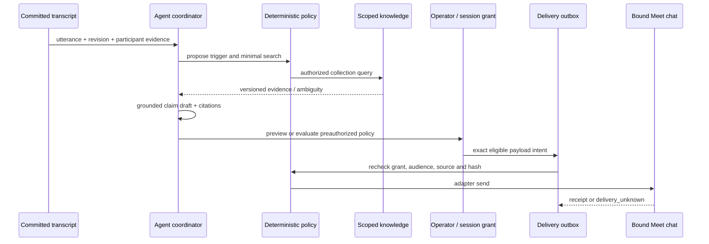

# FUNG — Meeting Agent Participation Specification

## 1. Product contract

Agent เข้าร่วม Google Meet อย่างเปิดเผย รับบทสนทนาที่ได้รับอนุญาต ตอบคำถามโดยอ้างอิง knowledge และส่งคำตอบ/เอกสารกลับใน **ห้องและช่องทางที่ผูกไว้** ตัวอย่าง “ยอดขายปีที่แล้ว” ต้องนำไปสู่การค้นหลักฐานจริง ไม่ใช่ตอบจากความจำโมเดล

C-3 / HIGH. Target specification only; no provider joined, account created, secret configured, hosted service deployed or message sent in this documentation work.

Parents: [Domain map](../architecture/MEETING_INTELLIGENCE_DOMAINS.md), [Agent architecture](../ai-system/agent-architecture.md).
Peers: [Live transcript](2026-09-21-live-meeting-transcription-spec.md), [Knowledge evidence](2026-09-21-meeting-knowledge-evidence-spec.md), [Google Meet API strategy](../decisions/2026-09-21-google-meet-agent-api-strategy.md).

## 2. Decisions and MVP boundary

- Google Meet first; API integration is acceptable by user's direction. Managed bot API is the candidate full-participation route; official Meet Media API is a separate receive-only/preview route.
- MVP public answer is short text + citation + authorized HTTPS document/excerpt link in Meet's actual in-call chat. Label this **ลิงก์เอกสาร**, not **ไฟล์แนบ**. Native file attachment requires a proven adapter capability and remains open on Meet.
- Local copilot/draft mode is useful but is not acceptance for “agent joins and answers in the meeting”.
- Spoken replies are optional follow-up with explicit output-audio capability and non-impersonating TTS voice; reading a text answer is not proof of audio participation.
- No automatic calendar crawl/join, unattended organization-wide bots, CRM writes, emails, cross-room forwarding, source ACL changes or silent browser automation.
- Do not extend the old read-only MCP command to send messages. Its FR-108 per-call approval/read-only rules remain intact.

## 3. Actors and prerequisites

| Actor | Authority / responsibility |
| --- | --- |
| FUNG local operator | selects meeting, corpus, online provider and policy; can stop/revoke |
| Meeting host / platform admin | admits bot and permits meeting media/chat under platform policy |
| Human participant / guest | receives presence/recording notice; can raise objection via documented process |
| Agent principal | non-human identity “FUNG Assistant”; no reusable human voiceprint |
| Knowledge owner | grants source read/re-share rights and classification |
| Provider / optional gateway | transport and narrowly scoped meeting actions, not knowledge policy decisions |

Before join: validate supported meeting URL, owner/account context, service region, billing cap, provider capability/version, admission requirements, consent/notice policy, source collection selection, output destination, retention/delete route and reliable stop control. “API available” is not evidence the customer's tenant permits it.

Profiles required: local principal/vault, business context, optional People directory, provider connection, meeting session, agent policy, knowledge collections, channel binding. Voice enrollment is not required for provider-labelled participants.

## 4. Modes and permissions

| Mode | Trigger | Action allowed |
| --- | --- | --- |
| off | none | no join/listen/query/send |
| observe | explicit start | receive/transcribe only |
| draft | explicit question or contextual mention | local retrieval and private draft; default after setup |
| asked_only | explicit addressed question, e.g. “FUNG ช่วยหา…” or authorized UI action | automatically answer within an approved session publication policy |
| proactive_bounded | stable relevant mention matching approved topics | auto-search and publish only if all publication gates pass |

Modes asked_only/proactive_bounded require deliberate session enablement and exact recipient/data-class/source limits; changing mode cannot silently broaden existing grants. Disable proactive mode independently from listening. No model can switch modes.

Separate capabilities: `meeting.join`, `meeting.media.read`, `meeting.participants.read`, `meeting.chat.read`, `knowledge.search`, `knowledge.content.read`, `meeting.chat.send`, `meeting.link.send`, `meeting.file.upload`, `meeting.audio.send`, `meeting.leave`. Each grant specifies session/occurrence, provider account, allowed sources/audience/classification, payload limits, expiry, budget and revocation revision.

Provider OAuth/API authorization is necessary but insufficient: FUNG policy still decides each action. Speaker identity never substitutes for an authenticated grant.

## 5. Functional requirements

| ID | Requirement | Verification |
| --- | --- | --- |
| MA-01 | Create one explicit session bound to an immutable conference occurrence and operator | recurring URL cannot route into another occurrence |
| MA-02 | Bot has visible agent name and admission/consent lifecycle | join request != admitted/receiving |
| MA-03 | Display per-capability readiness, not a single connected flag | can listen but cannot chat shown truthfully |
| MA-04 | Ingest only authenticated provider events; isolate account/bot/session generations | replay/cross-tenant payload rejected |
| MA-05 | Use final committed transcript revisions and non-self chat inputs | unstable ASR and bot echo cannot publish |
| MA-06 | Detect addressed questions and context mentions separately; debounce/cancel revisions | relevant mention may produce draft, not automatic authority |
| MA-07 | Query only selected knowledge scope and answer with citations/ambiguities | no evidence => clarify/not_found |
| MA-08 | Support private draft, per-answer approval and bounded preauthorized publication | exact payload/destination hash checked at send |
| MA-09 | Separate read/share rights and evaluate current destination audience | guest/unknown audience blocks confidential send |
| MA-10 | Reply in bound Meet chat; do not silently use Google Chat, email or DM | wrong/unsupported destination fails closed |
| MA-11 | Send link vs native file distinctly; minimize/redact and preserve source version | no local paths, fake attachments or implied permission change |
| MA-12 | Durable outbox, idempotency/reconciliation and honest receipts | uncertain send never auto-retried blindly |
| MA-13 | Revoke/stop cancels queued actions and drains/leaves under bounded policy | no new send after revocation is observed |
| MA-14 | Recover from reconnect/crash without duplicate bot or response | uncertain create/send reconciles before another attempt |
| MA-15 | Rate, cost, duration, inference and network limits with visible diagnostics | no endless agent conversation or unbounded provider bill |
| MA-16 | Capture remains independent of agent/retrieval/transport failures | local audio can continue when explicitly selected |
| MA-17 | Correct stale answers transparently with authorized follow-up/retraction attempt | no silent edit of already delivered business claim |
| MA-18 | Log provenance, minimal audit, retention and provider deletion status | no raw secret/transcript dumps; external deletion not overclaimed |

## 6. Session lifecycle

```text
configured -> preflight -> join_requested -> waiting_admission
 -> joined_observing -> active <-> paused
 -> leaving -> ended
         \-> disconnected / failed / join_unknown
```

Receive/readiness health is orthogonal. Provider-confirmed `botId`, occurrence, participant/session ID where exposed and admission event are required before reporting joined. A successful create-bot HTTP response only means request accepted.

- Admission timeout candidate: 120 seconds; do not retry indefinitely in lobby.
- Explicit leave is always available independently of model state.
- Pausing analysis stops new triggers; pausing media ends/subscribes off media as provider supports. UI must not claim recording paused if provider still collects.
- On logout/lock/grant revoke, stop new external actions and close decrypted context; leave media session unless an explicitly authorized operator policy says otherwise.
- On app restart, recover state for inspection, not automatic join or publication.
- If provider removed bot/host disabled access, mark ended/revoked and do not rejoin.
- End triggers bot leave, cancellation, local catch-up/summary optionally, and provider deletion workflow under retention policy.

## 7. Trigger-to-answer flow



Trigger record contains type, evidence revision refs, normalized topic/metric/company/period, source language, createdAt, deadline, excluded self IDs and policy version.

Candidate defaults: 2-second context debounce after committed utterance, at most one active agent run/session, 60-second semantic dedup cooldown, 30-second trigger expiry, at most 2 proactive public messages/minute and 20/hour. Values are configurable downward and qualification targets, not measured performance. An operator's explicit question can replace queued low-priority mention work, not interrupt active capture.

Query refinement can make at most 3 retrieval attempts under budget; no recursive “research until answered”. Agent says it lacks evidence or asks a concise clarification. If the discussion moves on, cancel expired pending publication. Important financial figures require exact KE metric evidence, not just confidence score.

Ignore self-generated transcript/chat/TTS spans using provider bot identity and output correlation where available; do not use text similarity alone as the sole loop guard. Other bots' content is untrusted; automated bot-to-bot triggering defaults off.

## 8. Publication policy and approval

A `MeetingPublicationGrant` minimally binds:

| Field group | Contract |
| --- | --- |
| Authority | trusted actor/vault, grant ID/version, session/occurrence, expiresAt/revokedAt |
| Destination | provider account, bot/session, channel ID/type, optional thread, audience policy revision |
| Inputs | approved collections/docs, maximum classification, trigger modes/topics |
| Outputs | allowed text/link/file/audio kinds, byte/length/attachment caps, approved link hosts |
| Controls | manual-per-message or bounded-auto, rate/cost caps, budget, freshness window, approval provenance |

Grant expiry proposed: meeting end or 4 hours after enablement, whichever comes first; renewal is explicit. Shorter platform/provider expiry wins.

Final send gate checks: session active; backend capability supported; source revision and permissions current; payload hash unchanged; grant current; audience sharing rules satisfied; source/answer not stale; rate and money budget available; no unresolved prior delivery.

Manual approval shows recipient, content, source citations/version, redactions, link expiry, sensitive fields and remote storage implications. Edits after approval invalidate it. Bounded-auto approval sets a **policy**, not unlimited permission; out-of-policy content falls back to local draft.

If participant roster changes, refresh audience decision before any send. Meeting participants are not always the complete chat audience. If platform cannot prove membership/visibility, only content explicitly approved for that audience class may auto-publish.

## 9. Same-channel delivery and outbox

`DestinationBinding` is immutable for one intent: provider/account/occurrence/channel/thread plus approval snapshot. A meeting URL, human display name or current browser tab is not a routing key.

Outbox states:

`draft → awaiting_approval → ready → sending → provider_accepted → delivered`

Alternative terminal/control states: `blocked | expired | cancelled | failed | delivery_unknown | superseded`.
Only provider evidence or a verified echo/receipt can promote accepted to delivered; where unavailable, UI says “provider accepted, delivery unconfirmed”.

Fields: outbox ID/idempotency key, session/trigger/answer revision, exact payload encrypted ref+hash, evidence bundle, grant/audience versions, destination, attempt count, lease, state, external message/upload IDs, last error and timestamps.

Rules:

1. Persist intent before network call. One serialized dispatcher per destination; claim with lease and checked revision.
2. Use provider idempotency if documented. Otherwise query/reconcile by external ID/client correlation/own chat echo where reliable; application IDs alone do not guarantee exactly-once externally.
3. Timeout after possible send => delivery_unknown; no automatic resend unless provider proves non-delivery or supports idempotent replay. Offer operator inspection.
4. Rate limit/definite pre-send failure may retry with bounded backoff, respecting Retry-After and trigger expiry. Recheck authorization every attempt.
5. Upload and posting are separate operations; retain uploaded artifact ID to avoid duplicate upload. Failed publication does not imply remote upload deleted; record cleanup status.
6. If new transcript/doc revision changes answer, supersede unsent output. Already accepted/sent output requires a visible, linked correction with current authority.
7. Revocation cannot recall remote copies. Best-effort delete/retract only if separately permitted and supported; record unsupported/failed.

Candidate FUNG limits for Meet: short answer fitting adapter's measured limit; prefer one message with concise citation and short approved URL. If too long, prepare a compact evidence page; do not truncate away unit, year, caveat or source. Split only with approved bounded ordered parts and duplicate controls.

## 10. Document attachments

Three distinct results: `link_published`, `native_file_attached`, `unsupported`.

MVP Meet route supports authorized document/excerpt URL in chat after adapter qualification. An existing private report URL does not grant attendees permission. If user wants a local document shared, show a separate upload/share preview to an approved artifact host; no public-by-default upload.

Native upload is disabled until provider+platform capability and MIME/size/recipient/receipt behavior are tested. Never quietly switch to Google Chat spaces: that is a different conversation requiring explicit binding and approval.

Generated evidence page includes answer claims, exact source/version/locators, time/asOf, redaction notice and expiry. Access uses authenticated audience policy. No whole vault index, source voiceprint, OAuth tokens or raw meeting recording in the artifact.

## 11. Optional voice response

Off by default; separate `meeting.audio.send` and TTS rights grant. Voice must identify as an agent, not mimic a participant. Use approved BYOM voice provider and provenance; voice identification samples never feed TTS.

If enabled later: turn-taking queue, explicit addressed response first, maximum response duration, interruption/cancel, own-audio echo exclusion, output device/transport checks and text fallback only within already approved chat policy. Google official Meet Media receive-only route cannot be marked voice-capable. A vendor conversational Output Media capability must be validated independently.

## 12. Deployment and gateway contract

Two topologies are candidate, not current services:

- Direct official Meet media client → local FUNG (receive/metadata); no managed bot gateway necessary, but API preview eligibility required.
- Managed bot → public verified WSS/HTTPS ingress → authenticated Desktop outbound WSS → local ASR/knowledge → typed gateway action → provider → same Meet chat.

Gateway responsibilities: tenant isolation, signature/replay verification, bot/session binding, bounded routing, lease watchdog, minimal encrypted control journal and adapter API calls. It must not run an unrestricted LLM/tool proxy or become a searchable knowledge store.

Provider API/verification secrets live in operator-controlled server secret manager; Desktop holds a gateway device credential in OS keyring. Direct provider mode may hold its own credential in keyring. Never distribute a shared vendor master key inside the app or web frontend.

Proposed endpoints/contracts (names are FUNG, not provider API claims):

| Gateway operation | Required boundary |
| --- | --- |
| session.prepare | authenticated owner; create expiring scoped transport binding |
| session.join | validated provider URL/account + approved policy; record create intent before vendor call |
| media/events ingress | verify signature/handshake, age, replay and bot/account binding; validate bounded frames |
| session.events subscribe | authenticated device, exact session, cursor/coverage; no cross-tenant feed |
| delivery.execute | exact payload/grant hash, allowlisted capability, destination and lease checks |
| session.stop | idempotent, works independently of ASR/LLM; calls provider leave |
| session.cleanup/status | deletion/leave receipts and unresolved external state |

A public WSS listener and a continuously available lease watchdog are required for the managed route. Do not assume short-lived HTTP functions or existing LAN FUNGWIRE satisfy it. Hosting/region/TLS/domain/provider credentials are an explicit deployment gate; no automatic tunnel or port exposure.

Candidate heartbeat 10s, lease TTL 60s: if Desktop loses authority/connectivity, gateway blocks new publication and requests bot leave on expiry. Durable control journal records pending create/send/leave and known provider IDs so gateway restart reconciles before new action. If provider leave is unavailable, report unresolved remote recording and notify operator; don't claim immediate stop.

Transport buffer: encrypted, bounded (candidate 10 MiB/session, <=10 seconds of media), memory-first, dropped with explicit gap when exhausted. It is not a durable full recording archive. Provider retention/cost and any encrypted spool retention must be configured and verified; “audio processed locally” does not mean the bot provider never saw it.

## 13. API and persistence proposals

Native commands: `meeting_agent_preflight`, `meeting_agent_start`, `meeting_agent_pause`, `meeting_agent_stop`, `meeting_agent_set_policy`, `meeting_agent_ask`, `meeting_agent_approve_delivery`, `meeting_agent_revoke`, `meeting_agent_status`, `meeting_agent_history`.

All commands derive actor from trusted context, validate session ownership, use requestId/expectedRevision for mutations, return typed status/blocker and never accept an arbitrary tool name/URL from transcript text.

Domain aggregates: `meeting_agent_grants`, `meeting_agent_runs`, `meeting_delivery_outbox`, `meeting_delivery_receipts`; reference D3 sessions/participants, D10 revisions and D11 evidence bundles. Proposed jobs use typed session/run subjects, not fake recording IDs; adapt existing job/model_runs contracts through reviewed migration.

Events: `meeting-agent-status`, `meeting-agent-draft`, `meeting-agent-policy-blocked`, `meeting-delivery-status`. UI projection is scoped/paginated and contains no gateway credentials or raw private corpus.

## 14. UX, privacy, failure and cost

Setup wizard: meeting URL → local/API mode and privacy disclosure → preflight → corpus/context → observe/draft/asked/proactive → destination/notice → explicit Join. Default external publish OFF.

Live UI separately displays “Agent เข้าร่วมแล้ว”, “กำลังฟัง”, “กำลังค้น”, “รออนุมัติ”, “ส่งแล้ว/ยังยืนยันไม่ได้” and “หยุด Agent”. Recording and Agent stop are separate clear actions; do not strand a remote bot when the local window closes.

Proposed retention: private drafts 24h after meeting; content-free operational audit 30d; generated links expire 24h after end; provider media use minimum supported retention, then explicit deletion and receipt. These are product defaults for review, not vendor guarantees. Voice embeddings remain local and are excluded from provider traffic.

Budget preflight requires operator-approved maximum session duration, participant/media rates, model/cloud limits, artifact bytes and provider cost ceiling. Estimate from current configured tariff, label estimate vs billed; no price is hard-coded here. Warn before cap, disable new costly work/leave according to policy at cap. Delayed vendor metering and failed leave can cause charges beyond the estimate: disclose that limit, report unresolved sessions, and never claim a guaranteed billing hard cap without provider-side enforcement.

Failure examples: no admission => join_denied; no chat => observe/draft only; no source permission => private block; cloud/gateway outage => gap plus no sends; delayed transcript => suppress proactive; insufficient sources => concise clarification; unknown external delivery => reconcile. None warrants changing the destination or provider silently.

## 15. Acceptance and release gates

| Test | Requirement coverage / expected proof |
| --- | --- |
| MA-T01 admission denied/lobby/host removes bot | MA-01–03; state and identity truthful; no auto-rejoin |
| MA-T02 signed ingress replay/cross-tenant/corrupt frame | MA-04; rejected without media/content leakage |
| MA-T03 partial correction/echo/other bot loop | MA-05–06; zero unauthorized trigger publication |
| MA-T04 Thai sales question with missing/conflicting source | MA-07; cited value or clarification, never fabricated |
| MA-T05 manual vs bounded-auto grant | MA-08; valid policy can send without per-message click; outside scope blocked |
| MA-T06 guest joins/source ACL revoked | MA-09; final gate blocks confidential payload |
| MA-T07 same recurring URL/another room/channel | MA-10; binding isolation; no Google Chat fallback |
| MA-T08 local PDF report link vs native attachment | MA-11; remote recipient can open only authorized artifact; types truthful |
| MA-T09 timeout after send/restart/duplicate webhook | MA-12/14; no blind duplicate, honest delivery_unknown |
| MA-T10 revoke during generation/upload/send | MA-13; unsent canceled; in-flight race and remote copies disclosed |
| MA-T11 gateway/desktop crash and lease expiry | MA-13–16; bot cleanup reconciled; local capture independently healthy |
| MA-T12 budgets/rate flood/3-hour meeting | MA-15; bounded resources and metered cost |
| MA-T13 document/transcript correction after publication | MA-17; authorized visible correction or operator alert |
| MA-T14 deletion/backup/log secret scan | MA-18; no sensitive raw logs, explicit remote retention state |
| MA-T15 real Google Meet with 2+ humans and a shared-mic endpoint | live speakers, question, evidence link, guest policy, stop and restart exercised end-to-end |
| MA-T16 optional audio reply | separate output capability, rights, barge-in and echo tests; not required for text MVP |

Release must distinguish fixture, local integration, vendor API, actual Meet room, packaged Desktop and operational deployment evidence. A simulated bot or working web search cannot close the user-visible end-to-end story.

## Version Diff

| Version | Change |
| --- | --- |
| 0.0.0 → 0.1.0b | Added Google Meet participation, trigger modes, policy/knowledge gates, same-channel outbox, gateway lifecycle and release acceptance. |

## CHANGELOG

| Version | Date | Status | Summary | Commit Hash | Agent |
| --- | --- | --- | --- | --- | --- |
| 0.1.0b | 2026-09-21 | candidate | Detailed meeting-agent and publication proposal; no external actions performed. | working-tree; base b336f33 | RWANG |
