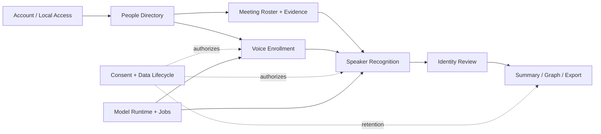
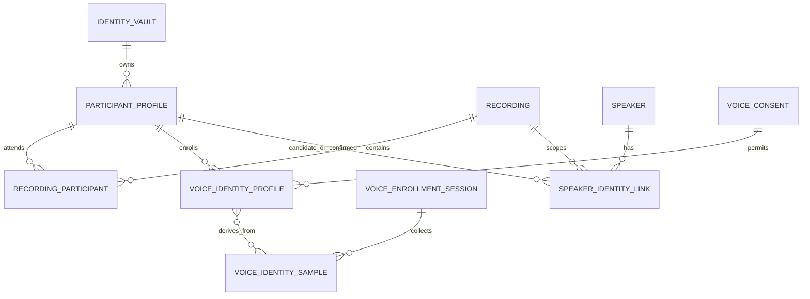
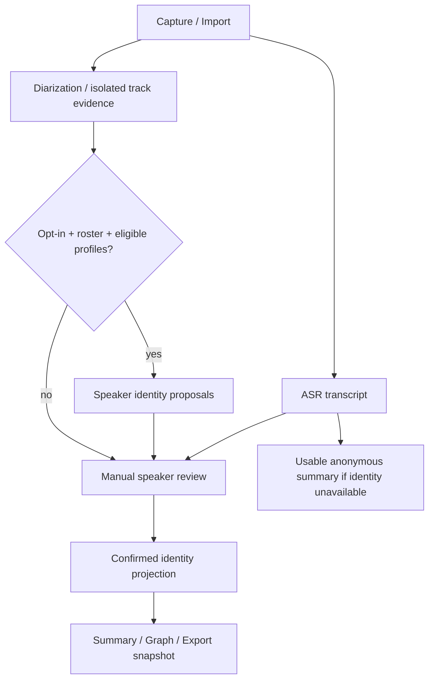

# FUNG — People, Voice Identity และการแบ่งโดเมน

## 1. ข้อเสนอและขอบเขต

ออกแบบ FUNG ให้รู้จัก **บุคคลที่ผู้ใช้บันทึกไว้** แล้วใช้เสียงเสนอว่าผู้พูดในประชุมน่าจะเป็นใคร ผู้ใช้เป็นผู้ยืนยันความสัมพันธ์ก่อนนำชื่อไปใช้ในเอกสารประชุม โดยทุกขั้นยังใช้ได้แม้ผู้ร่วมประชุมไม่มีบัญชี FUNG

งานนี้เป็น **C-3 / HIGH**: เปลี่ยนขอบเขต identity, local access, schema, encrypted assets, worker, review และ backup เอกสารนี้เป็นแบบสำหรับพิจารณา ยังไม่ใช่ implementation หรือผลทดสอบความแม่นยำ

ต่อยอด [speaker identification spec เดิม](2026-08-23-speaker-identification-and-voice-profile-spec.md) และ [meeting pipeline ที่อนุมัติแล้ว](2026-09-21-fung-meeting-transcript-pipeline-adaptation.md) โดยเสนอรายละเอียดโดเมนและตัดสินใจที่ spec เดิมยังเปิดไว้ เมื่ออนุมัติจึงใช้รายละเอียดในเอกสารนี้เป็น implementation contract; ก่อนอนุมัติไม่เปลี่ยนสถานะข้อเสนอเดิม

[ASSUMPTIONS]

1. เป้าหมายคือช่วยติดชื่อผู้พูดใน recording ไม่ใช่ใช้เสียงเป็นรหัสเข้าแอปหรือเป็นหลักฐานพิสูจน์ตัวตน
2. Desktop เป็น executor แรก; ผู้ใช้ local ไม่จำเป็นต้องสมัครสมาชิก
3. รุ่นแรกเป็น local owner คนเดียวต่อคลังข้อมูล ไม่สร้างระบบองค์กร/RBAC หรือ cloud directory เพิ่ม
4. Person ใช้ซ้ำได้ในคลังเดียว แต่การนำ voice profile มาเทียบต้องได้รับสิทธิ์ตรงขอบเขต และมีรายชื่อผู้เข้าร่วมที่เลือกไว้ในแต่ละ recording
5. Model matching สร้างข้อเสนอเท่านั้น; manual labeling ยังใช้ได้เมื่อไม่ได้ลงทะเบียนเสียง

**ขอบเขตรุ่นแรกที่เสนอ:** People directory + รายชื่อผู้เข้าร่วม + manual identity links + consent/enrollment + local matching + review + export ที่คง provenance + revoke/delete/restore proof ส่วน cross-device matching, automatic matching ทุกประชุม, cloud recognition และ voice login เป็นคนละระยะ

## 1.1 Integrated live-meeting domains — candidate extension

[Domain map D1–D13](../architecture/MEETING_INTELLIGENCE_DOMAINS.md) ต่อจาก D1–D9 ในเอกสารนี้ โดยเพิ่ม D10 Live Transcription, D11 Knowledge & Evidence, D12 Meeting Agent & Participation, D13 Conversation Delivery ไม่ได้แบ่งเป็นบริการใหม่ทั้งหมด

Google Meet/API เป็น source แรกตามที่ผู้ใช้เลือก: provider participant-session/track metadata ทำให้ติด “ชื่อจาก Meet” ได้โดยไม่ต้อง enroll voice. อ่าน [SI-API requirements](2026-08-23-speaker-identification-and-voice-profile-spec.md) และ [API decision](../decisions/2026-09-21-google-meet-agent-api-strategy.md)

**Identity priority:** source-attributed participant → optional reviewed local Person link; pyannote/voice matching ใช้เมื่อ source ผสม/ไม่ทราบคน/ไมค์ร่วม. ชื่อจากแพลตฟอร์มไม่เท่ากับชื่อบุคคลที่ยืนยัน และไม่เป็นสิทธิ์อ่านหรือแชร์ข้อมูล. การออกแบบ voice recognition แบบ local-only เดิมยังไม่อนุญาตนำ embeddings ไป meeting provider

Proposed D3 `meeting_participant_sessions` อยู่คู่กับ `recording_participants`: ตัวแรกเก็บ occurrence/provider session/source generation และ label history, ตัวหลังเก็บ roster/person relationship. ทั้งสองเชื่อมกันด้วย optional reviewed binding ไม่บังคับสร้าง Person ทุกคน. Private provider identifiers/name history อยู่ใน protected payload ตาม D8; plaintext index ใช้ opaque IDs

Human principal และ agent principal แยกกัน; agent ไม่มี human person/voice enrollment โดยอัตโนมัติ. Shared room endpoint เป็น parent source ให้ anonymous child speakers ได้. Voice enrollment ไม่ขวาง critical path ของ live transcript/agent เมื่อ API attribution เพียงพอ

D8 เพิ่ม purpose grants แยก `external_meeting_media`, `knowledge_read`, `room_publication`, `artifact_share` และ optional `agent_audio_output`; recording/recognition consent เดิมไม่ครอบคลุมสิ่งเหล่านี้. D7 สร้าง local artifacts; D13 ตรวจสิทธิ์และส่งออกห้องจริง

`speaker_identity_links.source_kind` เพิ่ม `provider_metadata` ใน proposal เท่านั้น; input evidence ต้องรวม participant-session + attribution revision. API rerun/rejoin ไม่ลบ manual link เงียบ ๆ; mark stale เมื่อไม่พิสูจน์ continuity ได้

## 2. ฐานปัจจุบันและช่องว่างจาก source

| ส่วน | หลักฐานปัจจุบัน | ผลต่อการออกแบบ |
| --- | --- | --- |
| Account | `public.profiles` ผูกกับ `auth.users`; มีชื่อบัญชี ไม่ได้เป็นทะเบียนแขก | ใช้ account เดิม; ไม่สร้างบัญชีให้ผู้ร่วมประชุมทุกคน |
| Local data | GenesisBlockDB เป็น persistence boundary เดียว | ทุก metadata mutation ผ่าน adapter/transaction เดิม |
| Speaker | `speakers` มี `project_id`, `key`, `display_name`; reuse key ภายใน project | ห้ามนำ speaker ID/key ไปแทน person ID |
| Timeline | `speaker_turns` มี recording, model run, revision, overlap | ผูก identity กับ recording และหลักฐานเวอร์ชันที่ใช้ |
| Existing voice profiles | `voice_profiles` ใช้ rights/provider ของ TTS/Agent Voice | Recognition ใช้ `voice_identity_profiles` แยกต่างหาก |
| Worker | `diarize.py` คืน anonymous turns และ `confidence: null`; ยังไม่คืน enrollment embeddings | เพิ่ม embedding adapter และ matcher; ห้ามเอา clustering score มาแสดงเป็นความแน่ใจในชื่อ |
| Rerun | local diarization แทน proposed turns; import attribution บาง path ลบและสร้าง transcript segments ใหม่ | การเปลี่ยน run/turn IDs ต้อง invalidate identity evidence; ห้ามอ้างว่า confirmed link ปลอดภัยเพียงเพราะ `speaker_id` เดิม |
| Jobs | `JobKind` เป็น closed set; input ref แรกอ่านเป็น recording; ไม่มี durable dependency DAG | Enrollment ต้องมี typed subject ที่รองรับจริง; identity job ต้องตรวจ prerequisite snapshot เอง |
| Model provenance | `model_runs.recording_id` เป็น required | Enrollment ที่ไม่มี recording ต้องเก็บ run manifest ของตน ไม่สร้าง recording ปลอมเพื่อผ่าน FK |
| Backup | `run_backup_job` export Genesis ทั้งชุด แล้วรวม source audio ก่อนเข้ารหัส archive | ต้องออกแบบการแยก private payload/keys; คำว่า local-only ไม่ได้ทำให้ข้อมูลพ้น backup อัตโนมัติ |
| Graph | มี graph kind `person`/`mention`; ยังไม่มี people directory authority | ชื่อที่ LLM พบในเนื้อหาไม่ใช่ enrollment หรือ confirmed identity |

ตรวจจาก working tree บน base `b336f33`; ไม่ได้สอบถาม live account, เปิด meeting audio หรือทดสอบ model ในงานออกแบบนี้

## 3. แยก identity ให้ชัดก่อนสร้าง user profile

| แนวคิด | ตัวอย่าง | ขอบเขตและความหมาย |
| --- | --- | --- |
| Account profile | บัญชีที่ login เป็น Boss | authentication, preferences, device ownership; ไม่พิสูจน์ว่าคนที่พูดคือเจ้าของบัญชี |
| Local principal / vault | ผู้ควบคุมคลัง FUNG บน Windows account นี้ | authority สำหรับอ่าน/เขียนข้อมูล local; มีได้โดยไม่ login |
| Participant profile / Person | คุณเมย์, คุณต้น | ทะเบียนบุคคลที่ผู้ใช้สร้างใน vault; ชื่อแสดงไม่ต้องเป็นชื่อทางการและไม่ต้อง unique |
| Recording participant | คุณเมย์เป็นผู้ดำเนินประชุมใน recording R | การเข้าร่วม/บทบาท/ชื่อในประชุมนี้; รายชื่อคาดหมายไม่ใช่หลักฐานว่าพูดจริง |
| Speaker cluster | `s:0` ของ diarization run D ใน R | กลุ่มเสียง; model rerun อาจสลับเลขได้ |
| Capture provenance | mic / system / participant track | บอกแหล่งเสียง; mic อาจถูกใช้ร่วมกัน จึงไม่ยืนยันว่าเป็นเจ้าของบัญชี |
| Voice identity profile | ตัวอย่างเสียงและ embedding รุ่น 3 ของคุณเมย์ | ใช้เทียบเสียงภายใต้ consent และ model version ที่เข้ากัน |
| Speaker identity link | cluster ของ R ถูกผู้ใช้ยืนยันว่าเป็นคุณเมย์ | ข้อสรุปเฉพาะ recording/evidence revision; ยกเลิกหรือแก้ไขได้ |
| TTS voice profile | เสียงที่มีสิทธิ์ให้ Agent Voice สังเคราะห์ | สิทธิ์คนละวัตถุประสงค์กับการจำเสียง |

ความสัมพันธ์สำคัญ: **1 Person → หลาย recording participations → หลาย speaker links** และ **1 Person → หลาย voice profile revisions** คนสองคนชื่อเหมือนกันได้; คนเดียวอาจถูก diarizer แบ่งเป็นหลาย cluster จึงไม่บังคับ one-person/one-cluster

## 4. Domain map — 9 ขอบเขตในแอปเดียว

ใช้ modular monolith ภายใน Rust/Tauri เดิม การแบ่งโดเมนคือแบ่งเจ้าของข้อมูลและกฎ ไม่จำเป็นต้องแยกเป็น 9 services

| ID / Domain | เป็นเจ้าของ | รับ/ส่งข้อมูลกับโดเมนอื่น | ข้อห้ามสำคัญ |
| --- | --- | --- | --- |
| D1 Account & Local Access | session, local principal, vault binding, unlock/lock | ส่ง actor/vault context ให้ทุก command | login ไม่สร้าง Person/consent/voiceprint อัตโนมัติ |
| D2 People Directory | person, aliases, self-person link, archive/merge | ส่ง person ID และ display projection ที่ผ่านสิทธิ์ | ไม่เก็บ vectors; ไม่รวมคนด้วยชื่อ/email อย่างเดียว |
| D3 Meeting Participation & Evidence | roster, source/channel, anonymous speakers/turns, evidence revision | ส่ง audio spans และ snapshot ให้ D4/D5 | participant track/mic label ไม่ใช่ confirmed person |
| D4 Voice Enrollment | enrollment sessions, quality gate, samples, profile versions | ขอสิทธิ์จาก D8; ขอ embedding จาก D9; ส่ง eligible profile ให้ D5 | ห้ามเรียนรู้จากทุก recording โดยอัตโนมัติ |
| D5 Speaker Recognition | eligible gallery, scoring, threshold policy, top candidates/unknown | รับ profiles/evidence; ส่ง proposal ให้ D6 | ไม่ยืนยันชื่อ, ไม่ให้สิทธิ์เข้าถึงข้อมูล, ไม่แก้ transcript |
| D6 Identity Review | proposed/confirmed/rejected/stale links, review decisions | รับ candidate; ส่ง resolved identity view ให้ D7 | ห้ามเปลี่ยนชื่อ speaker ระดับ project เพื่อยืนยันคนใน recording เดียว |
| D7 Meeting Intelligence & Output | summary/graph/export ที่มี revision/evidence | อ่าน confirmed view จาก D6 | ไม่ใช้ LLM เดาชื่อหรือใช้ proposal เป็นเจ้าของ action ที่ยืนยันแล้ว |
| D8 Consent & Data Lifecycle | purpose/scope grants, encrypted assets/keys, retention, revoke/delete, backup policy | ตรวจก่อนอ่านเสียง/ส่งงานและก่อน commit ทุกผล | สิทธิ์บันทึก/จำเสียง/สังเคราะห์เสียงแยกกัน |
| D9 Model Runtime & Jobs | model package/cache, worker, scheduling, run manifest, cancellation/recovery | คืน embedding/result แบบ typed ให้ D4/D5 | worker ไม่เขียน DB โดยตรง; GPU/CPU readiness ต้องตรวจจริง |

D2–D6 เป็นแกนฟีเจอร์; D1/D7/D9 ใช้ส่วนเดิมและเพิ่มจุดเชื่อม; D8 เป็นข้อกำหนดร่วมและมีเจ้าของชัดเจน ทุกโดเมนอ่าน/เขียนผ่าน Genesis handle เดียว; private files มี canonical metadata/custody ใน Genesis

## 5. Account, Person และ local access

### 5.1 ฟิลด์ที่ต้องมี

**Account profile เดิม:** account ID, display name และข้อมูล session/provider ที่ระบบ auth เป็นเจ้าของ เก็บภาษา/timezone/preferences ตามที่จำเป็น ไม่มี embeddings ใน Supabase

**Participant profile:** person ID, vault ID, display name, optional aliases/avatar/organization/role, status, revision, created/updated times ชื่อเล่นพอสำหรับ MVP; ไม่ต้องบังคับ email, phone, วันเกิด หรือบัตรประชาชน บทบาทเฉพาะประชุมอยู่ที่ recording participant แทนการแก้ person ทุกครั้ง

**Self-person mapping:** ผู้ใช้กด “คนนี้คือฉัน” เพื่อเชื่อม local principal กับ person ได้ การเชื่อมนี้ช่วยตั้งค่า UI/roster; ไม่ถือว่าเสียงจาก mic เป็นคนนี้เสมอ และไม่อนุญาต voice login

**Recording participant:** recording ID, person ID, optional alias/role/source metadata, `match_enabled`, grant reference รายชื่อจาก Zoom เป็น metadata suggestion; ต้องเลือกว่าจะเชื่อมกับ person ใดก่อนเพิ่มเข้าชุดที่ matcher ใช้

### 5.2 Ownership และสิทธิ์ v1

- หนึ่ง local vault ต่อ data root มี stable ID และ local owner principal; bind กับ cloud account ได้เฉพาะ explicit action ขณะ vault ถูกเปิดโดยเจ้าของ
- Native command ได้ actor/vault จาก trusted session context; ห้ามรับ `reviewed_by`/owner identity จาก payload ของ UI แล้วเชื่อทันที
- การสลับ account ไม่เปลี่ยน owner ของ vault และไม่ทำให้บัญชีใหม่อ่านคลังเดิมได้อัตโนมัติ; logout ของบัญชีที่ bind หรือกด lock จะปิด voice matching และเคลียร์ decrypted cache
- Offline owner ยังเปิดคลังผ่าน local unlock ที่กำหนดไว้ได้; OAuth outage ไม่ตัดสิทธิ์ playback/transcription local เดิม
- v1 ใช้ OS user + OS secure storage เป็น boundary พร้อม explicit unlock session; ต้องระบุว่าไม่ป้องกันโปรเซสอันตรายที่ควบคุม OS user อยู่แล้ว และไม่อ้างว่าเป็น enterprise multi-user isolation
- แยก capability ภายในเป็น `people.manage`, `voice.enroll`, `voice.match`, `identity.review`, `voice.delete`; local owner ใช้ได้หลัง unlock แต่ MCP/LAN/browser ไม่ได้รับโดยปริยาย

Person เป็นข้อมูลที่ผู้ใช้บันทึก ไม่ใช่หลักฐานว่า FUNG ตรวจสอบชื่อทางราชการแล้ว

## 6. Proposed data model

ชื่อด้านล่างเป็น logical schema proposal สำหรับ migration ใหม่ผ่าน `genesis_adapter`; ยังไม่มีตารางเหล่านี้ใน runtime ปัจจุบัน

ทุก row ใหม่ใช้ UUID, RFC3339 timestamps, revision และ scope ที่ตรวจจาก native context การ join ข้าม project/vault ต้องถูกปฏิเสธ แม้ FK ของแต่ละ ID จะมีอยู่จริง

| Entity ใหม่ | ฟิลด์หลัก / invariant |
| --- | --- |
| `identity_vaults` | `id`, `owner_principal_id`, optional `bound_account_id`, `self_person_id`, `state`, key-store namespace; ไม่เก็บ secret key ใน row |
| `participant_profiles` | `id`, `vault_id`, `profile_payload_ciphertext`, `key_ref`, `status`, `revision`; payload มีชื่อ/aliases/รายละเอียดบุคคล; ค้นชื่อหลัง unlock ใน memory |
| `recording_participants` | `id`, `vault_id`, `project_id`, `recording_id`, encrypted `person_ref/role/alias`, `match_enabled`, `consent_ref`, revision; ไม่ยืนยันว่าพูดจริง |
| `voice_consents` | `id`, `vault_id`, purpose, allowed scope, granted/expiry/revoked times, actor, policy version, encrypted subject/evidence refs; grant เป็น immutable revision |
| `voice_enrollment_sessions` | `id`, `vault_id`, `project_id`, encrypted person/consent refs, `state`, input manifest hash, run manifest, checkpoint, expiry; รองรับ enrollment ที่ไม่มี meeting recording |
| `voice_identity_samples` | `id`, `enrollment_id`, encrypted source refs/time range or owned asset manifest, quality flags, sample hash in protected payload, embedding compatibility key; source audio เดิมไม่ถูกย้าย/ลบจากการ enroll |
| `voice_identity_profiles` | `id`, lineage/revision, `vault_id`, encrypted person/sample/consent refs, `state`, model revision/checksum, preprocessing ID, dimensions, encrypted asset manifest, `key_ref`; active template แต่ละรุ่นแก้ในที่ไม่ได้ |
| `speaker_identity_links` | `id`, vault/project/recording, speaker/run/evidence snapshot, `source_kind` (manual/voice/import metadata), status, encrypted candidate/selected person/manual-label payload, threshold policy ID, `model_run_id?`, `supersedes_id?`, actor/time/revision; model สร้างได้เฉพาะ proposal/unknown |

Private references อยู่ใน encrypted payload จึงต้อง validate relationship ใน domain service ภายใต้ transaction; ไม่อ้างว่า DB FK ตรวจ encrypted person ID ให้ได้ Index plaintext ใช้ opaque IDs, scope/status/model revision ที่จำเป็นเท่านั้น

ใช้ของเดิมต่อ: `projects`, `recordings`, `audio_chunks`, `speakers`, `speaker_turns`, `model_runs`, `model_packages`, `jobs`, `audit_events`, `speaker_timeline_revisions`, `summaries`, `export_artifacts` ไม่มีตาราง `users` อีกชุด ไม่มี voice vector ใน `voice_profiles` ของ TTS

ER แสดง logical relationships รวม references ที่เข้ารหัส ไม่ใช่ SQL foreign-key DDL

### 6.1 แยก state machines

| Aggregate | States |
| --- | --- |
| Person | `active → archived`; `deleted` เก็บ tombstone ที่ไม่เปิดเผยชื่อ |
| Enrollment | `draft → capturing/selecting → quality_check → embedding → ready → committed`; หรือ `cancelled/failed/expired` |
| Voice profile | `pending → active → suspended/revoked/expired`; revoked เป็น terminal ต้อง enroll รุ่นใหม่ |
| Identity link | `proposed → confirmed/rejected`; `unknown` เป็นผลที่ถูกต้อง; evidence เปลี่ยนเป็น `stale`; ยกเลิก mapping เป็น `revoked` |
| Diarization turn | ใช้ state ของ timeline เดิม; ยืนยันช่วงผู้พูดไม่เท่ากับยืนยันว่าเป็น person ใด |

การแก้ decision สร้าง revision/audit พร้อม supersession; ไม่ลบประวัติผู้ใช้เพื่อแทนด้วย model run ใหม่

### 6.2 Invariants สำหรับ identity links

1. identity scope = vault + project + recording + speaker + evidence snapshot; ไม่ใช้ชื่อ display หรือ `s:0` เป็น global key
2. สร้าง snapshot จาก run ID, sorted turn IDs/revisions, timestamps, channels และ source digests ที่ใช้จริง แยก transcript text revision จาก audio evidence revision
3. ต่อ current scope มี confirmed person ได้ไม่เกินหนึ่งคน; person เดียวมีหลาย cluster ได้
4. หาก cluster ปนหลายคน ต้อง split/review ก่อนยืนยัน; ไม่เฉลี่ยเสียงรวมแล้วติดชื่อให้ทั้งกลุ่ม
5. เปลี่ยน diarization/audio/cluster membership ทำให้ผลเดิม stale; confirmed revision เก็บอ่านย้อนหลังได้แต่ไม่ถูกนำไปใช้กับ evidence ใหม่อัตโนมัติ
6. คำสั่ง confirm/reject ต้องมี `expected_revision` และ input snapshot; result จาก worker ที่มาช้าห้ามทับ manual review ใช้ serialized domain mutation guard ร่วมกันสำหรับ UI/worker/revoke เมื่อ adapter ยังไม่มี compare-and-swap; check-then-upsert ที่ไม่กัน race ไม่เพียงพอ
7. สรุป/ส่งออกอ่าน identity projection ของ recording นี้เท่านั้น ไม่ rename `speakers.display_name` ทั้ง project เพื่อปิดงาน

## 7. Consent และ enrollment

### 7.1 Purpose แยกกัน

| Purpose | อนุญาตอะไร | ไม่ได้แปลว่าอนุญาตอะไร |
| --- | --- | --- |
| Recording permission | เก็บเสียงประชุมตาม workflow เดิม | ไม่ใช่สิทธิ์ลงทะเบียนหรือ reuse voiceprint |
| `voice.enroll` | สร้าง profile จากตัวอย่างที่เลือก | ไม่รวมทุกเสียงที่เคยบันทึก |
| `voice.match` | เทียบใน recording หรือ project ที่ระบุ | ไม่ค้นข้ามทุก project ในคลัง |
| `voice.reuse` | ใช้ profile กับประชุมถัดไปตาม scope | ไม่ตั้งชื่อหรือยืนยันบุคคลอัตโนมัติ |
| TTS/synthesis | ใช้ profile สร้างเสียงตาม rights เดิม | ไม่ได้รับสิทธิ์นี้จาก recognition |

Consent บันทึกผู้ให้ความยินยอม, ผู้ดำเนินการ, วัตถุประสงค์, ขอบเขต, policy version, เวลา และ evidence ref แยกกัน เจ้าของเครื่องกด checkbox เป็นเพียงบันทึกคำรับรองของผู้ดำเนินการ ไม่ใช่การพิสูจน์ว่าได้รับอนุญาตจากบุคคลนั้นแล้ว ข้อความและระยะเก็บเป็น product policy ที่ต้องทบทวนตามบริบทการใช้งานจริง

### 7.2 Enrollment สองทาง

**ลงทะเบียนใหม่:** เลือก/สร้าง Person → ระบุ consent/scope → เลือกไมค์ → บันทึกหลายช่วง → ฟังตรวจ → quality gate → สร้าง embedding → เปิด profile

**จาก recording เดิม:** ผู้ใช้เลือกช่วงที่ยืนยันผู้พูดด้วยตนเอง → ระบุสิทธิ์ enrollment เพิ่ม → quality gate → สร้าง profile การยืนยันชื่อใน transcript ไม่ enroll อัตโนมัติ

ค่าเริ่มต้นสำหรับทดลอง: 3 ช่วง ช่วงละประมาณ 10–30 วินาทีของเสียงพูดที่ใช้งานได้; เก็บความหลากหลายของประโยค/สภาพไมค์ ข้อกำหนดจริงต้องมาจาก qualification ไม่รับประกันความแม่นยำจากระยะเวลาอย่างเดียว

Quality gate ตรวจ speech duration, silence, clipping, overlap, discontinuity และความสอดคล้องระหว่างตัวอย่างของคนเดียวกัน; SNR/quality ที่วัดไม่ได้ให้เป็น unknown ไม่สร้างตัวเลขสมมติ ตัวอย่างไม่พอให้ขอเพิ่มพร้อมเหตุผล เก็บเสียงซ้อน/ตัวอย่างผิดคนเข้า template ไม่ได้

Preprocessing เป็น adapter contract: selected channel, sample rate, mono conversion, VAD/crop, normalization และเวอร์ชัน ต้องใช้เหมือนกันทั้ง enrollment กับ matching ไม่ทำ denoise/voice enhancement แบบเงียบ ๆ

### 7.3 การเพิ่ม/ลบตัวอย่างและเปลี่ยน model

- เพิ่มตัวอย่างต้อง explicit action และ consent ยังใช้ได้; ไม่มี automatic learning จากผล match หรือคำตอบ LLM
- เก็บ contribution map และ per-sample embeddings ใน encrypted profile asset เพื่อคำนวณ template ใหม่ของ model เดิมได้เมื่อลบ sample; ถ้าเหลือเพียง aggregate ที่แยก contribution ไม่ได้และ source ไม่มีแล้ว ต้อง re-enroll
- ลบตัวอย่างต้องสร้าง profile revision ใหม่ที่ไม่มี contribution จากตัวอย่างนั้น แล้ว retire template/cache/key รุ่นเก่า
- Key ของ compatibility = model ID + immutable revision/hash + preprocessing version + dimension/normalization; ใช้ dimension เท่ากันอย่างเดียวไม่ได้
- Model เปลี่ยนแล้ว vectors เดิมไม่เข้ากัน: re-embed เฉพาะ source ที่ยังมีและมีสิทธิ์; ถ้า source ถูกลบแล้วให้ re-enroll ไม่แปลง vector เดาสุ่ม

## 8. Recognition algorithm และการปฏิเสธคำตอบ

1. ผู้ใช้เปิด “ช่วยจำผู้พูด” สำหรับ recording และเลือกรายชื่อคนที่จะนำมาเทียบ
2. Freeze input snapshot ของ source, current diarization, roster, eligible profiles, consent revisions และ threshold policy
3. ใช้ clean non-overlap speech ของแต่ละ cluster; ไมค์/participant track เป็น evidence input ที่คง channel เดิมไว้ แหล่งเสียงที่ยังรวมหลายคนต้องแยกก่อน match
4. Extract/normalize embeddings ตาม adapter ตรวจ sample lengths/NaN/shape/outliers และเก็บ quality ของแต่ละช่วง
5. เทียบกับ profile templates ที่ active, compatible และอยู่ใน consent scope; score ต่อ person ต้องลด bias จากจำนวน samples/จำนวน profiles ที่มากกว่า
6. ใช้ threshold ของอันดับหนึ่ง + margin อันดับหนึ่ง/สอง + หลักฐานหลายช่วงที่สอดคล้องกัน; gallery คนเดียวก็ยังต้องผ่าน absolute rejection threshold
7. คืนไม่เกิน 3 candidates พร้อมหลักฐาน หรือ `unknown` พร้อม reason เช่น `insufficient_speech`, `overlap`, `below_threshold`, `ambiguous`, `profile_incompatible`, `no_eligible_profiles`
8. D6 เก็บเป็น proposal; ผู้ใช้ฟัง ยืนยัน ปฏิเสธ เลือกคนอื่น หรือคง anonymous

Matcher เริ่มด้วย exact comparison ใน memory ของ gallery ที่เลือก หลัง unlock ไม่ต้องเพิ่ม vector database อีกตัว ดัชนีแบบ ANN ค่อยพิจารณาเมื่อขนาดจริงต้องใช้ และต้องอยู่ภายใต้ Genesis contract

Similarity score ไม่ใช่ probability ว่าเป็นบุคคลนั้น UI ไม่แสดง “มั่นใจ 95%” จาก cosine score; ใช้ “เสนอชื่อ — รอยืนยัน” และแสดงคะแนน/model/evidence ในรายละเอียด ค่าตัดสินไม่ใช้ค่าตัวอย่างจาก library เป็น production threshold

หากยังไม่มี calibration policy ที่ผ่านสำหรับ model/domain นั้น ปิด automatic suggestions ในการใช้งานจริง; manual assignment และ diagnostic benchmark ยังทำได้

## 9. Runtime, cache และ pipeline integration

### 9.1 Model strategy

- คง `pyannote/speaker-diarization-3.1` เป็น diarization baseline ตามงานที่อนุมัติ
- ทดลอง `pyannote/wespeaker-voxceleb-resnet34-LM` เป็น embedding adapter แรกเพราะใช้ pyannote runtime family เดิมได้ นี่เป็นข้อเสนอเพื่อลดต้นทุน integration ไม่ใช่ข้อสรุปว่าชนะด้าน accuracy
- ใช้ `speechbrain/spkrec-ecapa-voxceleb` เป็นอีก candidate ใน qualification; เลือกเพียงตัวเดียวสำหรับ profile format รุ่นแรกหลังผลทดสอบ
- Exact revision, dependencies, preprocessing, license/conditions และ calibration ต้อง pin ก่อน enrollment; ไม่ติดตั้งทั้งสอง stack เข้า production โดยอัตโนมัติ

WeSpeaker model card ระบุการ extract embedding ผ่าน pyannote.audio และ license CC-BY-4.0; SpeechBrain ระบุ ECAPA embeddings/verification และ Apache-2.0 โดยไม่รับประกันผลบน dataset อื่น จึงยังต้องทดสอบเสียงประชุมไทยเอง ([WeSpeaker](https://huggingface.co/pyannote/wespeaker-voxceleb-resnet34-LM), [SpeechBrain](https://huggingface.co/speechbrain/spkrec-ecapa-voxceleb)). ข้อมูลนี้ไม่ใช่ผล benchmark ของ FUNG

`speaker-diarization-3.1` มี gated access conditions และการเตรียม pipeline/component ตาม model card; อย่าสรุปข้อห้ามแจกจ่ายทั้งหมดจากคำว่า gated เพียงอย่างเดียว ต้องตรวจ terms ของ artifacts ที่เลือกจริง ([pyannote model card](https://huggingface.co/pyannote/speaker-diarization-3.1))

### 9.2 ทรัพยากรและพื้นที่ดิสก์

- ใช้ model cache ชุดเดียวต่อ model revision ภายใน installation/vault policy ที่อนุญาต ทุก project อ้างอิง; ไม่ copy weights ต่อ Person หรือ recording
- Voice templates แยกจาก model cache และแยกตาม vault; ไม่ share embeddings ข้ามคนหรือ vault แบบ global cache
- รายงานพื้นที่แยก runtime / model weights / source audio / private samples / derived cache / Rust build artifacts
- ขนาด vectors ประมาณ `จำนวนคน × templates/คน × dimension × bytes/value` ก่อน metadata/crypto; ตัวอย่างสมมติ 100 คน × 3 × 256 × float32 ≈ 300 KiB จึงควรคุม source audio/model/runtime copies เป็นหลัก ตัวเลข 256 เป็นตัวอย่างคำนวณ ไม่ใช่การล็อก embedding model
- `medium CPU int8` เป็น Whisper execution choice ไม่ใช่ข้อพิสูจน์ว่า speaker embedding model รัน int8 ได้ Runtime แยกตรวจ CPU/GPU/dtype ของแต่ละ adapter
- Capture มีลำดับความสำคัญสูงสุด; inference ใช้ resource lease ไม่โหลด Whisper/pyannote/embedding/LLM บน GPU พร้อมกันจนเกินงบ หาก fallback CPU ให้บันทึกใน run manifest
- Missing weights/locked vault/OOM/cancel แสดงสถานะจริง; ไม่มี download หรือ cloud fallback เงียบ ๆ ระหว่าง recognition

### 9.3 เชื่อม jobs โดยไม่อาศัยเวลา enqueue เป็น dependency

รุ่นแรกเริ่ม matching จากหน้า Review เมื่อ diarization snapshot พร้อม หรือหลัง user เปิด opt-in สำหรับ recording นั้น งาน `speakers.identify` ตรวจ snapshot/consent ก่อนเริ่มและก่อน commit ทุกครั้ง

Post-meeting auto-summary เดิมทำต่อได้โดยใช้ anonymous/user-authored labels ที่มีอยู่ ผล identity ภายหลังทำให้ named summary/export snapshot เก่าเป็น stale และเสนอ regenerate ไม่ rewrite artifact เดิมเงียบ ๆ

Job contract ที่ต้องเพิ่มก่อนลง runtime:

- `speakers.identify`: subject เป็น recording, output เป็น proposals/unknown; `model_runs` ใช้ recording เดิมได้
- `voice.identity.enroll`: subject เป็น enrollment session ภายใต้ project/vault; wizard ต้องเลือก project/scope ที่มีอยู่ก่อน start แม้เข้าจาก Person detail ไม่สร้าง project/recording ปลอม เก็บ `execution_manifest` ใน session เพราะ `model_runs` ปัจจุบันบังคับ recording FK
- เพิ่ม typed enqueue/parse สำหรับ enrollment โดยไม่เปลี่ยนความหมาย input ref แรกของ jobs เดิม; legacy rows ยัง parse/recover ได้
- Input manifest เก็บ version, subject kind/ID, snapshots, model/calibration hashes และ consent revision; worker รับเฉพาะ asset ที่ native ตรวจแล้ว
- Idempotency key มาจาก scope + input snapshot + model/policy/profile revisions; resume ใช้ snapshot เดิมหรือคืน `stale_input` ไม่คำนวณกับ gallery ใหม่โดยเงียบ
- Revoke/lock ขณะรันต้องยุติการเผยแพร่ผล ถึง worker จบแล้ว native ก็ต้องตรวจสิทธิ์อีกครั้ง; retry ไม่ทำให้ revoked result กลับมา
- ถ้าจะเปิด automatic chain ต้องเพิ่ม persisted prerequisite contract และ crash/restart tests ก่อน; serial queue ปัจจุบันอย่างเดียวไม่ใช่ proof ว่าลำดับคงอยู่หลัง restart

## 10. Review, summary, graph และ export

สร้าง read model `ResolvedSpeakerIdentity(recording_id, evidence_snapshot)` กลางสำหรับ UI/summary/export:

1. user-confirmed person link ที่ยัง valid → ชื่อบุคคล + `ผู้ใช้ยืนยัน`
2. recording-specific manual label → label + `ผู้ใช้ตั้งชื่อ` โดยไม่อ้างว่ามี voice match
3. unresolved/stale/unknown → anonymous/source label ตามเดิม

ข้อเสนอชื่อแสดงใน review inspector เท่านั้น ค่าเริ่มต้นของ summary prompt/graph/export ไม่ใช้ candidate person เป็นข้อเท็จจริง ชื่อที่มีอยู่ใน raw transcript ยังคงเป็นข้อความที่พูด ไม่ใช้เพื่อสร้าง identity link

- Badge ของ “ยืนยัน speaker turn” กับ “ยืนยันบุคคล” ต่างกัน
- ปุ่ม confirm ต้องมีการเลือกช่วง/cluster ชัดเจน; bulk confirm ทำได้เฉพาะรายการที่ผู้ใช้ตรวจ ไม่ใช้ “ยืนยันคนนี้ทุกประชุม” เป็นค่าเริ่มต้น
- Split/merge: ถ้า confirmed people ขัดกัน ต้องแก้ conflict ก่อน merge; user edits และ prior evidence ยังย้อนดูได้
- Import metadata เป็นที่มาของข้อเสนอ; source metadata ไม่ได้ auto-confirm person ในรุ่นแรก
- Graph ยังมี anonymous `speaker` nodes และ `mentions` ได้ แต่ `speaker → person` ใช้ confirmed link พร้อม evidence; ไม่รวม global person graph ด้วยการสะกดชื่อเหมือนกัน
- Summary/export ต้องบันทึก transcript + identity revisions ที่ใช้; unlink/rename/delete ทำให้ output ที่เกี่ยวข้อง stale และแสดงคำอธิบาย
- Manual summary retry ไม่ rerun diarization/enrollment; การกด match อีกครั้งไม่แก้ raw text/timestamps/segment IDs
- Export ยังคงใช้ชื่อที่ผู้ใช้ตั้งเองได้เพื่อไม่ regress workflow เดิม แต่แยก provenance จาก person-confirmed name และมีตัวเลือก anonymous export

## 11. การเก็บข้อมูล ลบ และ backup

### 11.1 Encryption และ custody

Metadata/scope ที่ไม่เป็น secret อยู่ใน Genesis ส่วนชื่อ/aliases, person associations, consent evidence, sample audio, embeddings และ identity decision payload ใหม่เข้ารหัสก่อน persist ใช้รูปแบบ authenticated encryption ที่ review แล้ว โดย reuse crypto dependencies เดิมได้ แต่ต้องมี envelope/context สำหรับ identity แยกจาก backup format

Keys อยู่ใน OS secure storage; ใช้ key แยกต่อ person และต่อ voice profile/session revision เพื่อให้ลบเฉพาะส่วนได้ ไม่ derive keys ของ profile ที่ถูกลบกลับจาก master key ที่คงอยู่ใน DB ใช้ random nonce และ AAD ผูก vault/entity/revision/model hash กันการสลับ ciphertext ข้าม scope Key namespace แยก `people_metadata` กับ `voice_biometric` เพื่อให้สำรองทะเบียนบุคคลได้โดยไม่ให้สิทธิ์ถอดรหัส voice template

Private assets อยู่ใต้ app-owned data root พร้อม checksum/size/format/key reference ที่ domain เป็นเจ้าของใน Genesis; native ตรวจ canonical path/reparse points และไม่รับ arbitrary file path จาก renderer DB commit กับไฟล์ไม่ atomic ร่วมกัน จึงต้องใช้ pending manifest → encrypted temp write → atomic rename → activate transaction พร้อม recovery cleanup

ข้อมูล plaintext อยู่ใน bounded memory/IPC เฉพาะช่วงทำงาน ไม่ serialize vector/key/raw clip ลง logs, audit payload, crash reports หรือ MCP; worker ไม่ได้ token/keyring/DB access เกินจำเป็น หาก library ต้องมีไฟล์ชั่วคราว plaintext ต้องมี explicit implementation review และ bounded cleanup ไม่อ้างว่าครบ encryption จากการเข้ารหัสปลายทางอย่างเดียว

Genesis signed WAL ไม่เท่ากับ at-rest encryption การ `DELETE` projection อย่างเดียวไม่รับประกันลบ payload เก่าใน journal/backup จึงต้องใช้ ciphertext ตั้งแต่แรกและ key lifecycle ให้ครบ

### 11.2 Default retention ที่เสนอ

| ข้อมูล | Default v1 |
| --- | --- |
| Enrollment preview ที่ยังไม่ commit | memory/session only; cancel/expiry/next startup ล้าง orphan ที่ระบบสร้าง |
| Dedicated enrollment raw sample | ลบหลัง commit profile สำเร็จ; ให้เลือกเก็บแบบ encrypted เพื่อ re-enroll ได้อย่างชัดเจน |
| ช่วงที่อ้างจาก meeting audio | เก็บ reference ไม่ copy audio ซ้ำ; voice-profile delete ไม่ลบ original recording |
| Active templates | อยู่จน revoke/expiry/delete; project/recording scope จำกัดการใช้ |
| Matching probe embeddings | ไม่เก็บถาวรใน v1; ล้างเมื่อ job จบ/cancel/lock |
| Proposals/decisions | ตาม recording retention; private contents เข้ารหัส, audit ใช้ opaque references |
| Model weights | แชร์ตาม revision; user cleanup เฉพาะ revision ที่ไม่มี active job/profile dependency |

### 11.3 แยกคำสั่งที่ผู้ใช้เข้าใจได้

| การกระทำ | ผล |
| --- | --- |
| “ปิดใช้เสียงชั่วคราว” | suspended; ไม่ match ใหม่ แต่กู้กลับได้ |
| “ถอนสิทธิ์จำเสียง” | ปิด eligibility ทันที, invalidate in-flight jobs/caches, destroy keys/owned voice assets ตาม manifest และบันทึกผล cleanup |
| “ลบตัวอย่างนี้” | retire templates ที่มี contribution นี้; rebuild จากตัวอย่างที่เหลือหรือขอ enroll ใหม่ |
| “ลบการจับคู่ในประชุมนี้” | ถอน link เฉพาะ recording; คนและ profile ยังอยู่ |
| “ลบบุคคลและข้อมูลจำเสียง” | ถอน links/roster refs, ทำลาย person/profile keys, invalidate derived outputs; tombstone ไม่เก็บชื่อ |
| “ลบ recording” | ลบตาม custody เดิมพร้อม invalidate source-dependent samples/links; ไม่ลบบุคคลจากประชุมอื่น |

Consent revoke ไม่ลบชื่อที่ผู้ใช้ยืนยันด้วยตนเองในบันทึกเก่าโดยอัตโนมัติ แต่ล้าง model proposals ที่พึ่ง consent นั้น; person deletion มีผลกว้างกว่าและแสดง impact preview ให้ชัด เก็บคำตัดสินที่ไม่เปิดเผยข้อมูลส่วนตัวเพื่อ audit ได้

ไฟล์ transcript/export ที่เคยส่งออกนอกแอป, original audio และข้อความชื่อที่อยู่ใน raw transcript มี lifecycle แยก ระบบรายงานว่าอะไรลบได้/อะไรยังอยู่ ไม่รับรองการลบ remote copies, snapshots หรือข้อมูลบน SSD แบบ physical secure erase จากการกดปุ่มเดียว

### 11.4 Backup/restore — release gate

Backup ปัจจุบัน export Genesis ทั้งชุด จึงไม่สามารถเติม checkbox “ไม่รวมข้อมูลบุคคล” แล้วถือว่าจบ รุ่นแรกเสนอ:

1. Full backup ยังคงมี opaque metadata/ciphertext rows ของ identity ได้ และอาจมีชื่อใน transcript เดิม แสดง scope ตามจริง
2. สำรอง People directory/confirmed manual links เป็นค่าเริ่มต้น เพิ่ม section แบบ versioned ใน encrypted archive สำหรับ `people_metadata` recovery keys ที่ allowlist ชัดเจน อ่าน keys ใน memory และเข้ารหัสภายใต้ archive envelope ก่อนเขียนลงดิสก์; ไม่ใส่ `voice_biometric` keys หรือ dedicated private voice assets และเปลี่ยน inventory ให้ไม่เผลอรวม enrollment clips
3. Clean restore คืน People directory และ manual names ได้หลังตรวจ archive/vault ownership และนำ people keys เข้า secure storage ใหม่; ถ้า recovery keys ขาด/เสียหาย ให้แสดง `ข้อมูลบุคคลล็อกอยู่` voice profile ใช้ state `suspended` พร้อม reason `needs_reenrollment` จนมี fresh enrollment และไม่ใช้ proposals เก่ามาเปิด recognition
4. Restore ลงเครื่องเดิมต้องไม่ใช้ voice key namespace เก่าอัตโนมัติ; restored recognition เป็น suspended เสมอ ตรวจ vault binding/revocation ก่อนการเริ่ม enrollment ใหม่
5. “สำรองพร้อม People/Voice profiles และ keys” เป็น opt-in ระยะถัดไป ต้องใช้ portable encrypted key envelope, ownership check, revocation reconciliation และทดสอบ lost-key/old-backup resurrection ก่อนเปิด
6. Logical project export ที่ต้องไม่มี identity data ต้องสร้าง allowlisted export view ผ่าน Genesis API; ไม่แก้ signed backup bytes และไม่เปิด SQLite ตรง

ข้อความ UX v1: “สำรองข้อมูลประชุมและรายชื่อบุคคล แต่ไม่รวมกุญแจและไฟล์สำหรับจำเสียง; เครื่องใหม่ต้องลงทะเบียนเสียงใหม่” Owner ที่เก็บ archive/recovery phrase เก่าอาจกู้ People metadata เก่ากลับได้; การลบบุคคลต้องรายงาน archive copies ที่อยู่นอกการควบคุม การออกแบบนี้ไม่อ้างว่า ciphertext/opaque references เป็นข้อมูลนิรนามอย่างสมบูรณ์

## 12. UX ที่ต้องมี

| Surface | เนื้อหาและ action หลัก |
| --- | --- |
| Profile/Settings เดิม | account, local vault owner/status, “คนนี้คือฉัน”, lock/unlock; consent summary |
| “บุคคล” | list/search คน, เพิ่ม/แก้/เก็บถาวร, duplicate review; ชื่อซ้ำได้ |
| Person detail | รายละเอียดบุคคล, ขอบเขตที่อนุญาต, voice readiness, ตัวอย่างที่ใช้, enroll/revoke/delete |
| Enrollment wizard | consent → เลือก/อัดเสียง → ฟัง/quality → scope/retention → บันทึก; cancel ทุกขั้น |
| Meeting setup/Review | รายชื่อผู้ร่วมประชุม, เลือกคนสำหรับ match, opt-in, readiness ขาดอะไร |
| Speaker inspector | ฟังช่วงอ้างอิง, anonymous lane, candidate, confirm/reject/เลือกคนเอง/unknown, แยก turn-confirm กับ person-confirm |
| Summary/export | confirmed names หรือ anonymous, source revision, stale notice, regenerate action |
| Data management | พื้นที่เก็บแยกประเภท, consent/revocation log, delete impact, backup inclusion truth |

Empty/error states ต้องแยก `ไม่มีคน`, `ยังไม่ลงทะเบียนเสียง`, `ไม่มีสิทธิ์ใช้เสียง`, `profile ถูกล็อก`, `เสียงไม่พอ`, `ผลกำกวม`, `model ไม่พร้อม`, `รอยืนยัน`, `ข้อมูลเปลี่ยนต้องตรวจใหม่` ไม่ใช้ spinner ถาวรแทน blocker

Desktop ใช้ shell เดิมและเพิ่ม People entry ที่จำเป็น; ไม่เปลี่ยน recording controls รอบนี้ Keyboard สามารถ play/เลือก candidate/confirm ได้, status ไม่ใช้สีอย่างเดียว และ screen reader อ่านเวลา/ผู้พูด/สถานะได้

Mobile ระยะแรกยังใช้ timeline/manual review เดิม การ enroll/match บนมือถือหรือ paired execution ต้องเพิ่ม protocol/capability และมี device proof ก่อน; device pairing อย่างเดียวไม่อนุญาตส่ง voice templates

## 13. Commands, events และ file ownership

ชื่อเป็น proposal; frontend ได้เฉพาะ DTO ที่จำเป็น ไม่ได้ raw vector, secret key หรือ filesystem path ของ private assets

| Command group | Operations |
| --- | --- |
| People | `participant_profiles_query`, `participant_profile_create/update/archive`, `participant_profile_merge_preview/commit`, `participant_profile_delete_preview/commit` |
| Meeting roster | `recording_participants_query/set`; scope/revision validation ที่ native |
| Enrollment | `voice_identity_enrollment_start/add_sample/commit/cancel/status` |
| Lifecycle | `voice_identity_suspend/revoke/delete_preview/delete_commit`; revoke มีผลก่อน cleanup เสร็จ |
| Matching | `speaker_identity_match_start`, `speaker_identity_candidates_query` |
| Review | `speaker_identity_confirm/reject/unlink`; ทุก mutation รับ expected revision |
| Readiness | `voice_identity_status`; แยก runtime/model/vault/consent/calibration readiness |

Events: `voice-enrollment-progress`, `speaker-identity-updated`, `voice-identity-revoked`, `identity-artifact-stale` มีเพียง scoped ID, status, revision/reason; UI ดึง authorized detail อีกครั้ง Events เป็น notification ไม่ใช่ authoritative state

Proposed Rust modules: `people.rs`, `voice_identity/{enrollment,matching,review,privacy}.rs` และ `voice_identity/mod.rs` เป็น thin coordinator เชื่อม `genesis_adapter`, `job_engine`, `diarization`, `local_diarization`, `meeting_intel`, `transcript_export`, `backup_payload` ทีละขอบเขต Python worker `speaker_embedding.py` มี embedding IO contract เท่านั้น

ให้ native coordinator เป็นผู้ commit ทุก authoritative change และ invalidate derived views ใน transaction; domain code ไม่เรียกข้ามโดเมนด้วยการแก้ตารางของกันเองโดยตรง ไม่มี event broker หรือ generic plugin framework ใหม่สำหรับฟีเจอร์นี้

## 14. Qualification และ acceptance matrix

ชุดทดสอบ model ต้องได้รับสิทธิ์ใช้เสียง และแยก enrollment/calibration/test recordings คนละ session ไม่ใช้คลิป enrollment มาวัด accuracy ของตัวเอง ควรมี known speakers และคนที่ไม่อยู่ใน gallery เสมอ

| หมวด | ต้องพิสูจน์ |
| --- | --- |
| Identity/scoping | คนไม่มี account, ชื่อซ้ำ, self-person, same `s:0` ข้าม recording/project, account switch ไม่เห็น vault เกินสิทธิ์ |
| Manual workflow | ตั้งชื่อ/ยืนยันคนได้โดยไม่มี model; ยืนยัน turn ไม่ auto-confirm person; legacy renamed label ยังคงใช้ได้ |
| Enrollment | consent missing/revoked/expired, mixed-speaker samples, silence/short/clipped/overlap, cancel/restart cleanup |
| Matching | known/unknown/ambiguous, gallery ว่าง/คนเดียว/หลายคน, same person หลาย cluster, no calibration, incompatible model |
| Concurrency | review ขณะ worker รัน, revoke ก่อน commit, source/roster/profile เปลี่ยน, duplicate click, restart ไม่ publish stale result |
| Migration | add-only install idempotency; legacy jobs/voice_profiles/speakers ใช้เดิม; malformed scope/FK refs ถูกปฏิเสธ |
| Storage/privacy | plaintext ไม่เข้า WAL/logs/MCP/temp, wrong key/tamper/swap ciphertext, path traversal/reparse points, orphan cleanup, revoke key deletion failure รายงานตรง |
| Data lifecycle | delete sample ถอน contribution, person merge conflict, remove source, revoke vs unlink, default backup exclusion, clean/same-host restore, old backup ไม่เปิด recognition เอง |
| Output | candidate ไม่เข้า named export, recording-scoped resolver, stale outputs, correction ไม่เปลี่ยน raw audio/text/IDs, graph ไม่มี auto-person merge |
| Runtime | offline หลังเตรียม model, CPU และ GPU ที่รองรับ, OOM/cancel/capture priority, shared model cache, packaged resource paths |
| UX/device | enrollment → match → review → export และ lock/delete ผ่าน native Desktop จริง; Mobile gate แยก |

รายงานคุณภาพแยก **diarization DER**, **speaker verification false accept/false reject**, และ **open-set identification false named suggestions / missed-known / unknown rate** ตาม gallery size อย่าใช้ EER ของ benchmark สาธารณะเป็นความแม่นยำของ FUNG

Corpus ต้องมีภาษาไทย/อังกฤษ/สลับภาษา, คนละไมค์/วัน, far-field/meeting compression, เสียงซ้อน/สะท้อน/ป่วย, เสียงคล้ายกัน และ replay/synthetic voice challenge เพื่อแสดงขอบเขต ไม่อ้างว่า model จับ spoof ได้จาก embedding similarity

Candidate product gate: wrong-name suggestion rate ไม่เกิน 1% บน held-out operating set โดยต้องรายงาน denominator, confidence interval, gallery size, unknown rate และ coverage ควบคู่; เป็นเป้าหมายที่เสนอ ไม่ใช่ผลที่ผ่านแล้ว ห้ามผ่าน gate ด้วยการคืน unknown ทั้งหมด และต้องกำหนด minimum useful coverage จาก pilot ก่อน freeze policy

วัด cold/warm latency, real-time factor, peak RAM/VRAM, model/runtime disk bytes, enroll/match duration และ gallery growth บน hardware snapshot จริง; ไม่ reuse ตัวเลข GPU/accuracy จาก spec เก่า

## 15. ลำดับพัฒนาและ dependency gates

| ระยะ | สิ่งที่ส่งมอบ | เงื่อนไขจบ |
| --- | --- | --- |
| P0 Contract & fixture | schema/typed jobs/encrypted payload contract, fixtures, source-revision rules, backup policy, model qualification plan | domain review ผ่าน; legacy compatibility และ deletion semantics ตัดสินครบ |
| P1 People + manual identity | vault/access foundation, People/roster, recording-scoped manual links/resolver | ใช้ได้ offline ไม่ต้องลงทะเบียนเสียง; ข้าม recording ไม่สลับคน; encrypted payload/revision tests ผ่าน |
| P2 Embedding qualification | ทดลอง WeSpeaker/ECAPA กับสิทธิ์ข้อมูลที่พร้อม, dependency manifest, calibration artifact | เลือกหนึ่ง model/revision; Thai/open-set metrics และ runtime/disk evidence ครบ |
| P3 Consent + enrollment | encrypted samples/templates, worker job, model provenance, suspend/revoke/delete และ backup/restore handling | restart/cancel/revoke/delete/clean restore tests ผ่านก่อนให้ผู้ใช้เก็บ voiceprint จริง |
| P4 Assisted matching + review | `speakers.identify`, candidates/unknown, race guards, review UI, summary/graph/export projection | E2E fixture และ real Desktop flow ผ่าน; proposals ไม่กลายเป็น confirmed เอง |
| P5 Packaged qualification | installed runtime, offline/CPU-GPU/resource proof, consented real meetings, UX/accessibility | source + fixture + model + native device + package evidence ระบุครบ; สวิตช์ปิด feature แล้วยังอ่านงานเดิมได้ |
| P6 Optional expansion | project-wide reuse automation, paired matching, encrypted portable profiles, broader directory/roles | ต้องมี proposal เรื่อง scope/protocol/key recovery เพิ่ม; ไม่รวมใน v1 |

P1 กับงาน benchmark P2 ทำขนานได้หลัง P0; P3 พึ่ง identity foundation และ selected model; P4 พึ่ง P1/P3; P5 เป็น serial acceptance ไม่ปิด gate ด้วย import probe เพียงอย่างเดียว

Migration เป็น add-only และ feature-default-off จนพร้อม ไม่ auto-convert legacy speaker display names เป็น Person หรือ enrollment; account IDs, speaker IDs และ TTS IDs เดิมคงความหมาย การ rollback ปิด enrollment/matching, ยุติ jobs, รักษา manual transcript; ไม่ downgrade DB แบบล้างข้อมูล

## 16. Decisions ที่เสนอให้อนุมัติพร้อมแบบ

| ID | Default ที่เสนอ |
| --- | --- |
| VI-01 | บัญชี FUNG กับ Person แยกกัน; แขกไม่ต้องสมัครบัญชี |
| VI-02 | Local single-owner vault; ทุกข้อมูลใหม่ผ่าน Genesis เดิม |
| VI-03 | Recognition profiles แยกจาก Agent Voice/TTS ทั้งข้อมูลและ consent |
| VI-04 | Person ใช้ซ้ำได้ใน vault; matching ต้องเลือก roster และมี scoped consent ทุกครั้ง; reuse ข้ามประชุม opt-in |
| VI-05 | Model เสนอชื่อ; human confirmation ก่อน identity-linked output; unknown เป็นผลลัพธ์ปกติ |
| VI-06 | Embedding model ทดลอง WeSpeaker ก่อนและเทียบ ECAPA; lock หลัง qualification |
| VI-07 | ไม่เก็บ dedicated raw enrollment audio หลัง commit เป็นค่าเริ่มต้น; ไม่มี self-training |
| VI-08 | Default encrypted backup รวม People recovery แต่ไม่รวม voice keys/private assets; restore recognition ต้อง re-enroll; portable voice-profile backup แยกระยะ |
| VI-09 | Identity ผูก recording/run/revision; summary/export ต้องตรวจ stale identity snapshot |
| VI-10 | ไม่มี voice authentication, automatic voice cloning, silent cloud matching หรือ continuous background identification |

สิ่งที่ต้องตัดสินด้วยหลักฐานใน P0/P2: exact model/dependency revisions, duration/quality thresholds, minimum useful coverage, scope/expiry wording และ local unlock implementation ไม่มีการอ้างว่าค่าเหล่านี้ผ่านการทดสอบแล้วจากการอนุมัติ design

## 17. Evidence references และการตรวจแบบ

Parent/peer: [architecture](../Desktop/ARCHITECTURE.md), [master plan](../plans/2026-08-09-fung-master-implementation-plan.md), [privacy](../Desktop/LEGAL_PRIVACY.md), [meeting mode](../Desktop/07-meeting-mode.md), [speaker timeline](../Mobile/SPEAKER_TIMELINE_PROPOSAL.md), [Agent Voice](../Mobile/STORIES_PROCESSING_AGENT_VOICE_PROPOSAL.md), [current Desktop evidence](../Desktop/08-real-progress.md), [Mobile evidence](../Mobile/IMPLEMENTATION_STATUS.md)

Source inspected: [Genesis schema](../../src-tauri/src/genesis_adapter.rs), [account profile schema](../../supabase/migrations/20260722000000_auth_control_plane.sql), [diarization worker](../../scripts/diarize.py), [speaker attribution](../../src-tauri/src/speaker_merge.rs), [local diarization](../../src-tauri/src/local_diarization.rs), [jobs](../../src-tauri/src/job_engine.rs), [graph](../../src-tauri/src/graph_build.rs), [backup](../../src-tauri/src/backup.rs), [backup payload](../../src-tauri/src/backup_payload.rs), [archive crypto](../../src-tauri/src/backup_archive.rs)

Document review checklist: identity names/scope ไม่ชน schema เดิม; every domain มี owner; prerequisites สำหรับ enrollment/review/delete/restore ครบ; แยก proposal ออกจาก implementation/benchmarks; ไม่มีการดึง model, enroll คน, เปลี่ยน source code หรือเปลี่ยนข้อมูลผู้ใช้ในรอบนี้

## Version Diff

| Version | Change |
| --- | --- |
| 0.2.0b | Extended speaker domains with API participant evidence, D10-D13 integration and separate room-publication/agent identity controls. |
| 0.0.0 → 0.1.0b | เพิ่ม domain design ครบ 9 ขอบเขต, account/person separation, encrypted identity data model, enrollment/matching/review, lifecycle/backup, UI/API, qualification และ phased delivery บน FUNG เดิม |

## CHANGELOG

| Version | Date | Status | Summary | Commit Hash | Agent |
| --- | --- | --- | --- | --- | --- |
| 0.2.0b | 2026-09-21 | candidate | Extended speaker domains with API participant evidence, D10-D13 integration and separate room-publication/agent identity controls. | working-tree | RWANG |
| 0.1.0b | 2026-09-21 | candidate | Proposed supporting domains and concrete implementation boundaries for assisted speaker recognition; documentation only. | working-tree; base b336f33 | RWANG |
