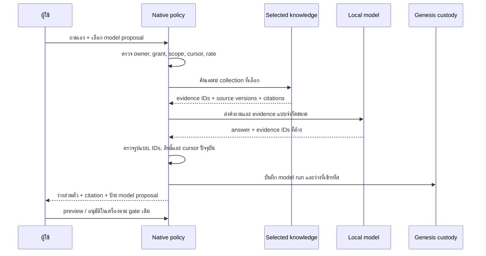

# FUNG — นำแนวทาง Meeting/Agent ของ Lalin มาใช้

## 1. ขอบเขตและสถานะ

เอกสารนี้เป็นข้อเสนอ **C-3 / HIGH** สำหรับ Desktop Meeting Agent ของ FUNG
โดยต่อจาก [สถาปัตยกรรม Desktop](../Desktop/ARCHITECTURE.md),
[domain map](../architecture/MEETING_INTELLIGENCE_DOMAINS.md),
[Meeting Agent contract](2026-09-21-meeting-agent-participation-spec.md) และ
[การปรับ meeting pipeline จาก Lalin รอบแรก](2026-09-21-fung-meeting-transcript-pipeline-adaptation.md).
สเปกนี้ได้รับอนุมัติสำหรับ slice local model proposal แล้ว การยอมรับคุณภาพคำตอบ
จากโมเดลจริงและการใช้งานกับ Google Meet ยังคงเป็น gate แยก

[ASSUMPTIONS]

1. คำขอนี้เน้น Meeting/agent workflow ของ FUNG Desktop ไม่ใช่ Lalin Play,
   dubbing หรือการย้าย backend ของ Lalin มาไว้ใน FUNG
2. รุ่นแรกใช้คำถามที่ผู้ใช้กดส่งเองกับ knowledge ที่เลือกไว้ในเครื่อง;
   ไม่เปิด auto-trigger จากผู้พูด และไม่ส่งข้อความออก Google Meet
3. โมเดลท้องถิ่นเป็นตัวเลือกที่ผู้ใช้กำหนดอย่างชัดเจน; ถ้าไม่มีโมเดลที่พร้อม
   เส้นทางร่างแบบยกข้อความหลักฐานเดิมยังใช้งานได้

## 2. หลักฐานจาก Lalin และ FUNG

ตรวจ `F:/lalin` แบบอ่านอย่างเดียวที่ commit `43121cc`. Working tree ของ
Lalin มีการแก้ `tools/verify/wer_review.py` ของผู้ใช้อยู่แล้ว; ไฟล์นั้นไม่ใช่
แหล่งของข้อเสนอนี้และไม่ได้ถูกแตะต้อง

| หลักฐาน | สถานะที่ตรวจได้ | แนวทางสำหรับ FUNG |
| --- | --- | --- |
| `apps/api/app/routers/agent.py` และ `apps/desktop/src/components/MixCopilot.tsx` | Workspace Agent เรียกโมเดลให้ **เสนอ** mutation; UI แสดงแต่ละข้อและผู้ใช้กดใช้เอง; ฝั่ง UI ตรวจผล apply จริง | แยกการสร้างร่างออกจากการอนุมัติ/commit ให้ชัด และแสดงผลการใช้จริง |
| `apps/desktop/src/components/mixCopilotOps.ts` | UI กับ executor ใช้ตัวอ่าน op/args ชุดเดียวกัน; operation ที่ไม่รองรับแสดงเป็นอ่านอย่างเดียว | ความพร้อมที่ UI แสดงต้องมาจาก native capability และผล native commit; ห้ามขึ้นว่าอนุมัติ/ส่งสำเร็จจากการกดปุ่มลำพัง |
| `docs/architecture/MEETING_TRANSCRIPT_PIPELINE.md` | ขั้น ingest/ASR/diarization/video fusion เป็นเครื่องมือประเมินออฟไลน์; narrative agent และ review/export ขั้น 5–6 ยังไม่ได้สร้าง | ใช้แนวคิด diff + เหตุผล + human review เป็นข้อเสนอระยะถัดไป ไม่อ้างว่าเป็น implementation ของ Lalin |
| `apps/api/app/routers/agent.py::_validate_mutation` | ตรวจชื่อ operation กับการมี required fields เป็นหลัก | FUNG ต้องตรวจ scope, สิทธิ์, cursor, source version, citation และ payload ที่ native boundary; การตรวจแบบ Lalin อย่างเดียวไม่พอสำหรับข้อมูลประชุม |
| FUNG `meeting_agent_ask` | ร่างส่วนตัวปัจจุบันประกอบข้อความยกจาก selected knowledge; มี rate/owner/cursor checks แต่ยังไม่สังเคราะห์คำตอบด้วยโมเดล | เพิ่มเส้นทาง **model proposal** แบบ opt-in โดยคงเส้นทางเดิม |
| FUNG `meeting_agent_preview_delivery` / `meeting_agent_approve_delivery` | มี preview, payload hash, local-only approval และ native stale-cursor fence แล้ว | ใช้ gate เดิม; โมเดลไม่มีสิทธิ์เลือก destination หรืออนุมัติแทนผู้ใช้ |
| FUNG `correct_meeting_utterance` | การแก้ M1 transcript ต้องเป็น human reviewed revision ต่อ utterance ที่ committed | ไม่เขียน proposal ลง revision จนกว่าผู้ใช้จะยอมรับ; งานแก้ transcript ด้วยโมเดลเป็น slice แยก |

หลักฐานข้างต้นเป็นการอ่าน source/document ณ snapshot นี้ ไม่ใช่การทดสอบ
Lalin runtime หรือคุณภาพคำตอบภาษาไทยของโมเดล

## 3. การตัดสินใจสำหรับ slice แรก

เพิ่ม **local model proposal** ให้ Meeting Agent เฉพาะคำถามที่ผู้ใช้ส่งเองใน
โหมด `draft`. คำตอบจากโมเดลเป็นร่างส่วนตัวที่ต้องมี citation จากชุดหลักฐาน
ที่ native search คืนมา ไม่ใช่คำสั่งหรือสิทธิ์ใหม่ พฤติกรรมเดิมที่ยกข้อความ
หลักฐานยังเป็นค่าเริ่มต้นและไม่เรียกโมเดลโดยเงียบ ๆ

### 3.1 คำขอและผลลัพธ์

- เพิ่มชนิดร่าง `extractive | model_proposal` ในคำขอ `meeting_agent_ask`;
  ค่าเก่าที่ไม่ได้ส่ง field นี้เป็น `extractive` เพื่อรักษา client เดิม
- โมเดลรับเฉพาะคำถาม, cursor/revision ที่ native ตรวจแล้ว และรายการ evidence
  ที่เลือกจาก collection ที่อนุญาต พร้อม ID, excerpt และ source version แบบจำกัดขนาด
- โมเดลคืนข้อมูลแบบ typed `answer: string` และ `refs: evidenceId[]` เท่านั้น
  ไม่รับ tool name, URL, recipient, grant, mode, speaker identity หรือคำสั่งส่งออก
- Native ปฏิเสธคำตอบว่าง/ยาวเกิน, refs ว่าง/ซ้ำ/ไม่อยู่ในชุดค้น, ผลลัพธ์ผิดรูปแบบ
  และ source/cursor/owner/grant ที่เปลี่ยนระหว่างรอโมเดล ถ้าตรวจไม่ผ่าน
  จะไม่มี private draft ใหม่
- UI แสดง `model proposal — ยังไม่ยืนยันความถูกต้อง` พร้อม citation จริง
  และแสดง blocker เมื่อโมเดลไม่พร้อม ผู้ใช้ยังถามแบบ `extractive` ได้

### 3.2 ขอบเขตโมเดลและ provenance

- slice นี้ใช้ provider **Ollama local** ที่เปิดอยู่ใน `model_providers`
  (`ollama-summary-intent`) และชื่อโมเดลที่ผู้ใช้กรอกตรงกับ `/api/tags`
  ไม่เลือกโมเดลอื่นจากเครื่องโดยอัตโนมัติ และไม่เรียก cloud ใน slice นี้
- endpoint จำกัด `http` ที่ loopback IP, ปิด proxy และ redirect ใน agent path
- เส้นทาง agent ต้องมี timeout, ขนาด input/output และ token budget ที่สั้นกว่า
  `graph_build::call_llm` ปัจจุบันซึ่ง timeout 600 วินาที; ต้องยกเลิกผลที่มาช้า
  หลัง session หยุดหรือ cursor เปลี่ยน
- บันทึก `model_runs` ด้วย provider/model/task และ hash ของ input/output;
  ห้ามใส่คำถาม, excerpt, private answer หรือ credential ลง log/plaintext ref
- เพิ่มการผูก `model_run_id` แบบ optional ใน `meeting_agent_runs` และในผลลัพธ์
  draft เพื่อให้ตรวจย้อนกลับได้ว่า generated draft มาจากโมเดลใด
  ร่างเดิมที่ไม่มี model run ยังคงอ่านได้
- ใช้ encrypted private draft custody และ Genesis commit frontier เดิม
  พร้อมตรวจ evidence/ACL/cursor อีกครั้งก่อน commit และก่อน preview/approval

ข้อมูล transcript และเอกสารเป็น **untrusted data** สำหรับ prompt โมเดล
คำสั่งในข้อความเหล่านั้นเปลี่ยน policy, tool หรือ destination ไม่ได้
Native ตรวจได้ว่า citation ID มีอยู่และยังอ่านได้ แต่ตรวจความจริงทุกประโยค
ของคำตอบโมเดลไม่ได้ จึงคงการตรวจของผู้ใช้และไม่เปิดการส่งอัตโนมัติ

## 4. สิ่งที่ยังไม่รับจาก Lalin

- `Meet ring gate` กับการอนุมานว่าเสียงที่ไม่มี ring คือผู้บันทึก:
  เป็น heuristic ออฟไลน์ที่ไม่มี custody/participant-session ที่ FUNG ใช้ยืนยัน
  non-self actor ได้ จึงไม่ปลดบล็อก automatic trigger
- narrative transcript correction, context pack และ per-line `keep|fix|flag`:
  Lalin ยังไม่มี implementation ขั้นนี้ FUNG M1 มี append-only human revision
  แต่ legacy `transcript_refinement_proposals` ผูก `transcript_segments`
  ไม่ใช่ M1 utterance; ต้องมี data contract และ approval แยกก่อนต่อเข้ากัน
- การสลับ local/cloud ของ Lalin และการ validate mutation แบบดูแค่ field:
  ไม่ใช้แทน FUNG owner/session/ACL/cost/cursor checks
- ไม่มี Google Meet join, media, chat send หรือ external delivery ใน slice นี้

## 5. ลำดับ implementation หลังอนุมัติ

1. ขยาย typed request/response และ readiness ให้ opt-in model proposal
   โดยไม่เปลี่ยน default `extractive`; ตรวจ schema และ UI contract
2. เพิ่ม local model adapter ที่ระบุ provider/model ชัด, bounded input/time/output
   และ test stub; ไม่แก้ path ของ summary/intent เดิม
3. ใช้ evidence IDs จาก search เดิม, validate model output ใน native,
   บันทึก model run กับ private draft ภายใต้ owner/Genesis fence เดิม
4. ให้ UI แสดง proposal, citations, blocker และผล native preview/approval จริง
5. ทดสอบ invalid refs, prompt injection, stale cursor/ACL, account switch,
   model timeout, unavailable model, duplicate request และ recovery ของร่างเดิม

## 6. Success / exit criteria

- คำถาม manual `extractive` เดิมให้ผลเดิม; ไม่มีการเรียกโมเดลโดยไม่ได้เลือก
- model proposal ที่ผ่านการตรวจเป็น private draft พร้อม citation และ model provenance;
  ไม่มีโมเดลใดสร้าง revision หรือ delivery intent โดยตรง
- invalid/unsupported output, source/grant/cursor เปลี่ยน, owner lock/logout,
  timeout และ provider ไม่พร้อมต้อง fail closed โดยไม่สร้างร่างหรือรายงานสำเร็จ
- preview/approval ยังเป็น local-only และตรวจ source freshness กับ payload hash
- focused native/contract/UI tests ผ่าน พร้อม Rust/TypeScript checks ที่เกี่ยวข้อง
- รายงานหลักฐานแยก source, fixture, local runtime, native UI, provider,
  real meeting และ release; ไม่มีการยกระดับผล fixture เป็นการยอมรับผลิตภัณฑ์

## 7. Implementation mapping หลังอนุมัติ

- `meeting_intelligence_schema.rs` และ `src/lib/meetingIntelligence.ts` เพิ่ม
  `draftKind`, `modelName`, `modelRunId` โดยคำขอเก่ายัง default เป็น `extractive`
- `meeting_agent_model.rs` ตรวจ provider/model แบบตรงชื่อ, ใช้ Ollama loopback
  และจำกัดเวลา/ขนาด/token; รับ JSON `answer` กับ `refs` ที่ตรวจ ID แบบ native
- `lib.rs` เลือก evidence ที่โมเดลอ้างจริงและใช้ policy/session/cursor gate เดิม
- `genesis_adapter.rs` ตรวจ selected collection, ACL, source version, grant,
  cursor, owner และ provider config อีกครั้งก่อน commit; `model_runs`,
  encrypted private draft และ `meeting_agent_runs.model_run_id` อยู่ใน commit เดียวกัน
  โดยคอลัมน์ optional นี้เพิ่มใน schema v13 เพื่อคง v1–v12 ที่เผยแพร่แล้ว;
  Genesis ไม่รองรับการเพิ่ม FK ในตารางเดิม จึงให้ native รับรองลิงก์ด้วย
  การสร้างทั้งสองแถวแบบ atomic แทน โมเดลอาจใช้หลักฐานที่ไม่ได้เลือกเป็น citation;
  native จึงตรวจ freshness ของหลักฐานทุกชิ้นที่ส่งเข้าโมเดลทั้งตอน commit
  และก่อน local preview/approval
- `MeetingIntelligencePanel.tsx` แสดงตัวเลือกโมเดล, readiness/blocker,
  ป้ายข้อเสนอที่ยังไม่ยืนยัน และ citation ก่อน local-only preview/approval

การตรวจด้วย fixture, provider runtime จริง และ real meeting ต้องรายงานแยกกัน
ตามผลที่สังเกตได้; ไม่มีการเปิด auto-trigger หรือ external dispatch

### Local verification

- `npm run test:meeting-intelligence-contract`: 16/16 ผ่าน; bridge ตรวจ
  opt-in request และชื่อโมเดลตรงที่ส่ง
- `npm run build`: TypeScript และ Vite ผ่าน
- Rust library suite หลัง migration v13 และ full model-input freshness gate:
  583 ผ่าน, 1 ignored;
  AppContainer probe 1 ตัวถูกข้ามเพราะ restricted sandbox ไม่สร้าง profile ได้
- `meeting_knowledge` integration: 16/16 ผ่านเมื่อข้าม AppContainer probe;
  การรัน probe ตรงใน sandbox ล้มที่ `CreateAppContainerProfile 0x80070002`
- โมเดลจริง, ความแม่นยำภาษาไทย, native UI บนเครื่องผู้ใช้, real meeting,
  external provider และ release acceptance: **NOT_RUN**

## Version Diff

`0.2.1b → 0.2.2b`: บันทึก full model-input freshness gate และผล Rust
regression ล่าสุด; ไม่มีการยกระดับ fixture เป็น acceptance ของโมเดลจริง

## CHANGELOG

| Version | Date | Status | Summary | Commit Hash | Agent |
| --- | --- | --- | --- | --- | --- |
| 0.1.0b | 2026-09-25 | candidate | Local model proposal workflow, native validation, provenance and acceptance gates | working-tree | RWANG |
| 0.2.0b | 2026-09-25 | beta | Approved local implementation mapping and bounded Ollama adapter | working-tree | RWANG |
| 0.2.1b | 2026-09-25 | beta | Local verification results and AppContainer limitation | working-tree | RWANG |
| 0.2.2b | 2026-09-25 | beta | Validate every model input source at draft and preview boundaries; final local counts | working-tree | RWANG |
