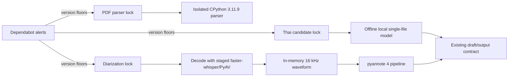

# FUNG — Isolated Python Runtime Dependabot Remediation

## 1. Classification and authority

| Field | Value |
| --- | --- |
| Complexity | C-3 — architecture-driven runtime migration |
| Risk | HIGH — three isolated runtimes, model-loading boundary, optional Torch/pyannote compatibility |
| Parent architecture | `docs/Desktop/ARCHITECTURE.md` |
| Parent runtime plan | `docs/plans/2026-08-09-fung-master-implementation-plan.md` §9 |
| Peer contracts | `2026-09-21-whisper-model-profiles.md`; `2026-09-21-pyannote-diarization-runtime.md`; local meeting-intelligence PDF parser contract |
| Scope authorization | User request: “fix it all” for the 37 open runtime Dependabot alerts |

## 2. Symptom and evidence

GitHub reported 37 open runtime alerts across three separately staged dependency sets:

| Runtime | Alerts | Existing pin | Remediation target |
| --- | ---: | --- | --- |
| Knowledge PDF parser | 23 | `pypdf==6.10.0` | `pypdf==6.16.1` |
| Detailed Thai candidate | 4 Transformers + 1 Accelerate | `transformers==4.57.1`, `accelerate==1.10.1` | Transformers `5.17.0`, Accelerate `1.15.0`, with a local single-checkpoint guard |
| Optional diarization | 9 Torch | `pyannote.audio==3.4.0`, Torch/TorchAudio `2.4.1` | `pyannote.audio==4.0.7`, Torch `2.14.0`, TorchAudio `2.11.0`, hash-lock every resolved wheel |

The Accelerate advisory has no declared fixed release. Version `1.15.0` is therefore not represented as an upstream fix. FUNG must make the advisory's untrusted sharded-index path unavailable by requiring the approved local single-file checkpoint and rejecting index/shard files before model loading.

## 3. Root cause

The three isolated runtimes use exact dependency pins. Their lockfiles, stage scripts, manifests, Rust readiness checks, and tests intentionally verify those versions, but no Python security-update workflow reconciled the pins with later advisories. The diarization pin also encodes a real API dependency: pyannote 3.4 uses TorchAudio's `AudioMetaData`, removed in TorchAudio 2.9.

## 4. Runtime flow and trust boundary

Each runtime remains isolated as before. Detailed transcription remains opt-in, local-only, offline, and draft-only. Diarization remains optional, local-only, and transcript-nonblocking. PDF parsing remains in its isolated CPython runtime with BSD-3-Clause parser attribution.

## 5. Required changes

1. Raise the PDF parser pin and all current-version guards to `6.16.1`; hash-lock the universal wheel and preserve parser output and provenance semantics. New parser fingerprints naturally include the new parser version.
2. Regenerate the hash-locked candidate dependency file for Transformers `5.17.0` and Accelerate `1.15.0`; synchronize stage manifest checks, Rust readiness constants, and tests.
3. Before Transformers imports or checkpoint loading, fail closed unless the approved `pytorch_model.bin` exists and no sharded checkpoint index/shard files are present. Keep local-only/offline loading and the low-memory load behavior.
4. Regenerate the CPU diarization lock for pyannote `4.0.7`, Torch `2.14.0`, and TorchAudio `2.11.0`; update the stage version contract and install all packages only with hashes.
5. Decode input with the already-staged faster-whisper/PyAV decoder and pass a 16 kHz waveform to pyannote. Adapt the pinned pyannote 4 output wrapper back to FUNG's existing anonymous speaker-turn JSON. Do not change the gated `speaker-diarization-3.1` model, identity policy, cache, token custody, or transcript fallback.
6. Record a new RCA and update current peer/setup documentation. Preserve dated historical reports as historical evidence.

## 6. Acceptance criteria

- All three dependency locks resolve the required floors and retain complete hashes; the 37 current affected-version matches are removed from their manifests.
- PDF parser tests, Rust provenance tests, and the isolated parser stage/import probe pass with `pypdf==6.16.1`.
- Candidate lock installs/imports on the target CPython 3.11.9 environment; stage, manifest, Rust readiness, and worker tests agree on Transformers `5.17.0` and Accelerate `1.15.0`.
- Worker tests show that sharded indexes are rejected before loading while the approved local full checkpoint and low-memory path remain supported.
- Diarization dependency import probe passes on target CPython 3.11; a local waveform fixture reaches the pipeline input contract and emitted output retains the existing JSON schema.
- Existing transcript fallback and offline behavior remain unchanged.
- A real `speaker-diarization-3.1` inference smoke is required to claim model compatibility. If the user's gated weights are not present and authorized for use, report that check as `NOT_RUN`; do not claim model or release acceptance from import/unit tests.
- Run focused knowledge, candidate, release/resource, diarization, Rust, build, and repository diff checks appropriate to touched paths.

## 7. Known boundary

The Accelerate upstream GHSA has no declared fixed version. The application mitigation protects FUNG's current approved model path; it does not make arbitrary third-party Accelerate use safe. A future sharded or externally supplied model requires a reviewed upstream fix or an independently maintained patched dependency before adoption.

The gated diarization model may not be available for local inference. Dependency, decoder, input-contract, and output-contract tests do not substitute for that smoke test or for DER/JER qualification.

## Version Diff

| Version | Change |
| --- | --- |
| 0.1.0 | Added runtime-security remediation floors, trust boundary, migration flow, and acceptance gates for 37 alerts. |

## CHANGELOG

| Version | Date | Status | Summary | Commit Hash | Agent |
|---|---|---|---|---|---|
| 0.1.0 | 2026-10-01 | candidate | Implemented synchronized dependency floors and runtime-boundary controls, corrected the operational embedded-Python archive digest, and passed parser staging; gated diarization inference remains unrun. | pending | RWANG |
