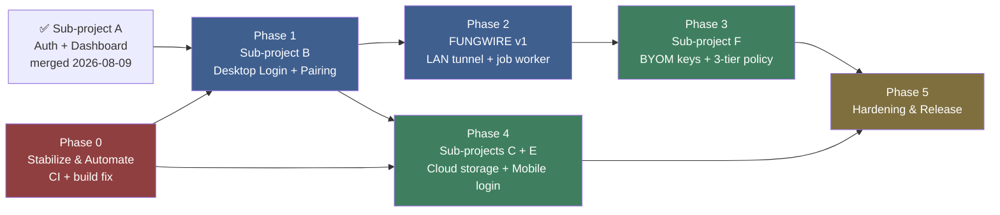
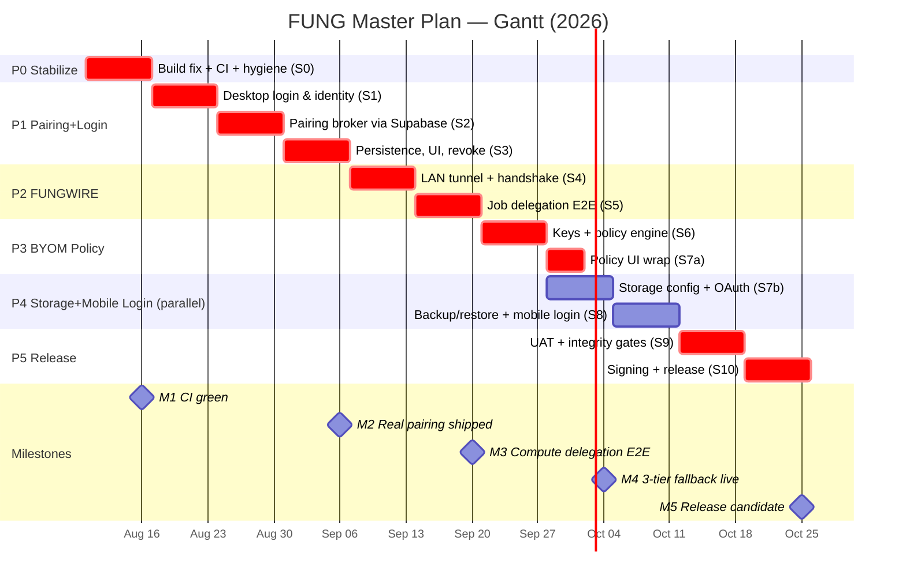

# FUNG Master Implementation Plan / แผนการพัฒนาหลักโปรเจกต์ FUNG

> **For agentic workers:** This is a **program-level roadmap**. Each Phase below is executed as its own cycle: `superpowers:brainstorming` (if spec missing) → `superpowers:writing-plans` (task-level TDD plan) → `superpowers:subagent-driven-development` (automated execution). Phase-level checkboxes here track *phase* completion; task-level checkboxes live in each phase's own plan file.
>
> **สำหรับ agent:** เอกสารนี้คือ roadmap ระดับโปรแกรม แต่ละ Phase จะถูก execute ผ่านวงจร spec → plan → SDD ของตัวเอง

| Field | Value |
|---|---|
| Version | 1.0.0 |
| Date | 2026-08-09 |
| Status | draft — pending Boss approval |
| Author | Claude (Fable 5) + Boss |
| Supersedes | none (first master plan) |
| Source docs | `2026-08-08-auth-web-hybrid-subproject-a-design.md`, `docs/Mobile/IMPLEMENTATION_STATUS.md` v0.4.0b, `docs/Desktop/08-real-progress.md` v0.1.3b, Sub-project B brainstorm decisions (2026-08-09) |

---

## 1. Executive Summary / สรุปผู้บริหาร

**EN:** FUNG is a local-first audio intelligence app (Tauri v2 + React + Rust + GenesisBlockDB) with three shipped feature branches (Zoom ingestion, BYOM TTS, Supabase Auth + Web Dashboard). This plan sequences the remaining work — device pairing, desktop login, the FUNGWIRE compute tunnel, BYOM cloud keys, cloud storage, and mobile login — into 6 dependency-ordered phases over ~10 weeks, executable by Claude Code agents under the Subagent-Driven Development (SDD) workflow with human review gates. Phase 0 removes the two blockers that currently make automation unsafe: a broken `npm run build` and zero CI.

**TH:** FUNG เป็นแอป audio intelligence แบบ local-first ที่ส่งมอบไปแล้ว 3 feature ใหญ่ (Zoom ingestion, BYOM TTS, Supabase Auth + Web Dashboard) แผนนี้จัดลำดับงานที่เหลือ — device pairing, desktop login, FUNGWIRE tunnel, BYOM cloud keys, cloud storage, mobile login — เป็น 6 Phase ตาม dependency ใช้เวลา ~10 สัปดาห์ รันแบบอัตโนมัติด้วย SDD workflow โดยมี human review gate ทุก Phase โดย Phase 0 ต้องแก้ 2 ตัวบล็อกก่อน: build ที่พังอยู่ และการไม่มี CI

---

## 2. Current State Analysis / วิเคราะห์สถานะปัจจุบัน (นับจากไฟล์จริง 2026-08-09)

### 2.1 Scaffold inventory — real counts

| Metric | Count | Detail |
|---|---|---|
| TypeScript/TSX files (`src/`) | **23** (5,871 lines) | `src/` 4, `src/mobile/` 8, `src/web/` 5, `src/landing/` 1, `src/components/` 4, `src/lib/` 1 |
| Rust files (`src-tauri/src/`) | **12** (6,720 lines) | largest: `mobile.rs` 2,003 ln, `lib.rs` 1,428 ln, `zoom_sync.rs` 1,243 ln |
| Tauri commands registered | **57** | 4 unwired from frontend: `mobile_diarization_import`, `mobile_model_packages_query`, `mobile_agent_voice_stop`, `mobile_voice_parse` |
| Frontend routes (`main.tsx`) | **5** | Tauri→App / `/auth/callback` / `/app?surface=*` (ungated) / `/app` (AuthGuard) / default→Landing |
| Shared components | **4** | `ExternalAccountPanel`, `FungLogo`, `TtsProviderPanel`, `ZoomPanel` |
| Mobile screens | **5 tabs + 1 contextual** | home / notes / voice / graph / devices + timeline (→ CreativeStudio) |
| Supabase migrations | **2** | `auth_control_plane` (4 tables + RLS), `profile_trigger` |
| GenesisBlockDB tables (mobile schema) | **23** | incl. `paired_devices`, `capability_grants`, `delegated_jobs` (schema exists, no desktop consumer) |
| SQLite WAL tables (desktop) | **14** | projects, recordings, jobs, transcript_segments, … |
| Tests | **68 Rust `#[test]` + 6 JS** | zero React-component tests, zero E2E |
| CI/CD | **0 workflows** | no `.github/workflows/`; Vercel deploy is manual/CLI |
| npm deps | 15 (9 runtime) | Rust deps 13 + `genesis-block-native` via **absolute path `G:/GenesisBlock_Dev/GenesisBlock`** |

### 2.2 Shipped (verified in git, merged to `main`)

| Deliverable | PR / merge | Evidence |
|---|---|---|
| Zoom Meeting Ingestion (Phase 1) | merge `5d6bd06` | `zoom_sync.rs`, `speaker_merge.rs`, `graph_build.rs`, `ZoomPanel.tsx` — 22 Rust tests |
| BYOM TTS Provider | PR #2 (`0061931`) | `tts_config.rs`, `tts_executor.rs`, `TtsProviderPanel.tsx` |
| Sub-project A: Auth + Web Dashboard | PR #3 (`5e6cd21`) | `src/web/*` (5 files), `src/lib/supabase.ts`, profile trigger migration |

### 2.3 Proven gaps (from code, not opinion)

1. 🔴 **Build broken:** `npm run build` fails — 6 tsc errors in `src/mobile/PitchingAssist.tsx` (752-line orphaned screen; imports 4 functions that don't exist in `mobileStore.ts`, uses untyped `ScreenOrientation.lock`)
2. 🔴 **No CI:** zero automated gates; agent-driven development has no regression net
3. 🔴 **Non-portable build:** `genesis-block-native` = absolute path dep on `G:/` — breaks any CI runner / second machine
4. 🟡 **Pairing is fake:** `mobile_pair_desktop` hashes user input locally; no desktop-side code generation, no handshake, no verification (UI copy promises one)
5. 🟡 **`delegated_jobs` has no consumer:** mobile enqueues; desktop never drains
6. 🟡 **Two disjoint device identities:** cloud `devices` (fingerprint) vs local `paired_devices` (endpoint) — no link
7. 🟡 **FUNGWIRE = name only:** one sentence in spec A; zero code, zero protocol
8. 🟡 Checkbox drift: all 3 completed plans show 0/125 boxes checked → plan files can't be trusted as status; git is ground truth
9. ⚪ iOS unstarted; Thai on-device STT unselected; physical UAT stale (per `IMPLEMENTATION_STATUS.md`)
10. ⚪ `JULES_REPORT.md` = unrelated stub at repo root (untracked); `AGENTS.md` points to non-existent `CORE/` dirs

---

## 3. Requirement Register / ทะเบียนความต้องการ

ID scheme: `REQ-<phase>-<nn>`. Source column ties back to existing docs/decisions.

### Phase 0 — Stabilize & Automate

| ID | Requirement | Source |
|---|---|---|
| REQ-0-01 | `npm run build` passes clean (fix or quarantine `PitchingAssist.tsx`) | tsc output 2026-08-09 |
| REQ-0-02 | GitHub Actions CI: tsc + vite build + `cargo test` (desktop feature set) on every PR | gap §2.3-2 |
| REQ-0-03 | `genesis-block-native` dependency made CI-safe (vendored, git dep, or feature-gated so desktop builds without it) | gap §2.3-3 |
| REQ-0-04 | Repo hygiene: remove/relocate `JULES_REPORT.md`, fix or delete `AGENTS.md` stub, commit or ignore untracked assets | gap §2.3-10 |
| REQ-0-05 | Branch protection: PR required on `main`, CI must pass | process |

### Phase 1 — Sub-project B: Desktop Login + Device Pairing

Decisions locked in brainstorm 2026-08-09: scope = pairing only (D pulled in) · 6-digit code · discovery = cloud primary + manual IP fallback · verification via Supabase · desktop OAuth = system browser + deep link · data model = hybrid (cloud handshake, local runtime).

| ID | Requirement | Source |
|---|---|---|
| REQ-B-01 | Desktop Tauri app: Google OAuth via system browser + `fung://auth/callback` deep link; session persisted in OS keyring | brainstorm Q5 |
| REQ-B-02 | Desktop registers itself in Supabase `devices` (platform, label, keypair fingerprint) on first login | devices table |
| REQ-B-03 | New `pairing_sessions` table (Supabase): initiator_device_id, target hint, code_hash, expires_at ≤ 5 min, status; RLS = own-user rows only | brainstorm approach 1 |
| REQ-B-04 | 6-digit code flow: desktop generates + displays; mobile submits; Supabase row verifies hash match | brainstorm Q2/Q4 |
| REQ-B-05 | Cloud discovery: mobile lists user's registered desktops; manual `IP:port` entry remains as fallback | brainstorm Q3 |
| REQ-B-06 | On success both sides persist locally: mobile `paired_devices` row gains `cloud_device_id` link; desktop stores paired mobile identity | brainstorm Q6 |
| REQ-B-07 | Replace fake `mobile_pair_desktop` proof with real verified pairing record | gap §2.3-4 |
| REQ-B-08 | Dashboard "อุปกรณ์ที่จับคู่" tile + mobile Devices tab show live paired state; unpair/revoke both sides | spec A §157 |
| REQ-B-09 | Pairing audit rows in `oauth_audit_events` (or new `device_audit_events`) | security |

### Phase 2 — FUNGWIRE v1: LAN Tunnel + Desktop Job Worker

| ID | Requirement | Source |
|---|---|---|
| REQ-W-01 | Desktop WebSocket server (LAN, TLS-pinned to pairing keypair) accepting only paired device identities | gap §2.3-4/5 |
| REQ-W-02 | Mobile FUNGWIRE client: connect, heartbeat, reconnect, `trust_state` → `unreachable` handling | model.ts DeviceState |
| REQ-W-03 | Desktop worker drains `delegated_jobs` (transcription first) received over tunnel; progress events stream back | delegated_jobs schema |
| REQ-W-04 | Job protocol: manifest hash verification, resumable checkpoint (`checkpoint_json`), cancel | schema fields |
| REQ-W-05 | Fallback wiring: `admit_task` deferral reasons trigger delegation offer when a paired desktop is reachable | `on_device_ai.rs` |

### Phase 3 — Sub-project F: BYOM Cloud Keys + 3-Tier Fallback Policy

| ID | Requirement | Source |
|---|---|---|
| REQ-F-01 | Account Settings: register cloud API keys (Anthropic/OpenAI/custom) — stored locally (keyring), never in Supabase | privacy-first decision |
| REQ-F-02 | Policy engine: local → paired desktop → cloud API, user-configurable per task kind (STT/LLM/TTS) | 3-tier decision |
| REQ-F-03 | Cloud executor for STT/LLM tasks honoring policy + spend guardrails (per-day cap) | new |
| REQ-F-04 | Mobile settings surface for tier policy (privacy default = local only) | privacy-first |

### Phase 4 — Sub-projects C + E: Cloud Storage Config + Mobile Login

| ID | Requirement | Source |
|---|---|---|
| REQ-C-01 | Account Settings: connect Google Drive / OneDrive / S3-compatible / custom endpoint for backup target | original decision (3) |
| REQ-C-02 | Export/backup job writes encrypted archive to configured target (aligns with U9 backup gap) | IMPLEMENTATION_STATUS U9 |
| REQ-E-01 | Mobile app Google login (same Supabase project, PKCE) linking device to account | sub-project E |
| REQ-E-02 | Mobile session ↔ device registration unified with Phase 1 model | REQ-B-02 |

### Phase 5 — Hardening & Release

| ID | Requirement | Source |
|---|---|---|
| REQ-R-01 | Physical Android UAT re-run on Genesis-enabled APK (screen-off, kill-restart, 3-hour recording) | IMPLEMENTATION_STATUS |
| REQ-R-02 | Genesis integrity gates U8/U9/U10/U12 proven or formally waived | IMPLEMENTATION_STATUS |
| REQ-R-03 | Release signing + store metadata pipeline (Android) | IMPLEMENTATION_STATUS |
| REQ-R-04 | Decide fate of `PitchingAssist` (rebuild on real store API or delete) | gap §2.3-1 |

---

## 4. Phase Plan & Critical Path / แผนแบ่ง Phase และ Critical Path

### 4.1 Dependency graph



**Critical path (เส้นทางวิกฤต): P0 → P1 → P2 → P3 → P5** (~8 สัปดาห์). Phase 4 ขนานกับ P2/P3 ได้หลัง P1 เสร็จ เพราะพึ่งแค่ auth + devices model

**Why this order / เหตุผล:**
- P0 first: automation without CI on a repo whose build is *already broken* compounds errors silently — every later phase is agent-executed and needs the net. (P0 มาก่อนเพราะ agent รันอัตโนมัติต้องมี CI จับ regression)
- P1 before P2: FUNGWIRE authenticates connections with the pairing keypair — no pairing, no tunnel identity. (tunnel ต้องใช้ identity จาก pairing)
- P2 before P3: the 3-tier policy engine needs tier 2 (paired desktop) to exist before the fallback chain is real. (policy 3 ชั้นต้องมีชั้นที่ 2 ก่อน)
- P4 independent: storage config + mobile login only need Supabase auth (done) and the device model (P1).

### 4.2 Phase summary table

| Phase | Goal | Duration | SP | Requirement IDs | Exit gate |
|---|---|---|---|---|---|
| P0 | Green build + CI + portable deps | 1 wk (S0) | 34 | REQ-0-01…05 | CI passes on a fresh runner; `main` protected |
| P1 | Real device pairing + desktop login | 3 wk (S1–S3) | 89 | REQ-B-01…09 | Mobile↔desktop paired via 6-digit code brokered by Supabase; revoke works both sides |
| P2 | Working compute delegation over LAN | 2 wk (S4–S5) | 55 | REQ-W-01…05 | Transcription job delegated mobile→desktop end-to-end with progress + resume |
| P3 | BYOM cloud keys + tier policy | 1.5 wk (S6–S7a) | 42 | REQ-F-01…04 | Task falls back local→desktop→cloud per user policy; keys never leave device |
| P4 | Cloud storage + mobile login | 1.5 wk (S7b–S8) | 42 | REQ-C-01,02 / REQ-E-01,02 | Encrypted backup lands in user's Drive/S3; mobile signs in |
| P5 | Hardening & release | 2 wk (S9–S10) | 47 | REQ-R-01…04 | Signed release APK + UAT evidence + integrity gates dispositioned |

Velocity assumption: **~30–40 SP / week** with SDD (agents implement, human reviews). 1 SP ≈ one bite-sized reviewed task step. ความเร็วสมมติฐาน ~30–40 SP/สัปดาห์ ภายใต้ SDD

---

## 5. Detailed Phase Definitions / รายละเอียดแต่ละ Phase

### Phase 0 — Stabilize & Automate 🔴 (Sprint S0, 1 week)

**Goal / เป้าหมาย:** Every later phase is executed by agents; this phase builds the safety net. Green build, CI on every PR, portable dependencies, clean repo.

**Team allocation:** Agent-Fixer (haiku — mechanical), Agent-DevOps (sonnet — CI workflow), Reviewer (sonnet), Boss (approve branch protection — requires GitHub admin).

**Tasks:**

| Task | SP | Req | Owner |
|---|---|---|---|
| T0.1 Quarantine `PitchingAssist.tsx` (exclude from tsconfig or move to `attic/`; file GH issue for Phase 5 decision) | 3 | REQ-0-01 | Agent-Fixer |
| T0.2 Verify `npm run build` + `cargo test` green locally | 2 | REQ-0-01 | Agent-Fixer |
| T0.3 Feature-gate `genesis-block-native`: desktop CI builds with `--no-default-features`; document mobile build prerequisite | 8 | REQ-0-03 | Agent-DevOps |
| T0.4 `.github/workflows/ci.yml`: tsc → vite build → cargo test (desktop features) on PR + push to main | 8 | REQ-0-02 | Agent-DevOps |
| T0.5 Repo hygiene: delete `JULES_REPORT.md`, fix `AGENTS.md`, commit-or-gitignore untracked `assets/`, `public/`, icons | 5 | REQ-0-04 | Agent-Fixer |
| T0.6 Branch protection on `main` (PR + CI required) | 3 | REQ-0-05 | **Boss** |
| T0.7 Backfill: mark checkboxes in 3 completed plan docs as done (kill checkbox drift) | 5 | REQ-0-04 | Agent-Fixer |

**Acceptance criteria:**
- [ ] Fresh `git clone` on a machine **without** `G:/GenesisBlock_Dev` → `npm ci && npm run build` and `cargo test --no-default-features` pass
- [ ] PR to `main` without green CI is blocked
- [ ] `npx tsc --noEmit` exits 0

**Risks:** R3 (genesis path), R2 (hidden coupling in PitchingAssist quarantine). Mitigation in §7.

---

### Phase 1 — Sub-project B: Desktop Login + Device Pairing 🔵 (Sprints S1–S3, 3 weeks)

**Goal / เป้าหมาย:** จับคู่ mobile ↔ desktop ได้จริงผ่านรหัส 6 หลักที่ Supabase เป็นตัวกลางตรวจสอบ พร้อม desktop Google login. Kill the fake pairing.

**Design inputs (locked):** 6-digit code both sides · Supabase-brokered verification · cloud discovery + manual IP fallback · deep-link OAuth · hybrid data model · new `pairing_sessions` table (pending final approval of Approach 1).

**Team allocation:** Agent-Rust (sonnet — keyring, deep link, commands), Agent-DB (haiku — migration from complete SQL in plan), Agent-Frontend (sonnet — Dashboard/Mobile UI), Reviewer (sonnet per task), Final review (opus), Boss (Supabase dashboard config: redirect URLs, deep-link scheme in Google Console).

**Sprint S1 — Desktop identity (28 SP)**

| Task | SP | Req |
|---|---|---|
| T1.1 Spec + plan for Phase 1 (brainstorm §remaining Q → spec → writing-plans) | 5 | all B |
| T1.2 `fung://` deep-link registration (tauri-plugin-deep-link) + `/auth/callback` handoff | 8 | REQ-B-01 |
| T1.3 Desktop Supabase session: PKCE exchange in Rust, tokens in OS keyring (pattern exists in `zoom_sync.rs`) | 8 | REQ-B-01 |
| T1.4 Device keypair generation + fingerprint; register row in `devices` on first login | 5 | REQ-B-02 |
| T1.5 Desktop UI: login state in settings surface (reuse `ExternalAccountPanel` pattern) | 2 | REQ-B-01 |

**Sprint S2 — Pairing broker (33 SP)**

| Task | SP | Req |
|---|---|---|
| T2.1 Migration: `pairing_sessions` table + RLS + TTL cleanup function | 5 | REQ-B-03 |
| T2.2 Desktop: generate code, create session row, display code + countdown UI | 8 | REQ-B-04 |
| T2.3 Mobile: device list from cloud (discovery) + manual IP fallback sheet (replace placeholder UI) | 8 | REQ-B-05 |
| T2.4 Mobile: submit code → verify hash vs session row → mark session `confirmed` | 8 | REQ-B-04 |
| T2.5 Audit events for created/confirmed/expired/revoked | 4 | REQ-B-09 |

**Sprint S3 — Local persistence + UI + hardening (28 SP)**

| Task | SP | Req |
|---|---|---|
| T3.1 On confirm: mobile writes real `paired_devices` row w/ `cloud_device_id`; desktop persists mobile identity; delete fake proof path | 8 | REQ-B-06/07 |
| T3.2 Dashboard paired-devices tile live data + revoke | 5 | REQ-B-08 |
| T3.3 Mobile Devices tab: live states (paired/unreachable/revoked), unpair | 5 | REQ-B-08 |
| T3.4 Revocation propagation: revoked in cloud → local trust_state flips on next check | 5 | REQ-B-06 |
| T3.5 Final whole-branch review + fix wave | 5 | all B |

**Acceptance criteria:**
- [ ] Fresh desktop → Google login via system browser → device appears in Supabase `devices` and web Dashboard
- [ ] Pairing: code shown on desktop, entered on mobile, confirmed via Supabase — wrong code ×5 → session locked; expiry at 5 min proven by test
- [ ] `mobile_pair_desktop`'s unverified path removed; pairing without confirmation impossible
- [ ] Revoke on either side → other side shows revoked within one refresh
- [ ] Works with manual IP when Supabase unreachable **for discovery only** (verification always requires Supabase — documented limitation)

**Risks:** R4 (deep link on Windows), R5 (RLS for cross-device reads), R1 (scope creep). 

---

### Phase 2 — FUNGWIRE v1: LAN Tunnel + Job Worker 🔵 (Sprints S4–S5, 2 weeks)

**Goal / เป้าหมาย:** งาน transcription จาก mobile ส่งไปรันบน desktop ผ่าน WebSocket LAN tunnel ที่ authenticate ด้วย pairing identity — ปิดช่องว่าง `delegated_jobs` ไม่มีคน consume

**Team allocation:** Agent-Rust ×1 per side (sonnet; tunnel server desktop / client mobile — sequential, not parallel, shared protocol crate), Agent-Protocol (opus — protocol design task only), Reviewer (sonnet), Final (opus).

**Sprint S4 — Tunnel (30 SP)**

| Task | SP | Req |
|---|---|---|
| T4.1 Protocol spec: message envelope, auth handshake (challenge signed by pairing key), heartbeat, versioning | 8 | REQ-W-01 |
| T4.2 Desktop WS server (tokio-tungstenite; new dep — flag in plan) bound LAN, rejects unpaired identities | 8 | REQ-W-01 |
| T4.3 Mobile WS client + reconnect/backoff + `trust_state=unreachable` wiring | 8 | REQ-W-02 |
| T4.4 Handshake integration test (loopback, two AppStates) | 6 | REQ-W-01/02 |

**Sprint S5 — Delegation (25 SP)**

| Task | SP | Req |
|---|---|---|
| T5.1 Desktop worker: receive job manifest, verify hash, run transcription via existing pipeline, stream progress | 8 | REQ-W-03 |
| T5.2 Mobile: drain `delegated_jobs` queue → tunnel; apply progress/results; checkpoint resume | 8 | REQ-W-04 |
| T5.3 `admit_task` deferral → delegation offer UX (one banner, not a redesign) | 5 | REQ-W-05 |
| T5.4 Cancel + failure paths (desktop offline mid-job → job resumable) | 4 | REQ-W-04 |

**Acceptance criteria:**
- [ ] Audio recorded on mobile (tier `Core` device) transcribed on paired desktop; segments appear on mobile with progress %
- [ ] Kill desktop mid-job → mobile shows `unreachable`, job `paused`; desktop restart → job resumes from checkpoint
- [ ] Unpaired/revoked device cannot complete WS handshake (test proves rejection)

---

### Phase 3 — Sub-project F: BYOM Keys + 3-Tier Policy 🟢 (Sprints S6–S7a, 1.5 weeks)

**Goal:** ผู้ใช้ใส่ API key ของตัวเอง (เก็บใน keyring เท่านั้น) และตั้ง policy fallback: local → paired desktop → cloud ต่อ task kind — privacy default = local only

Key tasks (42 SP): key registration UI (desktop settings + mobile settings) · keyring storage w/ redacted display · policy engine module consuming `admit_task` results + tunnel availability + key presence · cloud STT/LLM executors (reuse `tts_executor` HTTP patterns) · per-day spend cap counter · policy settings UI.

**Acceptance criteria:**
- [ ] Grep proves no API key ever serialized to GenesisBlockDB/Supabase/localStorage
- [ ] Policy matrix test: 3 tiers × availability combinations → correct executor chosen
- [ ] Default fresh install = local-only (no silent cloud calls — network test proves zero egress without opt-in)

### Phase 4 — Sub-projects C + E: Cloud Storage + Mobile Login 🟢 (S7b–S8, 1.5 weeks, parallel-capable after P1)

Key tasks (42 SP): storage target config UI (Drive/OneDrive/S3/custom) in AccountSettings · OAuth for Drive/OneDrive reusing `oauth_connections` · encrypted archive export job → upload · restore-verify test (backup is only real if restore works, aligns U9) · mobile Google login (PKCE webview-less flow) · mobile device registration merge with P1 model.

**Acceptance criteria:**
- [ ] Backup archive uploaded to user-chosen target; **restore on clean install reproduces notes/graph** (U9 evidence)
- [ ] Mobile login → same `devices` row model as desktop; Dashboard shows both devices

### Phase 5 — Hardening & Release 🟡 (S9–S10, 2 weeks)

Key tasks (47 SP): physical Android UAT battery (REQ-R-01, **Boss + device required**) · U8/U9/U10/U12 disposition doc · release signing pipeline · store metadata · `PitchingAssist` decision (rebuild on real `mobileStore` API or delete from attic) · load/perf pass on tunnel · final security review (opus) across P1–P4 surfaces.

**Acceptance criteria:**
- [ ] Signed release APK with UAT evidence log updated in `IMPLEMENTATION_STATUS.md`
- [ ] Every integrity gate U8–U12 marked proven or waived-with-rationale by Boss

---

## 6. Sprint Calendar / ปฏิทิน Sprint

1-week sprints, start Monday 2026-08-10.

| Sprint | Dates | Phase | Focus | SP |
|---|---|---|---|---|
| S0 | Aug 10–16 | P0 | Build fix, CI, hygiene | 34 |
| S1 | Aug 17–23 | P1 | Desktop login + device identity | 28 |
| S2 | Aug 24–30 | P1 | Pairing broker via Supabase | 33 |
| S3 | Aug 31–Sep 6 | P1 | Local persistence, UI, revoke | 28 |
| S4 | Sep 7–13 | P2 | FUNGWIRE tunnel | 30 |
| S5 | Sep 14–20 | P2 | Job delegation E2E | 25 |
| S6 | Sep 21–27 | P3 | BYOM keys + policy engine | 28 |
| S7 | Sep 28–Oct 4 | P3→P4 | Policy UI wrap; storage config start | 28 |
| S8 | Oct 5–11 | P4 | Backup/restore + mobile login | 28 |
| S9 | Oct 12–18 | P5 | UAT + integrity gates | 24 |
| S10 | Oct 19–25 | P5 | Signing, release, PitchingAssist disposition | 23 |



---

## 7. Risk Register — Top 10 / ทะเบียนความเสี่ยง

| # | Risk | P | I | Score | Mitigation | Trigger/Owner |
|---|---|---|---|---|---|---|
| R1 | **Scope creep** — B already absorbed D; tunnel/relay ideas leak into P1 | H | H | 9 | Phase exit gates enforced; anything beyond REQ list → parked in backlog section of phase spec | Reviewer flags "Extra" in spec review / Boss |
| R2 | **Broken build compounds under automation** — agents commit atop red build | M | H | 6 | P0 first; CI required before any P1 work; SDD reviewers get "tsc must be clean" as global constraint | CI red > 1 day / Agent-DevOps |
| R3 | **`genesis-block-native` path dep** breaks CI + all Rust tests on runners | H | H | 9 | T0.3 feature-gating; long-term: vendor or git-submodule the crate; CI runs desktop-features only until then | First CI setup / Agent-DevOps |
| R4 | **Deep-link OAuth on Windows fails** (scheme registration, browser → app handoff edge cases) | M | H | 6 | Spike task first in S1 (T1.2 is 8 SP for this reason); fallback = loopback localhost flow (pattern already proven in `zoom_sync.rs`) | Spike fails 2 days in / Agent-Rust |
| R5 | **RLS model gap for pairing** — both devices belong to same user, but sessions must prevent replay/hijack cross-user | M | H | 6 | `pairing_sessions` RLS = user-scoped; code never stored plaintext (hash only); expiry ≤ 5 min; attempt counter; opus security review at P1 final | P1 final review / Reviewer |
| R6 | **LAN security** — WS tunnel MITM, token theft on hostile Wi-Fi | M | H | 6 | Handshake = challenge signed by pairing keypair (not bearer token); payload encryption in protocol v1; document threat model in P2 spec | P2 spec review / Agent-Protocol |
| R7 | **Supabase free tier limits** (auth requests, table size, realtime) | L | M | 3 | Pairing traffic is tiny; monitor dashboard; upgrade path documented; no realtime dependency chosen (polling) | 80% quota alert / Boss |
| R8 | **Physical UAT stale** — Genesis APK recording durability unproven; P2 builds on top | M | H | 6 | REQ-R-01 scheduled; if S9 UAT fails, fixes get priority lane before release; keep pre-Genesis APK as known-good | S9 / Boss (needs device) |
| R9 | **Single human reviewer fatigue** — 300+ SP of agent output through one person | H | M | 6 | SDD two-stage review (agent reviewer per task, opus final per branch); Boss reviews only final PRs + exit gates; checkbox backfill (T0.7) keeps status honest | PR queue > 3 / Boss |
| R10 | **Key/secret leakage** in BYOM phase — keys in logs, state snapshots, or Supabase by accident | L | H | 5 | REQ-F-01 keyring-only; grep-based leak test in acceptance criteria; reviewer constraint "no key material in any serialized struct"; opus security pass | P3 final review / Reviewer |

P = probability, I = impact (L/M/H), Score = P×I on 1–9 scale. ความน่าจะเป็น × ผลกระทบ

---

## 8. Team Allocation Model / โมเดลการจัดทีม

Reality: **1 human (Boss) + Claude Code agents.** Roles map to SDD dispatches:

| Role | Model tier | Used for | Phases |
|---|---|---|---|
| Agent-Fixer | haiku | Mechanical fixes, transcription-from-plan tasks, checkbox/hygiene | P0, small fixes everywhere |
| Agent-DB | haiku/sonnet | Migrations with complete SQL in plan | P1, P4 |
| Agent-Rust | sonnet | Tauri commands, keyring, WS tunnel, executors | P1–P4 |
| Agent-Frontend | sonnet | React UI, Dashboard, mobile screens | P1, P3, P4 |
| Agent-Protocol / Architect | opus | FUNGWIRE protocol design, security-sensitive design tasks | P2, P3 |
| Task Reviewer | sonnet | Per-task spec + quality gate | all |
| Final Reviewer | opus | Whole-branch review per phase | all |
| **Boss (human)** | — | Approvals, Supabase/Google Console config, branch protection, physical UAT, exit-gate sign-off | all |

Boss-only tasks are flagged in phase tables (T0.6, Google Console setup in S1, REQ-R-01 UAT). งานที่ต้องเป็นมนุษย์ทำถูก mark ไว้ชัดเจน

---

## 9. Automated Execution Protocol / โปรโตคอลรันอัตโนมัติ

**EN:** Each phase runs the same pipeline. This section is the contract that makes the plan machine-executable.

**TH:** ทุก Phase รัน pipeline เดียวกัน — ส่วนนี้คือสัญญาที่ทำให้แผน execute โดย agent ได้

```
Per phase:
1. IF spec missing → superpowers:brainstorming (human answers scoped questions)
2. superpowers:writing-plans → docs/superpowers/plans/YYYY-MM-DD-<phase-slug>.md
   (bite-sized tasks, complete code, TDD, checkbox syntax)
3. git checkout -b feature/<phase-slug> from green main
4. superpowers:subagent-driven-development
   - ledger: .superpowers/sdd/progress.md
   - model tiers per §8 table
   - per-task: implementer → review-package → task reviewer → fix loop
5. Final whole-branch review (opus) → single fix wave
6. superpowers:finishing-a-development-branch → PR → CI green → Boss merges
7. Update THIS file: tick the phase checkbox in §10, append actuals to §6 table
```

**Standing rules for agents (สัญญาถาวร):**
- Never start a phase whose upstream exit gate is unmet (§4.2 table)
- `main` is always releasable; feature branches only
- Every plan carries Global Constraints verbatim from its spec (Thai UI labels, named exports, CSS convention, anon-key-only, surface-param routes ungated)
- Checkbox drift is a defect: finishing a branch includes ticking its plan's boxes (enforced from T0.7 onward)
- BLOCKED tasks escalate to Boss; never guess on Supabase/Google Console state

**Kickoff command for next session (คำสั่งเริ่มงาน):**
> "Execute Phase 0 of docs/superpowers/plans/2026-08-09-fung-master-implementation-plan.md via SDD"

---

## 10. Phase Completion Tracker / ตัวติดตามความคืบหน้า

- [x] **Phase 0** — Stabilize & Automate (exit: CI green on fresh runner, main protected) — **DONE 2026-08-09**, PR #4 (`6248816`): frontend 24s ✅ / rust 12m21s ✅ on fresh runners; actual 1 day vs 1 week planned. Task 5 (branch protection) pending Boss. Bonus findings: FungLogo.tsx untracked-but-imported (fixed), tauri-build unconditional resource copy (fixed in CI).
- [ ] **Phase 1** — Sub-project B: Desktop Login + Device Pairing (exit: real pairing E2E + revoke)
- [ ] **Phase 2** — FUNGWIRE v1: LAN Tunnel + Job Worker (exit: delegated transcription E2E + resume)
- [ ] **Phase 3** — Sub-project F: BYOM Keys + 3-Tier Policy (exit: policy matrix proven, zero key leakage)
- [ ] **Phase 4** — Sub-projects C + E: Cloud Storage + Mobile Login (exit: backup→restore proven, mobile signed in)
- [ ] **Phase 5** — Hardening & Release (exit: signed APK + UAT evidence + gates dispositioned)

---

## 11. Out of Scope / นอกขอบเขต (parked, not forgotten)

- iOS shell (needs macOS hardware — revisit after P5)
- FUNGWIRE cloud relay / NAT traversal (Vercel can't host WS; needs separate infra decision — after P2 proves LAN value)
- On-device Thai STT model selection (licensing decision — parallel track, Boss)
- Cross-meeting search (explicitly out per Zoom spec)
- Agent Voice legal/retention policy (product decision gate)
- `OAUTH2_JWT_AUTHORIZATION_SPEC.md` implementation (superseded in practice by Supabase auth — needs formal disposition in P5)

---

*Plan generated 2026-08-09 from filesystem ground truth (23 TS files / 12 Rust files / 57 commands / 68+6 tests / 0 CI workflows). Numbers re-auditable via the inventory commands in the source session.*
